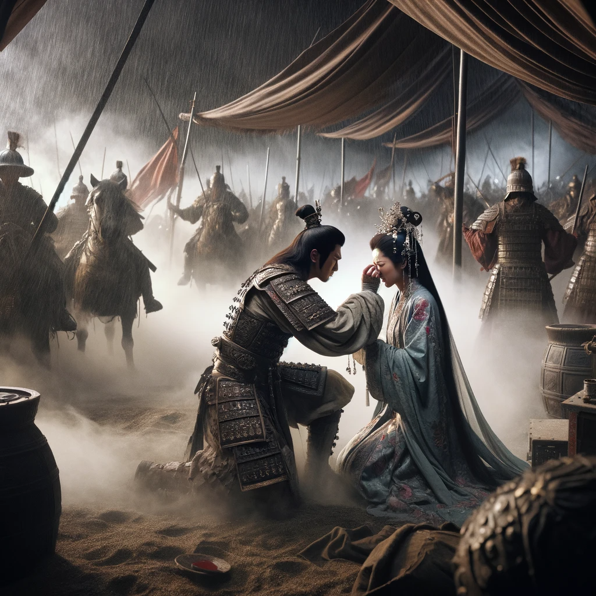
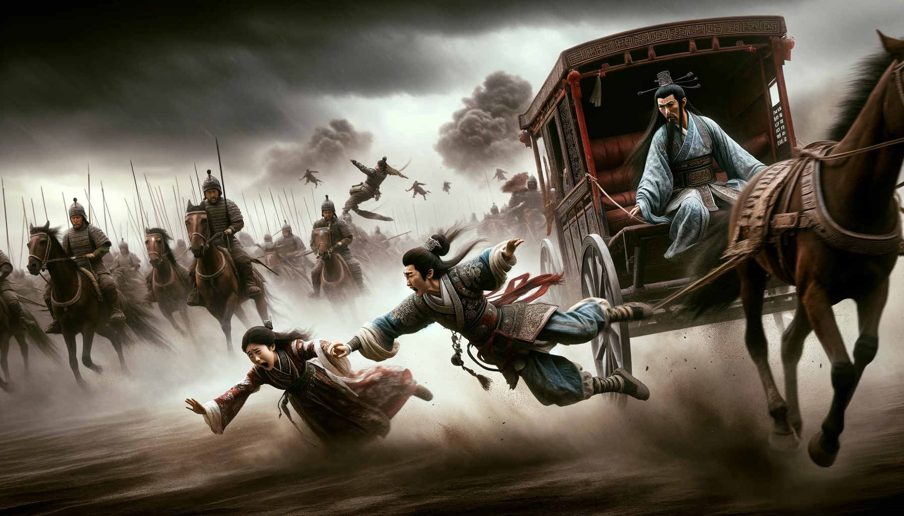

# 【随笔】我的软肋

晚上7点多，准备出门去找点东西吃晚饭，却一时手贱拿起手机刷了一下短视频。一个所谓高分电影介绍视频划入我的眼帘。才刚不过1分钟，就把我看得泪眼婆娑。

片中的男主角，在一个风和日丽的假日，眼睁睁看着妻女因为一个无差别攻击路人的歹徒袭击而离开了他，从此再也不能走出内心的阴霾。

于是，我一直把这三分多钟的视频看到最后，竟然跟着倒地痛哭的男主角一起痛哭不止。等我终于平复了情绪，洗了把脸，眨巴着哭红还没恢复的眼睛，揣上钥匙走出门的时候，已经是三四十分钟之后的事情了。我一面按电梯，一面在想：

> 天哪，这可真是我的软肋啊！
>
> 或许我就是坚定的认为，男人应该要照顾好、保护好自己的家人。于是，无法做到时的痛苦与自责，感受到被所爱的家人的拥抱时的那种痛哭，全都被自己代入，而感同身受了。
>
> 不知道，这是刻在我遗传基因里的密码，还是累世循环不已的记忆……
>
> 真不知道！

好歹，我生活在这和平而繁荣的国家里。不必担心这明显的软肋，在残酷地自然选择竞争中，成为自己致命的弱点。

不然，若生逢乱世，或尔虞我诈的险境，我这样的人怕是活不过开场吧……毕竟，就算如项羽一般的顶尖强者，也不是能决绝将子女推下马车逃命的刘邦的对手啊。

话又说回来，得到了顶尖强者全身心爱护的虞姬，和被丈夫果断抛弃、扔在敌营任对手宰割的吕后相比，她们俩谁更幸福，谁更幸运呢？在她们生命结束前的那一刻，究竟谁会更加满足呢？

还有被刘邦一再踹下马车的汉惠帝刘盈和鲁元公主刘乐，有这样的父亲，他们会觉得这是幸运还是不幸呢？谁又能知道呢？

还好，这一世，我应该只需要做一个生在太平盛世，有着这明显软肋、且没有匹夫之勇，却有着妇人之仁的普通男人。