# 【教程】尝试DALL-E 3中的各种绝美艺术风格（一）

那天看到这篇文章《[DALL-E 3 中18 种绝美艺术风格](https://mp.weixin.qq.com/s/KS6e0cUHTbxbWItds-yBpA)》，简直被惊艳到了，心想自己一定要试试看。但可惜GPT的绘画功能坏了好几天。今天且再次试试看吧。

我试着让GPT为我列出了所有可能的艺术风格，但显然，这似乎永远无法穷举的事情。在我连续追问三次之后，它终于把答案从10种扩充到了下面这么多种：

> 绘画和视觉艺术风格多样且跨越了各个时代和文化，以下是一个更为全面的列表，包含不同的绘画技法、媒介和风格：
>
> 1. 现实主义：精确描绘自然和社会现实。
> 2. 浪漫主义：强调情感和个人主义，以及对自然界的赞美。
> 3. 新古典主义：回归古典形式和理性的艺术风格。
> 4. 印象主义：关注自然光影和色彩的即时印象。
> 5. 后印象主义：更为主观和象征性的色彩与笔触使用。
> 6. 表现主义：扭曲现实以表达更深层的情感。
> 7. 野兽派：鲜艳的色彩和简单的形式。
> 8. 立体主义：分解物体并以抽象的形式重组。
> 9. 未来主义：关注动态和机械技术的视觉表现。
> 10. 超现实主义：梦境、幻象和潜意识的视觉化。
> 11. 超写实主义：极端细致的现实表现。
> 12. 抽象表现主义：自由的抽象笔触和大胆的色彩运用。
> 13. 极简主义：极端简化的形式和颜色。
> 14. 波普艺术：受大众文化影响的明亮色彩和简单图形。
> 15. 概念艺术：侧重艺术概念而非美学。
> 16. 街头艺术：通常在公共空间进行的视觉艺术实践。
> 17. 数字艺术：利用计算机技术创作的艺术。
> 18. 环境艺术：与环境互动的艺术形式。
> 19. 装置艺术：在特定空间创作的三维艺术作品。
> 20. 摄影艺术：以摄影为媒介的艺术形式。
> 21. 视频艺术：使用视频和动态影像的艺术形式。
> 22. 中国画：包括工笔和写意等技法。
> 23. 浮世绘：日本的传统版画艺术。
> 24. 细密画：典型的印度和波斯绘画，注重细节。
> 25. 迷幻艺术：典型的伊斯兰和阿拉伯艺术，使用对称和复杂的几何图案。
> 26. 水墨画：东亚传统的水墨艺术。
>
> 此外，还有各种技法和媒介特有的风格：
>
> 1. 素描：使用铅笔、炭笔、粉彩等工具的绘画技法。
> 2. 水彩画：使用水溶性颜料的绘画形式。
> 3. 油画：使用油性颜料在画布上绘画。
> 4. 丙烯画：使用快干型塑胶质感颜料的绘画。
> 5. 版画：包括木刻、铜版画、石版画和丝网印刷等。
> 6. 漫画：以连续画面叙述故事的艺术形式。
> 7. 插画：通常为文本提供视觉形象的艺术。
> 8. 塞尔绘画：指传统动画中的手绘图像。
> 9. 素食画：不使用动物产品的绘画形式。
> 10. 数字绘画：使用数字工具如平板和电脑进行创作。
> 11. 像素艺术：使用小方块像素创作图像，通常用于电子游戏。
> 12. 3D建模与渲染：在计算机上创造三维形象。
>
> 尽管存在这么多风格和技法，每位艺术家的个人风格是独一无二的，他们常常结合多种技巧和影响，创造出新的表达方式。

此外，单单是中国画，他也列举了不少画派的例子：

> 中国历史上的画派和画风繁多，有着深厚的传统和各具特色的风格，主要包括：
>
> 1. 山水画：以表现自然山水为主，追求意境与神韵，其中最著名的有北宋的“北宗画派”，代表人物如范宽、郭熙，以及南宋的“南宗画派”，代表人物如马远、夏圭。
> 2. 花鸟画：描绘花卉、鸟类及其他动植物，着重表现自然美，代表人物如宋代的徐熙、元代的黄公望。
> 3. 人物画：包括肖像画和日常生活场景的绘制，如唐代的吴道子、宋代的李公麟。
> 4. 工笔画：讲究细腻的线条和层次丰富的细节描绘，常见于花鸟和人物画。
> 5. 写意画：强调个人情感的表达，笔触自由，色彩简约，追求意境和境界的传达，如南宋米芾的作品。
> 6. 文人画：由知识分子和文人绘制，强调个性表达和文化修养，如元四家。
> 7. 院体画：受官方和宫廷的影响，画风较为工整和官方化，如明代的戴进。
>
> 这些画派和风格之间有着丰富的交流和影响，形成了中国绘画艺术多样化的特点。

且不多说，一图解千言，先画画看吧。

## 1. 木刻艺术品

木刻艺术品通常是指使用木刻技术制作的三维雕塑作品。这种艺术形式同样源远流长，被广泛应用于装饰和实用物品上，如家具、建筑装饰、宗教雕像等。木刻艺术品的制作涉及将艺术家的设计直接雕刻在木头上，创造出立体的形象和图案。

木刻艺术品的特点包括：

1. **质感**：艺术家会利用木材的自然纹理和色泽，通过雕刻技巧强调这些特性。
2. **工艺**：木刻工艺可能包括刻、削、雕和磨等多种技法，以创造出所需的形状和细节。
3. **多样性**：木头是一种极具多样性的材料，不同类型的木材可以创造出不同风格的艺术品。
4. **耐久性**：木刻艺术品可以非常耐用，但同时也可能受到温度、湿度等环境因素的影响。
5. **文化象征**：在许多文化中，木刻艺术品常常承载着宗教或象征意义，经常出现在庙宇、教堂或传统住所中。

在东亚，木刻艺术品常常与宗教仪式和信仰有关，比如佛像和道教神像等。此外，它们也可以是家庭和公共场所的装饰，或者作为日常生活中使用的器物，如家具和器皿。木刻艺术品的创作需要高度的技巧和耐心，每件作品都是独一无二的。

> 画一个方形的木刻艺术品，一条中国龙腾云驾雾的形象

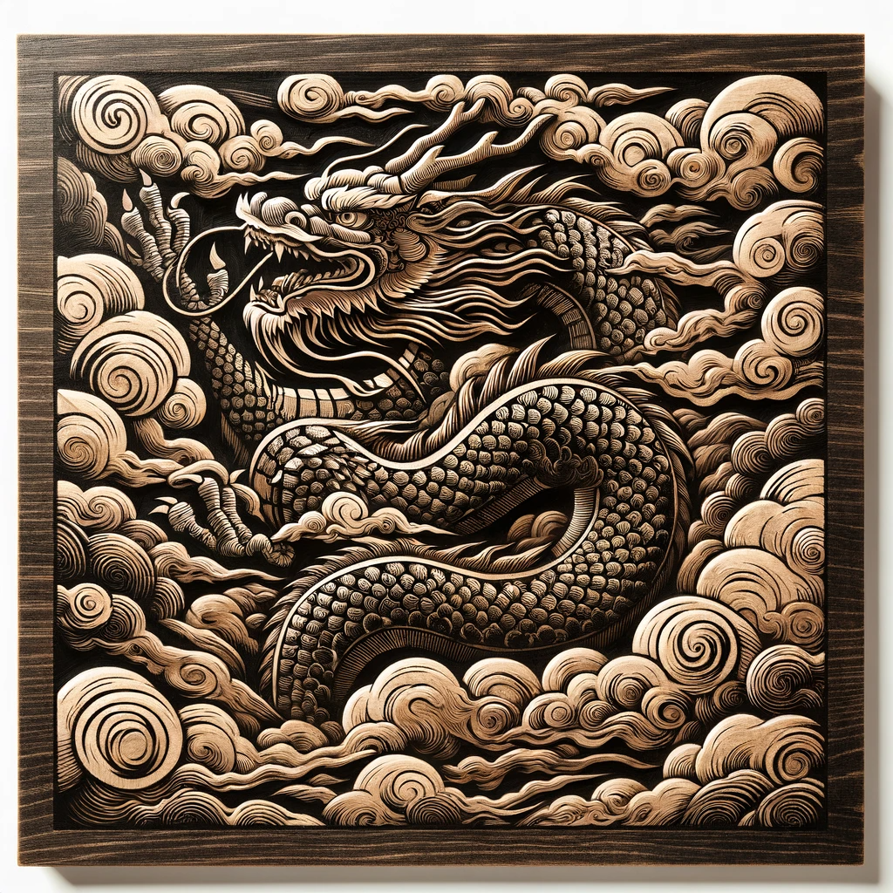

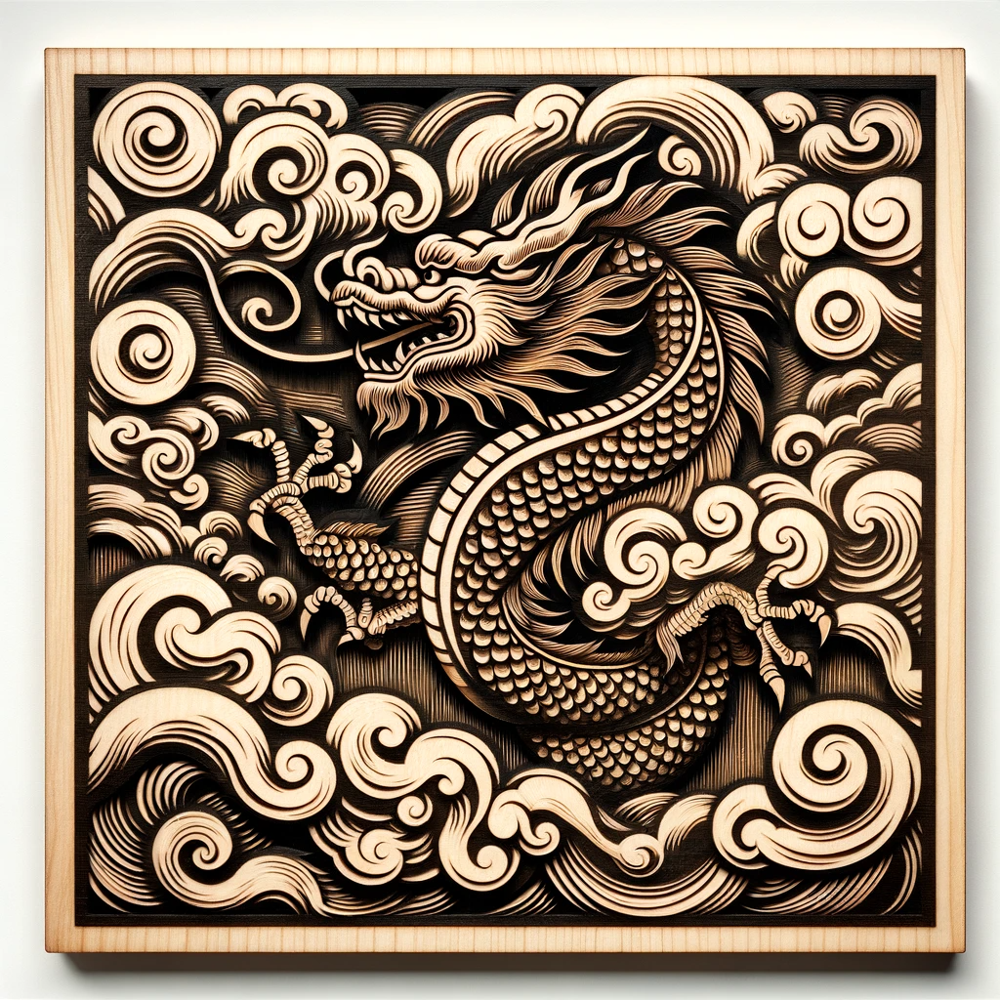

## 2. 涂抹油画

涂抹油画，也被称为厚重色彩油画或浓重色油画，是一种使用油画颜料的绘画技法。在这种风格中，画家通常会大量使用油画颜料，通过刷子或刮刀将颜料直接涂抹在画布上，有时几乎是未经稀释的。这种技法可以创造出丰富的纹理和层次，使画面产生立体感和动态效果。

涂抹油画的特点包括：

- **厚涂技法**：颜料层厚，质感强烈，可以看到明显的笔触和颜料层。
- **色彩的强烈对比**：鲜艳和深沉的色彩并置，产生强烈的视觉冲击。
- **形式的简化**：经常通过大胆的笔触和色块来简化形状，强调画面的表现力。
- **情感表达**：画家通过直观和富有表现力的笔触传达他们的情感和情感状态。

这种风格的油画因其独特的质感和强烈的视觉效果而受到赞赏，可以在许多现代和当代艺术家的作品中看到。

> **涂抹油画：一位身材绰约的年轻女士，站在栏杆前看台风中狂风肆掠的城市，大雨模糊了视野，裙裾飞扬**

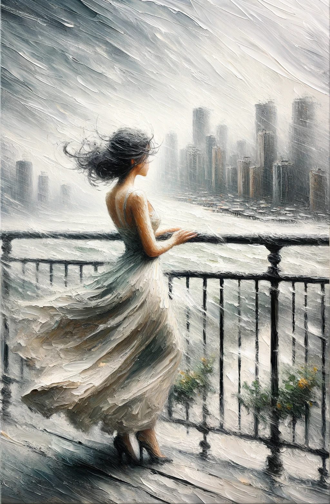

> **涂抹油画：一只灰色的胖英短蓝猫，正在草地上抓蝴蝶。猫咪模样憨厚，眼睛却灵动。**

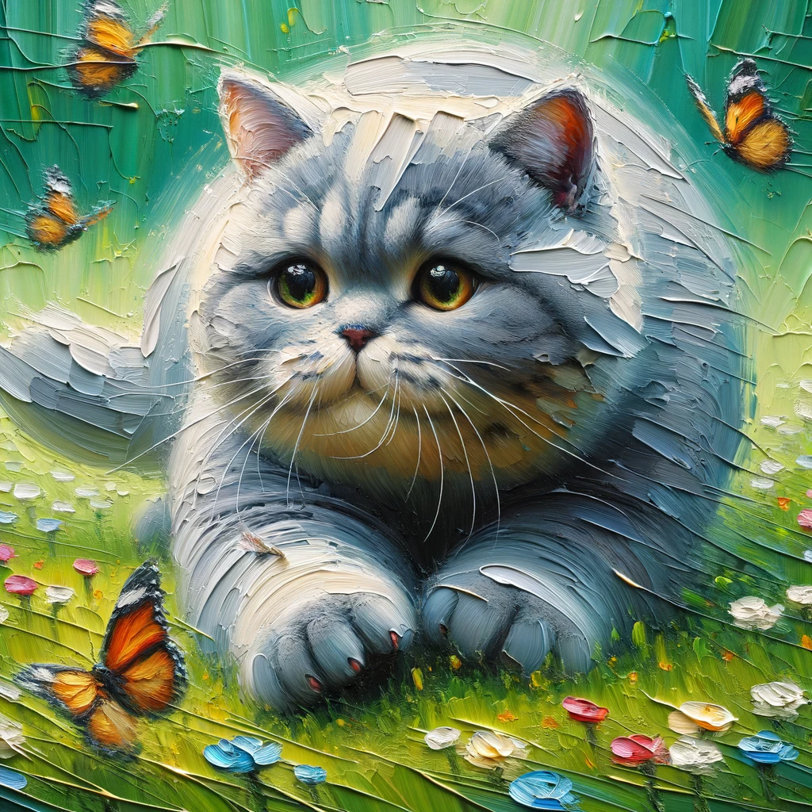

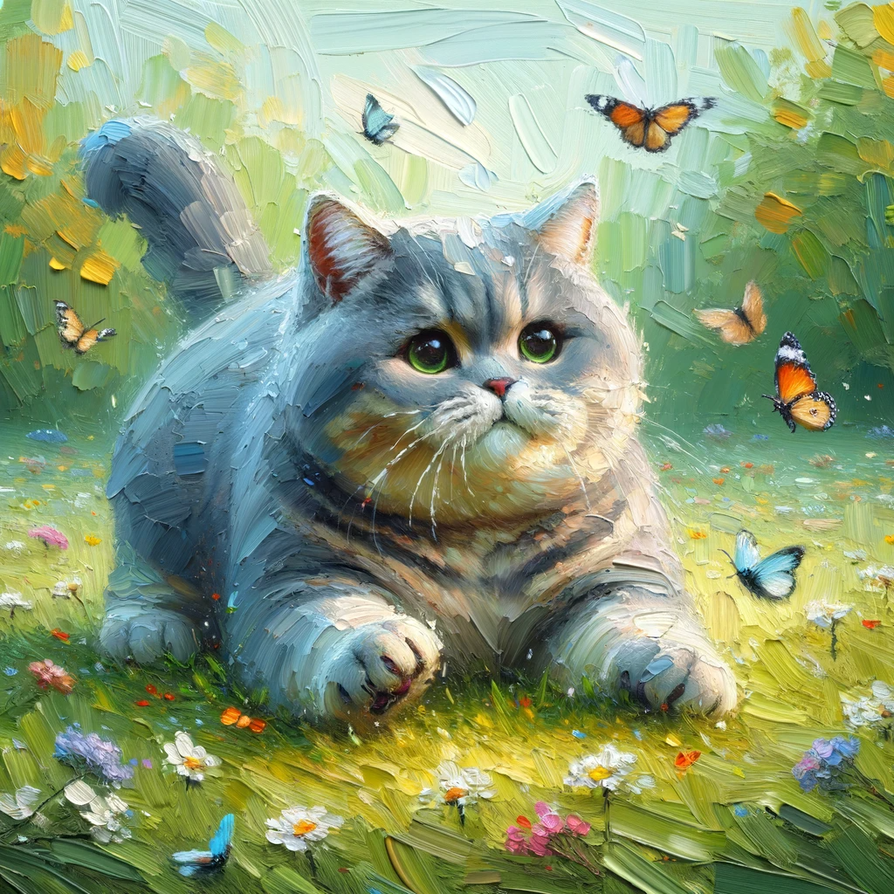

## 3. 立体像素艺术

立体像素艺术，也称为“体素艺术”(Voxel Art)，是一种使用三维像素（体素）创建图像和模型的数字艺术形式。这种风格类似于传统的二维像素艺术，但它增加了一个额外的维度，让艺术家可以构建更复杂、更丰富的场景和对象。

体素是立方体形状的，可以想象成三维空间中的小方块。通过在三维空间中堆叠和组合这些方块，艺术家能够创建出具有深度和体积感的图像。立体像素艺术通常具有一种独特而复古的美感，有点像早期三维电脑游戏的视觉风格。

立体像素艺术常用于视频游戏设计、数字艺术作品以及动画制作中。它能够呈现出一种独特的魅力，同时也允许艺术家在有限的分辨率下进行创作，这既是一种限制也是一种风格上的选择。由于它的这种特性，体素艺术在现代和复古游戏设计中都很受欢迎。

> **立体像素艺术风格的消防站模型，消防车正准备开出来。消防员正在上车。**

> **一个复古唱机的立体像素艺术风格模型，旁边还放了几张黑胶唱片**

## 4. 技术绘图

技术绘图是用于精确表示三维物体的二维图纸的一种形式。它通常用于工程、建筑和制造领域，以创建详细的设计和说明书。技术绘图会遵循一套严格的标准和规范，确保绘图的准确性和一致性。

在技术绘图中，一般会使用以下视图：

1. 正视图（Front View）：物体的正面。
2. 侧视图（Side View）：物体的侧面，通常分左侧视图和右侧视图。
3. 俯视图（Top View）：从上方看物体的视图。
4. 斜视图（Isometric View）：以倾斜的角度显示物体，可以同时展示物体的三个面。

除了这些基本视图，技术绘图可能还包括剖视图、局部图和细节图等。它们都是为了提供更多的细节，帮助理解复杂的部件和装配关系。

现代技术绘图通常使用计算机辅助设计（CAD）软件来创建，这使得编辑、复制和共享绘图更加容易和高效。技术绘图是实现精确工程和设计的基础，对于产品开发和制造来说至关重要。

> **高度细致的星际战舰技术绘图，展示其复杂、高科技的各种设施**

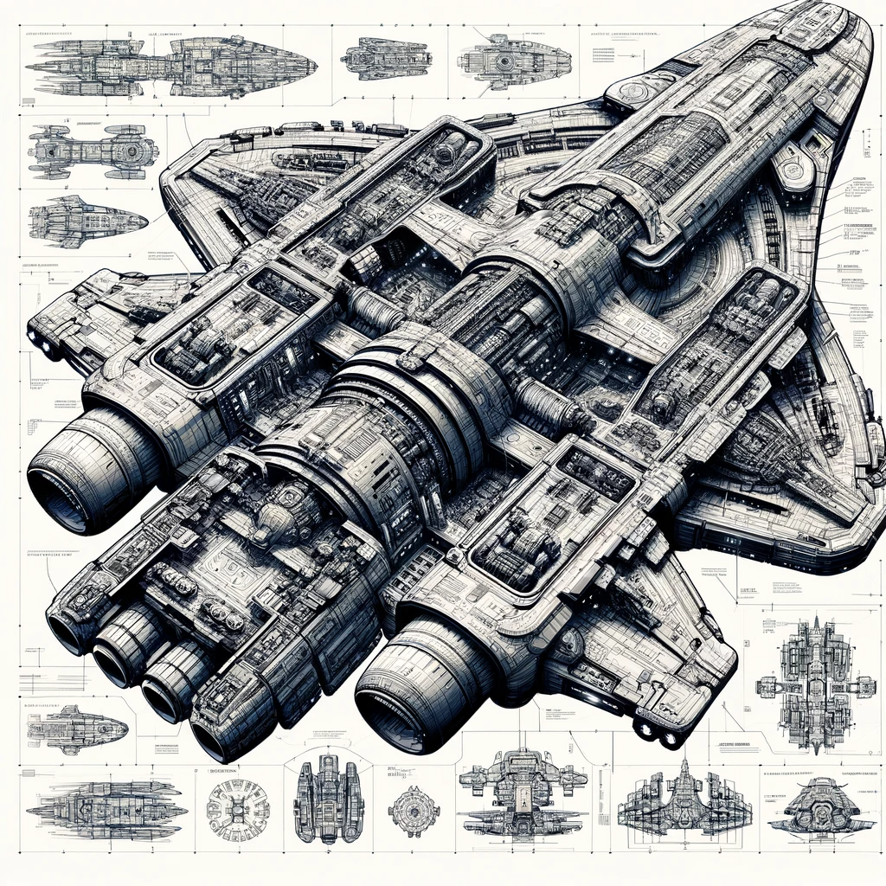

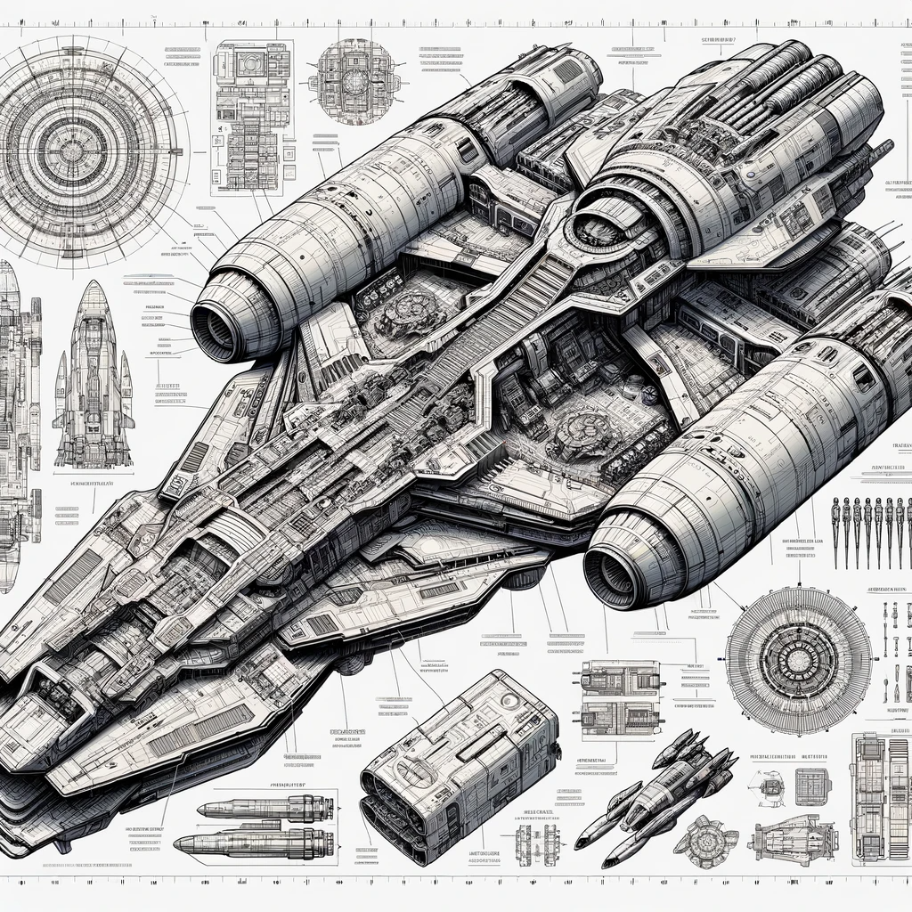

## 5. 新表现主义（New Objectivity，德语：Neue Sachlichkeit）

新表现主义（Neue Sachlichkeit），也称为“新客观性”，是20世纪初在德国兴起的一个艺术运动，主要反映在绘画和版画作品中。这个风格大约在第一次世界大战后出现，并且在1920年代达到了高潮。新表现主义反对表现主义的情感化和抽象趋势，倾向于一种更加冷静和客观的艺术表达。

这个运动通常被分为两个分支：一种是“左翼”或“批判的新表现主义”，它描绘了战后德国社会的贫困和腐败，以及城市生活的冷漠；另一种则是“右翼”或“古典的新表现主义”，它更注重形式的秩序、结构和工艺。

新表现主义的艺术作品往往具有鲜明的线条，清晰的形状，并且在某种程度上保留了现实主义。它们往往描绘日常生活，有时带有讽刺和政治评论的意味，艺术家们通过夸张的形式、锐利的光影对比以及明显的构图来传达其信息。这种风格的代表艺术家包括奥托·迪克斯（Otto Dix）、乔治·格罗兹（George Grosz）和马克斯·贝克曼（Max Beckmann）。

> **批判的新表现主义画作，描绘战后的废墟，一只腿的男人独立在废墟上，手里拿着一个玩具熊。批判战争的残酷**

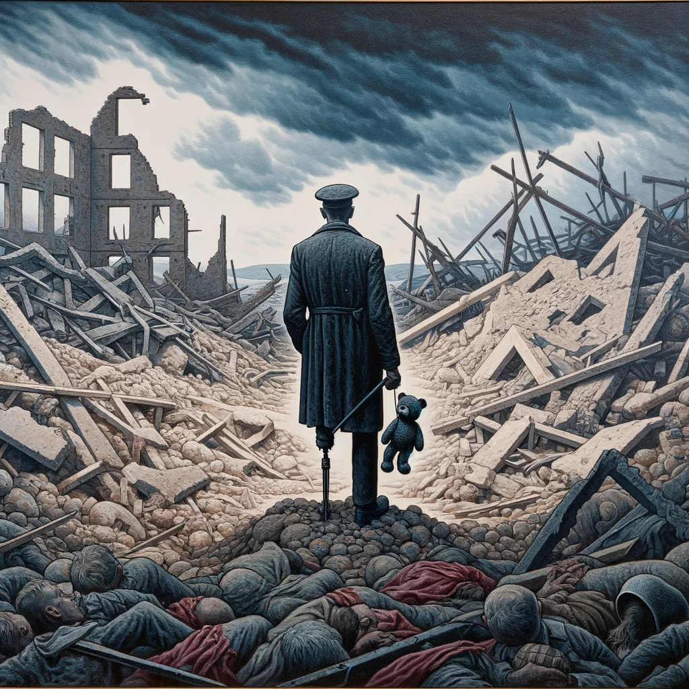

> **古典的新表现主义（Neue Sachlichkeit）画作，相爱的一家人，四口之家融为一体的温馨感。**

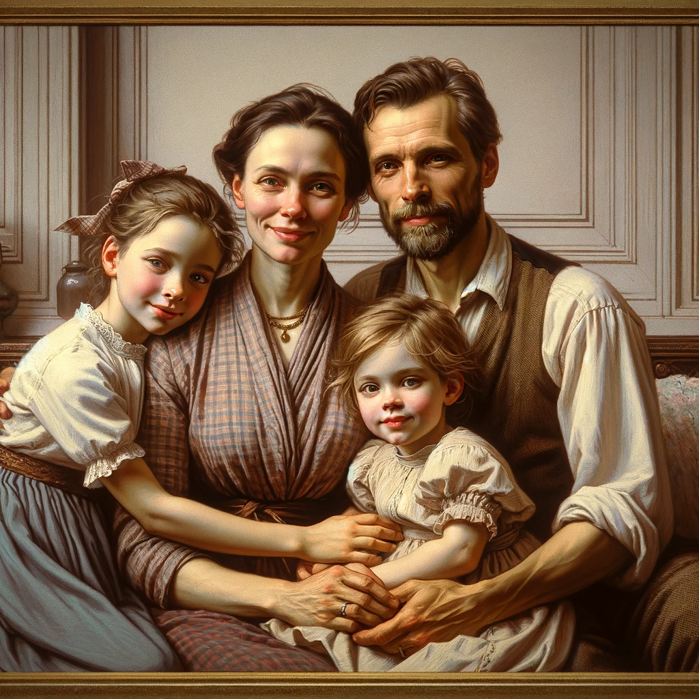

## 6. 新表现主义（Neo-Expressionism）

20世纪70年代后期到80年代在欧美兴起的艺术运动。这个流派的艺术家们反对当时的极简主义和观念艺术，转而采用强烈的色彩、粗犷的笔触和夸张的形象来表达个人情感和社会批评。新表现主义的画作通常具有很强的视觉冲击力和情感表达力，艺术家们通过这种方式来探索个人主义和主观经验。

> **新表现主义（Neo-Expressionism）画作：描绘战后的废墟，一只腿的父亲独自站在废墟上，手里拿着孩子心爱的玩具熊。批判战争的残酷。**

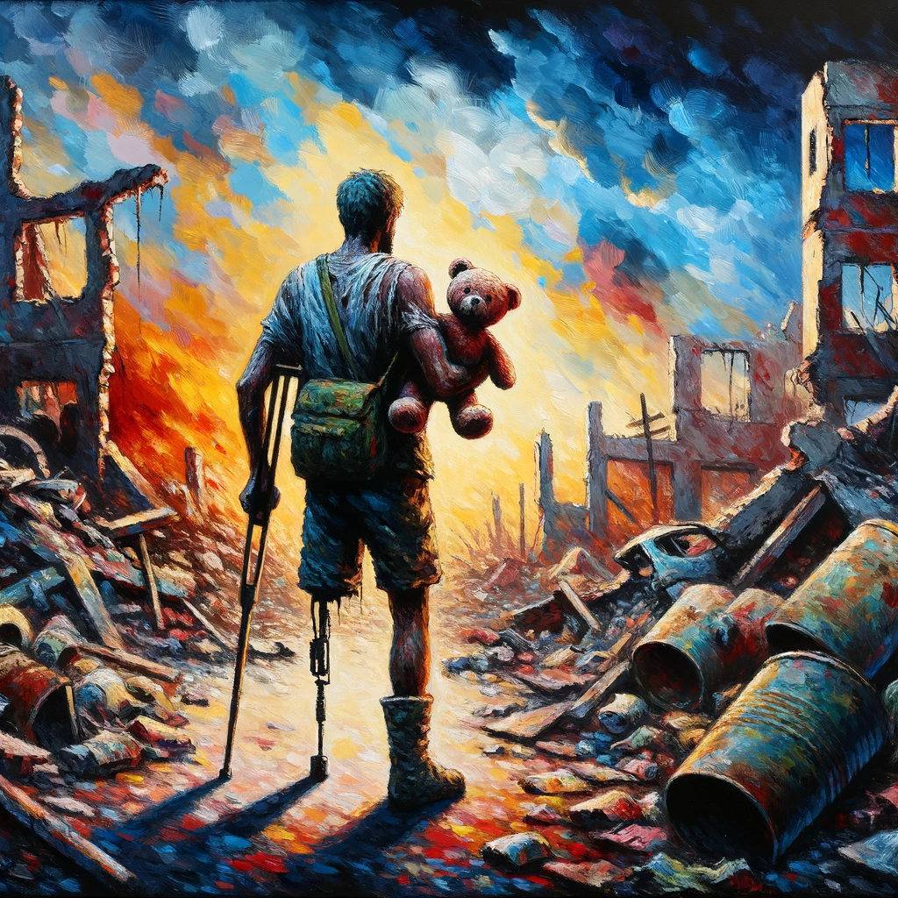

> **新表现主义（Neo-Expressionism）画作：相爱的一家人，四口之家（爸爸、妈妈、姐姐、弟弟）融为一体的温馨感，用暖色的光表现出强烈的情感。**

## 7. 电致发光多边几何低模 Electricluminescent geometric low-poly

这种艺术风格，结合了电致发光技术和低模型几何设计。

电致发光是指材料在电流或强电场作用下发出光，常见于EL面板和EL线。

而"低模"是指三维模型中多边形数量较少的设计，这种风格以简约和棱角分明为特点。

这种风格在视觉上通过使用明亮的光线来强调简单的几何形状，营造出现代感和科技感。

> 电致发光多边几何（ Electricluminescent geometric low-poly） 作品：一只美丽的小鸟

## 8 . 纸雕

纸雕是一种利用纸张进行创作的艺术形式，通过剪切、折叠、层叠等手法制作出立体的纸质作品。它可以是简单的剪纸艺术，也可以是复杂的三维纸雕塑。这种艺术形式强调在纸上创造出深度和阴影，以产生立体感和动感。纸雕常用于装饰、展览、甚至是照明设计（通过透光展示纸的质感和层次）。由于材料易于获取且成本低廉，纸雕艺术为艺术家和手工艺爱好者提供了无限的创作可能性。

> **一条中国龙（五爪金龙）的巨大复杂纸雕，表现出其气宇轩昂的宏大气场，同时用鳞片等精细做工刻画出其华贵的气质。**

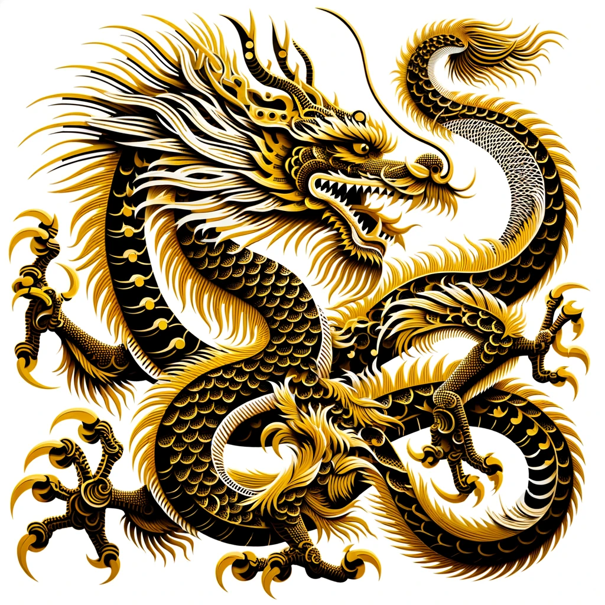

> **一艘航空母舰的巨型纸雕**

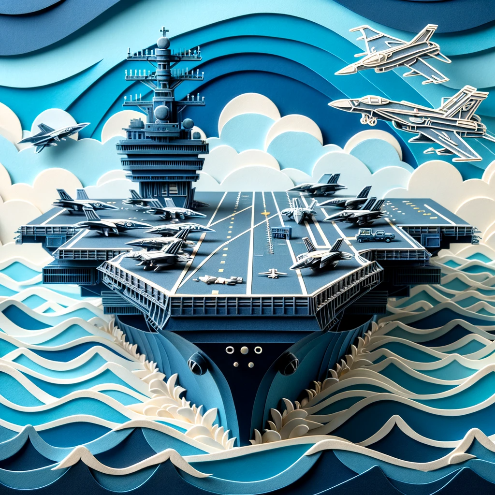

## 9. 剪纸

剪纸是一种传统的中国民间艺术形式，至今已有千年的历史。这种艺术形式涉及将纸张剪切成各种美丽和复杂的设计和图案。剪纸艺术品通常用作装饰品，尤其在春节和其他传统节日时，用以装点窗户、门和墙壁，带来吉祥和喜庆的气氛。剪纸艺术可以非常精细且技巧高超，有些作品可能非常复杂，包括表现人物、动物、故事情节和自然景观等主题。剪纸不仅仅是一种装饰，它也承载着丰富的文化意义和象征，每一剪每一刻都蕴含着艺术家的精心思考和愿望。

> **剪纸，红色，年年有鱼的意味**

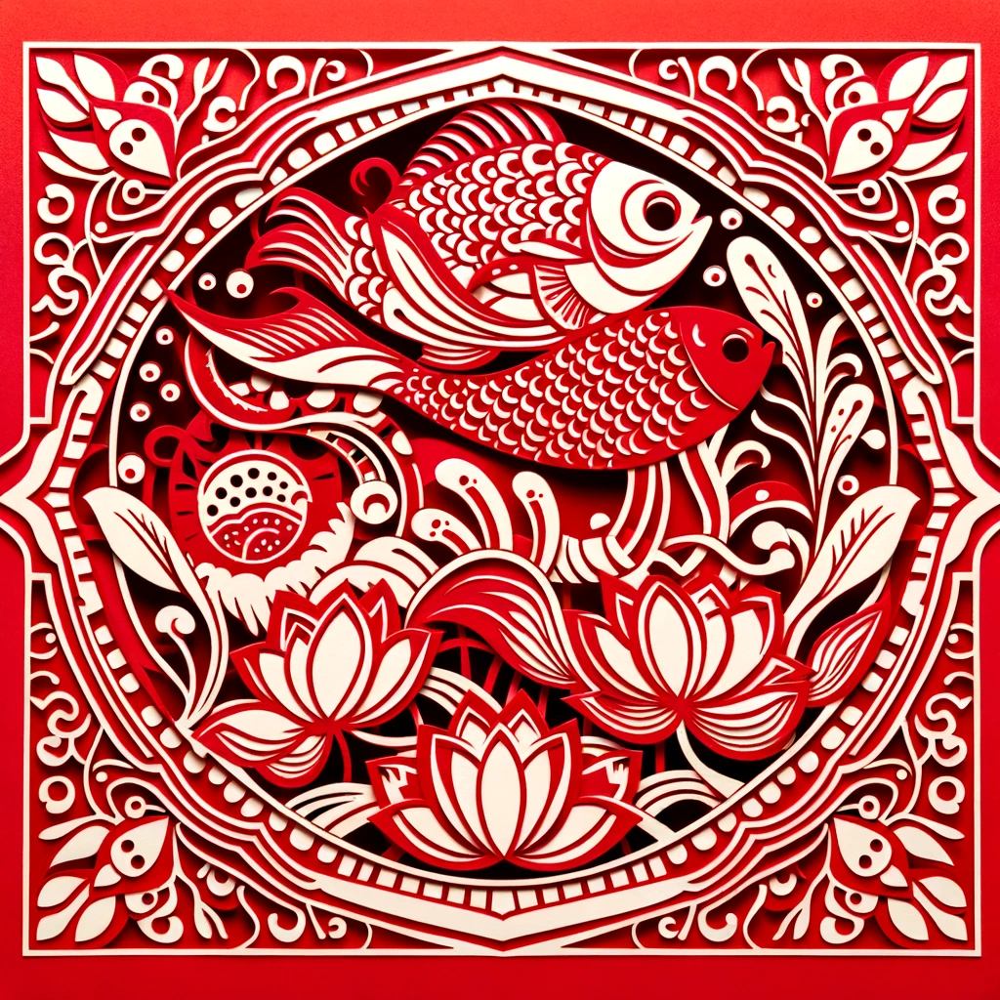

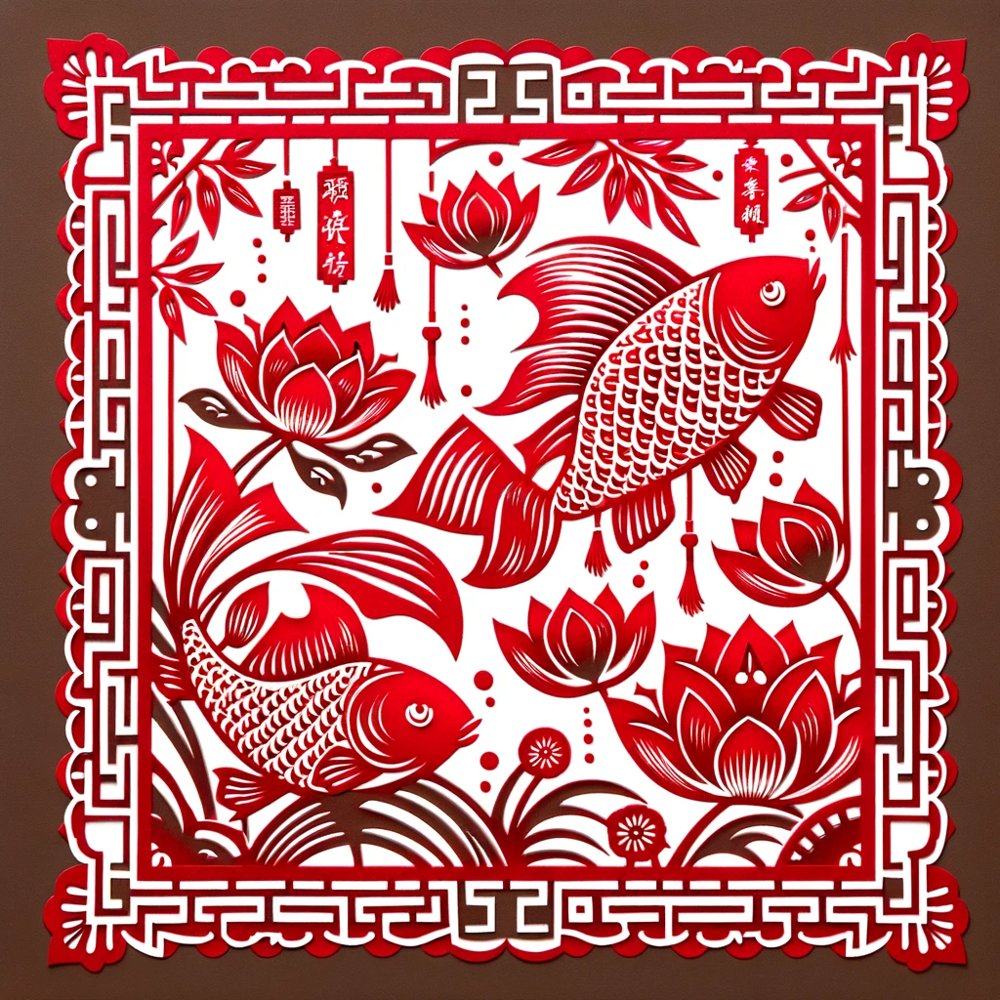

## 10. 手绘3D 效果

手绘3D效果的艺术形式，通常是指艺术家用手工绘画技巧，在平面媒介上创作出具有三维视觉效果的画作。这种技术依靠透视法、阴影、光线和色彩对比来营造深度和立体感，让二维平面上的图像看起来好像是真实存在的三维空间。这种绘画技巧经常用于街头艺术、广告、插画和一些视觉艺术作品中。观众从特定的角度观看时，会感受到图像跃然纸上，产生出奇的视觉错觉。

> **放在白色办公桌上的，在一张A4纸上画的一幅手绘3D的白色马克杯，把铅笔放在旁边**

> **在人行道上的手绘3D画，一只跃出水面的大鲨鱼栩栩如生，旁边留下绘画工具示意这是一幅手绘3D画**

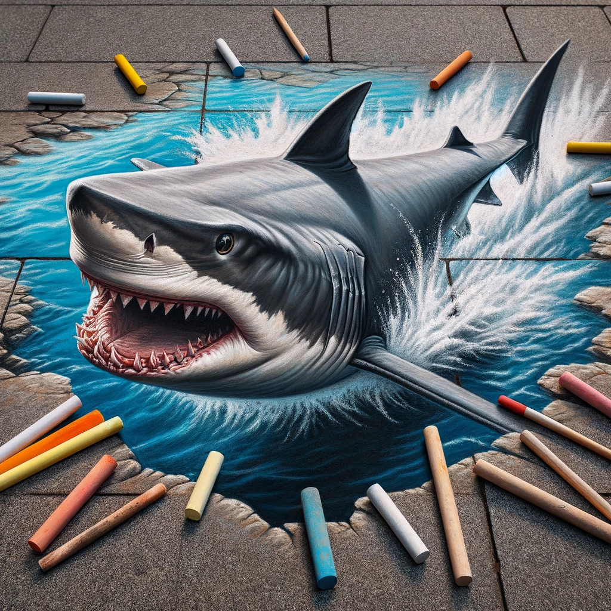

----

<待续>