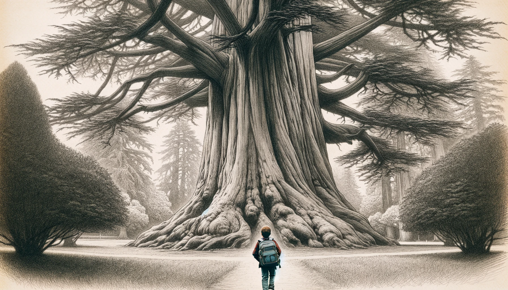
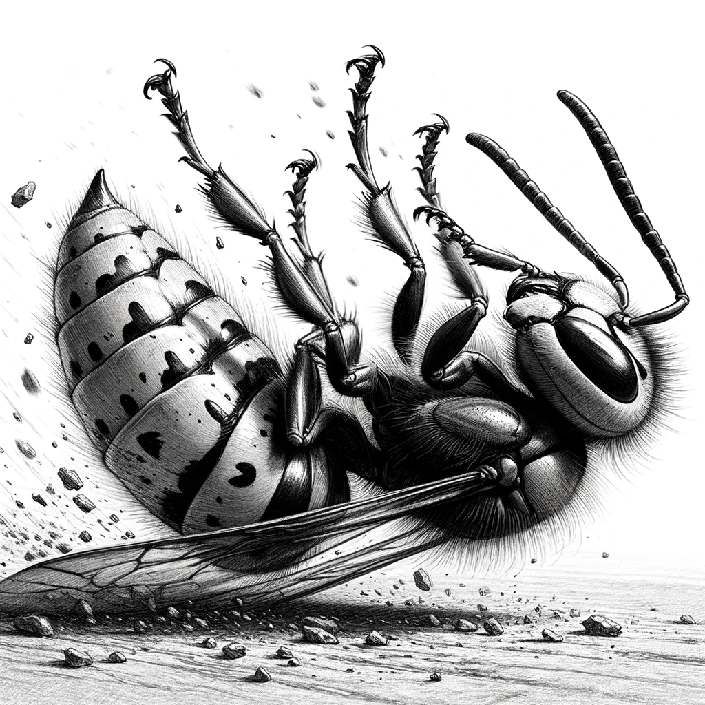
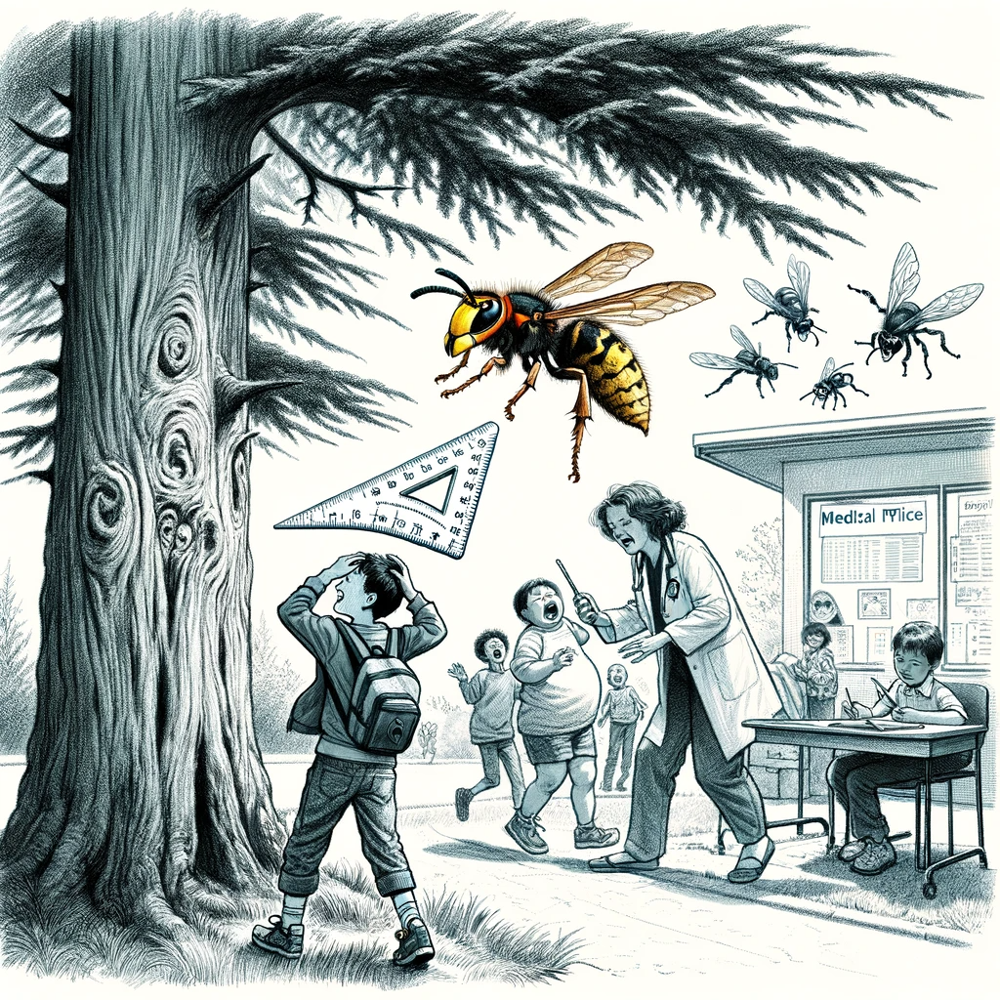
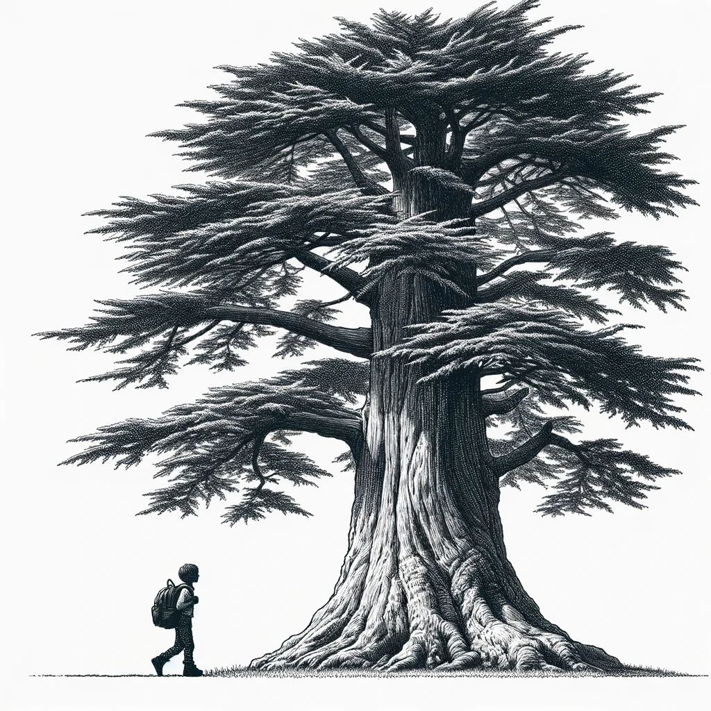
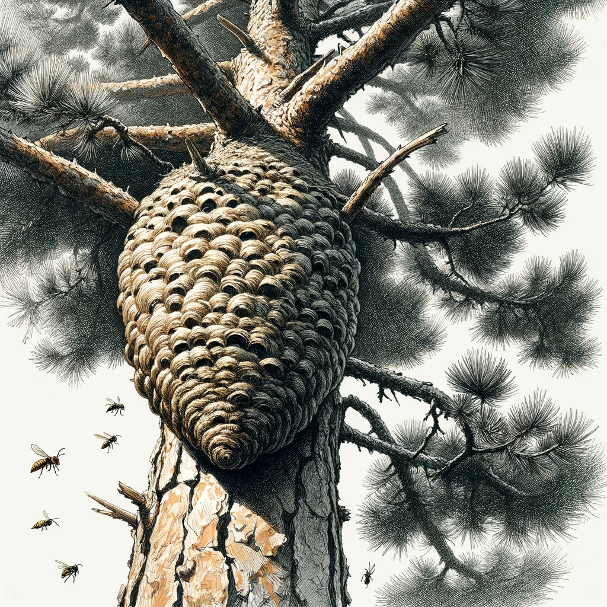

# 【生命•故事】（106）是谁捅了蚂蜂窝

有一天，应该是周六吧。那天下午学校搞了个全校大扫除，把校园里各个地方包干给了不同的班级。干完活后，我似乎又参加了一个什么课后的辅导活动，剩下自己一个人，便收拾了书包往家走。

通常来说，我都会从那棵靠近路边的巨大雪松下走过，这次也不例外。但没想到的是，刚刚走到松树下，一只蚂蜂嗡地直冲我而来，迅雷不及掩耳地落在在我头顶、「啪」的叮了一口。我手里正好拿着一把巨大的塑料三角尺，本能地拿起尺子，在脑袋上迅速地挥过，那只蚂蜂被尺子击中，跌落在一米开外的地上，嗡嗡地打着转，再也飞不起来。

脑袋被蛰，疼得越来越厉害，甚至还有些头晕起来。我担心蚂蜂的毒针留在脑袋上，便掉转头，晃晃悠悠地朝学校医务室走去。

推开医务室的门，没想到里面全是人，男孩，女孩，高年级的，低年级的，似乎还有老师。几乎所有的孩子们都在那里抹着眼泪，更有一个胖乎乎的小男孩，和几个女生哇哇大哭，热闹非凡。一问才知道，全都是被蚂蜂蛰的。闹了半天，是有人在大扫除时，把那棵松树上的蚂蜂窝给捅了。然后，炸了窝的蚂蜂就开始疯狂地无差别攻击所有从那附近经过的路人。唉，真倒霉！等了好一会儿，终于轮到我，医生看了一眼我，问我怎么回事？我说被蚂蜂蛰了，头痛头晕。她检查了一下，说脑袋上没有刺啊。我说，那可能我那一尺子出手也足够快，它还没来得及把自己的毒针扎太深就被我打飞了吧。

