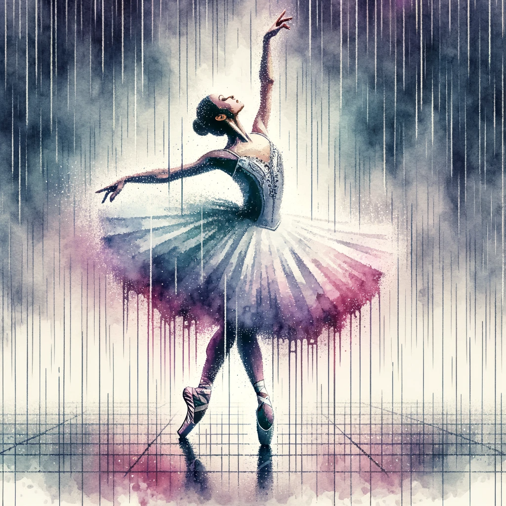
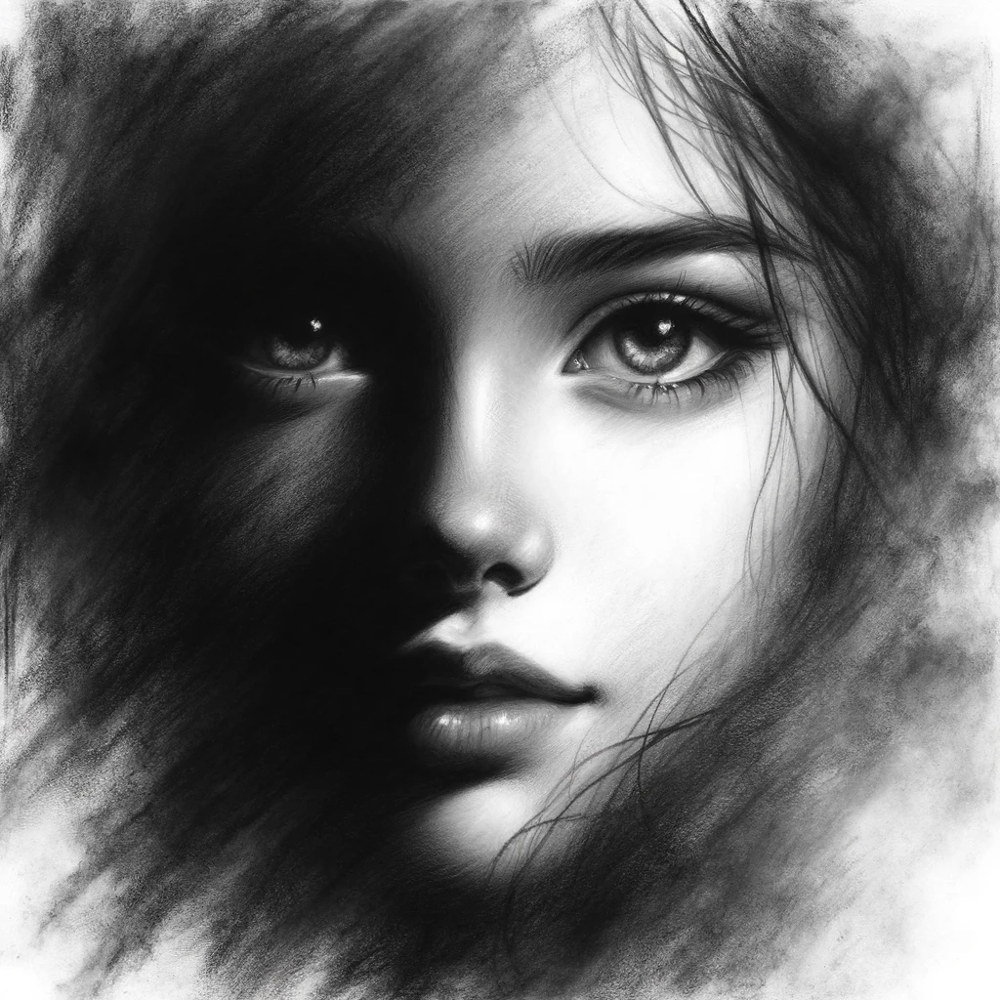
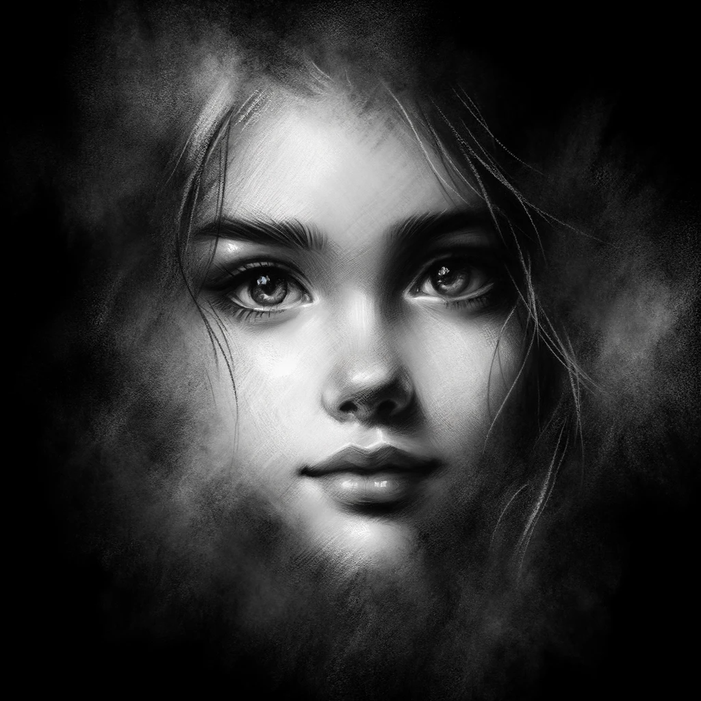
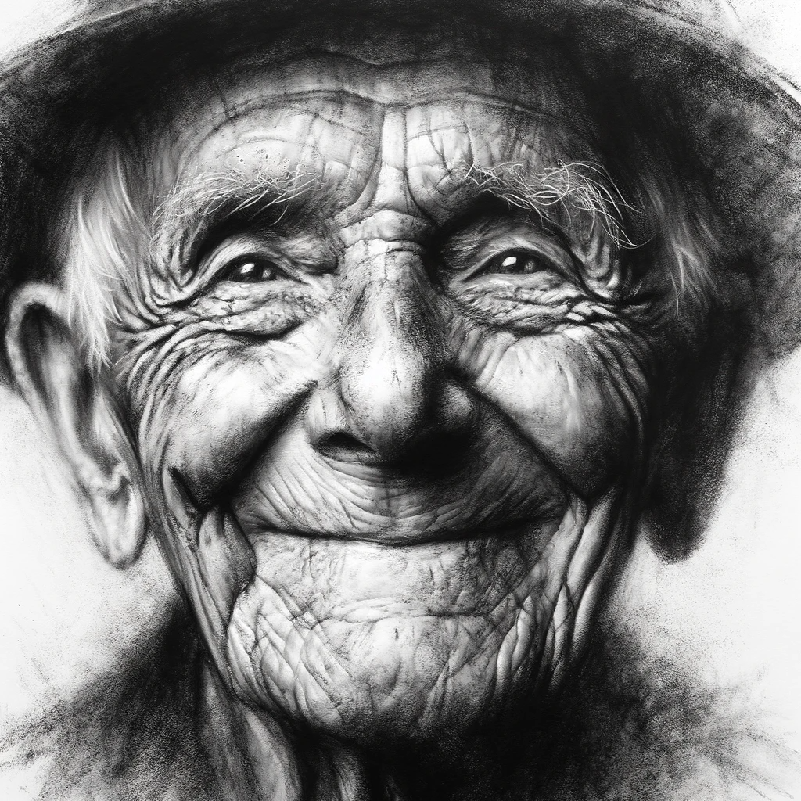
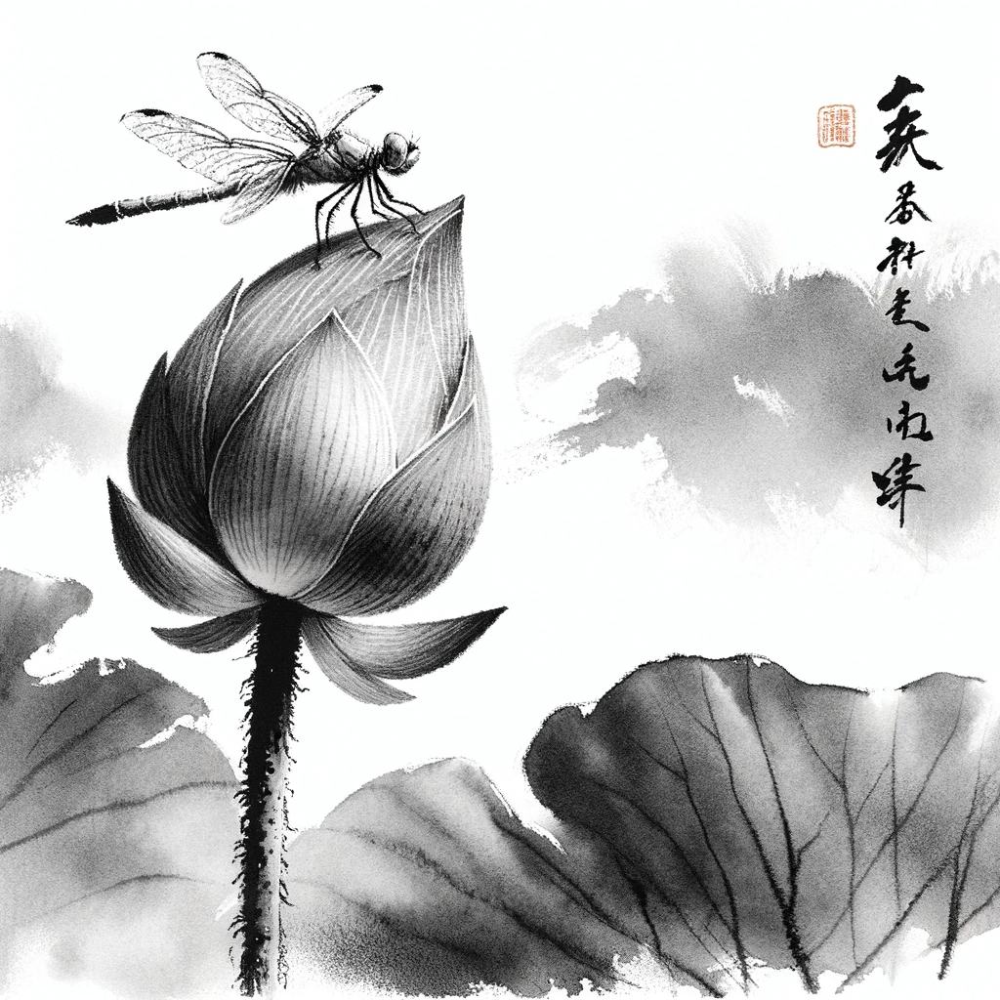
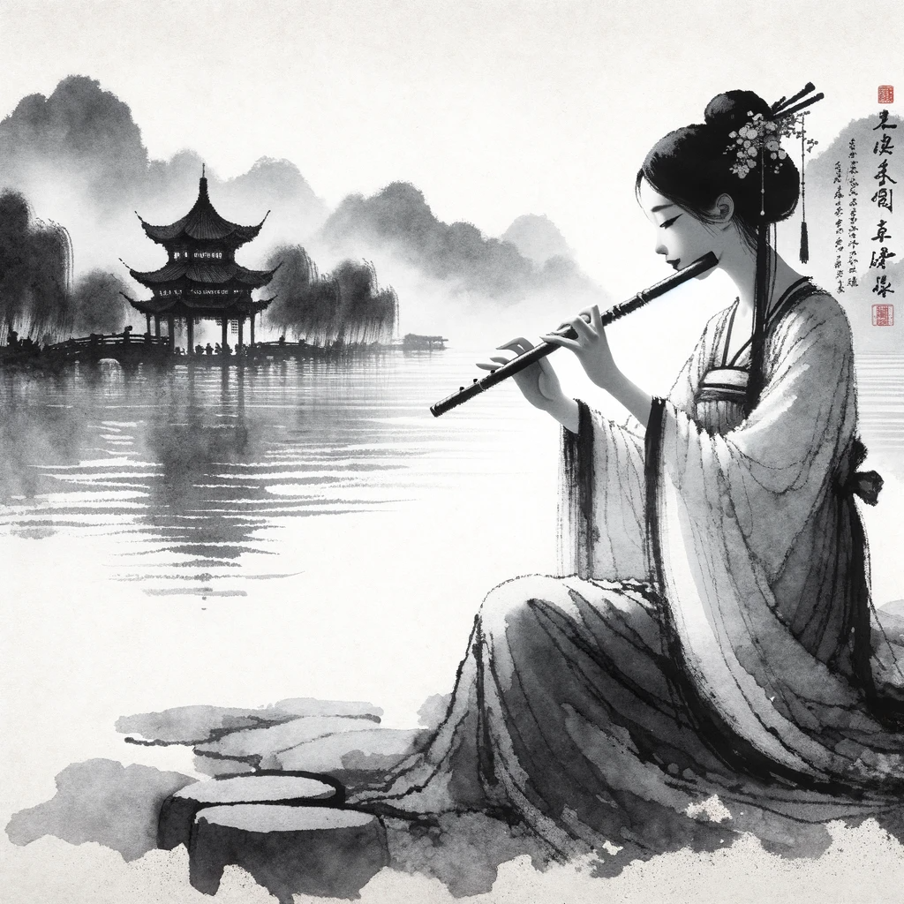
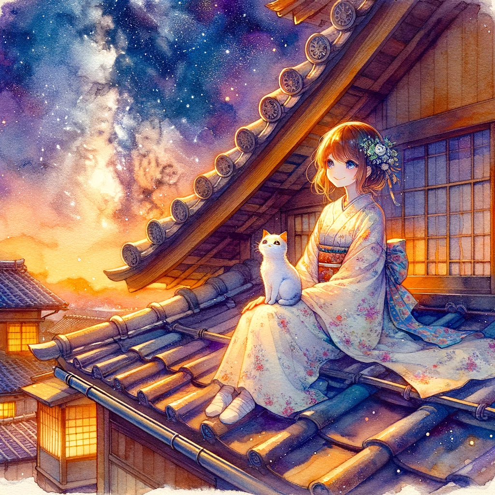
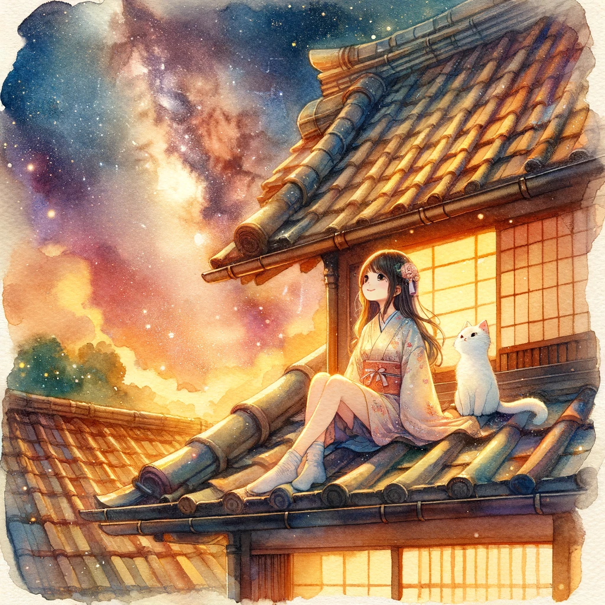
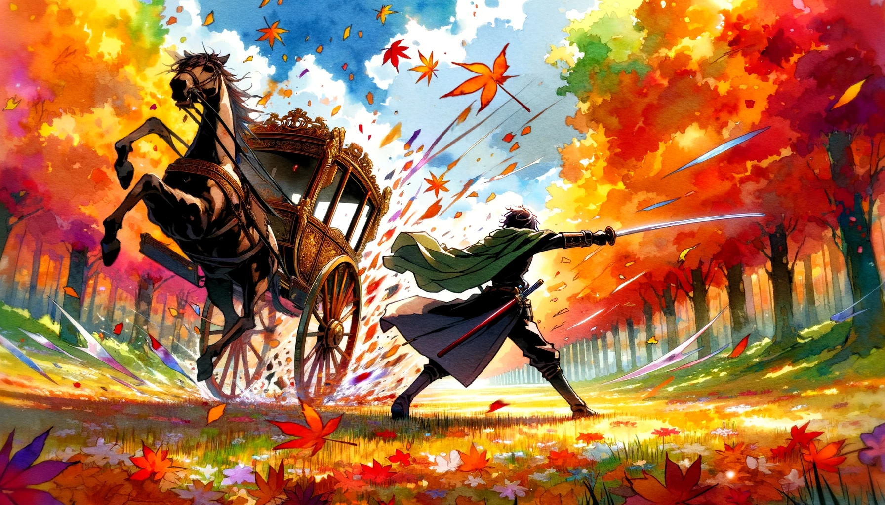

# 【教程】尝试DALL-E 3中的各种绝美艺术风格（二）

有种停不下来的感觉，尤其是画出一幅特别美的画之后，又画出一幅不尽如人意的画。

Anyway，继续尝试其它风格……

## 11. 霓虹立体派（Neon Cubist）

"霓虹立体派"（Neon Cubist）并不是一个传统艺术术语，看起来像是将"霓虹"（Neon）和"立体派"（Cubist）这两个词合并而成的新词。通常，"霓虹"指的是鲜艳的、通常用于标志和广告的气体灯，而"立体派"是一个艺术运动，其特点是将物体分解为几何形状并从多个视角同时展现。

如果我们将这两个概念结合，"霓虹立体派"可以被想象为一种艺术风格，这种风格可能会用鲜艳的、类似霓虹灯的颜色来渲染或照亮立体派风格的作品，从而创造出一种新的视觉效果。这可能意味着使用光线和色彩来强化立体派作品的几何形状和多视角效果，给人以独特的视觉体验。

> **画一个霓虹立体派的吹尺八的日本僧人，旁边有类似火影忍者的形象，塑造传统与现代的冲击感**
>
> 由于提到了火影忍者，GPT建议我把提示词修改成下面这样：
>
> > Create an image of a Neon Cubist art style representation of a Japanese monk playing the shakuhachi flute. Beside him, depict an original character dressed in a futuristic ninja outfit, embodying a blend of traditional and modern elements. The scene should have a dynamic contrast between the serene, traditional monk and the vivid, modern ninja, with neon lights accentuating the geometric forms in a Cubist manner to create a striking visual impact.

> **霓虹立体派的芭蕾舞者肖像，五颜六色的抽象符号在舞者身边跟着舞动**

## 12. 水彩像素艺术

水彩像素艺术是一种结合了传统水彩绘画和现代像素艺术（通常与数字艺术相关）风格的艺术形式。在这种风格的作品中，艺术家通常使用水彩技巧来创作图像，然后将这些图像转化为像素化的形态，模仿早期计算机图形的外观。这种融合创造了一种独特的视觉效果，既有水彩画的流动性和色彩的渐变，又有像素艺术的清晰边界和结构化布局。

> 水彩像素艺术的芭蕾舞舞者，在雨中漫舞

## 13.  涂抹木炭画

涂抹木炭画（Smudge Charcoal Drawing）是一种利用木炭棒或木炭粉进行绘画的艺术形式，它允许艺术家通过涂抹、擦除和混合技术在纸上创造出各种灰度和纹理效果。这种技术可以产生柔和的阴影和渐变，以及戏剧性的强烈对比，常用于创作更有表现力和情感氛围的作品。涂抹技巧的运用对于表现物体的立体感和质感尤为关键，使得作品既有力度又不失细腻。

> 一幅阴影中美丽少女脸庞的**涂抹木炭画**画像。忧郁的表情，但美丽的大眼睛透出一点纯真、快乐的光芒

> **涂抹木炭画肖像，老父亲，深邃的皱纹显示出岁月的痕迹。但眼神开朗、快乐。**

## 14. 涂抹中国水墨画

涂抹中国水墨画是一种传统的东方艺术形式，它结合了水墨画的自由流动性和涂抹技法的表现力。传统水墨画侧重于使用水和墨水的比例来控制色彩的深浅，而涂抹技法则通过故意使墨水在纸上扩散或混合，创造出模糊或柔和的效果。这种方法往往能够捕捉动态的场景或表达主题的情感深度，使画面产生一种独特的氛围和质感。涂抹中国水墨画常被用来表现自然景观，如山水、花鸟等，同时也适用于抽象构图，为观者提供了更多的想象空间。

> 涂抹中国水墨画，一只蜻蜓独立荷花苞尖，显出「小荷才露尖尖角，早有蜻蜓立上头」的意境。

> 涂抹中国水墨画，一个年轻女子在西湖边吹笛子，「欲把西湖比西子，淡妆浓抹总相宜」的意境。

## 15. 动漫水彩

动漫水彩风格是指将传统水彩画的技法和动漫风格的描绘相结合的一种艺术形式。在这种风格中，水彩的渲染效果被用来给动漫人物或场景增添一种柔和、梦幻的氛围。与普通的动漫绘图，如数码绘画相比，动漫水彩风格强调的是水彩独有的流动性和色彩的透明度。

这种风格通常以手绘的方式进行，画家会利用水彩颜料的特性，通过水的多少来控制颜色的深浅和覆盖范围，创造出独特的质感和层次。动漫水彩画可以表现为简单的人物肖像，也可以是复杂的故事场景。它们通常充满了色彩和情感表达，而且很多时候会融入自然元素，如花朵、水面等，来增强画面的表现力。动漫水彩风格的作品往往给人以温暖而诗意的视觉体验。

> 梦幻般的动漫水彩风格肖像，一个美丽的年轻女孩和她心爱的猫咪坐在传统日式房屋的屋顶，看着灿烂的星河，温馨而梦幻。

> 宽屏动漫水彩风格的场景：一位剑客，在秋季颜色绚烂的原野上，隔空一剑将车队中间最豪华的一辆皇家马车劈开成碎片。要冲击感，表现出动态和巨大的威力，同时也要有绚烂的美感。

