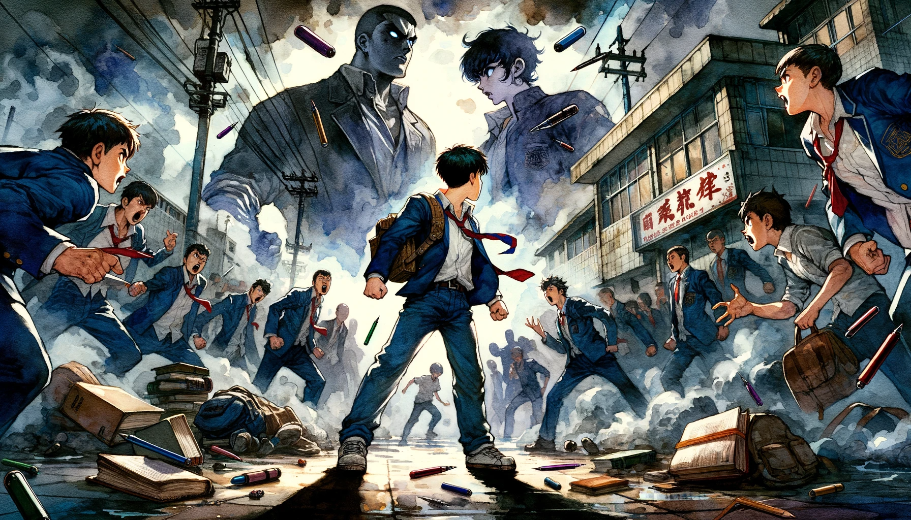
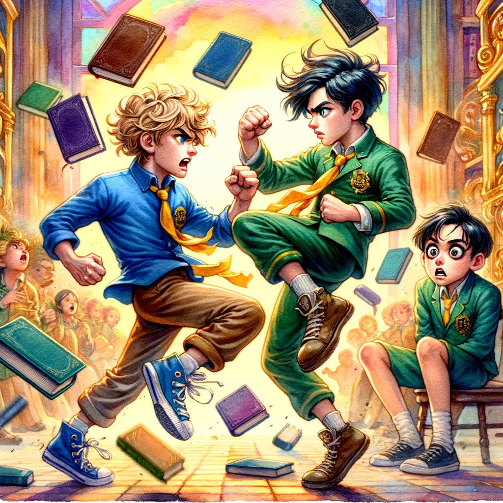
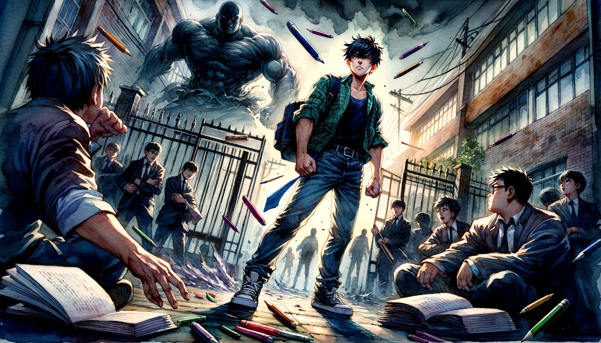

# 【生命•故事】（107）我们那时经历过的霸凌

在我们读小学和初中那会儿，似乎正是一段社会有些动荡的时期。常常有黑社会相关，或者严打有关的各种故事，在我们耳边有鼻子有眼地传来传去。比如那些菜刀帮和斧头帮斗殴，砍死多少人啊；某个地方的黑帮被揣着冲锋枪、风衣的便衣武警连锅端掉啊，等等……不时还会见到法院贴出大字报，一口气宣布许多人被判处死刑等等。

再不然，就是某某学校的女学生，在上学路上的竹林中被人强奸。某某学校的学生打架，低年级的小个子被打，悄悄守在澡堂外面，一刀捅死揍过自己的高年级混混等……

然而，我们遇到的却是很常见的情况，那些在外面「混」的「坏孩子」们，会拦在我们上学的路上，「抢劫」——对，就是抢劫。抢走全部的零花钱，皮带，一切他们觉得好的东西。不给，就打。我似乎被抢过好几次，抢劫的那家伙我认识，是附近湾子里一个喜欢「混社会」的学生。

直到有一天，中午上学我和ZK一起，又遇到了那个家伙拦住我们抢劫。我颇有些害怕，退到后面。ZK毕竟是部队大院里长大的孩子，年纪也比我大些，长得也魁梧，坚决不肯服软。于是，说话间，他们就叮铃桄榔抡起拳头打到一处。我站在旁边，傻傻地也不知道上去帮忙。只知道，嗖的一支钢笔飞了出来，我赶紧去把笔捡回来。啪的一本书又飞了出来，我又去把它捡起。ZK塞在衣服里的书本、笔等文具飞了一地，我一一捡起。那小混混没占到便宜，愤怒地走了。

到了晚上放学，校门口纠集了一大帮人，堵在那里，扬言要收拾ZK。他们不进学校，老师也没法管。估计老师也没法护送ZK回家。于是ZK也不敢出学校门，我们一帮同学陪着他不知如何是好。

后来怎么解决的呢？也是凑巧，我们班上也有个在外混社会的同学。他出校门一看，对方叫来的那帮人的老大他认识，可能还很熟吧。于是，他出面斡旋，让双方和好了。

那个和ZK打过架的家伙后来和我们也渐渐熟悉了些，聊起那次打架。还略略不平，他对ZK说：

> 你那时把书塞在衣服里，跟盔甲似的，害我好几拳都是打在书上，毫无效果。

ZK哈哈一笑：

> 嗯，你的拳头是蛮重的！

