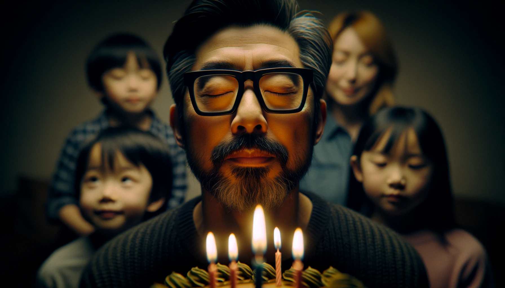
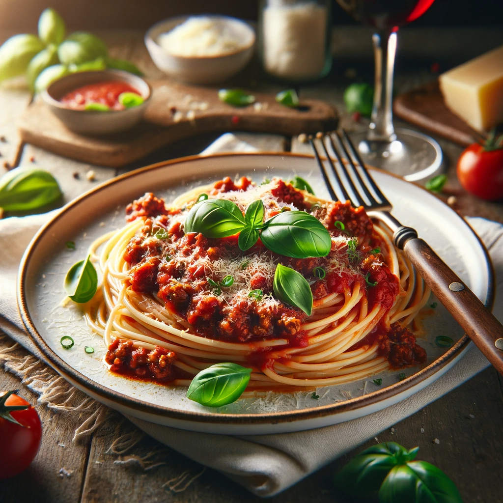

# 【随笔】有生的日子天天快乐

又到生日了，母亲一早就给我发来一个生日红包。而大宝也一起床，就开始准备着给我制作生日蛋糕的蛋糕胚。

然后，一整个白天，在外面忙活着工作上的各种会晤、交流什么的。等晚上到家时，我有些抱歉地对大宝说：

> 过半个小时，还有一个电话会议。然后再过两个半小时，有另外一个电话会议。而且，我还需要在这两个会议之间，为后面一个会议准备材料……

大宝笑了，说：

> 那你还要不要过生日啊？

我想了想，说：

> 那还是要的，惦记你做的生日蛋糕好久了！
>
> 就在这两个会议中间，还是有时间的：）

于是，我还是快乐地享用了一份漂亮的西红柿牛肉酱意大利面作为生日面。接着就是超级香浓的巧克力蛋糕，浓浓的75%纯巧克力熬制的巧克力酱，特别的香浓。大宝和阿宝都嫌这太苦，我和大鱼却吃得香喷喷。但是，明显，对于生日的期待，我已经没有孩子们那么积极了。

阿宝告诉我说：

> 所有人过生日，我都喜欢。当然，我自己过生日，我最喜欢了！

而大鱼则表示，只要有生日蛋糕，就是完美的生日，至于是谁负责切蛋糕，根本不重要。

只有我，忍不住会对自己这个生日的数字不满意。以前还可以四舍五入，欺骗自己还算年轻。现在只能五入，想骗自己都不容易。于是，这么一想，简直再也不愿意看那些各种IT系统自动发过来的「祝你 XX岁生日快乐」消息了。

但是，当大宝问我，要不以后不过生日了？我想了想，坚决地说：

> 生日那还是要过的，我喜欢吃你做的生日蛋糕！

我想起了郑智化的那首《生日快乐歌》的歌词：

> 祝你生日快乐，生日快乐！
>
> 有生的日子天天快乐！
>
> 别在意生日怎么过……