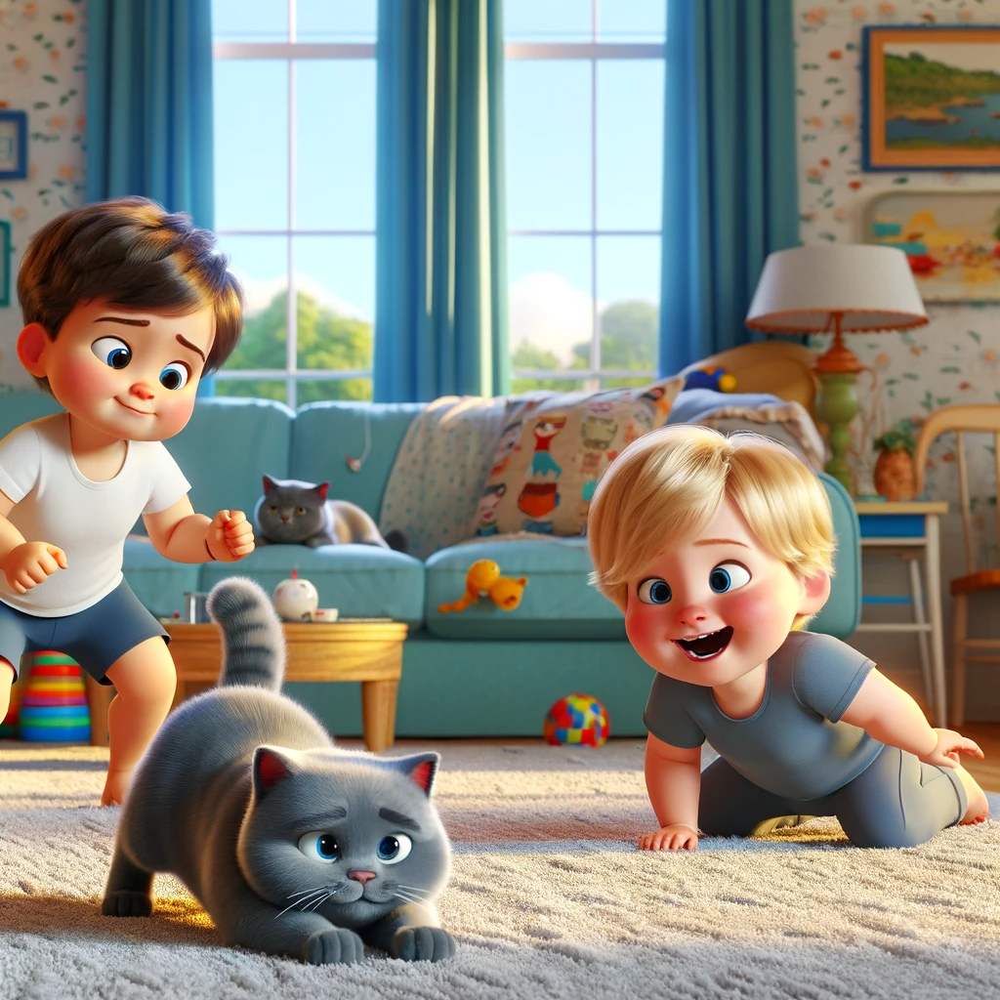
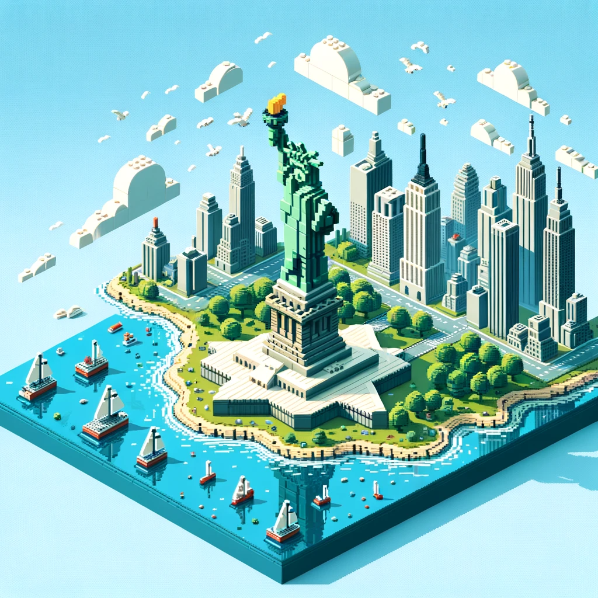
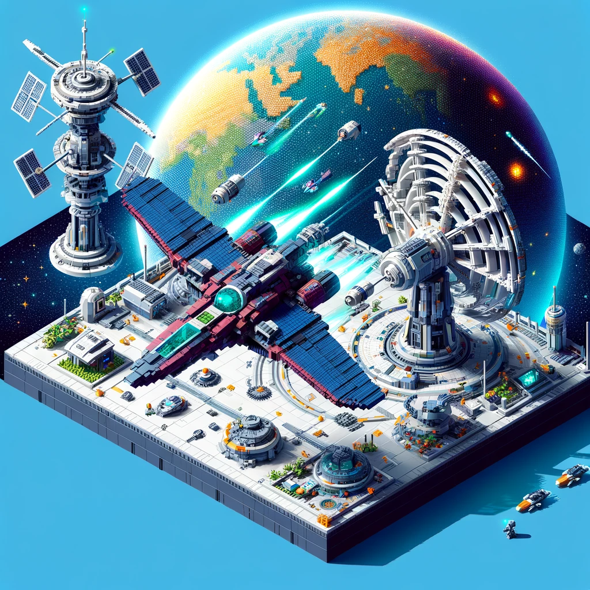
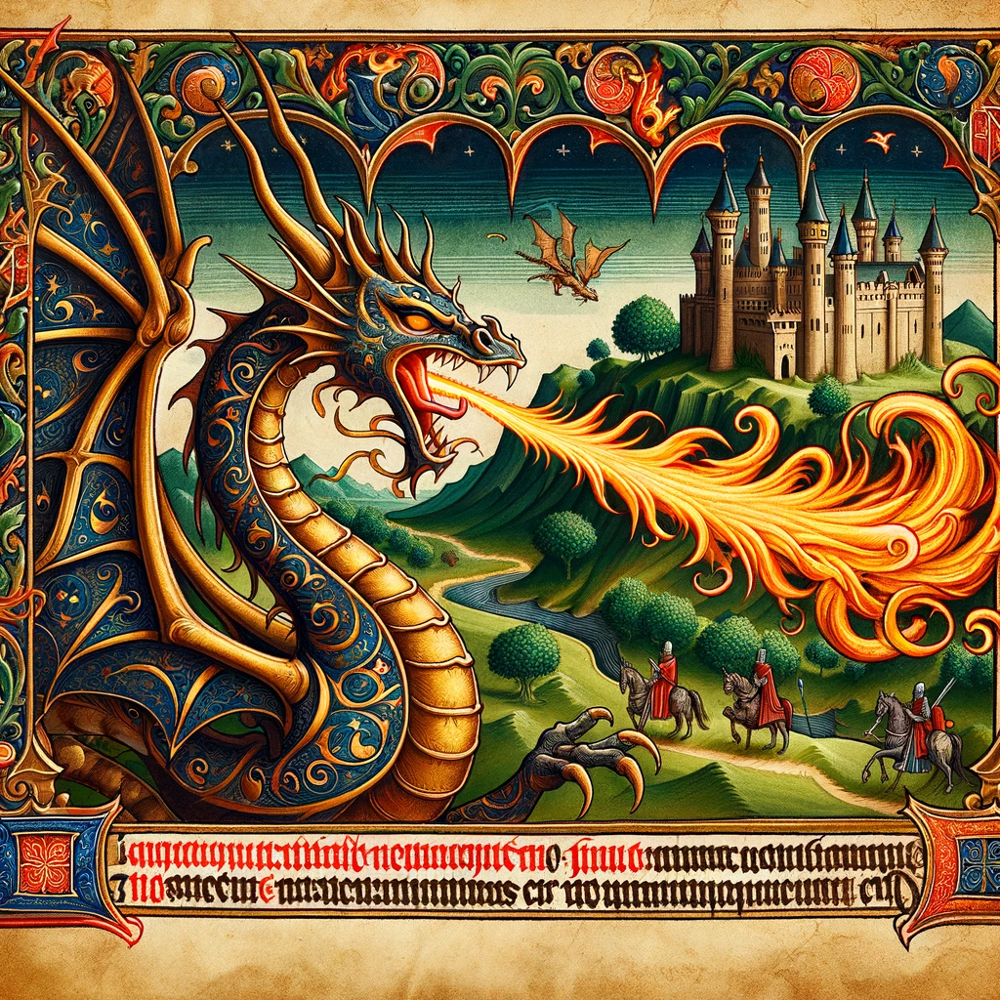
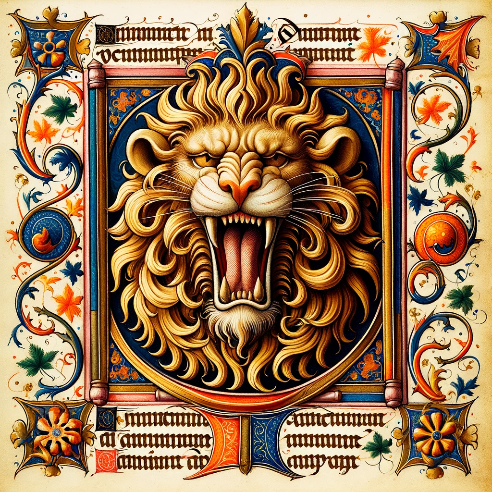
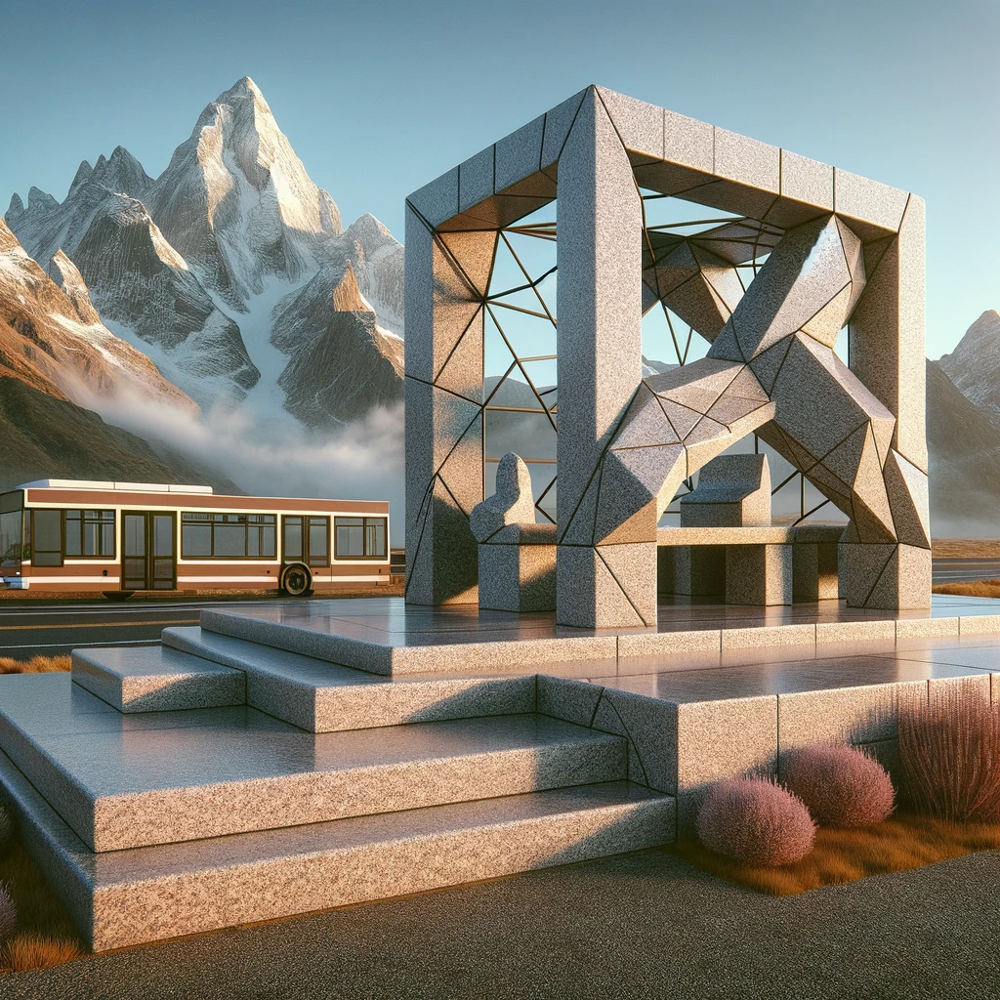

# 【教程】尝试DALL-E 3中的各种绝美艺术风格（三）

有种停不下来的感觉，尤其是画出一幅特别美的画之后，又画出一幅不尽如人意的画。

Anyway，继续尝试其它风格……

## 16. 3D 皮克斯风格卡通

3D 皮克斯风格卡通是一种非常受欢迎的动画形式，特点是具有高质量的三维图像、流畅的动画效果和生动的角色设计。皮克斯是动画界的佼佼者，以其革命性的计算机动画技术和对故事叙述的重视而闻名。这种风格的动画通常具有圆润的角色轮廓，丰富的表情和细节，以及逼真的纹理和光影效果。

皮克斯动画作品中的角色往往有着夸张的特征，比如大眼睛、宽大的嘴巴和鲜明的个性，这些都有助于表达角色的情感和增强观众的共鸣。此外，皮克斯的故事通常具有深层次的主题，既适合儿童观看，也能吸引成年观众。

在技术层面上，3D 皮克斯风格卡通采用先进的渲染技术和精细的建模来创造出色彩鲜明、动态自然的场景。皮克斯的动画师们将传统的动画艺术与最新的计算机技术相结合，创建出一个个令人难忘的动画世界。

> **画一个3D 皮克斯风格卡通：一个2岁多不到3岁的小男孩，在阳光灿烂的花园里，开心地拽着一只英短蓝猫的尾巴和它玩耍，蓝猫一脸嫌弃又无可奈何地陪着。**

> **画一个3D 皮克斯风格卡通：一个2岁多不到3岁的小男孩，在客厅里地毯上学习一只英短蓝猫趴在地上，准备出击扑窗外小鸟的样子。旁边6岁多的姐姐捧着肚子大笑。**

## 17. 霓虹线描

霓虹线描风格是一种艺术表现形式，它结合了霓虹般鲜明的颜色和光线以及简洁流畅的线条来创作画面。这种风格常常会使人联想到城市的夜景，特别是像东京或上海这样的大都市，其中霓虹灯光与夜生活交织在一起。线条通常是连续的，用以勾勒出物体的轮廓，而鲜艳的颜色则填充在这些轮廓之内或用于背景，营造出一种充满活力、未来感的视觉效果。它可以是非常简洁的，也可以非常复杂和详细，取决于艺术家想要表达的内容和风格。

霓虹线描作品通常具有很高的对比度和视觉冲击力，它们往往用来传达一种现代、时尚、前卫的感觉。这种风格在海报设计、广告、插图、动漫以及游戏界面设计中特别受欢迎。它也常见于数字艺术和街头艺术中，因为这种风格的流行性和视觉上的吸引力。

> **一只高傲的小猫咪的霓虹线描，优雅而神气的样子。**

> 一只憨态可掬的大熊猫在吃竹子的霓虹线描。突出大熊猫憨憨的样子。

## 18. 等距乐高

等距乐高（Isometric LEGO）通常指的是一种视觉表现手法，结合了等距投影的技术和乐高积木的创造性。在这种风格中，图像是按照等角三维视角呈现的，意味着与观察者的视线成等角，且三维空间中的长度、宽度和高度都没有因距离而缩短。

在等距乐高艺术作品中，乐高积木被用来构建场景和对象，但所有的线条在屏幕上都以相同的角度显示，通常是30度对地面。这种投影方式不会呈现透视收缩，因此远处的物体和近处的物体大小看起来是一样的。

这种风格的插画和设计通常用于视频游戏图形和像素艺术中，因为它可以有效地在二维平面上模拟三维效果，同时保持设计的整洁和可读性。等距乐高设计有其独特的视觉吸引力，可以带来新颖和有趣的视觉体验。

> **用等距乐高设计再现一个纽约市自由女神像附近风景画**

> **用等距乐高风格设计一个视频游戏的关卡画面，一艘飞船，准备靠近并袭击庞大的星球级别的空间基地的情形。尝试突出科技感和雄伟壮观感。**

## 19. 彩饰手抄本

彩饰手抄本是中世纪欧洲时期的一种装饰手稿，通常含有金色、银色以及鲜艳颜色的图案和字母，用以增强手抄文本的视觉美感和阅读体验。这些手抄本往往是宗教文本，比如圣经或祈祷书，但也包括文学作品、历史书籍和科学著作。

制作过程是极为精细和耗时的，每一页都是由专门的抄写员和艺术家手工完成。文字由抄写员精心书写，而边栏、首字母和文中插图则由插画家绘制，他们通常会使用金叶和其他珍贵材料来装饰。彩饰手抄本不仅是文本记录，也是艺术品，反映了当时的文化、宗教信仰和审美。

随着印刷术的发明和普及，彩饰手抄本的制作逐渐减少，但它们在艺术史和书籍史上依然占有重要地位。现存的彩饰手抄本被视为珍贵的文化遗产，保存在世界各大图书馆和博物馆中。

> 彩饰手抄本，一只中世纪传说中正在喷火的龙作为插画。

> **彩饰手抄本，一只正在咆哮的雄狮，头部详细特写**

不知不觉，已经尝试了15种绝美的艺术风格，我忍不住停下来问问蔡姬否：

> 我已经尝试了以下绘图的艺术风格：
>
> 1. 木刻艺术品
> 2. 涂抹油画
> 3. 立体像素艺术
> 4. 技术绘图
> 5. 新表现主义（New Objectivity，德语：Neue Sachlichkeit）
> 6. 新表现主义（Neo-Expressionism）
> 7. 电致发光多边几何低模 Electricluminescent geometric low-poly
> 8. 纸雕
> 9. 剪纸
> 10. 手绘3D效果
> 11. 霓虹立体派（Neon Cubist）
> 12. 水彩像素艺术
> 13. 涂抹木炭画
> 14. 涂抹中国水墨画
> 15. 动漫水彩
> 16. 3D 皮克斯风格卡通
> 17. 霓虹线描
> 18. 等距乐高
> 19. 彩饰手抄本
>
> 请向我推荐一下，接下来还有哪些值得尝试用来绘画的艺术风格呢？

蔡姬否回答：

> 探索艺术的道路上，你已经涉猎了许多独具特色的风格！接下来，这里有一些其他的艺术风格，它们各自带有不同的历史背景和技术特点，可能会激发你的创作灵感：
>
> 1. **艺术新印象主义（Pointillism）**：通过小点的聚集来形成图像，强调颜色的光学混合。
> 2. **装饰风艺术（Art Deco）**：这种风格以其对称的几何形状和丰富的装饰性而闻名。
> 3. **超现实主义（Surrealism）**：超现实主义者通过荒诞和梦幻的图像探索潜意识和梦境。
> 4. **未来主义（Futurism）**：强调速度、技术、青年和暴力，以及物体在空间中的动态表现。
> 5. **表现主义（Expressionism）**：注重表达情感和对现实的主观表现。
> 6. **野兽派（Fauvism）**：使用鲜艳的、过度饱和的颜色来达到强烈的表达效果。
> 7. **抽象表现主义（Abstract Expressionism）**：强调作者表达自身情感的自由抽象作品。
> 8. **民间艺术（Folk Art）**：传统上由未经正式培训的艺术家创作，通常具有文化和社区的特色。
> 9. **浮世绘（Ukiyo-e）**：日本的一种传统版画和绘画风格，常描绘历史、民间故事、风景和日常生活。
> 10. **艺术装饰（Art Nouveau）**：以自然形态和结构为灵感，流畅的线条和曲线为特点。
> 11. **波普艺术（Pop Art）**：利用大众文化的图像和符号，通常具有讽刺意味。
> 12. **立体主义（Cubism）**：通过几何形式破碎和重组物体，探索不同角度的视觉。
> 13. **当代街头艺术（Contemporary Street Art）**：通常在公共空间进行，包括涂鸦、模板艺术等。
> 14. **数字抽象（Digital Abstract）**：利用数字工具创作的抽象艺术，可以是非常自由形式的探索。
> 15. **构成主义（Constructivism）**：一种强调实用性和材料特性的艺术形式。
>
> 尝试不同的艺术风格不仅能提高你的艺术技能，还能帮助你在风格之间找到自己独特的声音。希望这些建议能给你带来新的创作灵感！

我被构成主义这个词吸引了，就从这里继续吧：

## 20. 构成主义

构成主义是一种20世纪早期在俄国兴起的艺术和建筑哲学，强调抽象的几何形式和用于实现社会目的的艺术。它由弗拉基米尔·塔特林（Vladimir Tatlin）和亚历山大·罗钦科（Alexander Rodchenko）等人提倡。构成主义艺术家们认为艺术应该反映现代工业社会和材料的使用，因此他们的作品通常是实验性的，使用新型材料并探索形式与空间的关系。

在构成主义艺术中，色彩使用通常较为简约，重点在于形状、线条和角度的组合，以及它们如何影响观者的感受和想象。这种风格在绘画、雕塑、平面设计、舞台设计和建筑中都有所体现。构成主义强调功能与形式的统一，这影响了后来的现代主义和包豪斯设计学派。

构成主义的重要特征包括：

- 几何抽象：通过几何形状表现视觉语言。
- 功能主义：认为艺术应该具有社会或实用功能。
- 空间和物质的新探索：通过艺术探索空间、材料和技术的可能性。
- 驳斥纯粹的“艺术为艺术”观点：艺术应服务于社会和政治目的。

构成主义对后来的许多艺术运动，如功能主义、抽象表现主义和极简主义等都产生了深远影响。

> 来一幅构成主义的设计图，山边用花岗岩雕塑的公共汽车站，有挡雨棚，有座椅，功能实用，又有花岗岩的特点，和大山风景融为一体。

呼呼～ 这么玩一下，对于艺术门外汉的我来说，感觉GPT4简直太强大了，几乎是无所不能啊。期待着早一天能用上GPT All in One的功能，同时，也要考虑开个能用GPT4 的API账号才是。

<待续>