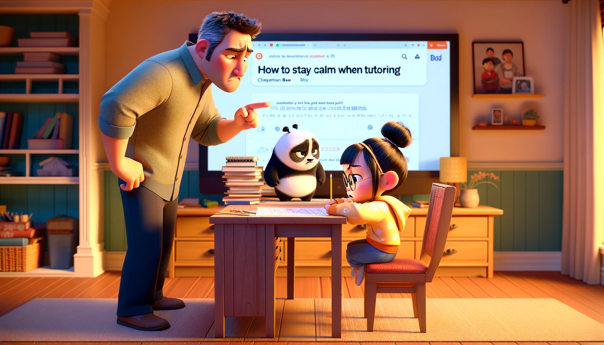
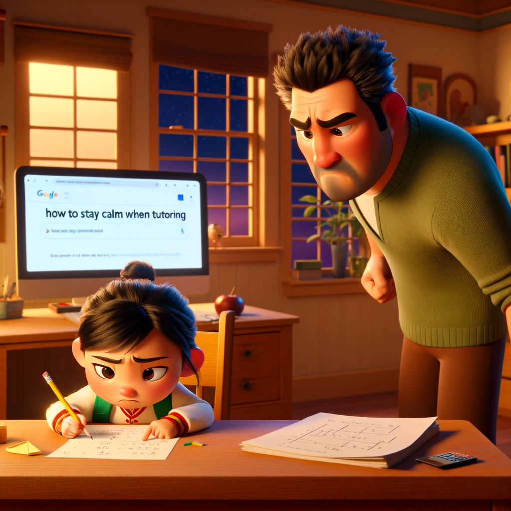

# 【生命⋅修行】心平气和有多难

晚上被抓去帮阿宝看一道数学题目的意思，只不过几秒钟过去，看着她瘪着嘴对我的问题一言不发，看着她拿着铅笔戳着书桌上的一张纸，我就不由的怒从心头起，变得越来越着急、烦躁、暴怒。

阿宝不愿意让我继续辅导，大宝赶紧又跑过来帮忙。一边帮我开解：

> 爸爸是觉得这题目太简单了，所以他完全无法理解，我们俩就是不懂这题目的意思，就会着急。

我憋着胸痛，退出书房，然后憋着一肚子怒火，打开电脑在网上搜索：辅导作业怎么才能「心平气和」呢？呼呼～许多人问这问题，也许多人在那里提供各种解决方案，更有一些新闻，比如某某老父亲，辅导孩子作业愣是搞得心梗发作。

说白了，原因也就两点：

1. 知识的诅咒——学校的课程、课本，老师布置的作业，包括在做在一边辅导的父母，都不能符合孩子当前的知识状态、综合的能力状态。给他们点任务和期待，距离技能与挑战的平衡点差距太大！
2. 错误期待——我这样的家长很容易被拖入「想要教会她正确做这一道题」的错误目标。作为一个完全不专业的教师，忽然承接这样看起来很简单，其实很难的目标。崩溃才是正常的。

所以，回到辅导孩子这件事情上，就要认清这么一个事实——学校的课本、作业体系未见得适合自家孩子状态的。**我们最重要的目标，还是让孩子在一个相对轻松、快乐的情绪中，持续地养成坚持学习的习惯与兴趣**。

自己辅导不来，就找一些专业的教学视频或软件。反正目前，我找到一个特级老师讲汉语拼音的视频，可以完美解决阿宝学拼音的问题。至于数学，我打算交给可汗学院了。以后再遇到其他啥问题，再寻找其他资源搞定吧！

----

回到自己最近的状态——我也很容易被「一点点不顺心」的事情激怒。想必「身体」和「道理」，这两个都不太通畅吧。