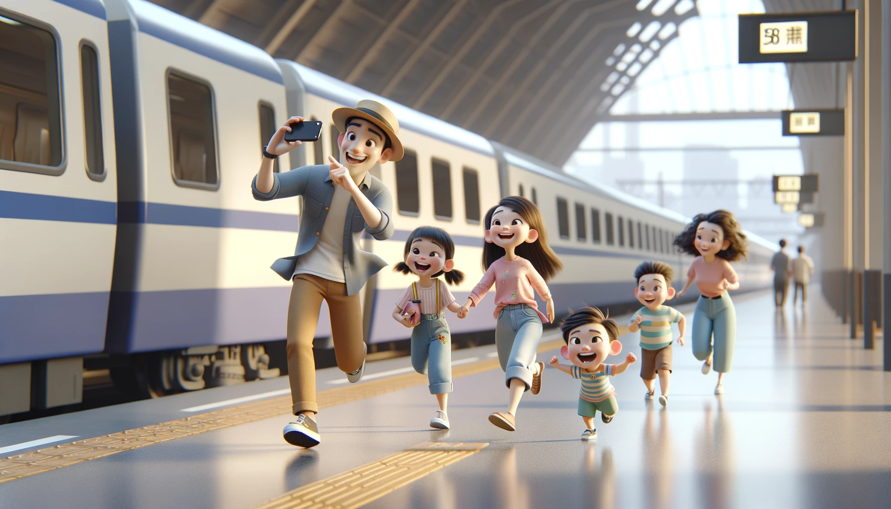

# 【随笔】坐高铁出去玩

本来计划去爬山的，可是夜里忽然下起了大雨，一直到早上都没有停下来的意思。大宝临时决定，我们干脆全家人一起坐高铁出去玩，随便坐几站路，然后玩一会儿就回来。于是乎，我们简单收拾，吃了个早餐就坐上地铁，查了查天气预报，见广州还是阴天，便买了从深圳到广州的城际列车和谐号动车的车票。

大宝把时间安排得恰到好处，到了深圳站，不急不忙地上了动车。

之前正好买了一本介绍中国高铁的绘本，大鱼很开心地观察了一下和谐号，与我们之前坐过的动车相比，车头没那么尖。上车后，两个小家伙都想要坐窗边看风景。我便带着大鱼到了另一节空旷的车厢坐下，大鱼开心地看着窗外的铁轨，各种颜色的火车。等火车开动之后，又仔细地研究一路上的高架桥，铁路上的信号灯。过了一会儿，列车员告诉我们，这里是一等座。如果需要继续坐的话，得补20块钱差价。我赶紧带着大鱼起身，往另一个方向的餐车走去。

果然，餐车里也还有空位置。阿宝也跟着我们过来，我给他们点了一份馄炖、一份馄炖面。然后把大宝也叫了过来，心安理得地开始享受宽敞的餐车环境。

以前不觉得，这次才发现，和谐号晃得还蛮厉害的。大宝说她都有些晕车了，好在路程也就一个多小时，而且，大鱼热衷于看高铁开门、关门，每次到站，一定要跑到门口去等待着，看得是不亦乐乎。等两个小家伙吃完没多久，我们就到了广州东。

到了广州没多久，这里也开始下雨。我们坐公交到了儿童公园，一下车，就不由得感慨，这对小孩子来说，可真是个好玩儿的地方。各种各样的滑梯、游乐设施、玩具、游乐场，还有宽敞的绿地，湖泊，沙坑。如果不是下雨，两个宝宝估计能在这里玩一整天不肯走。

于是，打着伞在公园随便逛逛，然后我们到公园对面的商场下面找了一家据说是老字号的鱼皮档买了些吃的。就坐着地铁去广州南站搭高铁回家了。

这次坐的复兴号，升级换代的高铁，果然和老版本的和谐号比起来，又快又稳当。

下车了，大鱼还惦记着要看高铁关门，结果另一个轨道一辆高铁呼啸而过，卷起巨大的风，差点把我帽子吹飞，把我俩都吓了一跳。