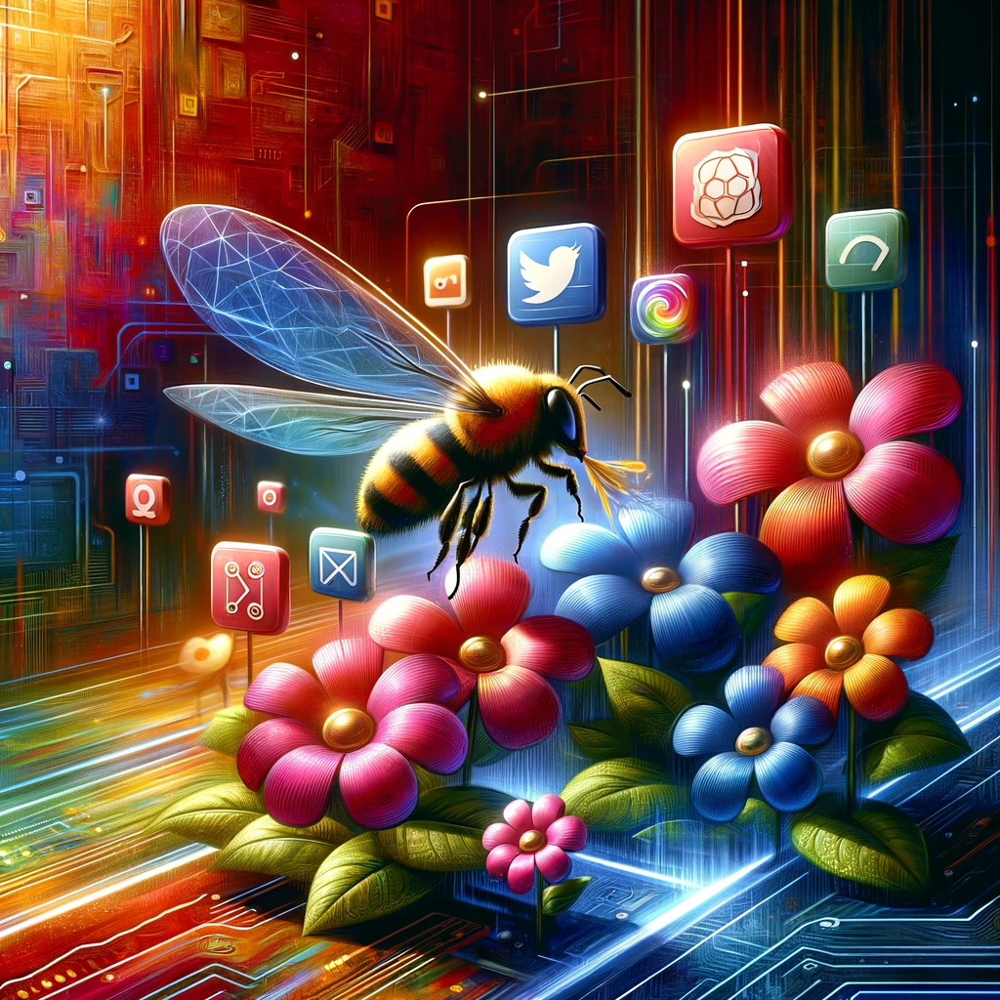
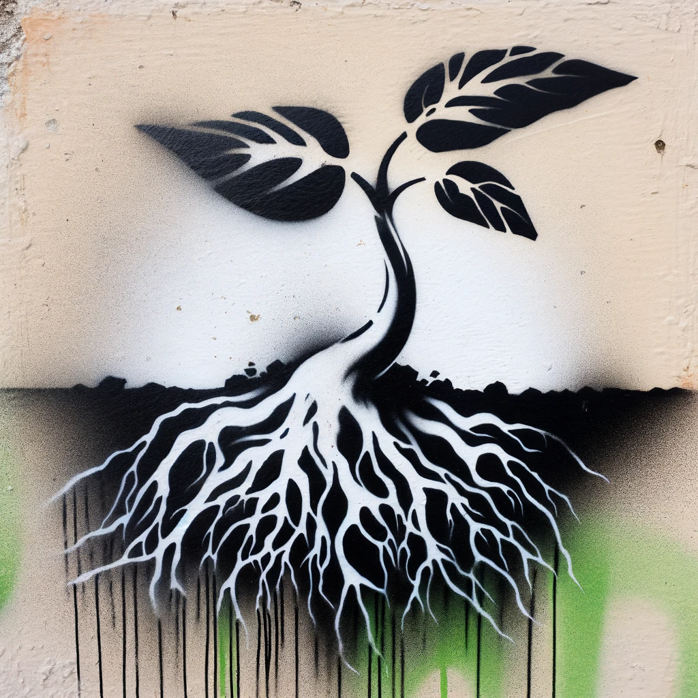
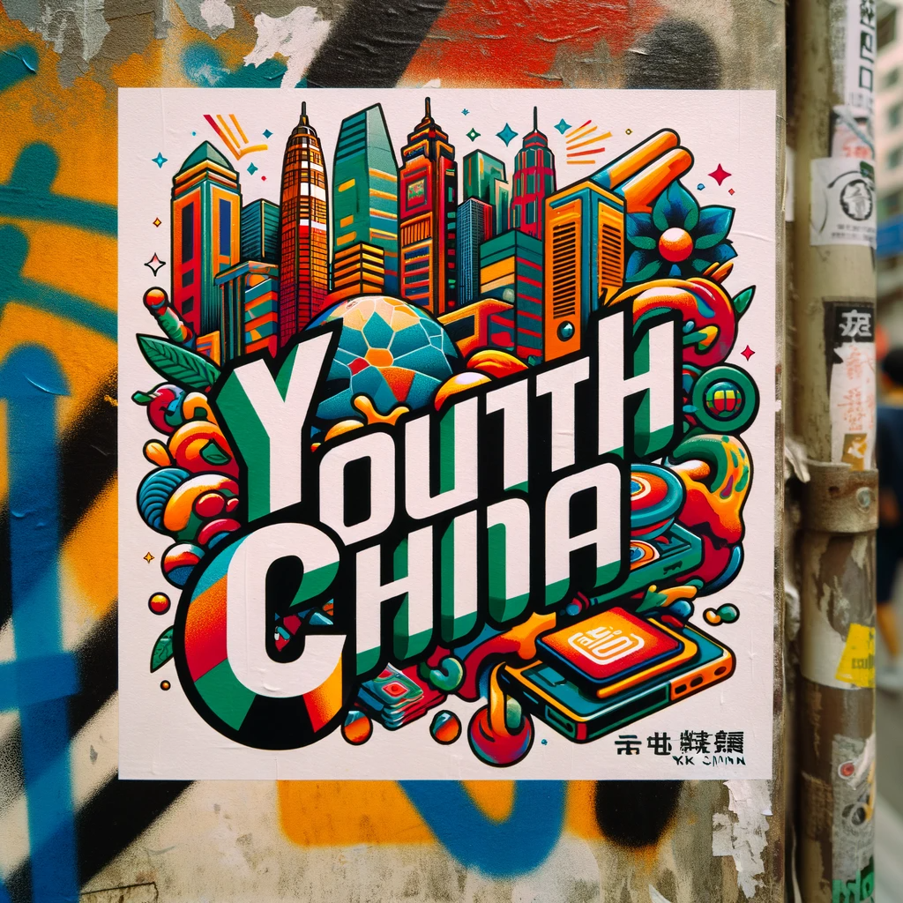
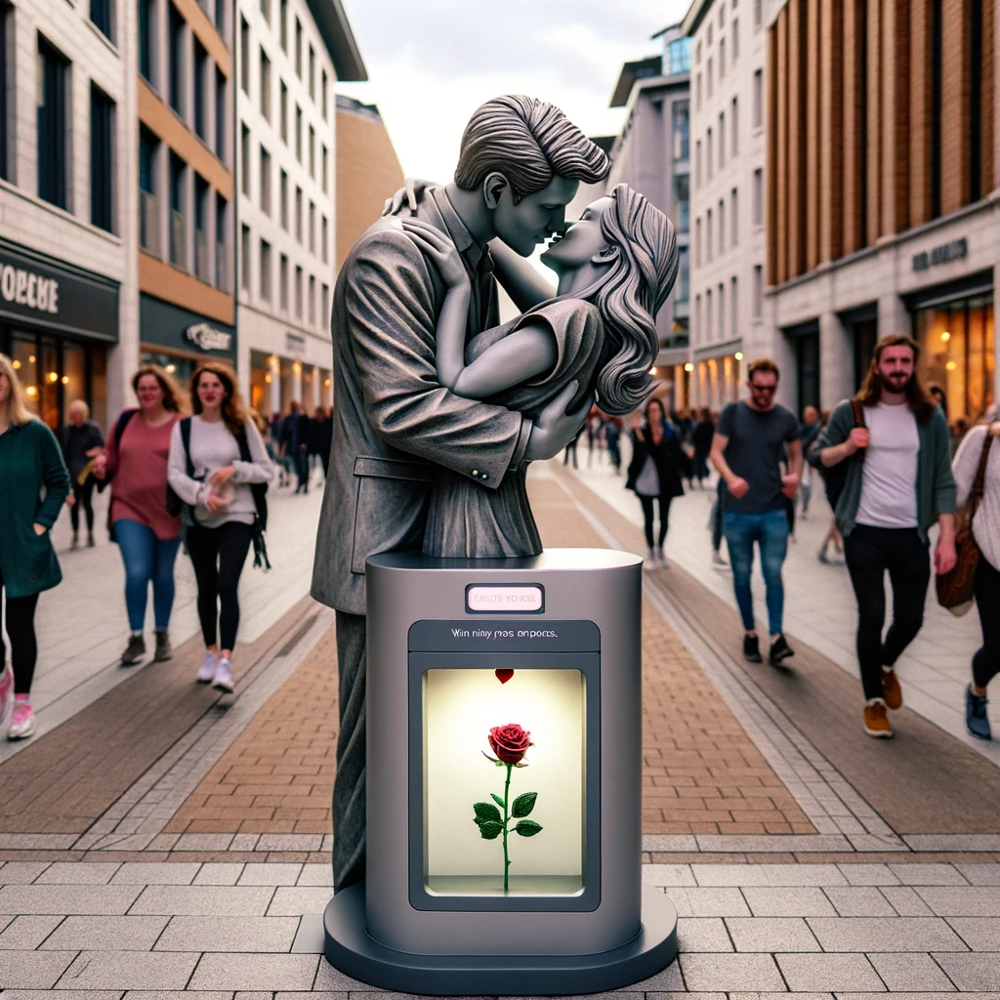
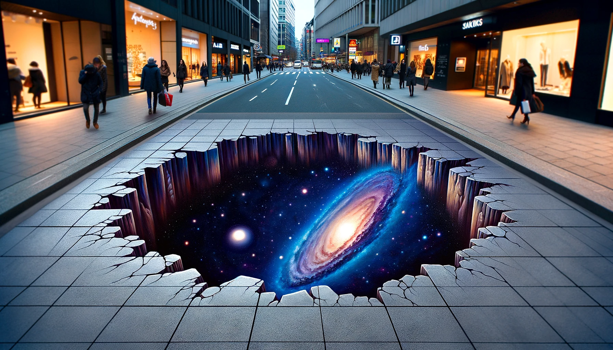

# 【教程】尝试DALL-E 3中的各种绝美艺术风格（四）

## 21. 数字抽象风格（Digital Abstract）

数字抽象风格是一种以计算机软件为工具，创造视觉艺术作品的方式。这种风格的特点在于其高度的自由和创新性，它不受传统绘画技术的限制。在数字抽象艺术中，艺术家通常使用各种数字工具，如图像编辑软件、自定义算法、甚至人工智能等，来创造独特的视觉效果。

数字抽象艺术的主要特点包括：

1. **形式自由**：艺术家可以创造出传统工具无法实现的形状、颜色和纹理。
2. **颜色丰富**：数字工具提供了几乎无限的颜色选择，使得作品可以非常鲜艳或非常微妙。
3. **层次多样**：艺术家可以轻松地在作品中添加、修改或删除各种层次，创造出复杂的结构和深度。
4. **实验性**：数字抽象艺术允许艺术家尝试各种创新的方法和技术，包括随机性和算法生成的元素。

这种风格适合勇于探索新技术、享受创作过程并愿意实验不同视觉效果的艺术家。

> 帮我画一个数字抽象风格的蜜蜂在不同APP的花丛中采蜜的图，突出高科技感

## 22. 当代街头艺术（Contemporary Street Art）

当代街头艺术，也被称为现代涂鸦艺术，是一种在城市环境中创作的视觉艺术形式。这种艺术风格从20世纪70年代开始流行，起源于美国的涂鸦文化，而后逐渐演变成一个全球性的文化现象。当代街头艺术包括多种表现形式，如：

1. **涂鸦（Graffiti）**：涂鸦是最常见的街头艺术形式，通常包括用喷漆在墙壁上创作的文字或图像。
2. **模板艺术（Stencil Art）**：艺术家使用切割好的模板和喷漆创作图案，这种方法可以快速复制图像。
3. **贴纸艺术（Sticker Art）**：艺术家设计并印制贴纸，然后在城市中的各种表面上贴上。
4. **街头装置（Street Installations）**：这种形式的街头艺术包括将雕塑、立体构造物等安装在街道上。
5. **3D地面画（3D Street Painting）**：通过特定的绘画技巧在地面上创作出看起来具有三维效果的作品。

当代街头艺术通常富有强烈的社会和政治寓意，艺术家们通过这种方式来表达自己的观点、情感或对社会现象的评论。这种艺术形式因其独特的公共性和易于接触的特点，已经成为当代文化中一个重要的组成部分。

### 涂鸦（Graffiti）

> 创造一幅街头涂鸦（Graffiti），涂鸦内容是汉字：“少年中国，与天不老”

. The backgr.png)

看样子，DALL-E搞不定汉字！

### 模板艺术（Stencil Art）

> 创造一个模板艺术（Stencil Art），表达年轻的生命力，种子破土的感觉

### 贴纸艺术（Sticker Art）

> 创造一个贴纸艺术（Sticker Art），主题是Youth China，画在深圳街头

### 街头装置（Street Installations）

> 设计一个街头装置（Street Installations）：情侣拥抱就能自动发放玫瑰花一支

> 这幅画展现了一个街头装置艺术作品，当情侣模仿这个装置上拥抱的雕塑时，就会自动发放一支玫瑰花。画面中，这个创意十足的雕塑坐落在城市街头，周围建筑和行人为背景。这件现代风格的雕塑设计优雅迷人，鼓励人们互动。玫瑰花发放的瞬间被捕捉下来，彰显了这个装置浪漫、奇妙的氛围。

### 3D地面画（3D Street Painting）

> 创作一个3D地面画（3D Street Painting），闹市街头的人行道上一个巨大、深邃的洞，里面是地球对面的星空。

<待续>