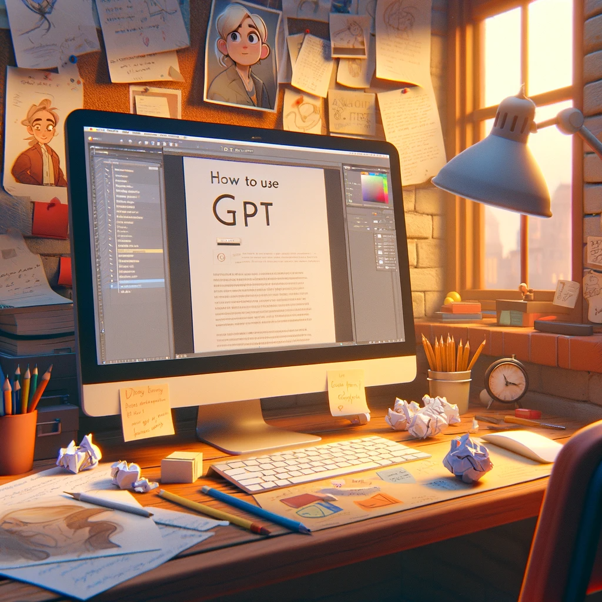

# 【生命⋅修行】关于写作的一点思考

前几天，大宝问起我关于怎么用GPT画画时，我告诉她，其实很简单，我甚至写了一些教程，在GPT里有哪些风格可以用，用什么样的提示词，能画成什么样子，我都在文章中给出了例子。

然而，接下来大宝的回答，让我郁闷、气结了许久，她说：

> 你的文章我没看。
>
> 我看不下去。
>
> 一看标题就觉得看不进去，不想看。

郁闷归郁闷，其实简单想想也知道，她说的就是事实——一个我不太愿意面对的事实。当然，她还补充了几句：

> 和菜头的文章我就愿意看下去——标题简单吸引人，图也简单吸引人，文章内容也是。

我默默地想：

**这就是天分 + 几十年功力的区别**

----

更重要的是，我也意识到，其实自己在写作的练习中，也没有做到位——标题、想要传递的主题、与之对应的文章结构等等，都少推敲。

正所谓，只是练习无法趋向完美，只有完美地练习才趋向完美。

----

脑子里正带着这点困惑的时候，和一个多年的老朋友聊天，不经意提到我在尝试坚持练习写作。他问我：

> GPT都这么厉害了，你为什么要练习写作呢？

一时间，我竟然被问住了。其实，是被自己问住了。我当然考虑过很多次，为什么我要坚持练习写作？但GPT都这么厉害了，为什么我还要「这样练习写作」呢？

这真是一个好问题！

可是，我的答案是什么呢？

