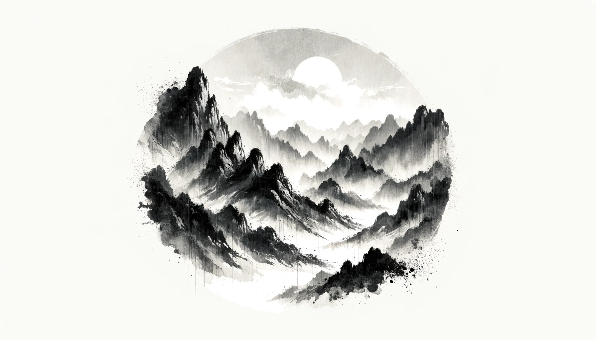
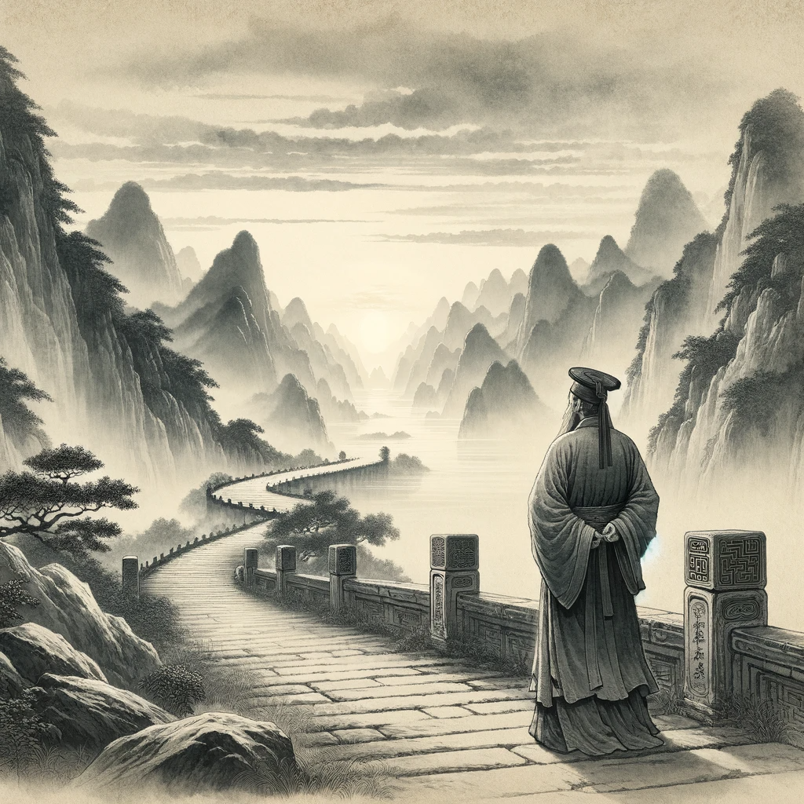

# 【随笔】惜命的韩愈

昨天还是啥时候，看到一篇文章，讲到韩愈的《祭十二郎文》中有这么一句：

> 吾年未四十，而视茫茫，而发苍苍，而齿牙动摇。念诸父与诸兄，皆康强而早世，如吾之衰者，其能久存乎？

韩愈写下这段时怕是刚刚三十九，之后又活到五十七才去世，也是那个年代的正常寿命啦。但我今天早上起床时，却发现自己脑袋莫名眩晕得厉害，走一会儿更觉得要摔倒，怎么也好不了，测了一下血氧、心跳和体温，却都正常，不知道这是怎么了。

大宝说我这就是病了而已，天冷感冒了罢。于是乎，我便想起这句话来。琢磨着自己现在也是头发早早就开始花白、高度近视（不知有没有老花）、若干牙齿更是烂得一塌糊涂。呜呼～我从小可都是想要好好地一直活到很老很老呢，可是这身体情况，唉！于是，整个上午，顶着眩晕都脑袋，我想的都是，要怎么保养好这个身体，怎么活得久一点：

> 规律作息，坚持锻炼，把心放宽！

无非是这么几条吧，一定要做到。

可是，等中午睡了一个长长的午觉，接着又在一个电话会议之后慢慢进入工作状态，眩晕的情况消失了。一不留神就干到了晚上10点。我脑子里所想的，又变成了这么一个问题：

> 一天时间太少，随便处理一两件事情就会把一天24小时轻松耗尽！
>
> 究竟要怎样才能多做点事情？
>
> 究竟要怎样才能这一辈子，真正地做成一点事情呢？

真是人心不知足啊！