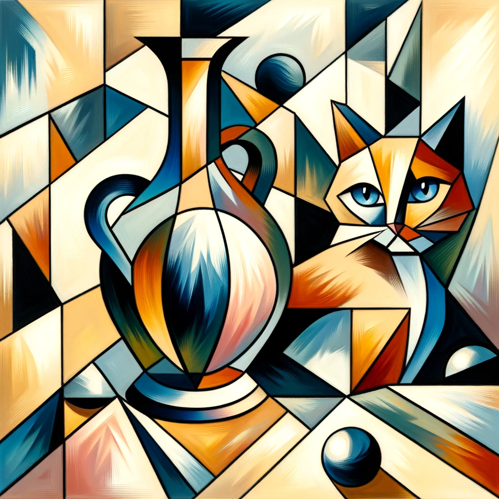
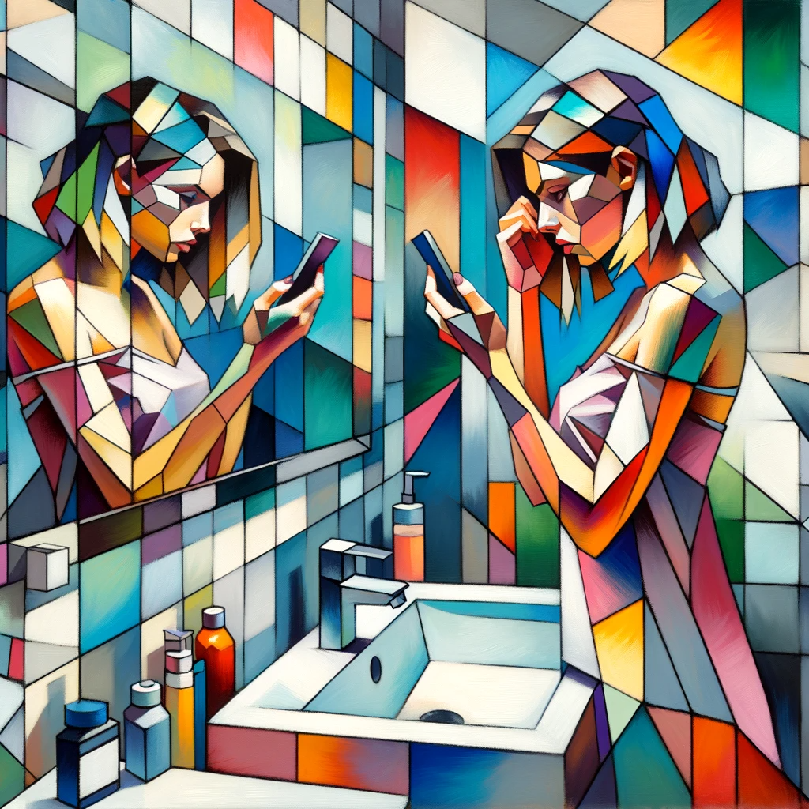
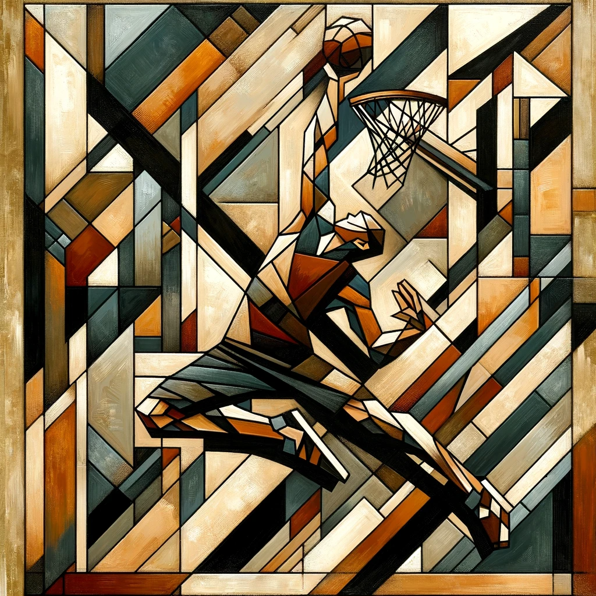
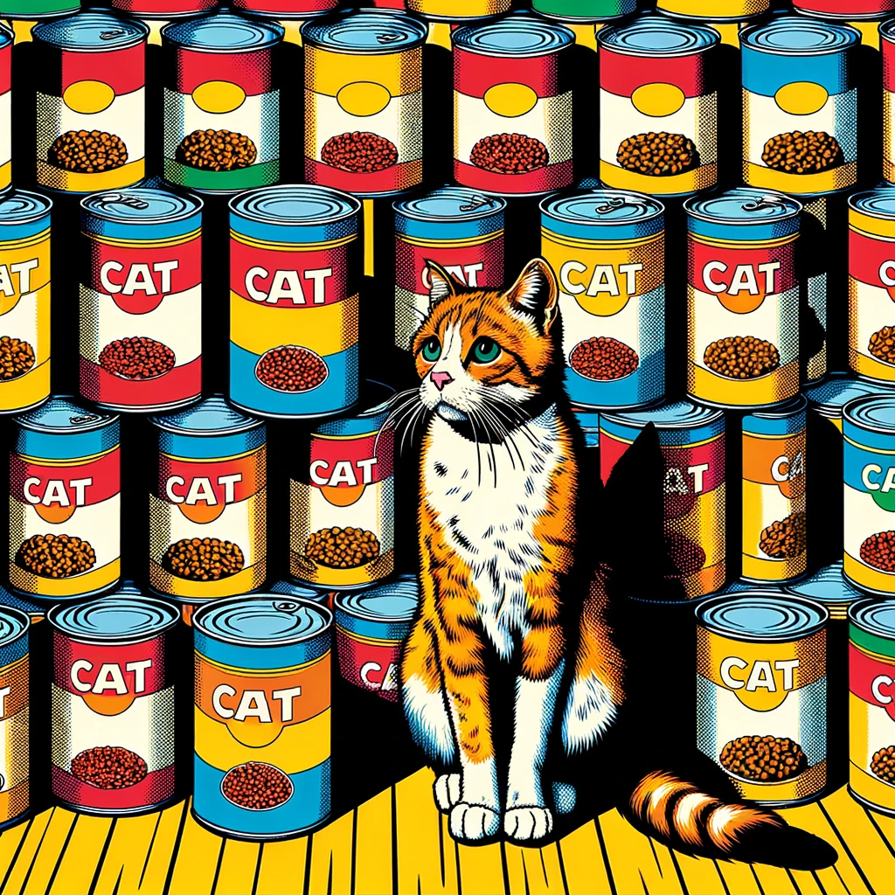
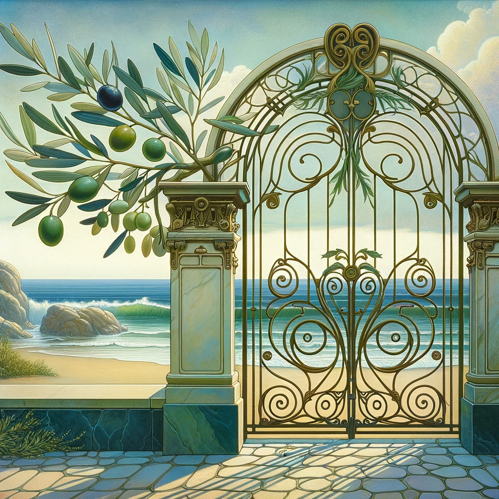
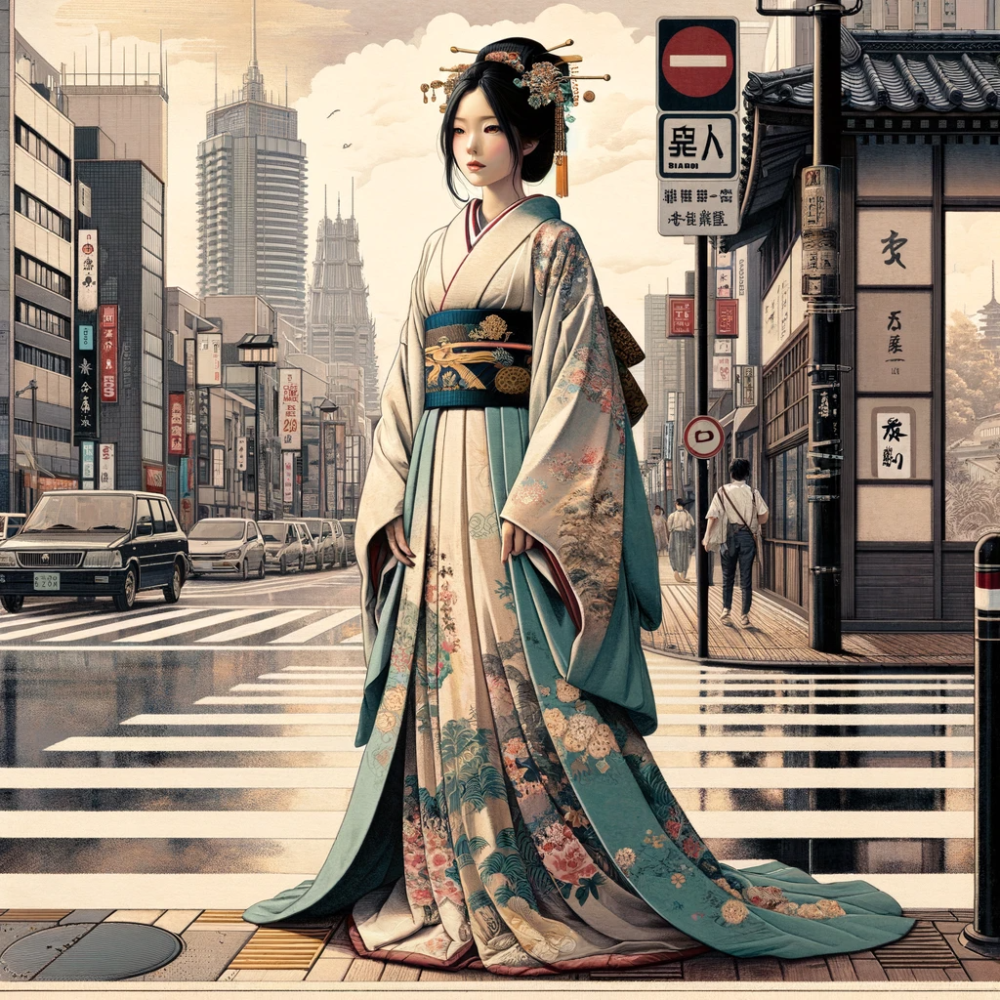
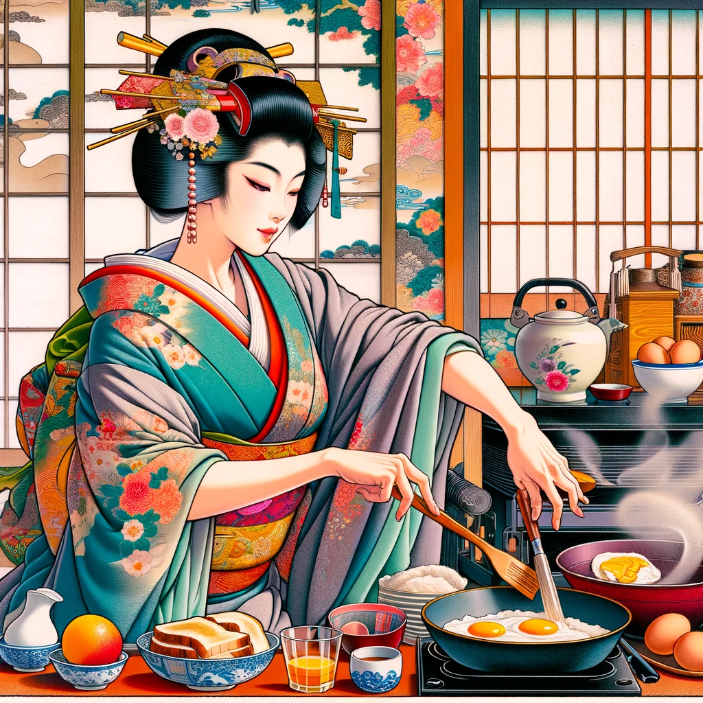
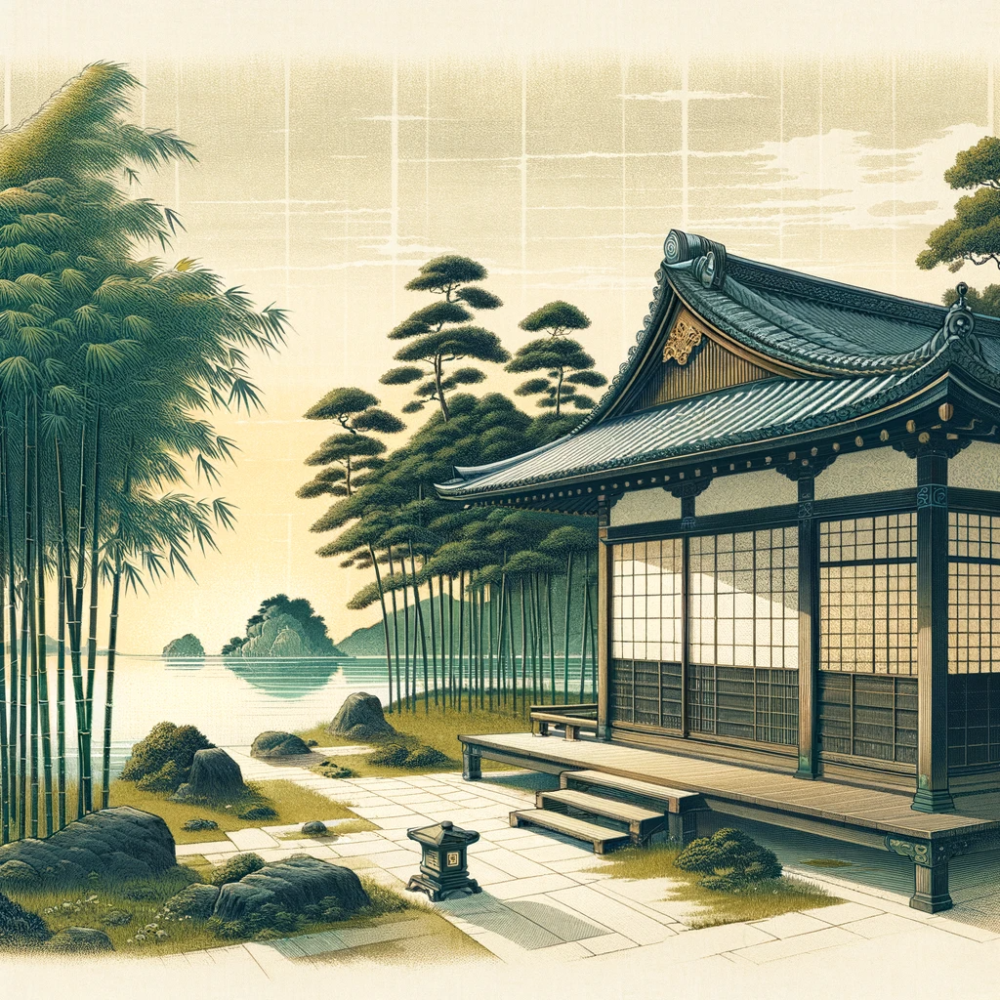

# 【教程】尝试DALL-E 3中的各种绝美艺术风格（五）

今天，计划试试以下几种风格：

1. **立体主义（Cubism）**：通过几何形式破碎和重组物体，探索不同角度的视觉。
2. **波普艺术（Pop Art）**：利用大众文化的图像和符号，通常具有讽刺意味。
3. **艺术装饰（Art Nouveau）**：以自然形态和结构为灵感，流畅的线条和曲线为特点。
4. **浮世绘（Ukiyo-e）**：日本的一种传统版画和绘画风格，常描绘历史、民间故事、风景和日常生活。

## 23. 立体主义（Cubism）

立体主义（Cubism）是一种艺术运动，它大约在20世纪初期兴起，以其独特的视角和风格影响了现代艺术的发展。立体主义最著名的代表人物是巴勃罗·毕加索（Pablo Picasso）和乔治·布拉克（Georges Braque）。以下是立体主义的一些主要特点：

1. **分解和重组**：立体主义艺术家会把物体分解成几何形状，并从多个角度重新组合在一起，这样做可以同时展现物体的多个侧面。
2. **抽象和扁平化**：这种艺术风格倾向于抽象，使用扁平化的几何形状来表达三维物体，从而打破了传统的透视法和固定观点。
3. **颜色和纹理**：立体主义作品常常使用单调或有限的色彩范围，更注重形状和结构而非颜色。纹理的使用也是为了增加深度和层次感。
4. **碎片化的观点**：立体主义作品通常通过碎片化的视角来展现主题，挑战传统的艺术观念，强调从多个角度看同一对象的可能性。
5. **影响**：立体主义对后来的许多现代艺术运动产生了深远的影响，包括未来主义、构成主义和超现实主义。

立体主义是现代艺术历史上的一个重要里程碑，它不仅改变了艺术家对形状、空间和颜色的处理方式，还对整个20世纪的视觉艺术产生了深远影响。

> 创造一幅立体主义画作，花瓶和猫为主题

> 这是一幅立体主义风格的画作，主题是花瓶和猫。在这幅作品中，可以看到立体主义特有的几何形状和碎片化形态。花瓶和猫被从多个视角描绘，以抽象但仍可辨认的方式融合在一起。色彩鲜明对比，线条混合了锐利与柔和，创造出动态且引人入胜的构图。

> 立体主义画作，浴室前照镜子的年轻女子，手机不离手，描绘现代人颓废、焦虑的精神状态

> 这幅画采用了立体主义风格，展现了一位年轻女子站在浴室镜子前，手持智能手机的场景。画面通过典型的立体主义几何形状的碎片化表现，融合了锐利和柔和的线条，色彩虽然鲜艳却传达出一种忧郁感。镜子中的倒影同样呈现出抽象和碎片化的效果，强调了现代生活碎片化和焦虑感这一主题。

想要模仿布拉克风格，费了一番力气后，下面的Prompt终于可用：

> 立体主义画作，主题是一个在街头扣篮的少年，通过使用麻布、皮革和泥土等元素，来表达运动、青春和热血的感觉。画面中，少年的身体和背景将以几何形状和抽象线条呈现，创建出一种动态和力量的感觉。色调将以大地色为主，采用麻布、皮革和泥土的质感。整体上，这幅画将通过立体主义的视角，传达少年运动时的活力和激情。

## 24. 波普艺术（Pop Art）

波普艺术（Pop Art）是20世纪中叶兴起的一种重要的艺术运动，主要流行于1950年代和1960年代。它起源于英国，随后在美国得到了极大的发展和普及。波普艺术的特点是利用大众文化的元素，如广告、漫画、明星和普通消费品等，通过这些元素来反映和批判当时的消费主义社会和大众文化。

波普艺术家们常常采用鲜艳的色彩、重复图案和铁板画（serigraphy）或丝网印刷等技术来制作艺术品。他们的作品通常带有讽刺意味，同时也展示了一种对传统艺术形式的挑战和创新。

安迪·沃霍尔（Andy Warhol）和罗伊·利希滕施泰因（Roy Lichtenstein）是波普艺术中最著名的艺术家。例如，沃霍尔的《金宝汤罐》和利希滕施泰因的漫画风格作品，都是波普艺术中的经典例子。

波普艺术对后来的艺术形式和文化产生了深远的影响，它的影响力一直延续到今天。

> 来一幅波普艺术（Pop Art）的画作，猫粮罐头，还有饿坏了的猫

## 25. 艺术装饰（Art Nouveau）

艺术装饰（Art Nouveau）是一种主要在1890年至1910年之间流行的艺术和设计风格，它强调自然形态、曲线和长流线型的设计。这种风格的特点是：

1. **自然灵感**：艺术装饰风格常常受到自然界的启发，包括植物、花朵、动物形象等，这些元素被抽象化并用于图案和装饰。
2. **曲线和流线型**：该风格著名的是其优美的曲线和波浪形的设计元素，这些元素在建筑、家具、珠宝、玻璃工艺和绘画中都有体现。
3. **复杂的装饰**：艺术装饰作品通常具有复杂而细致的装饰，这些装饰充满了创造性和想象力。
4. **综合艺术**：艺术装饰不仅仅局限于绘画和雕塑，它还包括建筑、家具设计、室内装饰、服装、珠宝、海报和广告设计等领域。
5. **颜色运用**：该风格常常使用大胆而鲜明的色彩，同时也不乏使用柔和的色调。

艺术装饰对后来的设计和艺术，如装饰艺术（Art Deco）和现代主义，都产生了影响。它强调美和功能的结合，以及艺术在日常生活中的应用。

> 来一幅艺术装饰（Art Nouveau）的画作，海边用橄榄枝装饰的花园门

## 26. 浮世绘（Ukiyo-e）

浮世绘（Ukiyo-e）是一种起源于17世纪日本的艺术形式，大致直到19世纪末期。这种艺术风格以其木版印刷画著称，尤其是在色彩方面的应用。浮世绘的意思是“浮动的世界”，反映了当时日本城市生活的快速变化和当代流行文化。

这种艺术形式最初是以绘制美丽女性、歌舞伎演员、相扑选手以及历史和民间故事为主要主题。随着时间的推移，浮世绘的主题扩展到了日本的风景和自然，比如名胜古迹和日本的四季变换。

浮世绘的代表人物包括葛饰北斋（最著名作品之一为《神奈川冲浪里》）和歌川广重（以其《东海道五十三次》系列闻名）。这些作品以其细腻的线条、鲜艳的色彩和强烈的视觉冲击力而著称，对后来的西方印象派和现代艺术产生了重要影响。

> 浮世绘风格画作，美人画风格，穿汉服（中国古代汉朝服装）的少女在现代都市街头

> 浮世绘风格画作，役者绘风格，一位美女主厨在做早餐的场景

> 浮世绘风格画作，风景绘，海边、竹林间的一栋传统东方风格庭院

<待续>