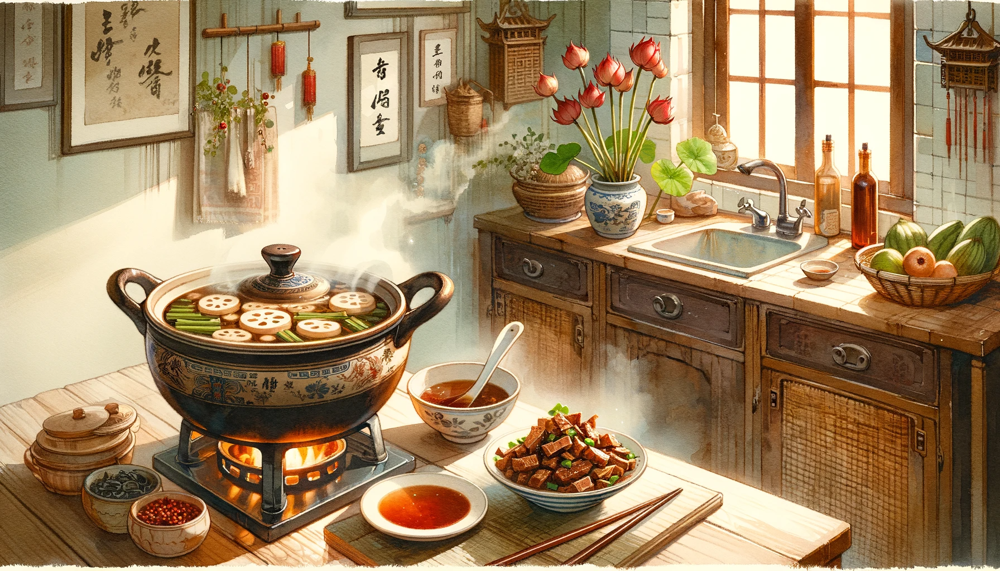
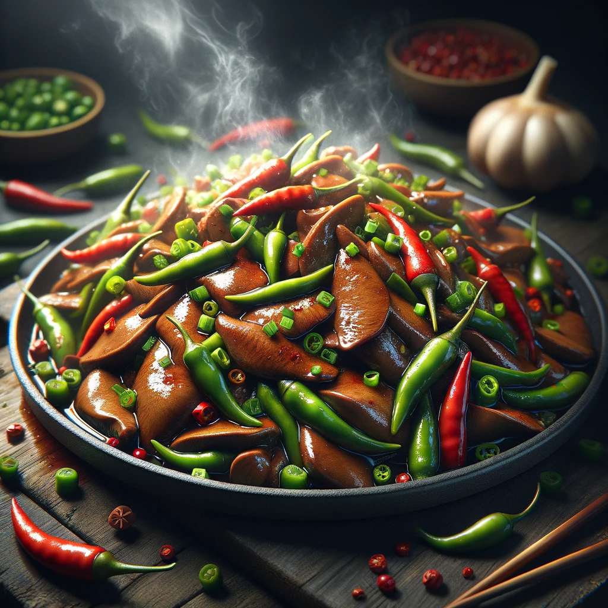
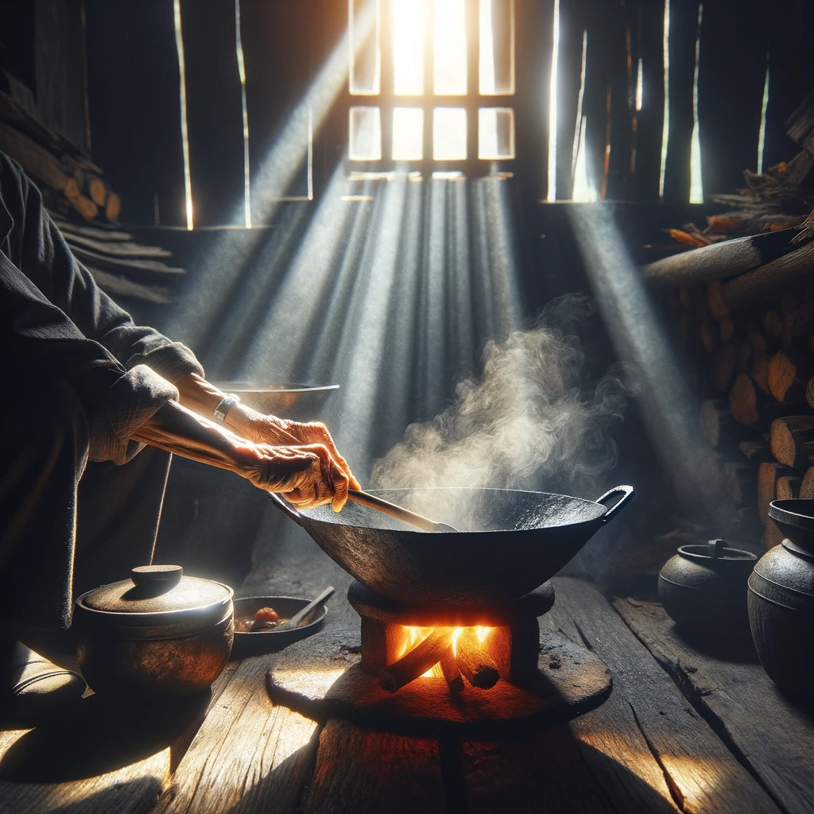
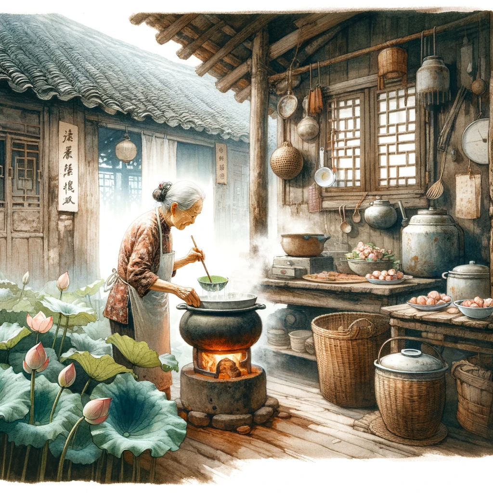

# 【随笔】炒猪肝与煨藕汤

那天下午，大宝忙活了好一阵子，然后叫我一起吃晚饭。

厨房的炉子上还煨着一锅香喷喷、热气腾腾的藕汤，我盛了一碗来到餐厅，一眼就看见摆在桌子正中的那盘香辣诱人的爆炒猪肝。赶忙放下汤碗，夹了一片猪肝丢进嘴里，唔～真是又辣、又香、又嫩、又Q，简直是好吃极了。压根停不下来，眨眼间，我就往嘴里塞了三、四片猪肝。一面大嚼、一面问大宝：

> 这猪肝太好吃了，你怎么做的？

大宝并没有回答我这个问题，反而自顾自地说：

> 我有时候，会觉得小时候是很久很久以前的事情，好像过了很长时间那种感觉。你明白吗？

我摇了摇头：

> 我总是觉得，时间过得太快，一眨眼就过去了。回想起小时候，就好像在昨天一样！

她说：

> 你想啊，我小的时候，和爷爷、奶奶住在山里。那是连电都没有的地方，水也是要从远处的山泉眼去打回来的。太阳一落山，山里就全黑了。我们住在那个山里临时搭建的小屋子里，只有爷爷、奶奶和我三个人，离寨子也非常远，周围只有大山，没有其它人。
>
> 那时候的生活，和现在城市里相比，简直像两个世界一样。

我想了想，确实如此。不管怎么说，从我记事起，就是生活在有电、有水的城市里。而这水、电，虽然是一百四十多年前就发明了的东西，但在大宝小的时候，却还没有进入她的家乡。所以，那相当于——她的童年，其实是一个相距现在一百四十年的时代啊！

她继续说：

> 有一年我过生日，奶奶正好不在，也许是下街或者到哪个亲戚家去了。奶奶总是记不住我的生日的，但是爷爷能记住。爷爷买了猪肝回来，对我说：
>
> > 今天给你炒个猪肝，给你过生日！
>
> 于是，爷爷和我，两个人。在山林的小屋里，吃了一份香喷喷的猪肝。真的是太好吃了！
>
> 后来，经历了很多事儿，爷爷奶奶开始吵架。在山里的快乐童年一去不复返，变成了很久很久很久以前的事情。再后来，我参加工作，来了深圳。我也会偶尔给自己买份猪肝，炒给自己吃。能重温那时的幸福和快乐！

我听得眼泪花在自己眼角打转，想要把她紧紧拥入怀里，隔着餐桌看着她忽闪的大眼睛，怕她笑我又多愁善感，便低下头去，喝了一口汤。

她说：

> 藕汤怎么样？这个藕不粉，炖出来只是清汤。不像上次我们在那个湖北餐馆里，喝到的藕汤那么浓。不过，我觉得，喝过最好喝的汤，还是你妈妈给我们煨的汤。
>
> 那次应该是她从武汉带的莲藕来深圳，给我们煨的藕汤。

我记不清是哪一次了，妈妈煨的藕汤确实好喝，但是究竟怎么好喝？我也说不清。只记得曾经向她请教过的一个细节：「藕切好后，要用盐立即染一遍」，然后好像是要大火煮一会儿，再下藕，换小火炖吧。

大宝问：

> 你是会做？还是只是理论上知道？

我说：

> 应该只是理论知识吧，自己没做多少次。

她说：

> 我觉得，那些经过时间沉淀的东西，真的是很好啊。比如你妈妈煨的藕汤、晒的咸鱼，比如我妈妈做的炒鸡。那都是一个地方几百年的传承，然后他们学到手，日复一日、年复一年地又做了几十年。
>
> 有特别的味道！

我又喝了一口大宝煨的藕汤，虽然藕不粉，但汤清甜爽口，一样美味得很！是啊，此时此刻的幸福，又有哪些能穿越时光，传到遥远的将来呢？

