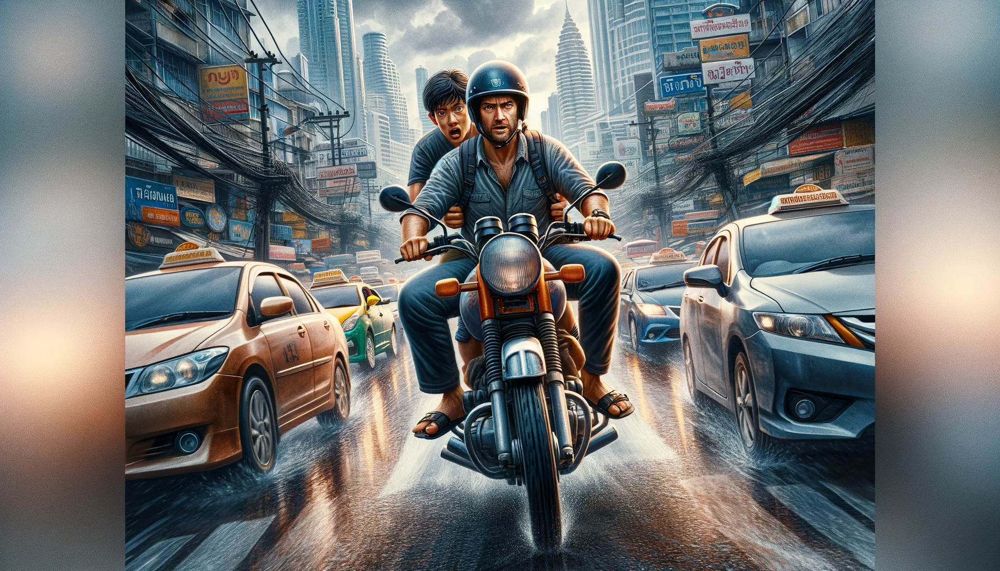
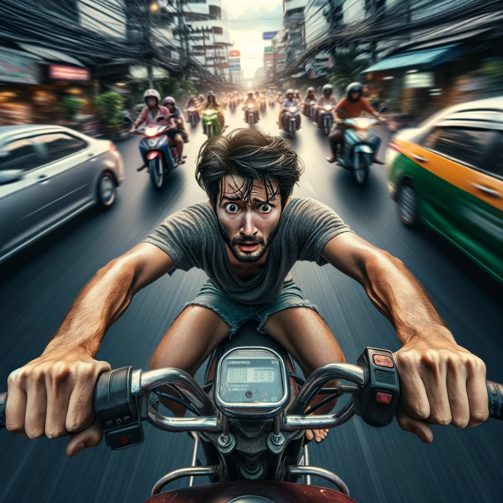

# 【随笔】让人胆战心惊的曼谷摩的

看来，无论如何高估曼谷高峰期的堵车都不为过。原本15分钟开车的路程，给自己预留了45分钟时间，打开Grab想打一辆车过去，却发现一晃15分钟过去了，却根本叫不到车，没有任何人应答。想要准时赶到约会地点，这时只剩下了两个选择：

1. 坐地铁 Blue Line
2. 用Grab打一辆摩的——Grab Bike

想到上次坐地铁刷卡的费劲经历，我手一滑就叫了一辆摩的，然后很快就有人接单了。看系统地图上显示，这辆摩托车还要在附近放下他上一趟搭载的客人，约莫5分钟之后才过来接我。于是，等待的时候，我开始胡思乱想：

> 上次的摩的司机倒是给了我一个头盔，但是好像不是每个摩的都会给客人准备头盔的。
>
> 还有，小H说他在曼谷开车时，最难忍受乱窜的摩托车，也看到过被汽车撞飞的摩托。他对我一再感叹，那都是在拿命换时间……
>
> 这会儿感冒，还有点头晕，要是没头盔，一顿吹风可有点难受。

正暗自嘀咕着，一个骑着本田小摩托的胖小伙停在了我面前。一看车牌号，没错，正是我叫的车。我给他看了一眼我手机Grab的界面，他点了点头示意我坐他身后。然后我用英文问他，头盔呢？他却说了一声「Yes」，就窜了出去。

闹了半天，他就压根没听懂我在说啥。真是想啥来啥，我看着他头盔上倒映出的自己，无奈地对着那个不戴头盔的「眼镜哥」笑了笑，拼命坐稳的同时，缩身到他背后，也好尽可能少吹那么一点风吧。

眼见着小哥在汽车的缝隙间自如地穿行，这也是意料之中的事情。但没多久，我忽然发现他走在了逆行的道路上，不是滴滴两声，示意对面的摩托车群给他留出一条通道。我吓了一跳，但也只能吓了一跳而已。便老老实实地把膝盖夹紧，心想可千万别被对面的摩托车蹭到。

刚适应这情况，他也回到了自己的道路上，估计也是快到了。小哥竟然打开了手机，划开了一个软件，开始点、点、点。甚至还开始打字——这是在接下一单活吗？

我无奈地心想：把自己这一路交给这样的哥们，还真不知道自己在拿「命」换「什么」呢？

还好，他收起了手机。抬手指了指十字路口右手边一栋大楼，告诉我：

> 到了！

感恩！感恩这位摩托小哥和老天爷，把我平安送到了目的地！！！

