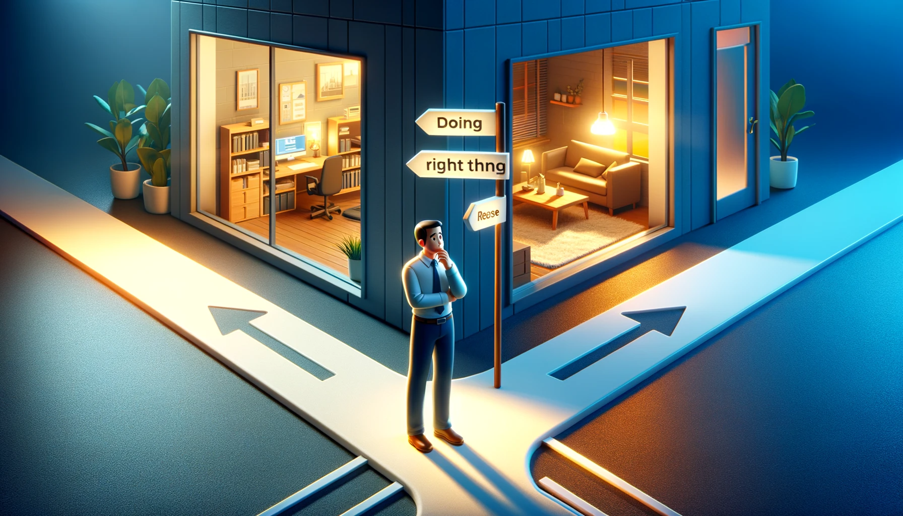

# 【生命⋅修行】先做事还是先做人

上一次认真思考这个问题，还是10多年前在18摸的时候。缘起是正在处理部门一位员工Work From Home导致的一系列违规问题，搁公司这是一件不大不小的事情，但显然这事儿也被卷入了一些办公室政治。而对于当事员工来说，就变成了一件非常、非常难受的事情——尤其是情感上的。

那时，正式处理这件事情时，我是这名员工的直属People Manager。这件事情发生时，却是在我的前任——也算是一个关系不错的同事加好友管理这个部门时。于是，某一次私下里聊天，他问我：

> 你觉得，应该先做事，还是先做人？

我几乎不假思索地说：

> 我一向的观点是——先做事，再做人。事情做对了，人就对了！

他摇了摇头，说：

> 我的观点是，先做正确的人，再做正确的事。

当时我反复思考了许久，依然觉得，自己选择先做正确的事，把事做正确是对的，哪怕是在处理这名员工的事情上。后来，我当时的直属领导，也算是我的导师吧，和我一对一会时，也聊起我的这件事情的处理。我说：

1. 当时，这事儿是按照规定和流程正常处理的。
2. 最终，员工可以自己选择留下来还是离开，但不管哪种选择，我在自己能争取的范围内，都帮员工争取到了最好的待遇。

我领导笑了：

> 你为员工做了很多，但你不告诉她，她也不知道你做的这一切。
>
> 所以，她对你是另一种看法！

……

在之后的漫长岁月里，我间或会想起这件事。其中有那么几年，我忽然觉得，或许我那个同事说的，先做人、再做事是对的。

……

然而，最近我却更加坚定了自己的原则：

> **事在人先！**

原因很简单，做人是一个持续修行、持续进步的过程。先考虑「做人」，很容易变成「人设」优先，比如，想做一个好人，想做一个好领导，想做一个有独特价值的人，想做一个好父亲，想做一个好丈夫；然后，随之而来的，就必然要考虑这些标准：

自己眼中的「好人」是什么样子的，自己眼中的「好领导」是什么样子的，自己眼中「有独特价值的人」，自己眼中的「好父亲」是什么样子的，自己眼中的「好丈夫」是什么样子的；

同样，别人眼中的「好人」、「好领导」、「有独特价值的人」、「好父亲」、「好丈夫」又有着许多套不同的标准。

但其实，这样一来是很容易变成向外求，变成为了某种「人设」去行动。或者更夸张一点，容易变成为了「面子」行事。

与其这样，不如索性放空自己，简简单单地遵循做正确的事情，正确地做事这一条「事在人先」的核心原则行动来得更加简单。

