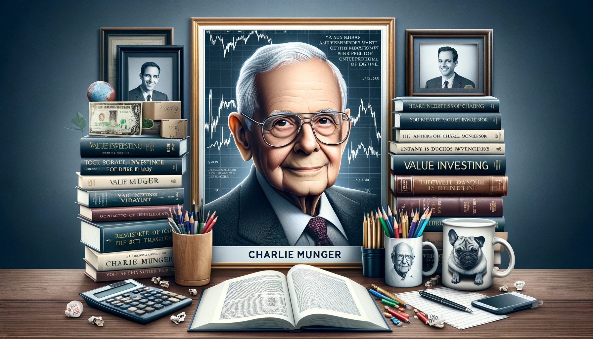
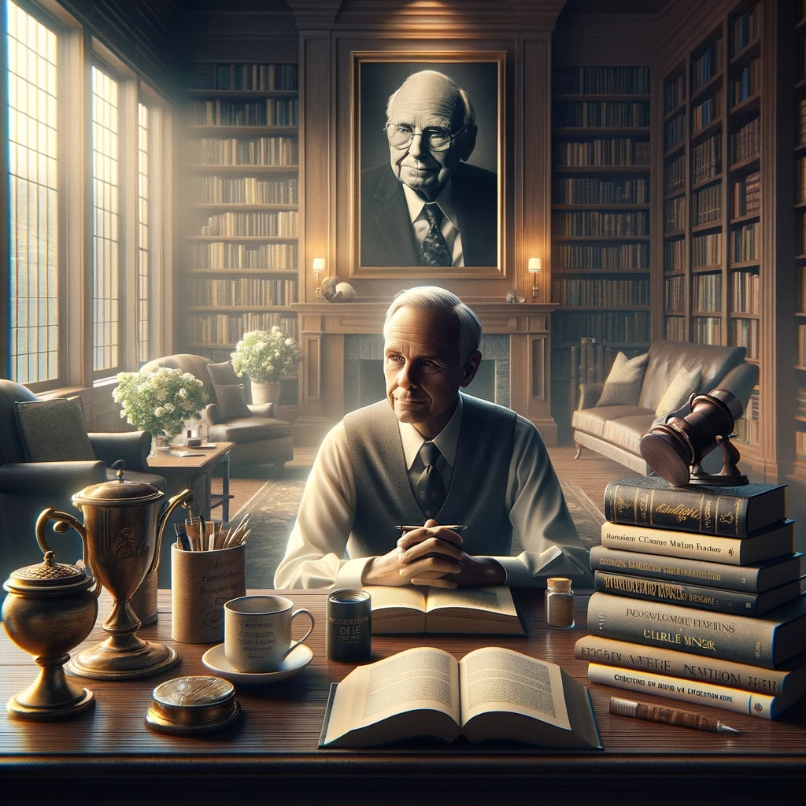

# 【随笔】缅怀一下芒格先生

昨天早上一起床，就看到了一条标题为R.I.P.的消息，原来是查理•芒格去世了，2023年11月28日上午，他在加州一家医院里安详离世。颇有些感触，我连忙把这条消息发给大宝，她也惊讶地「啊」了一声。

再过30来天，芒格就100岁生日了，虽然知道这个年纪的老先生，随时可能离开我们。但他真的离开时，我们还是有些惊讶，就好像已经习惯了一年又一年，他都和巴菲特坐在一起，给全世界的「价值投资者」们分享他们投资与人生智慧。曾想要把芒格那段《如何理性快乐地度过一生》的演讲再仔细重温一遍，却没想到，直到他离世，也还没能完成这个念想。于是，我再次提醒自己，有必要抓紧再好好学习、重温一遍芒格带给我的那些有价值的文字与记录，比如这些：

1. [Charlie Munger USC Law Commencement Speech - May 2007](https://www.youtube.com/watch?v=jY1eNlL6NKs&list=WL&index=14)
2. [Charlie Munger On BYD, Tesla, Alibaba and Bitcoin — Daily Journal’s Shareholders Meeting — 2/15/2023](https://www.youtube.com/watch?v=9VVPO3KWj3A&list=WL&index=16&t=4354s)
3. [Charlie Munger Acquired Interview October 29, 2023](https://podcasts.apple.com/us/podcast/charlie-munger/id1050462261?i=1000633030747) https://www.acquired.fm/episodes/charlie-munger

当然，还有《穷查理宝典》。

2008年的时候，我曾在豆瓣发过一篇简短的书评[《一个智慧老头的谆谆教诲》](https://book.douban.com/review/1576416/)，回首再看，15年已经过去，不禁唏嘘自己智慧并没有增长多少，看来在行动与实践上还需多多努力才是：

> 终究还是得让自己配得上自己想要的东西！

把这篇书评再次放在这里，也让自己重温一下自己曾经的感悟，然后行动起来！

----

## 一个智慧老头的谆谆教诲

看完了《VALUE》杂志社翻译的《Poor Charlie’s Almanack》，也就是《投资大家芒格》（一）。

真的是一个很智慧的老头，难得的是，他还乐于将自己的人生智慧传授、讲解给别人。不过，他时而旁敲侧击、时而正话反说，有些讲演倒过去看两遍还是不太好理解。不过，读一本书哪怕有一点收获都是物超所值，何况从中学到了不止一点。

摘录一些对我很有启发的只言片语以及非常有用的一些知识：

每个人都会犯的错误：

1. 高估有数据支撑的材料。
2. 不会把那些可能更重要的难以权衡的材料列入全盘考虑。

**我们大量的阅读。我不知道有哪个聪明的人不进行大量阅读，但这还不够：还必须拥有能抓住想法和采取明智行动的能力。**

如何才能效仿他的足迹？每天都试着让自己在起床的时候比以前更聪明一点，虔诚并且出色的履行自己的职责，一步一个脚印往前走，没必要跑得太快。但你希望自己能跑得更快。每次都努力争取，天天如此。**最后，如果活得足够长，大多数人都将得到他们应得的东西。**

人生每个阶段都将面临考验，我认为有三点将有助于你应对这些挑战： (1). 期望值要低 (2). 富有幽默感 (3). 把自己置身与友情和亲情中

人类的25个心理误判倾向：

1. 奖赏/惩罚的超级反应倾向
2. 喜欢/爱的倾向
3. 讨厌/恨的倾向
4. 回避疑虑的倾向
5. 回避不一致性的倾向
6. 好奇倾向
7. 康德式公平倾向
8. 羡慕/嫉妒的倾向
9. 回报倾向
10. 从简单的联系中受到影响的倾向
11. 简单的、回避痛苦的心理否定
12. 过度自我关注的倾向
13. 过度乐观的倾向
14. 对损失过度反应的倾向
15. 社会证据的倾向
16. 对比误判反应的倾向
17. 压力影响的倾向
18. 易得性误判的倾向
19. 不用就忘的倾向
20. 受药物错误影响的倾向
21. 受衰老错误影响的倾向
22. 受权威错误影响的倾向
23. 讲废话的倾向
24. 重视理由的倾向
25. 极端倾向——在偏向某一特定结果的几个心理倾向共同作用下出现极端性的倾向

一般而言，如果你试图运用你对心理倾向的知识来对你需要赢得其信任的人进行巧妙的操纵的话，你是同时在道德和稳妥性上面犯了错误。

查理.芒格推荐的书籍列表也非常有价值：

* 《深奥的简洁：让混沌和复杂归于有序》（Deep Simplicity: Bringing Order to Chaos and Complexity），作者约翰.葛瑞宾（John Gribbin），兰登书屋（Random House）2005年出版。

* 《泥鸽靶：华尔街高等金融实录》（FIASCO: The Inside Story of a Wall Street Trader），企鹅图书出版社（Penguin Books）1999年出版。

* 《冰河世纪》（Ice Age），作者约翰.葛瑞宾和玛丽.葛瑞宾（John & Mary Gribbin），巴诺出版社（Barnes& Noble）2002年出版。

* 《苏格兰人如何发明现代世界：西欧最穷的国家如何创造了世界》（How the Scots Invented the Modern World: The True Story of How Western Europe’s Poorest Nation Created Our World and everything in It），作者亚瑟.赫尔曼（Arthur Herman），三河出版社（Three Rivers Press）2002年出版。

* 《我的生活方式》（Models of My Life）,作者郝柏特.A.西蒙（Herbert A. Simon），麻省理工学院出版社（MIT Press）1996年出版。

* 《温度，决定一切》（A Matter of Degree: What Temperature Reveals About the Past and Future of Our Species, Planet, and Universe），作者基诺.沙格瑞（Gino Segre），北欧海盗图书出版社（Viking Books）2002年出版。

* 《安德鲁.卡耐基》（Andrew Carnegie），作者约瑟夫.弗雷泽.沃（Joseph Frazier Wall）,牛津大学出版社（Oxford University Press）1970年出版

* 《枪炮、病菌与钢铁：人类社会的命运》（Guns，Germs, and Steel：The Fates of Human Societies），作者贾德.M.戴蒙（Jared M Diamond），四季出版社（Perennial）1992年出版

* 《影响力》（Influence：The Psychology of Persuasion），作者罗伯特.B.西奥迪尼（Robert B.Cialdini），四季现代出版社（Perennial Currents）1998年出版

* 《本.富兰克林自传》（The Autobiography of Ben Franklin），作者本杰明.富兰克林（Benjamin Franklin），耶鲁大学出版社，“注意耶鲁”平装书系列，2003年出版

* 《生活在极限之内：生态学、经济学和人口禁忌》（Living within Limits: Ecology, Economics, and Population Taboos），作者加勒特.哈丁（Garrett Hardin），牛津大学出版社1995年出版。

* 《自私的基因》（The Selfish Gene），作者理查德.道金斯（Richard Dawkins），牛津大学出版社1990年出版。

* 《巨人：洛克菲勒传》（Titan: The Life of John D. Rockefeller, Sr.），作者罗恩.彻诺（Ron Chernow），美酒出版社（Vintage）2004年出版。

* 《国家的穷与富》（The Wealth and Poverty of Nations: Why Some Are So Rich and Some So Poor），作者大卫.兰德斯（David Landes）,W.W.诺顿公司（W.W. Norton & Company）1998年出版。

* 《沃伦.巴菲特的投资组合：集中投资策略》（The Warren Buffett Portfolio: Mastering the Power of the Focus Investment Strategy），作者罗伯特.G.海格斯状（Robert G.Hagstrom），威莱出版社（Wiley）2000年出版。

* 《基因组：一个物种的23章自传》（Genome: the Autobiography of a Species in 23 Chapters），作者马特.里德雷（Matt Ridley）,哈珀出版社（Harper Collins）2000年出版。

* 《毫不退让地赢得谈判——哈佛谈判法》（Getting to Yes：Negotiating Agreement Without Giving In），作者罗杰.费雪（Roger Fisher），威廉.尤里（William Ury）和布鲁斯.帕顿（Bruce Patton），企鹅图书出版社1991年出版。

* 《三个科学家和他们各自的上帝：在信息时代寻找生命的意义》（Three Scientists and Their Gods: Looking For Meaning in An Age of Information），作者罗伯特.怀特（Robert Wright）,哈珀出版社1989年出版。

* 《只有偏执狂才能生存》（Only the Paranoid Survive），作者安迪.格鲁夫（Andy Grove），货币出版社（Currency）1996年出版。

----

谨以此缅怀尊敬的芒格先生！

