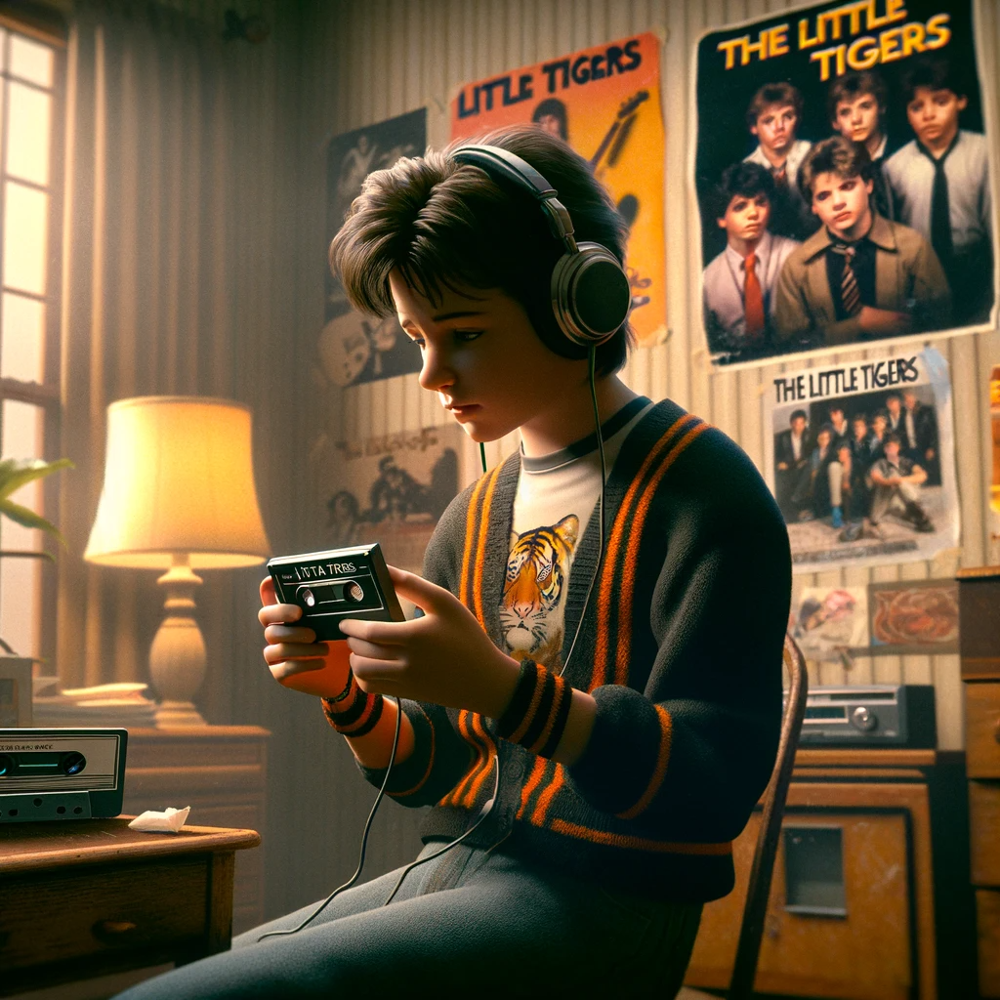
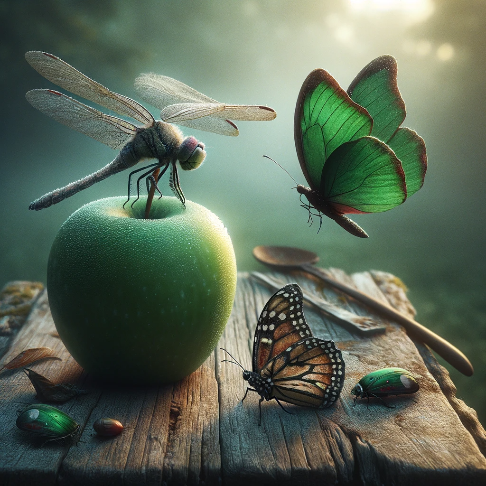

# 【生命•故事】（108）年少时的偶像——小虎队

. The image should resemble a classic movie po.png)读小学时，我们还只是偶尔从父母或他们那一辈儿的叔叔阿姨那里听到一些港台流行音乐和明星，比如蔡琴，比如刘文正，特别有意思的是——伴随着《酒干倘卖无》这首歌，都还同步传播着一个资本家剥削穷苦歌手的苦大仇深的故事。

但到了初中，我们就开始听自己喜欢的歌了。有一段时间，ZK总是先来我家找到我，然后我们一起到ZB家，在他的房间里，用他家的双卡录音机听一会儿歌。就这样，我喜欢上了《新年快乐》、《青苹果乐园》、《逍遥游》，以及唱这首歌的青春偶像——「小虎队」。

小虎队里三只小老虎各有特点，但我真正开始了解他们，是因为有一次假期到九江老家，在地上捡到了一张小虎队介绍的折页。这才知道了霹雳虎吴奇隆，小帅虎陈志朋，乖乖虎苏有朋。会柔道的霹雳虎总是在C位，但乖乖虎的人设却深得我喜欢，他竟然还是一名学霸。我把这张折页读了又读，小心地收藏起来，然后真正地喜欢上了这三个大哥哥明星。小虎队里最小的苏有朋，当时正是15、6岁的年纪，他读高中，我读初中。

哈哈，于是，当父母质疑自己追星不务正业时，我就拿出这张折页，给他们看苏有朋的介绍：

> 我是要向他学习，乖乖虎苏有朋不仅会唱歌跳舞，学习还特别好，读的可是台北的重点高中。
>
> 我要和他一样，读重点高中，上大学（那时父母对我们的最高期望，也就是上大学了）。

于是乎，就这样，听着小虎队的歌，渐渐地长大了。那时候正版的磁带一盒要9元钱或者10元钱，可父母一个月工资也才几十元不到一百元。于是，整个初中阶段，我也只能一盘一盘地用同学家的双卡录音机，翻录了许多小虎队的歌，学着唱《红蜻蜓》、学着唱《星星的约会》……直到后来，我终于考上了重点高中，而我的偶像苏有朋，也果然不负众望地考上了国立台湾大学机械工程系，继续着学霸偶像的人设。

而我也因为要在学校吃午餐，终于有了每周10元钱的早午餐钱+零花钱，攒钱成为了可能。于是，我终于得以收藏了原版的《爱》，以及最后小虎队暂时解散时的最后一盘专辑——《再见》！

闭上眼睛，再见的旋律依然飘荡在脑海，或许那也是我对自己少年时代所说出的「再见」吧：

> 当离别拉开窗帘
> 当回忆睡在胸前
> 要说再见真的很伤感
> 只有梦依旧香甜
> 当蜻蜓不再飞翔
> 当蝴蝶不再流浪
> 我的心已告别青苹果
> 只有爱依旧灿烂
> 请相信我们明天一定会再见
> 就像白云离不开蓝天
> 请相信欢笑泪水所有的约定
> 都是忘不掉的日记
> 请相信我会再次回到你面前
> 唱起我们无悔的青春
> 请相信虽然此刻就要说Bye Bye
> **明天我们会再见!**

