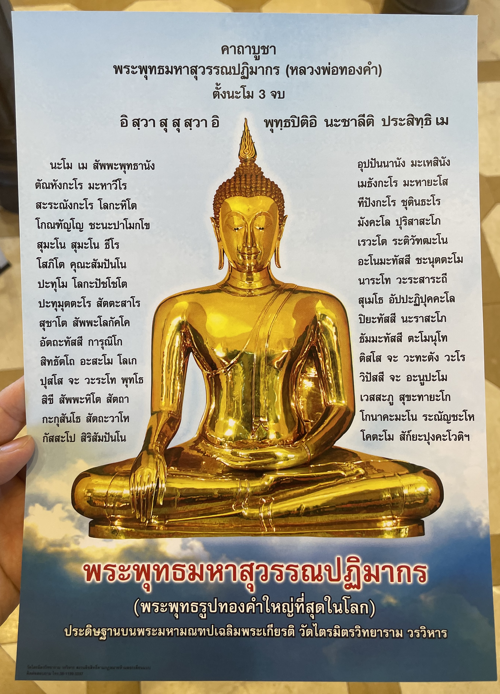

#  【随笔】少有中国游客的著名景点

认识了一个泰国朋友，也是个相对腼腆的理工男，答应带着我们在曼谷转一转。吃过午饭，他带我们参观的第一个景点就是**金佛寺，วัดไตรมิตรวิทยารามวรวิหาร，Wat Traimit Witthayaram Worawihan**。

参观金佛的门票是100泰铢，好像只是针对外国游客才需要购买门票。2、3楼还有博物馆，需另外购票，也是100多株。我们只买了到四楼参观金佛的门票，便徒步上了四楼。

如许多寺庙一样，进入大殿前需要脱鞋。强烈的阳光把地板晒得滚烫，寺庙贴心地用木板铺了一条通道——依旧很烫，但至少不像旁边的石板那样完全不能落脚。泰国朋友提醒我们，不要对着佛像拍照，那是不尊敬佛陀的行为。然而，大殿里依旧有人举着相机，一个工作人员冲着两个拿相机的印度人说着什么。那个朋友看了一眼，然后很无奈地小声对我们说：

> 唉，那印度人听不懂，不知道不能对着佛像拍照……

我跟着大家一起跪在佛像，默默念了一遍心经。起身时见周围的人都很虔诚地捧着一经文读着，还都献上了鲜花和袈裟，这才想起换鞋的地方似乎放着他们供奉的鲜花。于是，我连忙折返回去，捐了100泰铢，也拿了一套袈裟和鲜花回来，供奉在佛像前。

大家在读的经文是用泰文印刷的，我问泰国朋友这经文是什么意思，他说他也不知道，这其实是巴利文的经文，只不过是用泰文标注的读音。他虽然会读，但没法给我解释这经文究竟是什么意思。

离开金佛寺，我们动身前往下一个目的地，他回头看了一眼这里的游客，颇为纳闷地说：

> 我也不知道为什么，这么有名的地方，世界上最大的金佛，中国游客却很少来。其它国家的游客，却都很多呢。

我也觉得有些不解，后来和热心的房东大姐聊起此事时，她却是这么说的：

> 你们这个泰国朋友真的很好，能带你们去这里！
>
> 这个金佛寺非常非常的重要、非常非常的好！你们能有机缘去参拜这尊佛像，真的很棒！！！
>
> 那些普通中国游客，我反而觉得他们不来这里更好。他们大多只是猎奇、游玩，可是对佛陀并不懂得尊重，这是一个殊圣庄严的地方，还是留给愿意尊敬佛陀的人吧……

----

以下摘自维基百科「金佛寺」条目：

# 金佛寺[[编辑](https://zh.wikipedia.org/w/index.php?title=金佛寺&action=edit&section=0&summary=/* top */ )]

**代密寺**（[泰语](https://zh.wikipedia.org/wiki/泰語)：วัดไตรมิตรวิทยารามวรวิหาร，[皇家转写](https://zh.wikipedia.org/wiki/皇家泰語轉寫通用系統)：Wat Traimit Witthayaram Worawihan），又译**三友寺**，通称**金佛寺**，位于[泰国](https://zh.wikipedia.org/wiki/泰国)[曼谷](https://zh.wikipedia.org/wiki/曼谷)[三攀他旺县](https://zh.wikipedia.org/wiki/三攀他旺县)，寺内供奉一尊5.5吨的[素可泰代密金佛](https://zh.wikipedia.org/w/index.php?title=素可泰代密金佛&action=edit&redlink=1)，是世界最大的纯金佛像，获[吉尼斯世界纪录](https://zh.wikipedia.org/wiki/吉尼斯世界纪录)认证[[1\]](https://zh.wikipedia.org/wiki/金佛寺#cite_note-1)。

## 历史[[编辑](https://zh.wikipedia.org/w/index.php?title=金佛寺&action=edit&section=1)]

金佛寺原称**越三振寺**[[2\]](https://zh.wikipedia.org/wiki/金佛寺#cite_note-2)（วัดสามจีน），意为“三华人寺”，位于[曼谷唐人街](https://zh.wikipedia.org/wiki/曼谷唐人街)，相传是由三位华人集资建成，因而得名。1934年，越三振寺住持决意翻修寺庙，1937年获[最高僧伽委员会](https://zh.wikipedia.org/w/index.php?title=最高僧伽委員會&action=edit&redlink=1)批准，并在1939年更名为三友寺（วัดไตรมิต）。

寺内供奉的金佛据推测是铸造于[素可泰王国](https://zh.wikipedia.org/wiki/素可泰王国)时期，15世纪移送至[阿瑜陀耶](https://zh.wikipedia.org/wiki/阿瑜陀耶)供奉，之后在战乱年间流落。19世纪被发现时全身被灰泥包裹，安放在[曼谷唐人街](https://zh.wikipedia.org/wiki/曼谷唐人街)的乔他那兰寺（Wat Chotanaram）[[3\]](https://zh.wikipedia.org/wiki/金佛寺#cite_note-3)[[4\]](https://zh.wikipedia.org/wiki/金佛寺#cite_note-4)。1935年，这尊佛像被移送至三友寺[[5\]](https://zh.wikipedia.org/wiki/金佛寺#cite_note-wordpress1-5)。这时的三友寺仅是曼谷城中数百名不见经传的小寺之一，在20年间，这尊灰泥佛像仅安放在一处简陋的锡顶下[[6\]](https://zh.wikipedia.org/wiki/金佛寺#cite_note-6)。1955年，在搬运过程中灰泥脱落，露出纯金造像[[7\]](https://zh.wikipedia.org/wiki/金佛寺#cite_note-orgfree1-7)，这尊素可泰时期的纯金造像终于重见于世。就此该寺中文又通称金佛寺[[8\]](https://zh.wikipedia.org/wiki/金佛寺#cite_note-8)。

2010年2月14日，金佛寺建成专用于供奉金佛的帕玛哈蒙多阁（พระมหามณฑป），为四层大理石楼阁，中央为金制尖塔，内部还设置[耀华力路](https://zh.wikipedia.org/wiki/耀華力路)历史遗产中心展厅和金佛展厅[[9\]](https://zh.wikipedia.org/wiki/金佛寺#cite_note-magazine-9)。

## 参考文献[[编辑](https://zh.wikipedia.org/w/index.php?title=金佛寺&action=edit&section=3)]

1. **[^](https://zh.wikipedia.org/wiki/金佛寺#cite_ref-1)** [金佛寺——世界最大金佛](http://www.udnbkk.com/article-222520-1.html). [泰国世界日报](https://zh.wikipedia.org/wiki/泰國世界日報). [2023-10-22].
2. **[^](https://zh.wikipedia.org/wiki/金佛寺#cite_ref-2)** 林明明（Korawan Phromyaem）. [泰國曼谷地區中文地名研究](https://kns.cnki.net/kcms2/article/abstract?v=3uoqIhG8C447WN1SO36whLpCgh0R0Z-iv9r0YoQXiId4v9BfOE9rDistZLMegbxJXsIPZW6YpK81iEZfypCJ3a0K1hkBpqBZ&uniplatform=NZKPT). 华东师范大学. 2016年 [2023-07-02]. （原始内容[存档](https://web.archive.org/web/20230225133846/https://kns.cnki.net/kcms2/article/abstract?v=3uoqIhG8C447WN1SO36whLpCgh0R0Z-iv9r0YoQXiId4v9BfOE9rDistZLMegbxJXsIPZW6YpK81iEZfypCJ3a0K1hkBpqBZ&uniplatform=NZKPT)于2023-02-25） **（中文（繁体））**.
3. **[^](https://zh.wikipedia.org/wiki/金佛寺#cite_ref-3)** [金佛寺 (Wat Traimit)](https://www.bangkokriver.com/zh-hans/place/wat-traimit/). Bangkok River. [2023-10-22].
4. **[^](https://zh.wikipedia.org/wiki/金佛寺#cite_ref-4)** [Phra Sukhothai Trimitr (Golden buddha)](http://johnchocce.weebly.com/phra-sukhothai-trimitr-golden-buddha.html). Johnchocce.weebly.com. 1955-05-25 [2013-06-20]. （原始内容[存档](https://web.archive.org/web/20131016084335/http://johnchocce.weebly.com/phra-sukhothai-trimitr-golden-buddha.html)于2013-10-16）.
5. **[^](https://zh.wikipedia.org/wiki/金佛寺#cite_ref-wordpress1_5-0)** [The Golden Buddha Image](http://teayeon.wordpress.com/phra-maha-mondop/about/). Teayeon.wordpress.com. 2006-12-15 [2013-06-20]. （原始内容[存档](https://web.archive.org/web/20130624013711/http://teayeon.wordpress.com/phra-maha-mondop/about/)于2013-06-24）.
6. **[^](https://zh.wikipedia.org/wiki/金佛寺#cite_ref-6)** Miller, Jeffrey. [The Golden Buddha at Wat Traimit](https://web.archive.org/web/20101110110144/http://buddhistchannel.tv/index.php?id=18,1271,0,0,1,0). The Korea Times. The Buddhist Channel. 2005-06-02 [2009-11-08]. （[原始内容](http://www.buddhistchannel.tv/index.php?id=18,1271,0,0,1,0)存档于2010-11-10）.
7. **[^](https://zh.wikipedia.org/wiki/金佛寺#cite_ref-orgfree1_7-0)** [History of Golden Buddha](http://gba.orgfree.com/history of golden buddha.html) [互联网档案馆](https://zh.wikipedia.org/wiki/Wayback_Machine)的[存档](https://web.archive.org/web/20130410031930/http://gba.orgfree.com/history of golden buddha.html)，存档日期2013-04-10. Thai Buddhist website
8. **[^](https://zh.wikipedia.org/wiki/金佛寺#cite_ref-8)** [金佛寺](https://www.novotelbangkokploenchit.com/zh-hans/bangkok-destination/art-and-culture/wat-trai-mit/). Novotel. [2023-10-22].
9. **[^](https://zh.wikipedia.org/wiki/金佛寺#cite_ref-magazine_9-0)** [Temple of the Golden Buddha (Wat Traimit), Bangkok Best Tour](http://www.thaiwaysmagazine.com/bangkok/thai_temples/golden_buddha_best_tour.html). Thaiwaysmagazine.com. 2010-02-14 [2013-06-23]. （原始内容[存档](https://web.archive.org/web/20120510173903/http://www.thaiwaysmagazine.com/bangkok/thai_temples/golden_buddha_best_tour.html)于2012-05-10）.

……