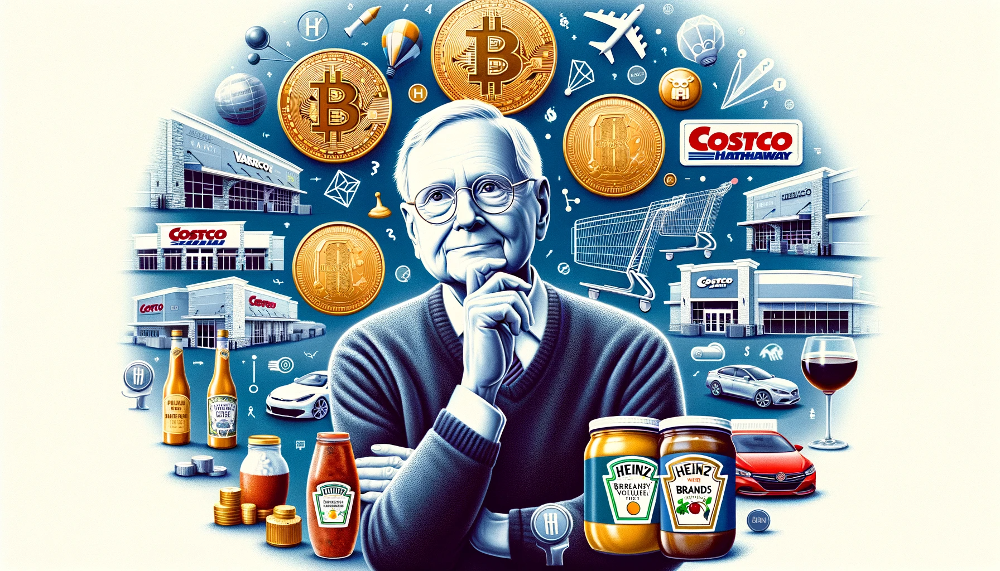
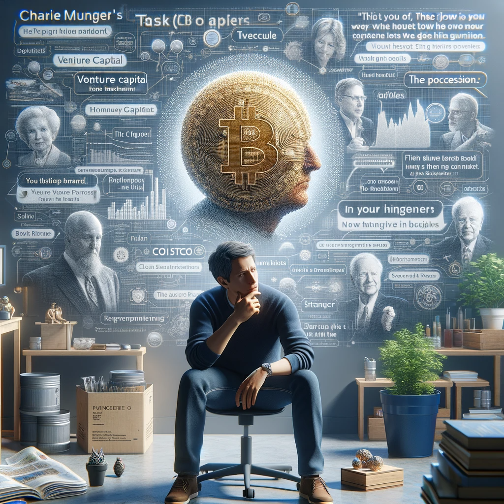

# 【随笔】芒格先生的最后一次Podcast 访谈（二）

在这二十分钟里，查理谈了好几个话题。据说他详细阐述了风投运做得如何糟糕，但估计攻击性太强而无法播出。关于比特币，他的观点是：

> 对整个世界来说，是需要一种货币，以前是英镑，现在是美元……

言下之意，**关于世界货币的地位，没比特币什么事儿**！——虽然我并不同意这个观点，但这个观点也很重要！

然后，他提到**拷贝Costco模式的那些公司中，依然有许多机**会。或许，这就是拼多多最近暴涨的导火索？黄峥可是一直推崇Costco的价值观与理念，号称要做电商领域的Costco呢。

关于品牌溢价，查理聊到了那些真正拥有品牌护城河的公司，聊到那些伟大的品牌和普通品牌之间的微妙区别。说实话，听他讲完，我依然不是很能理解这其中的微妙区别。但从他举的例子来看，奢侈品领域的爱马仕，还有调味品领域的亨氏（还有中国的那些酱料），显然这与人类DNA深处如何构造「味觉」、乃至相应的「品味」习惯有着深刻的关系。

好吧，还是知其然，不知其所以然……

问到他如果回到过去，能否有信心再造一个伯克希尔时，他谦虚而诚恳地说：

> 不能！
>
> 成功有三要素：
>
> 1. 聪明
> 2. 努力
> 3. 好运
>
> 能做的只不过是尽可能早一点开始，然后耐心等待，看是否能有机缘，在漫长的一生中，或有可能拥有这成功三要素中的一、两点而已。

所谓，**但行好事，莫问前程吧**！

以下是第20分钟到第41分钟的Transcript 与翻译……

----

David: We really wanted to ask your thoughts on venture capital.

大卫：我们真的很想听听你对风险投资的看法。

Charlie: Some of the deals get so hot and you have to decide so quickly. You're all just sort of gambling.

查理：有些交易变得如此火热，你必须迅速做出决定。你们都只是在赌博。

Ben: Do you think the role of venture capital is being properly accomplished in society?

本：你认为风险投资在社会中的角色是否得到了恰当的完成？

Charlie: No, I think it's very poorly done.

查理：不，我认为它做得很糟糕。

David: Charlie elaborated on this point with a few things that we can't air, but the topic did turn to Bitcoin.

大卫：查理详细阐述了这一点，但有些内容我们无法播出，不过话题转向了比特币。

Ben: I've heard many comments you've made on Bitcoin. I'm curious if you have a thought on this particular angle. An easy way to transfer money between countries, especially when those countries don't have a stable store of value within that country. Is it good to have an independent store of value that is not pegged to a nation state?

本：我听过你对比特币的许多评论。我很好奇你是否对这个特定角度有想法。作为一种在国家之间转移资金的简便方式，特别是当这些国家没有稳定的价值储存时。有一个不依赖于国家的独立价值储存是否有好处？

Charlie: Of course, it's good to the world as a whole to have a way of having some currency. The way that was solved is for a long time, the British pound was the national currency of the investment world. Then it shifted to the dollar, and it's still a dollar. People like China have these enormous reserves of dollars, the money we make. Think of the money people give us where we always just print up these pieces of paper.

查理：当然，对整个世界来说，拥有一种货币方式是有好处的。解决这个问题的方式是很长一段时间以来，英镑是投资世界的国际货币。然后转移到美元，现在仍然是美元。像中国这样的国家拥有大量美元储备，我们制造的货币。想想人们给我们的钱，我们总是只印这些纸片。

Ben: What about the common person in some of these less fortunate countries who don't have access to US dollars?

本：那些在不太幸运的国家中的普通人，没有使用美元的机会怎么办？

Charlie: Oh, they do if they ever get any money. The dollar is very fungible, you can always buy one anywhere.

查理：哦，如果他们有任何钱，他们确实可以得到美元。美元非常通用，你总是可以在任何地方买到。

Ben: I'm curious, back to this point of the role of venture capital in a society, if you could design a perfect system to fund innovation.

本：我很好奇，回到风险投资在社会中的角色，如果你可以设计一个完美的系统来资助创新。

Charlie: I think it's a very legitimate business if you do it right, if you want to give the right people the power, nurture them, and help them. You know a lot about the tricks of the game, so you can help them run their business, yet not interfere with them so much they hate you.

查理：我认为如果你做得对，想要赋予合适的人权力，培养他们，帮助他们，那就是一个非常合法的生意。你对这个行业的诡计非常了解，所以你可以帮助他们经营他们的业务，但又不要干涉他们太多以至于他们讨厌你。

By and large, having bumped into a lot of people in the businesses with venture capital financing, I would say the ordinary rule is that people in the business doing the work, more often than not they hate the venture capitalists. They don't feel they are a partner trying to help the company, they’re taking care of themselves and so on and so on. They don't like them.

总的来说，遇到很多在风险投资融资下的企业工作的人，我会说普遍的规则是，从事工作的人更多时候讨厌风险投资家。他们不觉得风险投资家是试图帮助公司的合作伙伴，而是在照顾自己等等。他们不喜欢他们。

Ben: How could it work differently?

本：这能有什么不同的工作方式吗？

Charlie: That’s not true at Berkshire. Our people know we're not trying to discard them to the highest bid. See if some investment banker offers us 20 times earnings or some lousy business, we don't sell. If it's a problem in a business we've never been able to fix, we'll sell it. But if it's a halfway decent business, we never sell anything. That gives us this reputation of staying with things, which helps us.

查理：在伯克希尔就不是这样。我们的人知道我们不是试图把他们卖给出价最高的人。看看，如果一些投资银行家给我们提供20倍收益的一些糟糕生意，我们不会卖。如果是我们从未能解决的业务问题，我们会卖。但如果是个尚可的生意，我们从不卖任何东西。这给了我们留守事物的声誉，这帮助了我们。

Ben: Do you think that buy and hold, not only mentality, but demonstration is the key thing that aligns investors with managers?

本：你认为买入并持有不仅是一种心态，而且是一种展示方式，这是将投资者与管理者联系起来的关键吗？

Charlie: Well, it's rare, you see. Everybody else has a standard way of doing things and the lawyers have their standard forms. Everybody just has the same standard form and they get the same standard results subject to the vicissitudes of investment life. You don't want to make money by screwing your investors and that's what a lot of venture capitals do.

查理：这很罕见，你看。其他所有人都有一套标准的做事方式，律师们有他们的标准格式。每个人都使用相同的标准格式，然后获得相同的标准结果，受制于投资生活的变幻无常。你不想通过欺骗你的投资者来赚钱，但这正是许多风险资本家所做的。

The world is full of ex-Goldman Sachs partners that formed a private fund and they manage a billion dollars or something like that. They charge two points off the top, plus the […] and that enables them to make very handsome living for themselves, but the endowments are not getting a good return.

世界上充满了前高盛合伙人，他们成立了一个私人基金，管理着十亿美元或类似的资金。他们从一开始就收取两个百分点的费用，加上[…], 这使他们能够为自己赚取非常可观的生活，但基金并没有获得好的回报。

David: Do you think it's specifically the fee aspect of fund structures?

大卫：你认为这是基金结构的费用方面的问题吗？

Charlie: It's just the nature of the wedges, it's the way it works. Of course, you really shouldn't be in the business of charging extra unless you really are going to achieve very unusual results. Of course, it's easier to pretend that you can get good results than it is to actually get them.

查理：这只是楔子的性质，就是这么运作的。当然，你真的不应该在业务中收取额外费用，除非你真的能取得非常不寻常的结果。当然，假装你能获得好结果比实际获得要容易。

It attracts the wrong people. People with investment capital turn up mine and the people who make the most money out of venture capital are a lot like investment bankers deciding which hot new area they're going to get in. They're not great investors or great at anything.

它吸引了错误的人。拥有投资资本的人变得贪婪，而从风险投资中赚取最多钱的人很像投资银行家，决定他们将进入哪个热门新领域。他们不是伟大的投资者，也不擅长任何事情。

David: What do you think endowments and large pools of capital should do then?

大卫：那么你认为基金和大量资本应该怎么做？

Charlie: Well, they're starting to do it. The endowments have started to say to all these people that charge 3 and 30 or whatever they charge. They said, we'll pay you 3 and 30. We're going to put in twice as much money. Then the next half, you'll get nothing on it. We're just going to ride pari passu on some of your investments.

查理：他们开始这样做了。基金开始对所有收取3和30或其他费用的人说，我们会付给你3和30。我们将投入两倍的资金。然后下一半，你什么也得不到。我们只是在你的一些投资上并驾齐驱。

The fees go down by 50%, that'll take a lot of the fun out of it. Fees down 50% and that's happening all over America. They feel had, misled, and irritated. They've looked foolish to their own trustees.

费用下降了50%，这会让很多人失去乐趣。费用下降了50%，这在整个美国都在发生。他们感到被欺骗，误导和恼火。他们在自己的受托人面前显得愚蠢。

David: One of the issues I think in investing right now, you mentioned it about venture capital, but I think it's true everywhere, is that there's just so much capital and so much competition. We're so far removed from the cigar bud era. We're in the opposite of the cigar bud era these days. Are there opportunities out there?

大卫：我认为投资中的一个问题是，你提到了风险投资，但我认为这在所有地方都是真的，就是有太多的资本和太多的竞争。我们离雪茄烟头时代已经很远了。我们现在处于雪茄烟头时代的反面。还有机会吗？

Charlie: Somebody will find a few things, but it gets harder and harder. I would argue one of the easiest ones was when they decided on a little group around Home Depot. They would copy the Costco model and home improvements and that was basically a good idea. Think of the money they made doing it.

查理：有人会找到一些东西，但它变得越来越难。我会说其中一个最简单的是当他们决定围绕家得宝的一个小团体时。他们会复制好市多模式并进行家居改善，这基本上是个好主意。想想他们这样做赚了多少钱。

David: Yeah, Bernie Marcus.

大卫：是的，伯尼·马库斯。

Charlie: Yeah. That was a direct copy of Costco.

查理：对。那是对好市多的直接复制。

Ben: Do you think there are more opportunities to copy Costco?

本：你认为还有更多机会复制好市多吗？

Charlie: Well, there was another one at Costco. Floor & Decor is the current imitator. It's in wood imitating vinyl flooring. They're running a Costco model and they keep adding miscellaneous stuff to it too.

查理：好市多还有另一个。地板和装饰是当前的模仿者。它是在模仿木质的乙烯基地板。他们运行一个好市多模式，并且还在添加各种杂项。

Ben: It's the miscellaneous stuff that'll eventually kill you, though.

本：但最终会杀死你的，是那些杂项。

Charlie: Well, it'll be simpler if it was all floor.

查理：如果只是地板，它会更简单。

David: Home Depot worked so well, but I don't know that it was totally obvious. Part of the appeal of Costco was it was horizontal. It was everything. Consumers could come. They could make a trip, bring their big wagon, and bring their big truck.

大卫：家得宝运作得非常好，但我不知道它是否完全明显。好市多的吸引力部分是它是横向的。它涵盖了一切。消费者可以来，他们可以带上大车，带上大卡车。

Charlie: Home Depot was the same. They copied everything.

查理：家得宝也是一样。他们复制了一切。

David: And famously Bernie Marcus came out to visit Sol before he started.

大卫：众所周知，伯尼·马库斯在开办家得宝之前去拜访了索尔。

Charlie: Yeah, he copied everything.

查理：是的，他复制了一切。

David: Sol was happy to share the playbook with everybody. How do you feel about that?

大卫：索尔很乐意与每个人分享剧本。你对此怎么看？

Charlie: Sol was another crazy person. He was domineering and so on, but he was also very intelligent. But there aren't many opportunities like Home Depot and Costco. There aren't very many.

查理：索尔是另一个疯狂的人。他很专横，等等，但他也非常聪明。但像家得宝和好市多这样的机会并不多。并不是很多。

Ben: Why do you think Walmart hasn't been successful once they saw Costco in competing?

本：为什么你认为沃尔玛一旦看到好市多在竞争中就没有成功？

Charlie: They were too weathered by the ideas they already had. That’s everybody’s trouble. They just can’t accept a new idea because the space is occupied by the old idea. They got into the habit of getting real estate for practically nothing, because they went into towns where nothing is valuable. So their occupancy cost are like zero. And they knew how to make big efficient stores. That was their formula.

查理：他们被他们已有的想法牢牢困住了。这是每个人的问题。他们就是无法接受新想法，因为旧想法占据了空间。他们习惯了几乎不花钱就能获得房地产，因为他们进入的城镇里没有什么是有价值的。所以他们的占用成本几乎为零。他们知道如何建造大型高效的商店。那就是他们的公式。

So it offended them to go against the rich suburbs and having to pay for the good locations. Costco just specializes in the good locations, where the rich people lived. And Walmart just let them do it year after year. It was just a terrible mistake.

因此，去反对富裕郊区并为好位置付费，这对他们来说是不可接受的。好市多专门在富人居住的好地方开店。沃尔玛年复一年地让他们这样做。这是一个可怕的错误。

David: Did you know Sam Walton?

大卫：你认识山姆·沃尔顿吗？

Charlie: No, never met him. I knew one of the sons. They divided it up about six parts very early.

查理：不，从未见过他。我认识他的一个儿子。他们很早就把它分成了六个部分。

David: Yeah, Walton Enterprise.

大卫：是的，沃尔顿企业。

Charlie: They never paid much gift tax.

查理：他们从未支付过多少赠与税。

Ben: The topic then turned into the automakers and the future of the car industry.

本：接下来的话题转到了汽车制造商和汽车行业的未来。

Charlie: How hard would it be to go into the auto business, to have some big killing? Who's going to win? Who knows? The whole thing has been thrown way up in the air by all these electric cars, all these big, new capital requirements, different ways of selling cars. Plus they got these tough unions. See I just don’t even look at the auto industry!

查理：进入汽车行业，取得巨大成功有多难？谁会赢？谁知道？整个事情被所有这些电动汽车、所有这些巨大的新资本需求、不同的汽车销售方式彻底打乱了。再加上他们有这些苛刻的工会。看，我甚至不看汽车行业！

Ben: Do you think it's more investible today than it was 50 years ago because of the disruptive innovation of electric?

本：你认为因为电动创新的颠覆性，今天的汽车行业比50年前更值得投资吗？

Charlie: Well maybe for one or two electric cars that are really good, maybe, but certainly nobody else. It's too tough. BYD was a miracle. That guy worked 70 hours a week and has a very high IQ. He can do the things you can't do. You can look at somebody else's auto part and you can figure out how to make the goddamned thing. You can't do that, you see.

查理：也许对于一两款真正好的电动汽车来说，可能，但肯定不是其他人。太难了。比亚迪是个奇迹。那家伙一周工作70小时，智商很高。他能做你做不到的事情。你可以看别人的汽车部件，然后弄清楚如何制造该死的东西。你做不到，你看。

Person: Charlie, you invest in a Hyundai.

人物：查理，你投资了现代。

Charlie: Yes, but they're clever too.

查理：是的，但他们也很聪明。

Person: How was that investment for you?

人物：那项投资对你来说怎么样？

Charlie: I lost money, not much because I was stubborn, I held out until I got back to almost what I paid for when I sold.

查理：我亏了钱，不多，因为我固执地坚持，直到我差不多回到了我出售时所付的价格。

Andrew: There's been a lot of discussion about Berkshire's investments in the Japanese trading houses.

安德鲁：关于伯克希尔在日本贸易公司的投资，有很多讨论。

Charlie: That is a no-brainer. Something like that, if you're as smart as Warren Buffett, maybe two to three times the century, you had an idea like that. The interest rates in Japan were half a percent per year for 10 years. These trading companies were really entrenched old companies. They had all these cheap copper mines and rubber plantations.

查理：那是显而易见的。像那样的事情，如果你像沃伦·巴菲特那样聪明，也许一个世纪就能遇到两到三次。日本的利率十年来是每年半个百分点。这些贸易公司是真正根深蒂固的老公司。他们拥有所有这些廉价的铜矿和橡胶种植园。

You could borrow for ten years ahead. Probably about a year you could buy the stocks and it's likely at 5% dividends. A huge flow of cash with no investment, no thought, no anything. How often do you do that? You'll be lucky if you get one or two a century. We could do that, nobody else could.

你可以提前借十年。大概一年你可以买入股票，可能会有5%的股息。巨大的现金流，无需投资，无需思考，无需任何事情。你多久能做到这一点？你很幸运如果一个世纪能遇到一两次。我们可以做到，别人做不到。

It looked attractive for half a percent, but you couldn't get it. But Berkshire with its credit could, and the only way you could get it was be very patient, just pick away little pieces of the time. It took him forever to get $10 billion invested. It was like God just opening a chest and just pouring money. It's awfully easy money.

对半个百分点来说看起来很有吸引力，但你得不到。但伯克希尔凭借其信用能够做到，唯一的方法就是非常有耐心，只是一点一点地挑选。他花了很长时间才投资了100亿美元。这就像上帝打开了一个箱子，只是倾倒金钱。这非常容易赚钱。

Ben: It's interesting that it's paradoxical. You need Berkshire's credit. But at Berkshire scale, it's actually hard to put enough money to work.

本：有趣的是，这似乎矛盾。你需要伯克希尔的信用。但在伯克希尔的规模下，实际上很难投入足够的资金。

Charlie: That's true, but why shouldn’t it be hard to make money? Why should it be easy?

查理：那是真的，但为什么赚钱就不应该难呢？为什么它应该容易？

David: Japanese trading companies remind me. We studied another company recently, Nike. That is surprising to me. Have you ever looked at it?

大卫：日本贸易公司让我想起了我们最近研究的另一家公司，耐克。这对我来说很令人惊讶。你看过它吗？

Charlie: That's a very different company. That's a style company. Of course, I've looked at it, but I don't like style companies.

查理：那是一家非常不同的公司。那是一家风格公司。我当然看过它，但我不喜欢风格公司。

Ben: Too fad-driven?

本：太受时尚驱动了？

Charlie: I suppose if you offered me Hermes at a cheap enough price, and I'd buy it. But short of that, I’m not going to buy any style company

查理：我想如果你以足够便宜的价格给我爱马仕，我会买的。但除此之外，我不会买任何风格公司。

Ben: That's a good pick.

本：那是个好选择。

Andrew: To the style point, another one that they covered was LVMH. What Arnault has done has been amazing. What do you make of that company?

安德鲁：关于风格的观点，他们还研究了LVMH。阿尔诺所做的非常了不起。你怎么看这家公司？

Charlie: Well, if you're as good as they are at what they've done, you have a lifetime to do it in. Without a lifetime, three or four lifetimes to do it in. You can create another, but it's not easy.

查理：好吧，如果你像他们那样擅长他们所做的，你有一生的时间去做。没有一生，三四辈子去做。你可以创造另一个，但这并不容易。

David: Hermes is on the eighth generation, I think, now of the family running it.

大卫：爱马仕现在是第八代家族经营。

Charlie: It's not a bit easy. They have meetings every day and make policy decisions, and they choose the locations one at a time. It's work.

查理：这一点都不容易。他们每天都开会，做政策决策，逐个选择位置。这管用。

Ben: It's definitely work. What do you think the durable value is in these, as you say, style companies, of the very best one in the world, the Hermes or the LVMH? What makes them enduring?

本：绝对管用。你认为这些风格公司中最好的，如爱马仕或LVMH，它们的持久价值是什么？是什么让它们持久？

Charlie: They just got a brand people trust so much. It took them a century to do it.

查理：他们只是拥有人们非常信任的品牌。他们用了一个世纪才做到。

Ben: Our conversation then turned to comparing Kirkland Signature as a brand to Hermes.

本：我们的谈话随后转向了将柯克兰签名品牌与爱马仕进行比较。

Charlie: Kirkland is a brand the way Tide is a brand. And Hermes is a… different kind of a brand.

查理：柯克兰就像汰渍一样是一个品牌。而爱马仕是...不同类型的品牌。

Ben: Yeah, Ferrari doesn't make detergent.

本：是的，法拉利不生产洗衣粉。

Charlie: No.

查理：不。

David: We've spent a lot of time studying these brands. How do you look at the value of a brand?

大卫：我们花了很多时间研究这些品牌。你如何看待品牌的价值？

Charlie: It's hard for us not to love brands, since we were lucky enough to buy See’s candy for $20 million as our first acquisition. We found out fairly quickly that we could raise the price every year 10%, and nobody cared. We didn't make the volumes go up or anything like that. Just made the profits go up. We've been raising the price by 10% a year for all these 40 years or so. It's been a very satisfactory company.

查理：我们不得不喜欢品牌，因为我们很幸运地以2000万美元买下了第一个收购目标See’s糖果。我们很快发现我们可以每年提价10%，没人在意。我们没有增加销量或类似的东西。只是让利润上升。这些40多年来，我们每年都在提价10%。这是一家非常令人满意的公司。

It didn't require any new capital. That’s what was good about it: very little new capital. It had two big kitchens and a bunch of rental stores when we bought it, and now it's got two big kitchens and a bunch of rental stores.

它不需要任何新资本。这是它的好处：非常少的新资本。当我们买它的时候，它有两个大厨房和一堆租赁商店，现在还是两个大厨房和一堆租赁商店。

Charlie See was a playboy, and his brother ran the company, his older brother, and dominated it completely. And when he died, Charlie made his brother as executor, and now he needs a lot of money to pay death taxes. He doesn't have it. It's due eight months or something later. They really wanted to sell it so they can pay the death taxes. See, it was only making $4 million pre tax when we bought it.

查理·西是个花花公子，他的哥哥经营公司，他的哥哥完全主导了公司。当他去世时，查理让他的哥哥成为遗嘱执行人，现在他需要很多钱来支付遗产税。他没有钱。税款大约在八个月后到期。他们真的想卖掉它，这样他们就可以支付遗产税。看，当我们买下它时，它只赚了400万美元的税前利润。

Ben: So that buying opportunity only came about because the family needed liquidity to pay the death taxes?

本：所以这个购买机会只是因为家族需要流动性来支付遗产税？

Charlie: Yes, that's right. We only found out about it because Charlie See was on this cruise to Hawaii or something with this guy who was a client… the investment council also worked for Blue Chip Stamps, which is the company that bought it. Anyway, that's how we found out about it. We paid that guy a finder's fee even, we've never paid one since.

查理：是的，没错。我们之所以知道它，是因为查理·西和这位投资顾问也为蓝筹邮票工作，这是买下它的公司。无论如何，这就是我们了解它的方式。我们甚至支付了那个人一笔寻找费，从此之后我们再也没有支付过。

Andrew: It was worth it!

安德鲁：那是值得的！

Charlie: Of course, but you don't want a bad reputation for paying a finder's fee. Everybody in the world will be bothering you all day long.

查理：当然，但你不想因为支付寻找费而声誉不佳。否则全世界的人都会整天打扰你。

Andrew: So, there are categories like See’s or Hermes, where brands lead to pricing power….

安德鲁：所以，有像See’s或爱马仕这样的类别，品牌导致了定价能力...

Charlie: I think your chances of buying one of them are so low, I wouldn't even look. I only believe in looking at things that I might find. You're not going to get a chance to buy them.

查理：我认为你买到其中一个的机会如此之低，我甚至不会去看。我只相信寻找我可能找到的东西。你不会有机会买到它们。

Ben: No curiosity without a return!

本：没有回报就没有好奇心！

Andrew: Why do you think there are extremely well-known brands in other categories, maybe packaged food or something?

安德鲁：你为什么认为在其他类别中有极为知名的品牌，比如包装食品或类似的东西？

Charlie: There are a lot of professional investors who buy nothing but branded goods. They usually start with this Nestle, and […]. They’ve done two or three points better than average, but it's not a bonanza.

查理：有很多专业投资者只买品牌商品。他们通常从雀巢开始，还有[...]。他们的表现比平均水平高出两三个百分点，但这不是一笔大财富。

David: After that, our conversation turned to Kraft Heinz and why Heinz is able to have pricing power while Kraft is not.

大卫：之后，我们的谈话转向了卡夫亨氏，为什么亨氏能有定价能力，而卡夫却没有。

Charlie: It is very interesting. There’s something about the flavor of ketchup on a goddamned fried potato… that you are really willing to change brands over. They want Heinz! And so, you can raise the price of Heinz pretty much. If you try and raise the price of Kraft cheese, everybody’s goes into rebellion, including the final customer, the housewife. They don't care that much about whether cheese is Kraft or not.

查理：这非常有趣。就是在该死的炸薯条上的番茄酱的味道...你真的愿意换品牌。他们想要亨氏！所以，你可以相当多地提高亨氏的价格。如果你试图提高卡夫奶酪的价格，每个人都会反抗，包括最终的消费者，家庭主妇。他们并不太在乎奶酪是否是卡夫的。

Ben: Why do you think that is?

本：你为什么认为会这样？

Charlie: Something about the sauce flavor. It’s happened elsewhere. In Korea, one guy, a Chinese guy, controls all the sauces. Every single major sauce, he controls at least 95% of them.

查理：有关于酱料的味道。这在其他地方也发生了。在韩国，一个中国人控制了所有的酱料。每一种主要的酱料，他至少控制了95%。

Ben: And it's because sauces have such a particular flavor that no one can imitate the trade secret?

本：这是因为酱料有如此特殊的味道，没有人能模仿这种商业秘密吗？

Charlie: Yeah.

查理：是的。

Ben: And that gives pricing power?

本：这就赋予了定价能力？

Charlie: They get used to it, and they like it.

查理：他们习惯了它，他们喜欢它。

Person: Is that Coca-Cola as well?

人物：这也适用于可口可乐吗？

Charlie: Yeah, sure.

查理：是的，当然。

Ben: Charlie, I'm curious. At age 99, what is something that you believe today that 70-year-old Charlie would have disagreed with?

本：查理，我很好奇。作为一个99岁的人，今天你相信什么，而70岁的查理会不同意？

Charlie: I knew when I was 70 that it was hard. It's just so hard. I *know* how hard it is now. Always, people who are getting this 2 and 20, or 3 and 30, or whatever, they all talk because oh, it was easy. And they get to believing their own bullshit. And of course, it's not very easy. It's very hard.

查理：我70岁的时候就知道这很难。这实在太难了。我*知道*现在有多难。总是那些获得2和20，或者3和30，或者别的什么的人在说话，哦，这很容易。他们开始相信自己的胡说八道。当然，这并不容易。这很难。

David: If you were back 30 or 40 years old again today, would you decide to go into the investment business again?

如果你今天又回到30或40岁，你会再次选择进入投资行业吗？

Charlie: Well, probably because it suits my nature. But I didn't really enjoy the 3 and 30 business. Once I had enough money on my own, I'd rather just operate with my own money. That is a much better way of doing it than being forced to sell, being forced to deal with investment bankers, being forced to deal with investment consultants, being forced to deal with venture capital. To hell with them. Who wants it? You don't need other people. The point of getting rich is so you don't have to need other people, so you don’t have to get along with other people.

查理：嗯，可能是因为这适合我的性格。但我并不真正喜欢3和30的生意。一旦我自己有了足够的钱，我宁愿只用自己的钱运作。这比被迫出售，被迫与投资银行家打交道，被迫与投资顾问打交道，被迫与风险资本打交道要好得多。去他们的吧。谁需要它？你不需要其他人。变得富有的意义就是你不需要依赖其他人，这样你就不必与其他人相处。

Person: Charlie, if you started with Warren today and you were both 30 years old, do you think you guys would build anything close to what Berkshire is today?

人物：查理，如果你今天和沃伦一起重新开始，你们俩都30岁，你认为你们能建立起类似今天的伯克希尔吗？

Charlie: The answer to that is no, we wouldn’t. We had… everybody that had unusually good results… almost everything has three things: They're very intelligent, they worked very hard, and they were very lucky. It takes *all three*to get them on this list of the super successful. How can you arrange to have just […] good luck? The answer is you can start early and keep trying for a long time, and maybe you'll get one or two.

查理：答案是不，我们不会。我们有……每个取得非凡成果的人……几乎所有事情都有三个要素：他们非常聪明，他们非常努力工作，而且他们非常幸运。需要*这三者*才能让他们上榜超级成功者。你怎么能安排只有[…]好运气呢？答案是你可以早点开始，坚持很长时间，也许你会得到一两个机会。

Andrew: If you were starting again today, do you think insurance would still be the vehicle?

安德鲁：如果你今天重新开始，你认为保险仍然会是你的工具吗？

Charlie: It depends on your temperament! Insurance would be ideal for a certain kind of a temperament. It takes a very patient person to get rich in insurance. It takes forever to get anything, and it takes forever to push anybody aside. It's very hard to make money.

查理：这取决于你的性格！保险对某种性格的人来说是理想的。在保险业致富需要一个非常有耐心的人。要获得任何东西需要很长时间，要把别人推到一边也需要很长时间。赚钱很难。

Ben: I've heard you say, as soon as you're wealthy enough to self-insure, you should.

本：我听你说过，一旦你有足够的财富可以自我保险，你就应该这么做。

Charlie: That's [the answer for] practically everything. Think of all the crumbums of the world that drink too much and file a claim to the insurance company, gets on fire or something. Why would you want to pay for your share of their stupidity?

查理：那是几乎所有事情的[答案]。想想世界上所有那些喝得太多然后向保险公司提出索赔的混蛋，比如着火或其他什么的。你为什么要为他们的愚蠢买单？

Ben: Not to mention the overhead. Of course, the insurance company needs to pay all the people that work there.

本：更不用说开销了。当然，保险公司需要支付所有在那里工作的人。

Charlie: Yeah. It's crazy.

查理：是的。太疯狂了。

Ben: Is there any insurance that you carry today?

本：你今天还有保险吗？

Charlie: I carry no fire insurance anywhere.

查理：我哪里也没有买火险。

Ben: Do you carry auto insurance?

本：你买了车险吗？

Charlie: Yeah, I have to.

查理：是的，我必须买。

Ben: I don't know, Charlie could…

本：我不知道，查理可能……

Charlie: No, I have to and I do.

查理：不，我必须买，而且我确实买了。

<待续>