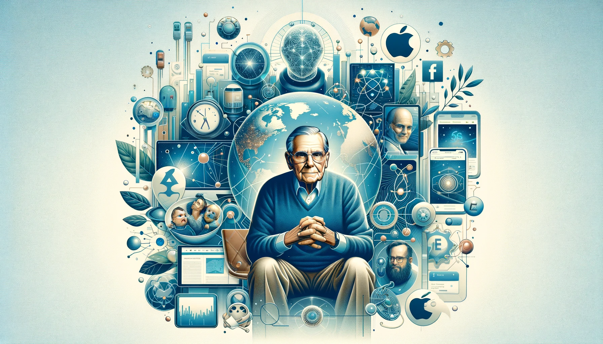
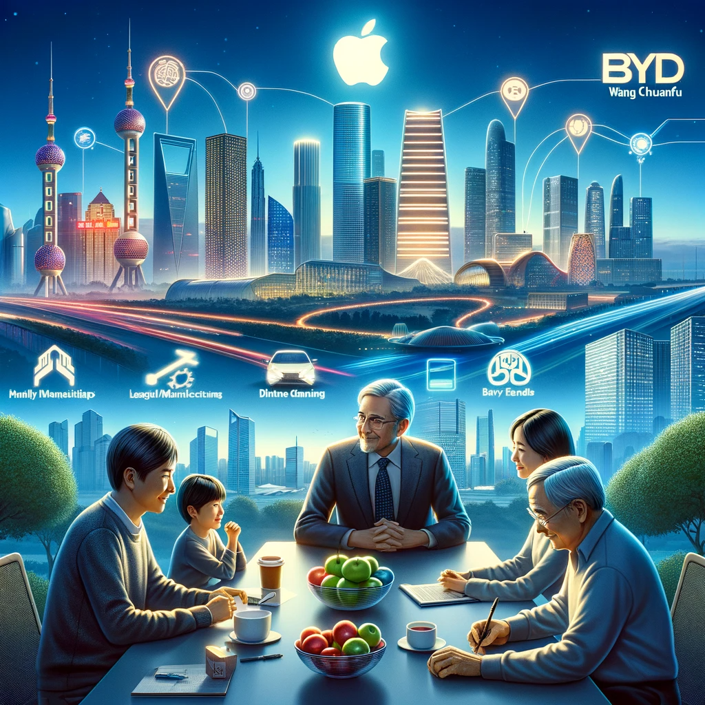
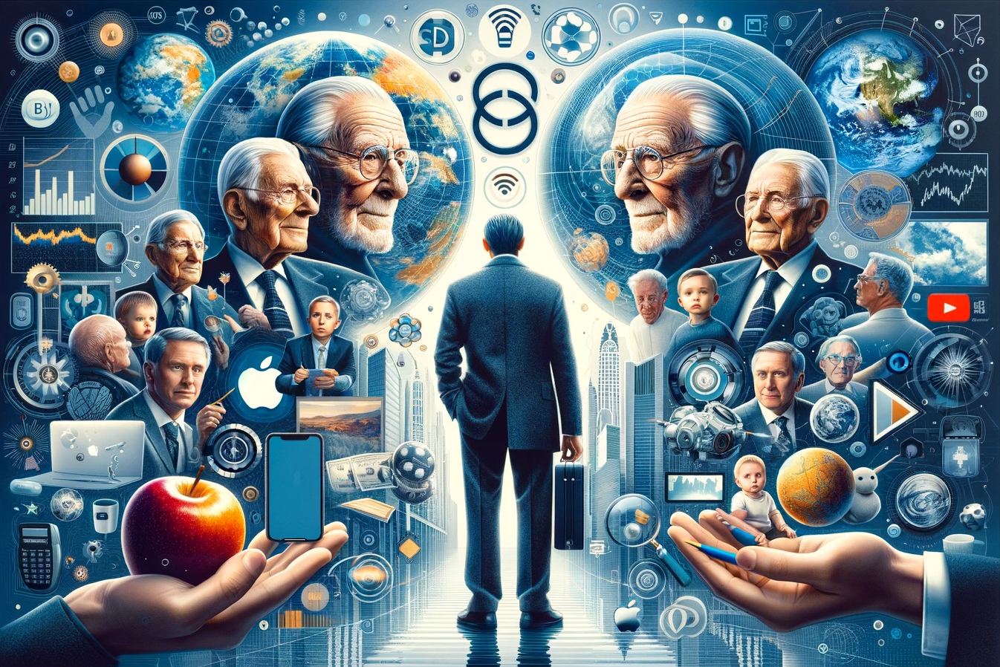
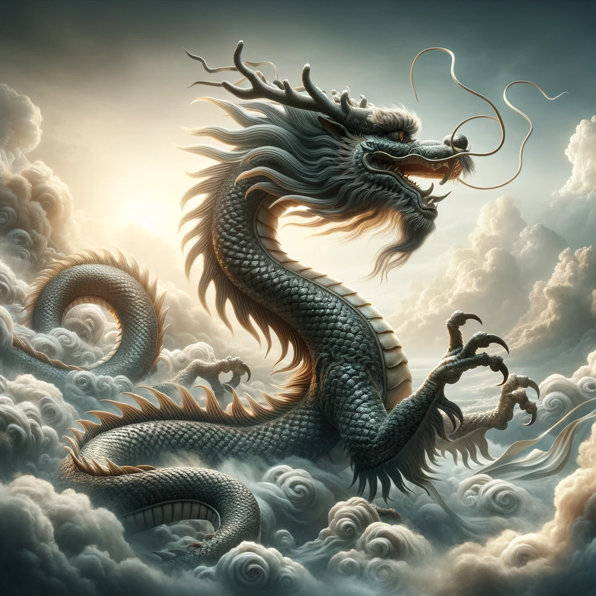
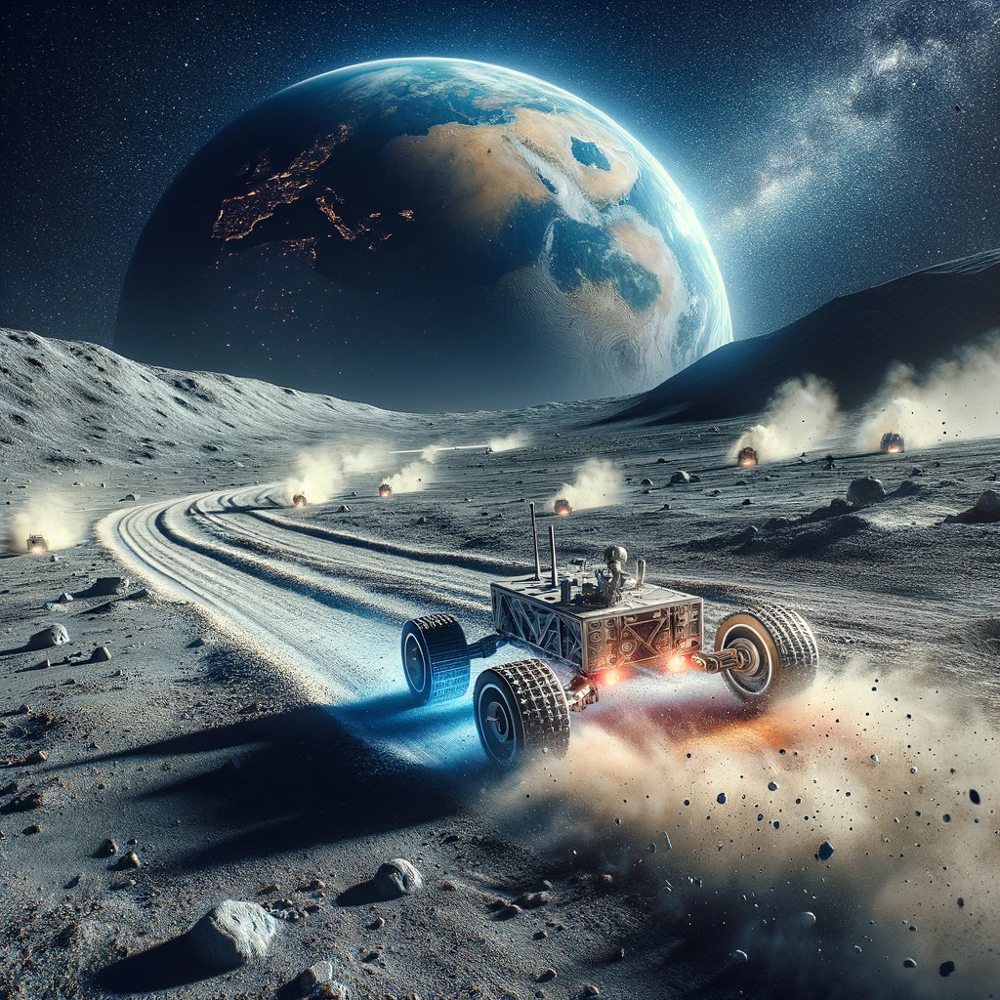
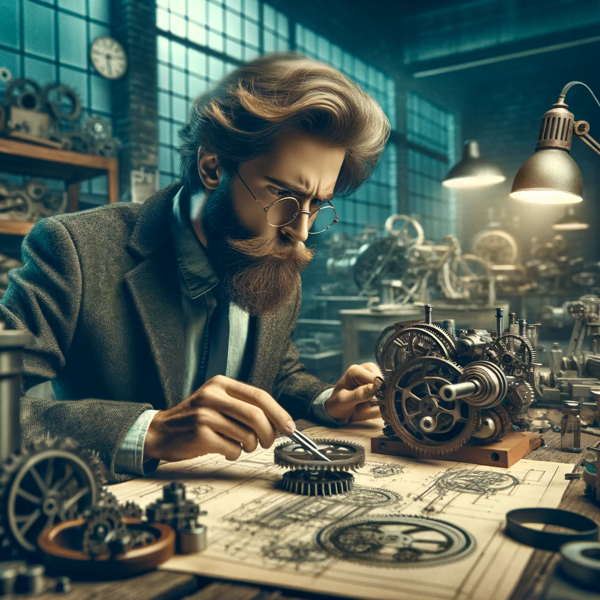
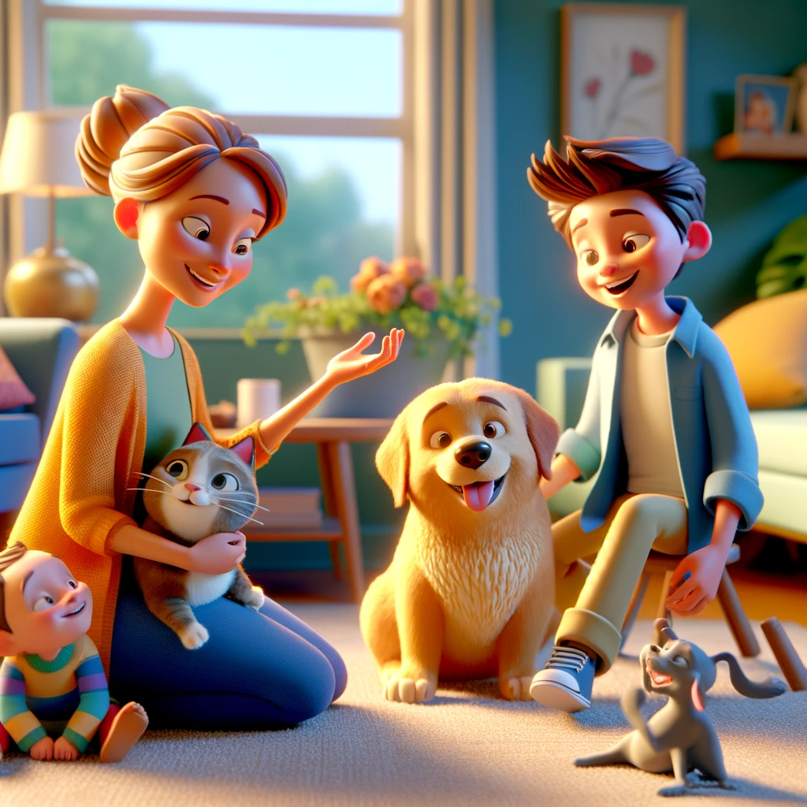

# 【随笔】芒格先生的最后一次Podcast 访谈（三）

在这最后的二十多分钟里，查理从苹果，聊到中国，并再次聊到了Costco，他说只研究的两种公司：

1. 本·格雷厄姆所推崇的那种真正便宜的，雪茄烟蒂型的公司。
2. 那些有「美德」的，创建了伟大品牌的公司——诀窍是用正确的价格买入

关于中国，他说了两点：

（1）在接下来的20年里，中国经济比几乎任何其他大经济体都有更好的未来前景。

（2）中国的领先公司比几乎任何地方的领先公司都更强大、更优秀，而且价格更便宜。

当然，还有比亚迪与王传福。查理显然是比亚迪与王传福的粉丝，他说王传福是一个天才的工程师，「**一个懂得如何亲手制造事物的狂热分子。换句话说，他比埃隆更接近实际制造的源头。比亚迪的那个人，比马一龙更擅长实际制造事物。**」

虽然他谦虚地不愿再充当老师给年轻人建议，可是关于家庭，他还是说了如下这些：

> **你得与每个人相处。你得帮助他们度过困难时期，他们也会帮助你，等等。但我认为这并不难。**
>
> 拥有一个伟大的配偶的最佳方式是配得上对方。只要双方都有这种感觉，那就是成功的秘诀。
>
> **你必须在诸如孩子教育等事情上与你的配偶建立信任。**

或许，因为这是查理•芒格唯一一次，也是最后一次Podcast访谈。所以，更加觉得弥足珍贵吧！

希望你也喜欢！

以下是最后二十多分钟的Transcript 与翻译……

----

Andrew: Since these guys are very tech-focused, I'm curious about not being a tech person. What did you think about the Apple investment? And what gave you the conviction to be so big?

安德鲁：由于这些人非常专注于科技，我对你不是科技人士的看法感到好奇。你对苹果的投资是怎么看的？是什么让你有如此大的信心？

Charlie: What everybody has learned is that everybody needs some significant participation in the 12 companies that do better than everybody else. You need two or three of them, at least. If you have that mindset, Apple was the logical candidate to be on the list of which you’re going to select your companies. It's not very hard to come up with an idea that it may be okay.

查理：每个人都已经学到，每个人都需要在那些表现比其他人都好的12家公司中有一些重要的参与。你至少需要两三个。如果你有这种心态，苹果就是你要从中选择公司的候选名单上的合乎逻辑的公司之一。想出它可能没问题的想法并不难。

Ben: Making the list doesn't sound too hard. In fact, there are these acronyms FAANG, MAAMA, Microsoft, Apple, Google, Facebook, but selecting the one and putting tens of billions to create hundreds of billions of value… that to me sounds hard to pick the one! How did you guys pick the one?

本：列出名单听起来不太难。实际上，有这些首字母缩写词FAANG、MAAMA、微软、苹果、谷歌、Facebook，但选择一个并投入数十亿以创造数千亿的价值……我觉得挑选那一个听起来很难！你们是怎么挑选那一个的？

Charlie: We're good at anything else.

查理：我们擅长其他任何事情。

David: Was it valuation?

大卫：是因为估值吗？

Charlie: Yeah, it got cheap. It got to about 10 times earnings when Warren bought in.

查理：是的，当沃伦买入时，它大约是10倍的盈利。

Ben: 2015, I believe, was the first.

本：我相信是2015年首次购入。

It's fascinating to me, this concept of if you look at distressed debt, or you look at (I think) Warren in the last Berkshire letter pointed out, it's been a handful of really good decisions…. Or you look at venture capital that's classically power law–distributed. Any of these asset classes comes down to a few really good decisions with high conviction over an *entire career*.

对我来说，这个概念很吸引人，如果你看看陷入困境的债务，或者你看看（我认为）沃伦在上一封伯克希尔信中指出的，只有少数真正好的决定……或者你看看风险投资那是典型的幂律分布。这些资产类别归结于一些高信念的非常好的决定，贯穿于*整个职业生涯*。

Charlie: Yeah, that's exactly what worked.

查理：是的，正是这样起作用的。

Ben: It's not smoothed. There's no asset class where you can repeatedly just do *okay*.

本：这不是平稳的。没有资产类别可以反复只做*还行*。

Charlie: The low-hanging fruit for the idiot is… it’s not gone, but it's very small.

查理：对于愚蠢的人来说，低垂的果实……它没有消失，但是很少。

Ben: You mentioned this idea when we were talking about Apple, that there are a few companies that it's just really important to be in. Do you think these big tech companies being the winners, where all of the pensions, Berkshire, university endowments, and everyone's 401(k) is being concentrated in these companies, do you think that was the natural outcome? Do we have to end up this way?

本：你在谈论苹果时提到了这个想法，就是有一些公司非常重要，需要参与其中。你认为这些大型科技公司成为赢家，所有的养老金、伯克希尔、大学捐赠基金和每个人的401(k)都集中在这些公司，你认为这是自然的结果吗？我们不得不这样做吗？

Charlie: Yeah, it was natural. That's why it happened.

查理：是的，这是自然的。这就是为什么它发生。

Ben: What causes that?

本：是什么导致了这种情况？

Charlie: Human nature and competition, that's what causes it.

查理：人性和竞争，这就是导致它的原因。

Ben: Will we eventually have one?

本：我们最终会只有一个公司吗？

Charlie: Eventually, this craziness in venture capital, when they’re all gone stupid, that's a natural outcome.

查理：最终，这种在风险投资中的疯狂，当他们都变得愚蠢时，那是自然的结果。

Ben: Will we have one $20 trillion company and then the next biggest company is—?

本：我们会有一个20万亿美元的公司，然后下一个最大的公司是——？

Charlie: I don’t know how the world is gonna. I think… I didn’t know we were gonna have as much as we did. They just happened.

查理：我不知道世界会怎样。我认为……我不知道我们会有我们所拥有的那么多。它们只是发生了。

Person: Would you continue investing in China? What's your position on that?

人物：你会继续在中国投资吗？你对此有何看法？

Charlie: My position in China has been that: (1) the Chinese economy has better future prospects over the next 20 years than almost any other big economy. That’s number one. (2) The leading companies of China are stronger and better than practically any other leading companies anywhere, and they're available at a much cheaper price.

查理：我在中国的立场是：（1）在接下来的20年里，中国经济比几乎任何其他大经济体都有更好的未来前景。那是第一点。（2）中国的领先公司比几乎任何地方的领先公司都更强大、更优秀，而且价格更便宜。

So naturally, I'm willing to have some China risk in the Munger portfolio. How much China risk? Well that's not a scientific subject, but I don't mind whatever it is, 18% or something. Whatever its worked out in the Munger family, it's okay with me.

所以，我自然愿意在芒格的投资组合中承担一些中国风险。多少中国风险呢？那不是一个科学问题，但无论是18%还是别的比例，无论芒格家族的投资组合如何，我都能接受。

Ben: What about other geopolitical considerations? Would you hold TSMC at this point?

本：关于其他地缘政治方面的考量呢？你现在会持有台积电吗？

Charlie: Well I don't like that as well as I like something with a real consumer brand of its own like Apple.

查理：嗯，我不像喜欢苹果那样喜欢它，苹果有自己的真正消费品牌。

Andrew: I'm curious, what major companies that haven't been mentioned do you think people would do well to study the virtues of, like studying the virtues of Costco?

安德鲁：我很好奇，除了已经提到的大公司，你认为人们研究像好市多那样的美德会做得很好的公司还有哪些？

Charlie: I only study two kinds of companies. I'm enough of a big Ben Graham follower… so if something is really cheap, even though it's a crappy company, I'm willing to consider buying it. For a while anyway. I do that occasionally. I've done it with great success of time or two, but unlike Howard Marks I’ve only done it once or twice in my lifetime for big gains, and that's it. It's not like I’ve done it a hundred times. It isn't a bit easy. A hundred times easy money is almost non-existent.

查理：我只研究两种公司。我足够崇拜本·格雷厄姆……所以如果某样东西真的很便宜，即使它是糟糕的公司，我也愿意考虑购买。至少暂时是这样。我偶尔这样做。我做过一两次大成功，但不像霍华德·马克斯那样，我一生中只为大收益做过一两次，就这样。不像我做过一百次那样。这一点也不容易。一百次轻松赚钱几乎不存在。

David: One type of company is the cigar butt. What's the other type of company?

大卫：一种类型的公司是雪茄烟蒂。另一种类型的公司是什么？

Andrew: The companies that people would do well to study the virtues of?

安德鲁：那些人们研究美德会做得很好的公司是哪些？

Charlie: Great brand companies, of course, are good. Getting the right price… the whole trick is getting them on a few rare occasions when they're really cheap. Buying Costco at its present price… it may work out all right but that’s… but again it's getting hard.

查理：当然，伟大的品牌公司是不错的。获得正确的价格……整个诀窍就是在极少数情况下它们真的很便宜时买入。以现在的价格购买好市多……可能会有不错的结果，但再次……这也变得困难了。

Andrew: Forgetting the prospects of the stock, how do you think about the next 10 years for the business?

安德鲁：忘记股票的前景，你如何看待接下来10年的业务？

Charlie: I think it’ll do pretty well.

查理：我认为它会表现得相当不错。

Ben: Charlie, one more question for you in this area. What is your favorite advice to give to young people?

本：查理，我还有一个问题要问你。你给年轻人的最喜欢的建议是什么？

Charlie: I don't give advice to just any young people. I give some, I pick my spots. I don't want to be more of a guru to young people than I already am. It's getting hard out there. There's all this bullshit and craziness. Of course, it's going to be hard.

查理：我不会给任何年轻人建议。我会选择时机。我不想成为年轻人的导师，比我现在已经是的更多。外面的世界变得艰难了。有这么多胡说八道和疯狂。当然，这将会很难。

Ben: Where do the attractive opportunities hang out anymore? It sounds like everything in the whole world is overpriced. Could that be possible?

本：那么有吸引力的机会在哪里？听起来好像整个世界的一切都被高估了。这可能吗？

Charlie: Damn near. Of course, it could be possible. It's not only possible, it's likely that it actually happened.

查理：几乎可以肯定。当然，这可能。不仅可能，很可能真的就发生了。

Ben: How did the world get so rich if we have all this capital for so few opportunities?

本：如果我们有这么多资本，机会却如此之少，世界是如何变得如此富有的？

Charlie: It's the nature of things. Look, biology produces a very advanced creature like us, consider I can talk intelligently on all these objects. But it does it by killing everybody off with brutal competition one with the other for… hundreds of thousands of years. In other words, the system that nature uses to get smart is kind of unpleasant for the people who are losing.

查理：这是事物的本质。看，生物学产生了像我们这样高度发达的生物，考虑到我可以在所有这些对象上智慧地交谈。但它通过在彼此间进行残酷的竞争，杀死所有人……成千上万年。换句话说，自然用来变得聪明的系统对于失败者来说有点不愉快。

Ben: So over the last 100 years, we've brutally shifted all this value from labor to capital, and now capital is all competing to get into a very small set of opportunities?

本：所以在过去的100年里，我们残酷地将所有价值从劳动转移到资本，现在所有的资本都在争夺少数的机会？

Charlie: It wasn’t as if it was all that easy if you go back a long time. It just was a lot easier.

查理：并不是说如果你回顾很久以前就一直都很容易。只是以前容易得多。

Ben: And if it continues to get harder, the natural end is that you have...

本：如果它继续变得更困难，自然的结果是你会得到……

Charlie: An unpleasant blow up or some kind. God knows what happens after an unpleasant blow up with our modern democracy. You get to a level like Europe which is quite dysfunctional.

查理：不愉快的爆炸或者类似的东西。天知道在不愉快的爆炸之后我们的现代民主会发生什么。你会达到像欧洲那样相当不功能的水平。

Ben: Is it too pessimistic of a view to say that the world seems to be out of good ideas to match the amount of capital out there looking for good ideas?

本：说世界似乎缺乏好的想法来匹配外面寻找好想法的资本，这种观点太悲观了吗？

Charlie: It was never easy. It's thoroughly understood it was never easy, and it's harder now. Those are the two. But it takes time. And you pay attention that you're handling the people you deal with. You want a good reputation when you're all done, not a bad one.

查理：它从来都不容易。要充分理解它从来都不容易，而且现在更难了。这就是两个事实。但这需要时间。而且你要注意你所处理的人。你最终想要一个好名声，而不是一个坏名声。

Andrew: I don't think you're saying there are no opportunities whatsoever. I think you're just saying low expectations and fewer bonanzas.

安德鲁：我认为你并不是说根本没有机会。我认为你只是在说期望值低，大收获少。

Charlie: The beauty of it is: you only have to get rich once. You don't have to climb this mountain four times. You just have to do it once.

查理：美妙的是：你只需要变富有一次。你不需要四次攀登这座山。你只需要做一次。

. The scene should capture the climber at the peak, wi.png)

Andrew: Well that’s your philosophy on both sides, you got to be patient for the great opportunities. But you got to recognize them when they come and pounce.

安德鲁：那是你的哲学，你必须耐心等待大机会。但你也必须在它们来临时认出它们并迅速行动。

David: We turned off the mics to have dinner and then recorded a little bit more later in the evening about Costco and some life advice from Charlie.

大卫：我们关掉麦克风去吃晚饭，然后晚上录了一些关于好市多和查理的生活建议的内容。

Ben: One Costco question that I've been wanting to ask you is: all the puzzle pieces of the low SKU count, the high inventory turnover… there are just so many things that fit together so beautifully…

本：我一直想问你关于好市多的一个问题：低SKU数量，高库存周转率……有很多事情非常完美地结合在一起……

Charlie: They're pretty obvious, though.

查理：它们很明显。

Ben: But how come no one else can pull it off if they're so obvious?

本：但如果它们如此明显，为什么没有其他人能做到？

Charlie: Well, it takes a good execution to do it. You really have to set out to do it, and then do it with fanaticism, every day, every week, every year for 40 years. It's not so damn easy.

查理：嗯，要做到这一点需要很好的执行。你真的必须下决心去做，然后每天、每周、每年坚持做40年。这并不容易。

Ben: So you think the success is the magic of the business model and culture?

本：所以你认为成功是商业模式和文化的魔力？

Charlie: Yes, culture plus model. Yes, absolutely. And very reliable, hard working, determined execution for 40 years.

查理：是的，文化加模式。绝对是的。还有非常可靠、勤奋、坚定的执行40年。

David: I mean, they talk about the story of the ketchup that you could increase the price of ketchup by 3% and nobody would notice, but that would destroy everything if you did that, right?

大卫：我是说，他们谈论了番茄酱的故事，你可以将番茄酱的价格提高3%，没人会注意，但如果你这样做，一切都会被破坏，对吧？

Charlie: I would say the central norm was: don't raise the market. Get it low and keep it there forever.

查理：我会说中心准则是：不要提高市场价格。让它低并永远保持低。

David: Which brings us to the hotdogs. Is it true, the story that when Craig took over as CEO, he did try to raise the price of the hotdogs?

大卫：这就引出了热狗的话题。当克雷格接任CEO时，他确实试图提高热狗的价格，这是真的吗？

Charlie: I don't know. I had no conversations on the subject.

查理：我不知道。我没有就这个话题进行过任何对话。

David: And Jim forbade him.

大卫：而吉姆禁止了他。

Charlie: I'm sure Jim would have forbade it, absolutely.

查理：我肯定吉姆会禁止的，绝对会。

David: There was no board-level discussion of the hotdog?

大卫：董事会没有讨论热狗的价格吗？

Charlie: No. Those two would not have thought it was a board matter to discuss the price of the hotdog.

查理：不，这两个人都不会认为讨论热狗的价格是董事会的事。

Ben: One thing that fascinates me about Costco is they seem to *only* be able to grow 10% per year, because they're not capital-constrained. No amount of money, if they were to access it for free, could—

我对好市多感到着迷的一件事是，他们似乎*只能*每年增长10%，因为他们不受资本限制。如果他们可以免费获得资本，那也不可能——

Charlie: I’ll tell you what is. It's hard to open too many stores a year. New store, new manager, new this, new politics. It's hard, plus a lot of stuff has to be learned, taught, and put in place. They didn't want to do more than they can comfortably handle.

我告诉你为什么。每年开太多新店很难。新店，新经理，新这个，新政治。这很难，加上很多东西都需要学习、教授和落实。他们不想做超过他们能够舒适处理的事情。

David: To the store openings, you mentioned China earlier. Was it 20 years that Costco had the license to operate in China?

大卫：关于店铺开业，您之前提到了中国。好市多在中国获得营业许可是20年前的事吗？

Charlie: The first store, they tried to open in China. The first store, somebody wanted a $30,000 bribe. Chinese culture. And they just wouldn’t pay it. That made such a bad impression on Jim Sinegal. He wouldn't even talk about going into China for about 30 years thereafter.

查理：第一家店，他们尝试在中国开业。第一家店，有人要求3万美元的贿赂。这是中国文化。他们就是不愿意付。这给吉姆·西内加尔留下了非常糟糕的印象。此后大约30年，他甚至不愿谈论进入中国。

David: So what changed? Why finally go in?

大卫：那么是什么改变了？为什么最终进入中国？

Charlie: Finally, the board started making enough noises.

查理：最终，董事会开始发出足够的声音。

David: You started agitating?

大卫：您开始鼓动了？

Charlie: Yeah.

查理：是的。

Ben: Who on the board could be excited about the Chinese market…?

本：董事会上谁会对中国市场感到兴奋……？

Charlie: Yeah. Who knows?

查理：是的。谁知道？

David: That’s so great.

大卫：太棒了。

Ben: One thing I found fascinating about Costco was the fact that even though they're at the lowest possible prices, their audience skews is wealthy. Was that an accident that they figured out over time, or did they know that?

本：我发现好市多的一个有趣之处是，即使他们提供的价格最低，他们的顾客倾向于富有。这是他们随着时间发现的偶然结果，还是他们知道的？

Charlie: No, Sol Price did. They had that figured out […].

查理：不，索尔·普赖斯知道。他们那时就弄明白了[…]。

Ben: All the way back in the Price Club days?

本：早在Price Club时代？

Charlie: Yes. He always wanted the rich man trying to save money.

查理：是的。他一直想要有钱人来省钱。

David: It's not just that they're the wealthiest customers, they're smart wealthy customers.

大卫：不仅仅是他们是最富有的客户，他们还是聪明的富有客户。

Charlie: They're picky.

查理：他们挑剔。

David: Yeah, they're picky wealthy customers.

大卫：是的，他们是挑剔的富有客户。

Ben: On some topics that are outside of Costco, you mentioned in The Daily Journal annual meeting this year that a young man knows the rules, and an old man knows the exceptions.

本：关于一些非好市多的话题，您在今年的Daily Journal年会上提到，年轻人知道规则，而老年人知道例外。

Charlie: Yeah, that's an old saying of Peter's.

查理：是的，那是彼得的一句老话。

Ben: Was that of Peter Kaufman?

本：那是彼得·考夫曼说的吗？

Charlie: Yeah.

查理：是的。

Ben: What are some of the exceptions that you found the most useful in life?

本：您在生活中发现最有用的例外是什么？

Charlie: Take those goddamned Costco hotdogs. That's an exception. Anybody else would have raised the price of hotdogs a long time ago. They just don't do it. You know how famous it is. You bring your kids, and they know they've got something going there that's worth extra money to them, and they just don’t destroy it.

查理：拿那些该死的好市多热狗来说吧。那是个例外。其他任何人早就提高了热狗的价格。他们就是不这么做。你知道那有多出名。你带孩子去，他们知道那里有对他们来说值得额外付钱的东西，他们就是不破坏它。

Ben: A thing that I've never fully understood: I know you're a big fan of the company, BYD, the Chinese company that makes batteries and electric vehicles.

本：有一件事我从未完全理解：我知道你非常喜欢这家公司，比亚迪，这家中国公司制造电池和电动车。

Charlie: I may be a big fan, but I'm hanging out my hat while I lurch around the track. They make me nervous. Just *so* aggressive.

查理：我可能是个大粉丝，但我在赛道上摇摇晃晃地挂起帽子。他们让我紧张。太*激进*了。

Ben: Is that dangerous in a company?

本：在公司中这样激进是否危险？

Charlie: That's what makes me nervous. Of course it's dangerous.

查理：那就是让我紧张的地方。当然是危险的。

Ben: Do you think that companies should try to grow at a lower rate than they're capable of in order to be more durable?

本：你认为公司应该尝试以比他们能力所及的更低速度增长，以便更加持久吗？

Charlie: Of course you do that safer, and its easier, and so forth. But I would argue at Costco, where they've done some of these things that are extreme like the hotdog, it's smart to change their ways on one item or two.

查理：当然，那样做更安全，更容易，等等。但我会说在好市多，他们在一两个极端事项上，比如热狗，改变他们的方式是聪明的。

Ben: It seems like there's a spectrum where on the one side there's Costco that is just not a fast-growing company, because it's very difficult to. On BYD, like you're saying, they grew like crazy! I mean, you turned--

本：看起来有一个范围，在一边是好市多，因为很难做到，所以不是一个快速增长的公司。在另一边，像你所说的比亚迪，他们疯狂地增长！我的意思是，你转过头来——

Charlie: Well BYD, this year will sell at least two and a half million cars. Most of them are electric, that's unheard of. That's way more than Mercedes, for instance.

查理：嗯，比亚迪，今年至少会卖出两百五十万辆车。它们中的大多数是电动的，这是前所未有的。这远远超过了梅赛德斯，例如。

David: More than Tesla, right?

大卫：超过了特斯拉，对吧？

Charlie: Yeah, more than anybody. Lots of troubles and losses. They ran into terrible trouble. They created the wrong kind… they made lots of mistakes. They were lucky to be on the cutting edge of this electric car business. It's way more acceleration than most people.

查理：是的，超过了任何人。很多麻烦和亏损。他们遇到了严重的问题。他们犯了很多错误。他们很幸运处于电动汽车业务的前沿。这比大多数人更快的加速。

So you have a car with more oomf than most people need. So the young macho male has a real lively car. There are a lot of things, where electric cars really work in some ways that are better! At making a 90-degree turn. You can go right opposite a parallel parking space, you just move the wheels, it turns the wheels 90 degrees and goes in. Nobody's ever done that. If your car goes flat, you could run a hundred miles on three other wheels or soemthing.

所以你有一辆比大多数人都需要的更有力的车。所以年轻的硬汉男性有一辆真正活泼的车。有很多东西，电动汽车在某些方面真的做得更好！比如做90度转弯。你可以直接对着一个平行停车位，只需移动车轮，它会把车轮转90度然后进入。从来没有人做过这样的事。如果你的车轮爆胎，你可以用其他三个轮子行驶一百英里左右。

Andrew: Do they have better economics, because they don't have nearly as many parts?

安德鲁：他们的经济效益更好，因为他们没有那么多零件吗？

Charlie: It's simpler.

查理：它更简单。

Ben: Have you ever had an investment like that before? I think you've invested something like \$270 million that's now worth something like \$8 billion in BYD.

本：你以前有过这样的投资吗？我认为你投资了大约2.7亿美元，现在比亚迪的价值大约是80亿美元。

Charlie: Well, very few people have an investment […]. That's a venture capital–type investment. It happened to be a thinly-traded public company, and we bought it as a venture capital–type company. But it was a venture capital–type play, and they just put the foot right in the floorboard and played it hard.

查理：嗯，很少有人有过这样的投资[…]。那是一种风险投资类型的投资。它恰好是一家交易量很少的上市公司，我们像对待风险投资类型的公司那样购买它。但它是一种风险投资类型的投资，并且他们只是把脚狠狠地踩在油门上，全力以赴。

By the way, both BYD and we tried to talk them out of going into the car business. They were gonna buy a bankrupt car business, and go into the car business. I said that's a graveyard for you, so why would you want to do that? And he paid no attention to us and went right ahead.

顺便说一下，比亚迪和我们都试图劝他们不要进入汽车业务。他们打算购买一家破产的汽车公司，进入汽车行业。我说那是你的坟墓，你为什么要这么做？他完全不理会我们，继续前行。

Ben: Had you invested already when he told you this plan?

本：你们投资时他告诉你这个计划了吗？

Charlie: Yes, yes. And it worked fabulously well. After huge mistakes! They almost went broke with their early dealership building system, almost went broke.

查理：是的，是的。结果非常好。经过巨大的错误！他们最初建立经销商系统时几乎破产。

David: What captivated you about it though?

大卫：是什么吸引了你对它的兴趣？

Charlie: The guy was a genius. He had a PhD in engineering, and he look at some great part… he could make that park look at the morning and look at it. I didn't know he could make it. I've never seen anybody like that. He could do anything.

查理：那家伙是个天才。他拥有工程学博士学位，他看着一些伟大的零件……他可以在早上看着它，然后明白它。我从未见过像他那样的人。他什么都能做。

He is a natural engineer and a get-it-done type production executive, and that's a big thing. It's a big lot of talent to happen in one place. It's very useful. He solved all his problems on these electric cars, the motors, the acceleration, the braking, and so on.

他是一个天生的工程师，擅长实际制造事物的生产执行官，这是一项重要的才能。它在一个地方集中体现出来是非常有用的。他解决了电动汽车上的所有问题，包括马达、加速度、制动等。

David: How would you compare him and BYD to Elon and Tesla?

大卫：您怎么看比亚迪与埃隆和特斯拉的比较？

Charlie: He's a fanatic that knows how to actually make things with his hands if he has to. He's closer to ground zero, in other words. The guy at BYD is better at actually making things than Elon is.

查理：他是一个懂得如何亲手制造事物的狂热分子。换句话说，他比埃隆更接近实际制造的源头。比亚迪的那个人比埃隆更擅长实际制造事物。

Ben: Charlie, you turn 100, which is an unbelievable statement on January 1st of next year. Do you have any plans?

本：查理，你明年一月一日就要迎来百岁生日，这真是令人难以置信。你有什么计划吗？

Charlie: I'm going to party.

查理：我要开派对。

David: Where's the party going to be?

大卫：派对会在哪里举办？

Charlie: The California Club. But I've totally maxed out the room, I can’t squeeze another.

查理：在加州俱乐部。但我已经把房间订满了，不能再挤进一个人了。

Ben: What captivates you these days? What's fun?

本：最近有什么事情吸引你？有什么好玩的吗？

Charlie: Well practically, everything is. Even politics, as bad as it is, it's kind of interesting.

查理：几乎一切都很有趣。即使是政治，尽管它很糟糕，但也有点意思。

David: When you look back at you and Warren's time together, when did you have the most fun?

大卫：回顾你和沃伦共同度过的时光，你觉得什么时候最有趣？

Charlie: We had about the same amount of fun all the way through. We're having fun now.

查理：我们一直都差不多同样有趣。我们现在也在享受乐趣。

Ben: Is there a particular era that you remember the most fondly that feels like the good old days?

本：有没有一个特定的时代让你最怀念，感觉像是美好的旧时光？

Charlie: Well remember we were sweating blood on some of those good old days.

查理：要记住，我们在那些美好的旧时光里流了不少血汗。

Ben: I mean, Salomon Brothers.

本：我的意思是，所罗门兄弟。

Charlie: Yeah, there were a lot of close misses. We got out with a big problem, but we could have had a big loss.

查理：是的，那里有很多险些出事。我们摆脱了一个大问题，但本可以损失惨重。

David: You could have had more problems than just a loss with Salomon, right?

大卫：和所罗门兄弟的问题不仅仅是损失，对吧？

Charlie: Yeah.

查理：是的。

Ben: Actually, when we examined Berkshire Hathaway on our podcast, our takeaway was that the whole franchise was at risk during Salomon Brothers, the entire Berkshire Hathaway name and future. Would you agree with that?

本：实际上，当我们在播客上分析伯克希尔·哈撒韦时，我们的结论是在所罗门兄弟期间，整个伯克希尔·哈撒韦的品牌和未来都处于危险之中。你同意这个观点吗？

Charlie: Not so much. We could have survived it.

查理：不太同意。我们本可以挺过来的。

Ben: If you would let the whole investment in Salomon go to zero, it would have been fine?

本：如果你让整个所罗门兄弟的投资归零，也会没问题吗？

Charlie: If it all blown up and went to zero, we would have written it off and gone on. And done pretty well.

查理：如果它全盘崩溃归零，我们会把它抹掉，继续前进。我们会做得很好。

David: What do you consider to be your finest hour?

大卫：你认为你最辉煌的时刻是什么？

Charlie: Well, we like to remember the close misses that were nearly terrible problems. We had terrible problem with The Buffalo News.

查理：嗯，我们喜欢回忆那些险些成为可怕问题的紧急关头。我们在布法罗新闻时遇到过大问题。

Ben: The Buffalo News / Buffalo Evening News brawl?

本：布法罗晚报/布法罗新闻的争执？

Charlie: Yeah. There were two newspapers in that town. We started a Sunday edition. That started a holy war, and the other guy went broke. We could have had a lot of bad publicity over that.

查理：是的。那个城市有两家报纸。我们开了一个星期天版。这引发了一场圣战，另一方破产了。我们可能因此招致很多负面舆论。

Ben: You were both pretty young and enterprising at that point. You weren't the Warren and Charlie of...

本：那时你们俩都还很年轻，充满进取心。你们不是现在的沃伦和查理……

Charlie: No. But I was very aggressive about wanting to have a good Sunday edition. I didn’t want to own the paper for 50 years with no Sunday editions and the other guy had one.

查理：不。但我非常积极地想要有一个好的星期天版。我不想拥有一家报纸50年却没有星期天版，而另一个家伙有。

Ben: What made the newspaper business so attractive at that point in history?

本：当时报纸业务有什么吸引人的地方吗？

Charlie: It was a gold mine at that time, total gold mine.

查理：那时它是个金矿，绝对的金矿。

Ben: That's attractive.

本：那很有吸引力。

David: The play in particular with The Buffalo Evening News and the Sunday edition was playing for the local monopoly to be *the* game in town. With newspapers, you could do that.

大卫：特别是布法罗晚报和星期天版的战略是为了争夺当地垄断地位，成为该地区的主导。对于报纸来说，你可以做到这一点。

Charlie: Sure.

查理：当然。

David: Newspapers, for decades, had EBITDA margins in the 50%–60% range, right?

大卫：几十年来，报纸的EBITDA利润率在50%-60%之间，对吗？

Charlie: No, only the little ones.

查理：不，只有小的。

David: Only the little ones?

大卫：只有小的吗？

Charlie: Yeah, the big ones are less, 30%, 40%, or 25%.

查理：是的，大的利润率更低，30%，40%，或者25%。

David: I said EBITDA on your presence, I apologize. Cash flow margins.

大卫：我在你面前提到EBITDA，我道歉。现金流利润率。

Ben: Actually, do you still feel that EBITDA is criminal the way that you've demonized it in the past?

本：实际上，你是否仍然认为EBITDA就像你过去所批评的那样是犯罪的？

Charlie: Yeah, I do. You've got a big truck company and take the depreciation out of the truck’s earnings. You’re lying about the earnings.

查理：是的，我这么认为。如果你有一家大卡车公司，把卡车收入中的折旧排除在外，你就在谎报收入。

Ben: You witnessed its rise with Malone, TCI, and Liberty when EBITDA was invented as a concept. What were you thinking?

本：你目睹了它的崛起，与马龙、TCI和自由传媒一起，当EBITDA作为一个概念被发明。你当时是怎么想的？

Charlie: I've never liked John Malone's extreme manipulations. I don't want to be known as the great manipulator like John Malone is. He paid less income taxes than anybody. He just pushed everything to the ideological extreme.

查理：我从来不喜欢约翰·马龙的极端操纵。我不想被称为像约翰·马龙那样的伟大操纵者。他支付的所得税比任何人都少。他只是把一切推向意识形态的极端。

Ben: In many ways, EBITDA was the community adjusted earnings of its era. Are you familiar with the community adjustment from WeWork?

本：在很多方面，EBITDA就像它那个时代的社区调整收益。你熟悉WeWork的社区调整吗？

Charlie: No.

查理：不熟悉。

David: Final question to wrap up. What is the set of companies that you think are the greatest that you've ever seen, either that you've owned or that you've not owned?

大卫：最后一个问题来结束这次对话。你认为你见过的最伟大的一组公司是哪些，无论是你拥有过的还是没有拥有过的？

Charlie: There are a lot of great companies. Hermes is a great company. In its heyday, General Motors was a great company. It just gradually went to hell one contract at the time.

查理：有很多伟大的公司。爱马仕是一家伟大的公司。在其全盛时期，通用汽车是一家伟大的公司。它只是逐渐因为一份份合同而走向地狱。

Andrew: What do you think about the predictability of… there were a number of companies back when you started where you could have said this business will be the same in 10 years? Do you think that number is the same today, or do you think it's much higher than that?

安德鲁：关于可预测性……当你开始时，有许多公司你可以说这个业务在10年后将会是一样的。你认为现在的这个数字是一样的吗，还是你认为它比以前多得多？

Charlie: I think most places have a lot of change and threat in their future.

查理：我认为大多数地方未来都充满了很多变化和威胁。

Ben: Do you think most places had a lot of change and threat in their future even 50 years ago, and this story is over-blown?

本：即使在50年前，你认为大多数地方也面临着很多变化和威胁吗？这个故事是否被夸大了？

Charlie: There’s a difference with some of what I call a specialized industrial company, and Berkshire has a lot of them. We have a lot of companies that are quite insulated from really tough competition, just because they've been so long, and they’re so good at what they do and have a good reputation, high value, and so on.

查理：对于一些我称之为专业工业公司来说，情况有所不同，伯克希尔拥有很多这样的公司。我们有很多公司因为经营时间长，做得很好，拥有良好的声誉，高价值等，所以相当免受真正严酷竞争的侵袭。

Andrew: What companies can you see today where you can confidently say, Berkshire aside, Costco aside, you can confidently say the business will be as good as it is today in 10 years?

安德鲁：你今天能看到哪些公司，可以自信地说，除了伯克希尔和好市多外，你可以自信地说这家公司在10年后的业务会像今天一样好？

Charlie: I think a lot of companies are pretty good, but you can't confidently say what's going to happen. Because you may get some guy like Iger in that just wants to push everything and do the right public relations. So no matter how good the business is, it will be phony.

查理：我认为很多公司都很不错，但你无法自信地说会发生什么。因为你可能会遇到像艾格那样的人，他只想推动一切并做正确的公关。所以无论业务有多好，它都会是虚假的。

Ben: Charlie, I have a personal question for you. David has a two-year-old, and I'm going to have my first child in a month. What advice do you have for us about building families?

本：查理，我有一个个人问题要问你。大卫有一个两岁的孩子，我下个月就要有我的第一个孩子。你对我们建立家庭有什么建议？

Charlie: Of course, you’ve got to get along with everybody. You got to help them through their tough times, and they help you, and so forth. But I think it’s not as hard. Half of the marriages in America work pretty damn well. And they would have worked just as well if they were both married to somebody else, by the way.

查理：当然，你得与每个人相处。你得帮助他们度过困难时期，他们也会帮助你，等等。但我认为这并不难。美国一半的婚姻都相当成功。而且即使他们和别人结婚，也会一样成功。

David: You've said that the best way to have a great spouse is to deserve one. As long as both parties feel that way, then it's a recipe for success.

大卫：你曾说过，**拥有一个伟大的配偶的最佳方式是配得上对方。只要双方都有这种感觉，那就是成功的秘诀**。

Charlie: Of course it is. You got to have trust with your spouse on things like education of the children and so forth.

查理：**当然是。你必须在诸如孩子教育等事情上与你的配偶建立信任。**

Benn: I love that. Charlie, thank you.

本：我喜欢这个观点。查理，谢谢你。

David: Thank you, Charlie.

大卫：谢谢你，查理。

Charlie: Good luck to you.

查理：祝你们好运。

Andrew: A lot of people are going to benefit a lot from hearing this, and your wisdom, and they're going to learn so much.

安德鲁：很多人会从听到这些和你的智慧中受益匪浅，他们会学到很多。

Charlie: Well you know if you stop and think about it, it's pretty hard. It doesn't look so damn easy just to go out... if you go to the ordinary person trying to promote himself as an investment advisor of some kind, he just thinks he knows everything about everything and how the Federal Reserve should be run and so on. We don't feel that way.

查理：你知道，如果你停下来想一想，这很难。看起来并不容易……如果你去找一个普通人，试图推销自己成为某种投资顾问，他就认为自己对一切都了如指掌，知道联邦储备应该如何运行等等。我们不是那种感觉。

David: I will say with the people we get to talk to you who've built great things, every single one of them says it was so hard. It's so hard, and you can't build something great without it being so hard.

大卫：我要说的是，我们有机会与那些建立了伟大事业的人交谈，他们每个人都说这非常难。这很难，没有经历艰难就无法建立伟大的事业。

Ben: Charlie, thanks so much for doing this with us.

本：查理，非常感谢您和我们一起做这个。

Charlie: I'm glad to do it. It'll be an interesting life. You'll do pretty well at it, but it's not going to be that damn easy.

查理：我很乐意这么做。这将是一段有趣的人生。你们会做得不错，但不会那么容易。

Ben: David, total life experience and complete boondoggle.

本：大卫，这是一次终身难忘的经历和完全的意外收获。

David: I can't believe we got to do this. I'm still pinching myself. It's now a couple of weeks after it actually happened.

大卫：我简直不敢相信我们做到了这一点。现在事情发生已经过去几周了。

Ben: I know, with autographed copies of Poor Charlie's Almanack to prove it.

本：是的，有《穷查理宝典》的亲笔签名证明。

David: As if the podcast wasn't enough. Actually, for those of you who haven't listened back in 2021, two-ish years ago, we did a whole three-part series, just us, covering the whole history of Berkshire Hathaway. Part one is on Warren, part two is on Charlie, part three is on Berkshire and Ted and Todd all the way up through to today. I assume many of you have listened to that, but there probably are a bunch of folks who haven't. If you want another 9 or 10 hours of Acquired content on Berkshire—I really think it's some of, if not our best work—go check those out.

大卫：好像播客还不够。实际上，对于那些还没听过的人，回到2021年，大约两年前，我们做了一个三部分系列，只是我们俩，讲述了伯克希尔·哈撒韦的整个历史。第一部分是关于沃伦，第二部分是关于查理，第三部分是关于伯克希尔和泰德和托德，一直到今天。我猜很多人已经听过了，但可能也有很多人没听过。如果你想听另外9到10个小时关于伯克希尔的Acquired内容——我真的认为这是我们最好的作品之一——去听听看。

Ben: With that, listeners, our huge thank you to Tiny for being the sole presenting sponsor of this episode. If you have, or you know of a wonderful internet business, you should reach out, hi@tiny.com. Just tell them that Ben, David, and Charlie sent you.

本：最后，感谢Tiny成为本期节目的唯一主赞助商。如果你有或你知道一个精彩的互联网业务，你应该联系他们，[hi@tiny.com](mailto:hi@tiny.com)。只要告诉他们本、大卫和查理推荐你的。

You can sign up for notifications of new emails every time an episode drops. We'll be including little tidbits as we learn things after releasing episodes—corrections, updates, things like that—and teasing the next episode, acquire.fm/email.

你可以注册通知，每次有新的剧集发布时都会收到新邮件。我们会在发布剧集后学到一些小知识——更正、更新之类的东西——并暗示下一集的内容，acquire.fm/email。

Listen to ACQ2. This is typically where we talk about more up-and-coming companies who are earlier in their journeys, or CEOs who are topic experts in important areas like AI. Search ACQ2 in any podcast player.

听ACQ2。这通常是我们讨论更具前瞻性的公司，它们在旅程中较早，或者是CEO们在重要领域如AI的专家。在任何播客播放器中搜索ACQ2。

After you finish this, join the Slack, acquired.fm/slack and discuss with the whole Acquired community. If you want to get some of that sweet Acquired merch that everyone's talking about, go to acquired.fm/store. With that, listeners, we'll see you next time.

在你听完这个之后，加入Slack，acquired.fm/slack，与整个Acquired社区一起讨论。如果你想得到大家都在谈论的Acquired商品，请访问acquired.fm/store。最后，听众们，我们下次见。

David: We'll see you next time.

大卫：下次见。

<完>