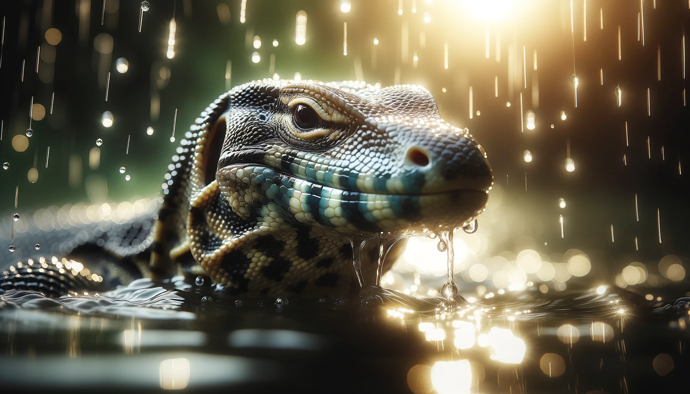
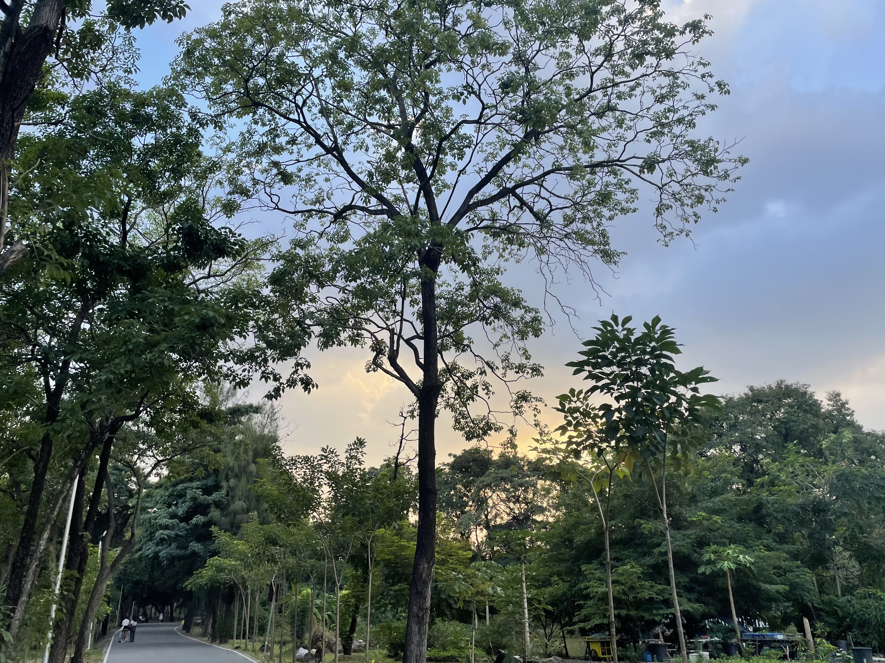
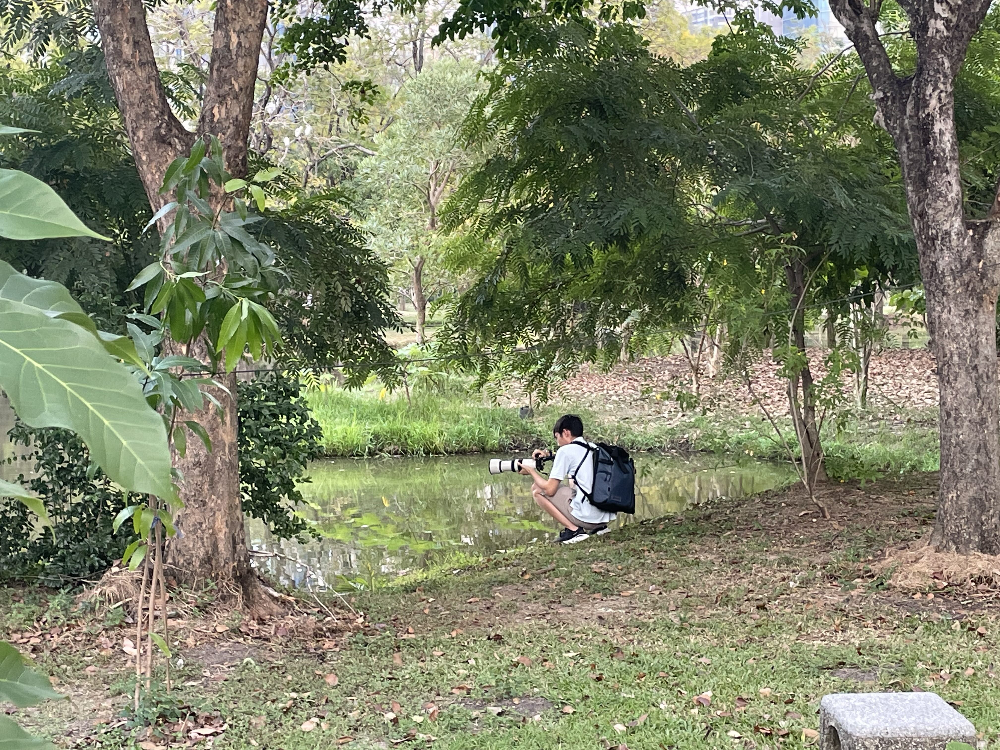
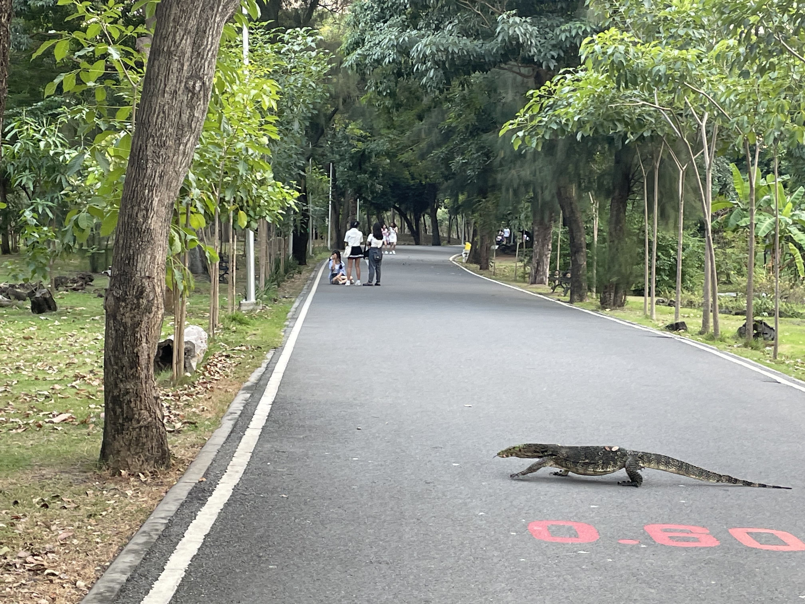
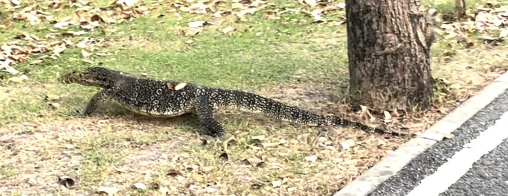
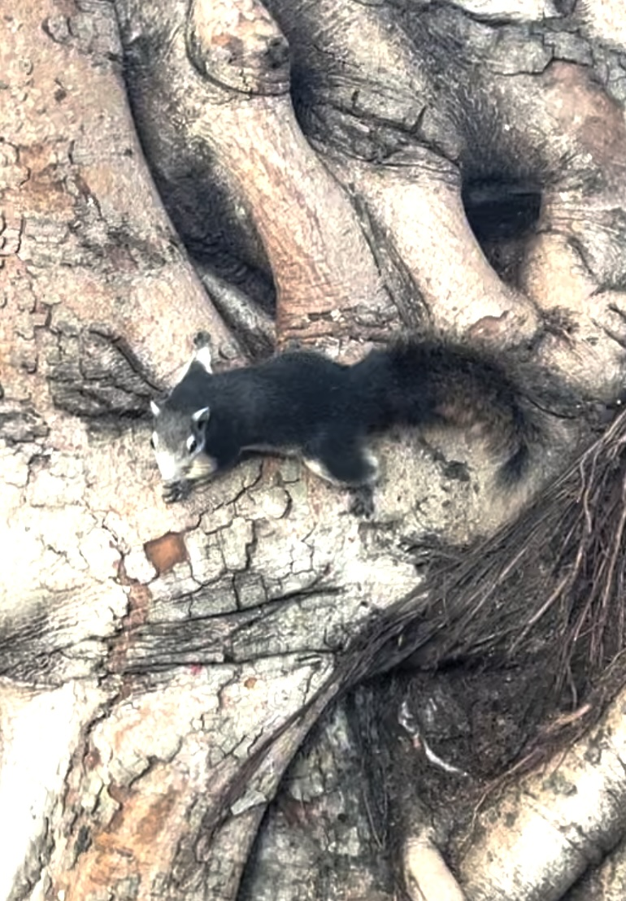

# 【随笔】泰国公园里的巨蜥

下午在**诗丽吉皇后公园**（Queen Sirikit Park）散步，正是快日落的时候，天边的云彩慢慢开始染上漂亮的金黄色。我一面往前走，一面抬头看着美丽的天空出神。举着相机拍了两张照片，却发现这苹果手机完全无法捕捉到肉眼明显可见的那种瑰丽、绚烂的色彩。

这时，我一扭头发现，却看见旁边草地尽头的小池塘边，又一个举着「大炮」的摄影师，正在专注地拍着什么。我很有些好奇，却又不好意思凑过去打扰，于是便远远地给他偷拍了一张——

你在拍你所见的美，与此同时，你也是别人摄像头里别致的景色。

我一边偷拍，一边也没有停下脚本。谁曾想刚把视线转回来，就被吓了一大跳。一个巨大的、鳄鱼一般的黑色家伙突然出现在路中间。它悠哉悠哉地从路中间从容走过，几乎都不扭头看我这个近在咫尺，被它吓得一动不敢动的游客。

想必，它对于像我这样大惊小怪的游客早就见怪不怪。之前坐在远处路边的女孩被它惊得一跃而起，也没有吸引它任何的注意力，它只是自顾自地横穿过马路，走向了草丛深处……

呃，等我整理照片时自己才意识到，它好像是冲着那个坐在湖边的摄影师去了。

咦，当时我怎么就没有留下来继续看看这热闹呢？

后来没走多远，又遇到一对儿白人情侣对着路边的树丛拍照，我从他们身边经过，结果又是一只黑色的大家伙扑通一声从台阶上跃入树丛下。感情这里的公园根本都是巨蜥的天堂啊！

前几天，在**班嘉琦缇皇后公园**（Benjakiti Park）第一次见到这个叫做Water Monitor的泽巨蜥（水巨蜥）时，我正惊讶地掏出手机来给他拍照，有个老人走过来，好心地阻止我靠近这个黑色的鳄鱼怪。他说这个很危险，告诫我有人（或者是说有小孩）被攻击过，不小心会丧命的！

网上一搜，竟然说之前在**伦披尼公园**（Lumphini Park），工作人员一口气抓了400多只水巨蜥拖到野外去放生。听说，这个家伙还是世界上最大的巨蜥——科罗拉多龙的近亲，算是地球上个头第二大的巨蜥了。

让我不太理解的是，这里的公园里有许多的鸟，连松鼠都随处可见，但就是见不到野猫。或许在这里，食物链顶端的生物，就只有这水巨蜥了？

但是，听说前几年在泰国的西北部丛林中还发现过野生的印度支那虎呢！不知道这些总共只剩下几千只的野生大猫，能撑到哪一年。

