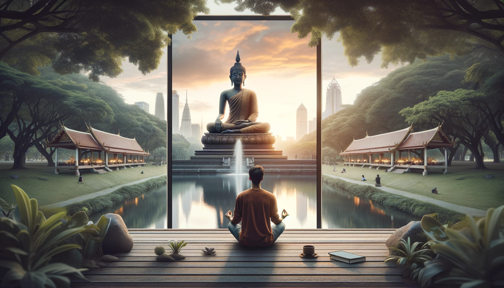
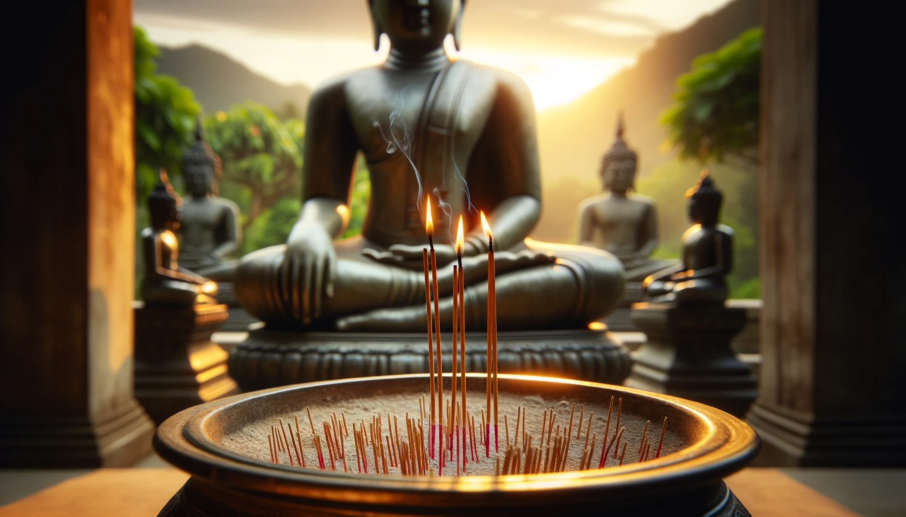

# 【随笔】不算彻底的一次「断食」

昨天只吃了一顿，算是轻断食一个白天。想着今天再来一次精神断食，于是决定跑去Benjakiti Park的Mediation Area，打算在释伽牟尼像前打坐一天，算是戒断一下手机。

但其实呢，刚刚看了看手机的使用时间。这一天也依然用了3个半小时的手机，抛开和大宝聊天的一个半小时，早上订出差的酒店时所花费的近一个小时，还是有一个小时的时间不知道拿手机干了些啥。

但不管怎么说，从接近中午开始，就是在释伽牟尼像前静坐，绕着湖走圈，再静坐，再走圈……大半天下来，也静坐了将近3个半小时，绕着湖走了4圈，也算是了了早上起床时的一段念想。许久没有这么长时间地静坐了，大部分时候都是在熬腿，佛像前的石板地也颇为考验人。虽然带了一件厚衣服垫着，但也就正坐时能有用——但正坐我本来就只能坚持半小时左右。盘腿坐衣服只够垫在屁股下面，不管是单盘还是散盘，甚至连散盘都算不上的「乱盘」，不用多久，硬硬的石板就会把脚硌得生疼。

有许多人会来这里拜佛烧香，我没见到附近有卖花和卖香烛的，本来想着下次从别处买了来供奉给佛像。后来才发现，就在佛像旁便有一个小铁盒子，里面放有香、烛、甚至还有打火机。于是，我也去取了三支香来点上，以此感恩佛祖传我内观的法门，还为我提供这么安静的地方可以静坐修行。

傍晚时分，有更多人来这里拜佛，还有人点上香烛，然后仔仔细细把佛前的石板打扫得干干净净。真是有许多虔诚的佛教徒。我都觉得有些惭愧起来，大部分时间在这里走神儿，真是愧对他们。

临走时，我又给佛祖上了三支香，感恩今天有机缘，能够得以进行这虽然不彻底，但好歹也算数的「精神断食」修行……

Namo tassa Bhagavato arahato sammasambuddhassa！

Namo tassa Bhagavato arahato sammasambuddhassa！

Namo tassa Bhagavato arahato sammasambuddhassa！

Idam me punnam, asavakkhayavaham hotu.

Idam me punnam, nibbanassa paccayo hotu.

Mama punnabhagam sabbasattanam bhajemi,

Te sabbe me samam punnabhagam labhantu.

Sadhu! Sadhu! Sadhu!