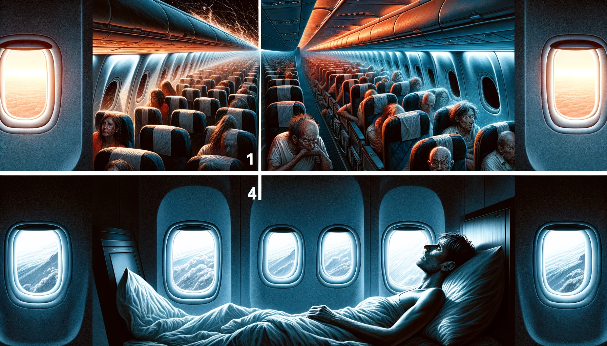

# 【生命⋅修行】一再回望「初心」

前两天坐上泰航的飞机从曼谷飞吉隆坡，起飞时，飞机出乎意料地猛烈抖动起来。也不知道这空客350就是这样的脾气，还是泰航的飞机就是这德行。飞机一面爬升，一面到处叮铃桄榔响个不停，我真担心它升空到几千米时会突然哗拉一声在空中解体散架。

我想，虽然自己在买机票时执着地避开马航、东航这种在我内心中不讨喜的航空公司，可是依然改变不了坐飞机的基本安全概率啊。我甚至想起自己暂停缴费的那一份保险，处于暂停状态已经很久了，如果此时此刻发生空难，肯定一分钱赔偿也没有……然后，又想起自己身为老公、身为父亲、身为儿子的种种责任，种种想要完成，却远远没有完成的心愿，内心不由得陷入伤心与不甘之中。

然后，飞机慢慢稳定下来，响声渐小，而我也一点点忘记了恐惧，变得昏昏欲睡起来……

等到了晚上，当我拉上窗帘，关了灯，躺在床上却翻来覆去无法入睡，任思绪在处理不完的工作、刷手机未能早睡的懊悔中来回穿梭许久。这才想起，那时在飞机上，在自己「面临死亡恐惧」的时刻，所思所想的其实完全是另外一些事情。

只因为自己活着，那许多要以「老公」、「父亲」、「儿子」等身份去做的事情，才变得有了意义……

写到这里，坐在斜对面的一位印度口音的老哥，大声对着旁边的女士巴拉巴拉着什么「Doc. Process」之类，越来越激情四射。我的注意力完全被他扯了进去，虽然依旧不太清楚他们在说些什么，但已经无法聚焦在写下这篇文章标题时的「初心」二字！

即将再次登机，依然是泰航，不知待会儿是否依然会再次面临死亡恐惧。但不管怎样，此时此刻，自己依然活着。

然而，我又想要怎样地活着呢？活着，对我而言，想要去做的，那最重要的事情又是什么呢？我付出了许多代价，一年又一年，一天又一天，走到了今天。究竟想要去的，又是何方呢？

……

起飞了，从舷窗看下去，吉隆坡璀璨的灯火就好像洒落山间的一盘珠宝，美极了！