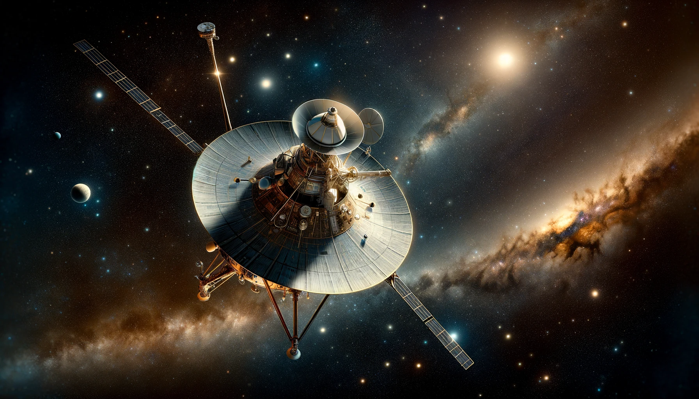
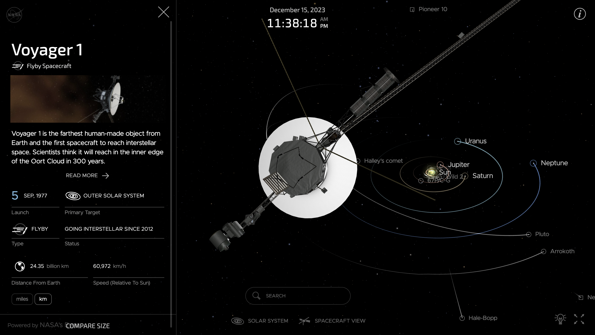
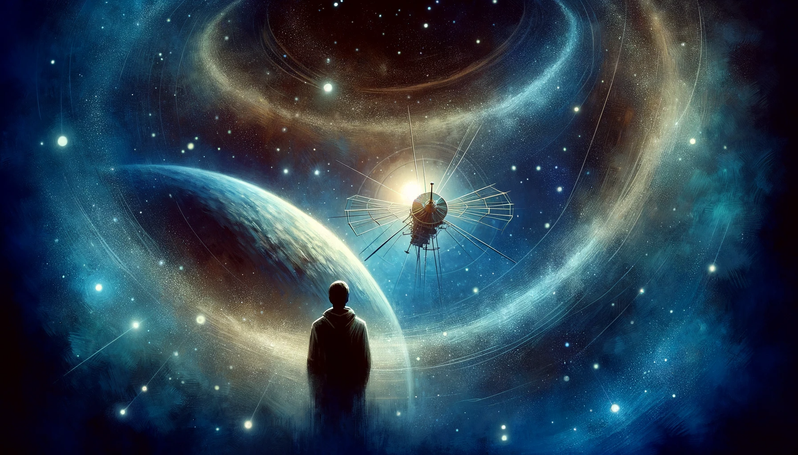

# 【随笔】旅行者一号

1977年9月5日，距离我周岁生日还有两个多月，人类最伟大的航天器之一——旅行者一号被泰坦三号E运载火箭送上了太空。凭借着176年才有一次的机会，旅行者一号依次借助了土星、木星的引力弓效应，顺利加速超过了第三宇宙速度，成为飞得最快的人造航天器（早两个月发射的旅行者2号也没有她快），向着太空的深处飞去！

那真是人类航天的黄金时代，整个小学、初中，我都会在各种科学杂志上看到旅行者1号和旅行者2号的各种消息。那载着全人类问候和《高山流水》的金属唱片，那近距离拍摄的木星、土星和她们各色卫星的照片，至今回想起来，依然让我心潮澎湃。

想到这里，不禁钦佩起桂海潮来，听说他也是从小就有着太空梦，只不过他坚定地，一步一步地走了下去，终于实现了自己的梦想。而我呢，关于太空的一切，依旧只是儿时的「梦想」罢了！

, lost in thought as he reminisces about h.png)

前两天看到新闻，旅行者一号的通讯设备又一次发生了故障，只送回来一段无意义的0与1。我上网一看，原来她已经在距离我们240多亿公里之外了。NASA的网站上，有这么一个[实时查看她飞行位置的网页](https://eyes.nasa.gov/apps/orrery/#/sc_voyager_1?time=2023-12-15T16:37:02.830+00:00)，用3D生成的，只见她一面以每秒16.94公里的速度向着太空深处极速飞去，一面努力地将天线对准地球的方向，试图继续和人类保持联系。

然而，不管这次能不能修好通讯设备，她所携带的核电池，也终将在2025年左右完全耗尽所有能量，全部的仪器设备都不得不关闭。她将再也接受不到来自地球的指令，也不可能再主动送回来任何信息了。

或许，到了那一天，才是旅行者的旅行，真正开始的日子吧！

祝福她，祝福人类，也祝福我自己！

