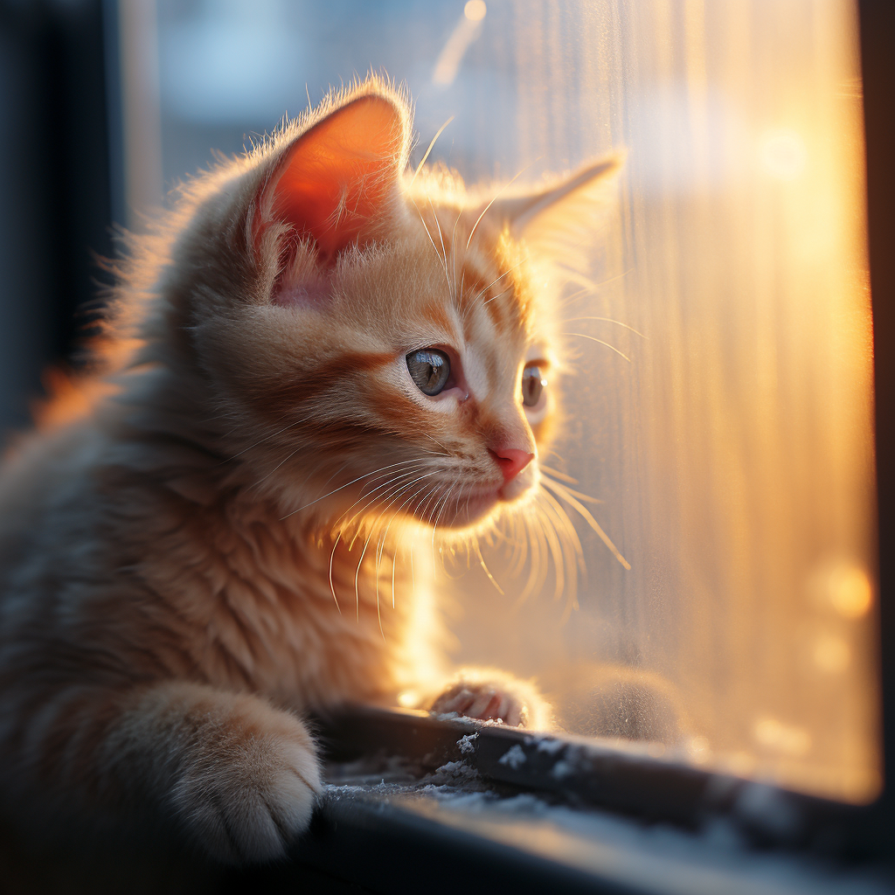

# 【随笔】生命的脆弱

前几天深圳降温，有一天早上，大宝忽然给我微信留了一条消息：

> 小橘冻死了！

我有些震惊，没想到在温暖的南方，室内，竟然还会冻死小猫。大宝也没有想到，她很难过。但是她说，她希望我不要比她还难过：

> 不然我都不敢跟你说，你本来就感情丰富的人。

原本以为，这只被大宝和大鱼救回来的流浪小猫已经被救活了。虽然当时送去医院时，医生说很不乐观，说小猫咪太虚弱，还有很多病，估计活不了。但挺过第一天之后，眼看着它精神一点一点好起来，偶尔还能和Cup还有孩子们玩一会儿。虽然不怎么吃猫粮，吃猫罐头也会拉肚子。它还特别粘人，那几天每次和大宝视频，我都能听见它在一边喵喵叫。我们还以为它就此可以一点点恢复过来，重新健康地长大。我们甚至还想着，将来要给它做个节育手术，让它一直陪着我们，陪着Cup呢。结果……

那天大宝说：

> 今天家里没有小橘猫一直喵喵叫，怪不习惯的。
>
> 只好赶紧把它的窝，还有为它准备的各种东西扔掉，免得看到了想起它，怪伤感的。

想到之前拯救的那只小鸟，也是在刚刚恢复学飞能力的第一天，在阳台玻璃门门把自己撞死。我们本想拯救的这两只小小生命，终将没能顺利活到长大，就不禁和大宝一起感慨：

**生命实在是太脆弱了！**

老婆把小橘猫的尸体也埋在了那株火龙果树下，和小鸟埋在一起。于是，关于这两段小生命的救助之旅，终究归于同一处。也不知道，因为我们的介入，给它们生命所增加的这几天时光，是否如我们最初想象的那样，是给它们真正的帮助呢？

《庄子•齐物论》中说：

> **方生方死，方死方生**

生命或许正因为这脆弱，而成其为伟大吧。没有生的脆弱艰难，就没有生的精彩灿烂。因为每一个生命都如此脆弱，所以每一个生命都是值得庆祝的奇迹，每个生命活着的每一秒，都是值得庆祝的节日。

死亡想必也一样，那毕竟是另一段生命历程的开始啊！

