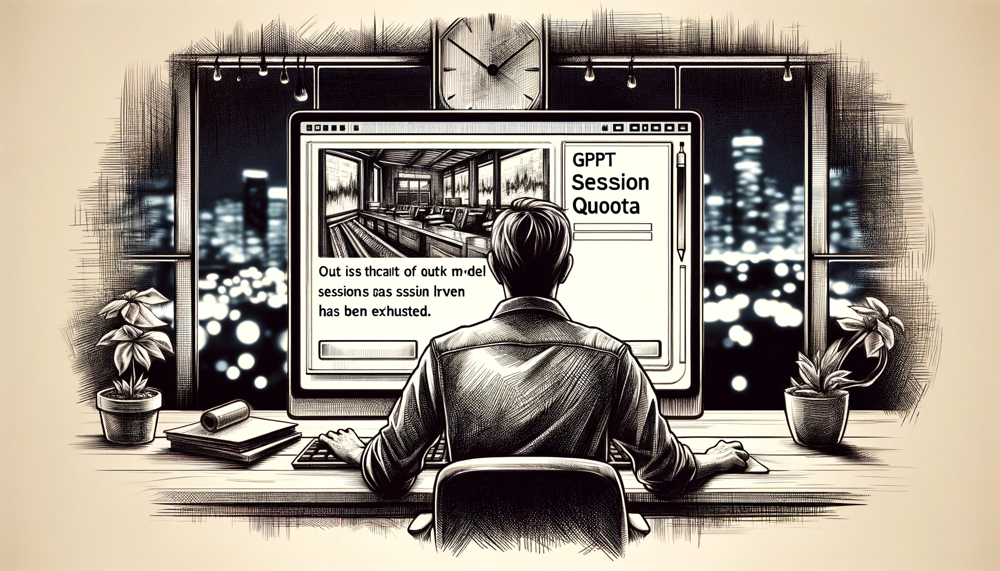
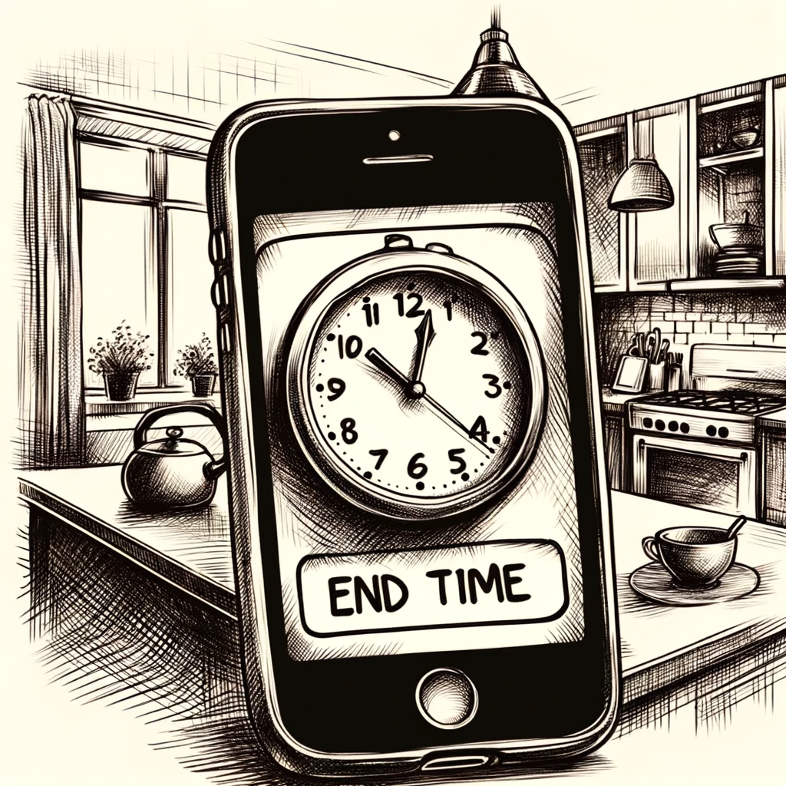
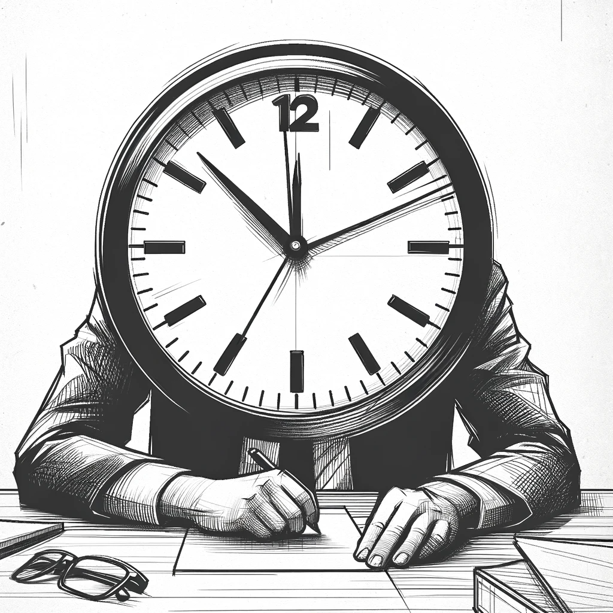
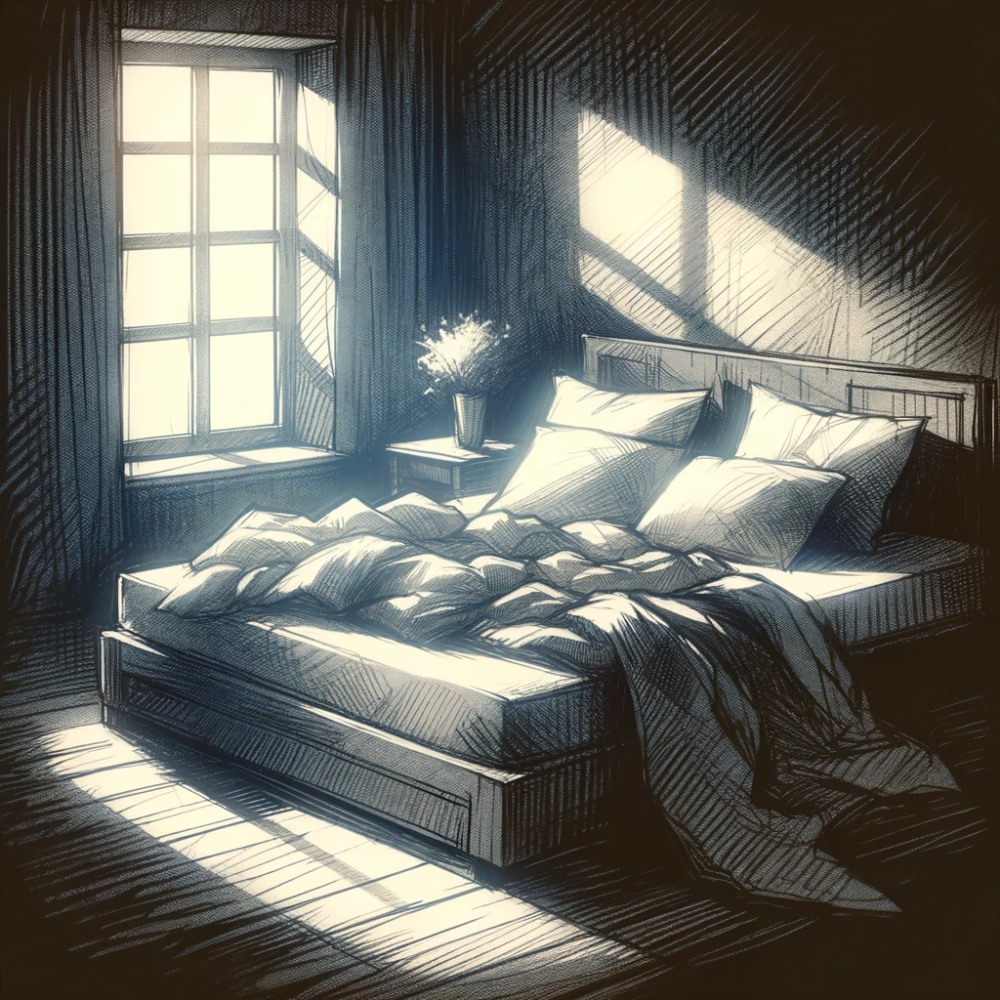
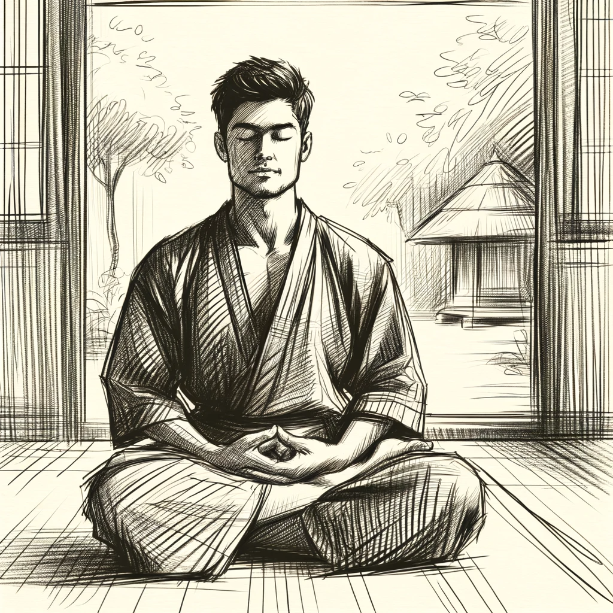
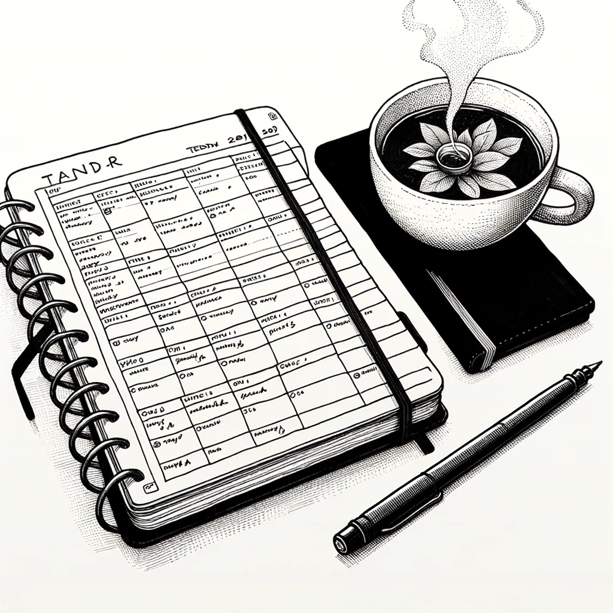

# 【生命⋅修行】再谈谈知止

想起这个话题，是因为昨天手头一件工作。原以为专注两个小时左右，怎么也可以做完。但是，一下午过去了，晚上吃完饭继续，还没结果，却眨眼间又到了睡觉的时间。

我正犹豫着要不要继续呢，一直在辅助我的GPT却忽然蹦出了这样一句提示：

> **您的GPT4模型会话额度已用完，请在22:30之后再继续开始对话**

我一愣，索性合上电脑，干脆停止了今天的工作。我和大宝说：

> 看来，不管什么事情，还是得设好截止时间才行。不然，像我这样的人，总会忍不住无休无止地，一直投入时间精力进去。

大宝点点头，说：

> 是啊，你看我带孩子们在外面玩时，那是好玩啊。但必须得在几点几分就停下来，开始准备回家，才能赶得急后续一系列的吃饭、睡觉，等等事情。
>
> 要不然，一直玩下去。过一会儿孩子饿了，就没有饭吃。然后还没吃饭，就困了，睡不了觉小家伙们就会闹……后面所有的事情都会跟着被影响，会乱套。

我叹口气说：

> 所以，在「知止」这点上，你做得比我要好得多！

这几天，因为大宝，我也再次开始早上起床之后先静坐二十多分钟。起床的闹钟和静坐结束的闹钟都是大宝设的，我只是跟着她起床，跟着她开始静坐，跟着她结束静坐而已。

冬天凌晨的被窝，实在是温暖宜人，让人舍不得离开。「再睡一会儿」vs. 「起床静坐」的念头在脑子里打着架，终究因为大宝已经起身出了卧室，于是，天平的一端增加了一枚重重的砝码。我也得以摆脱温暖被窝的「束缚」，迎接冬天清晨泠冽的冷空气。

专注在身体感受之后，越来越舒适的安宁，也让人不想停止。明明已经听到大宝已经开始搓着手结束静坐，「再坐一会儿，或许能感受更深的定境」，这个念头还依然在脑海里盘桓了至少两分钟。然后我才恋恋不舍地睁开眼睛。

其实这么一想，「止」与「行」根本就是一体两面的一件事儿。

前事若不止，后事如何得以实行呢？

从《大学》里那句：

 **知止而后有定，定而后能静，静而后能安，安而后能虑，虑而后能得 ** 

看起来，**止**是**得**的前提。然而，我此时却觉得

> 知止方能止，能止方能行，能行方能有所得。

还是需要先真正地了解自己，了解环境，了解当下时空这一瞬的枢纽关键，才能知道要止什么，要行什么罢。

当然，像我这样的人，觉察功夫练到位之前，排好紧密、科学的时间表，或许还是大有裨益的。

