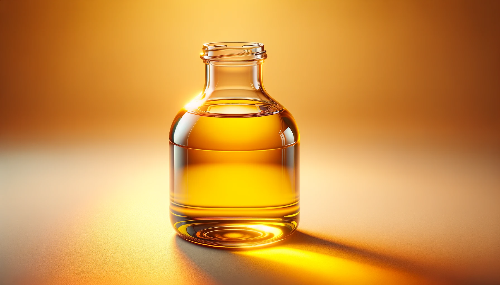
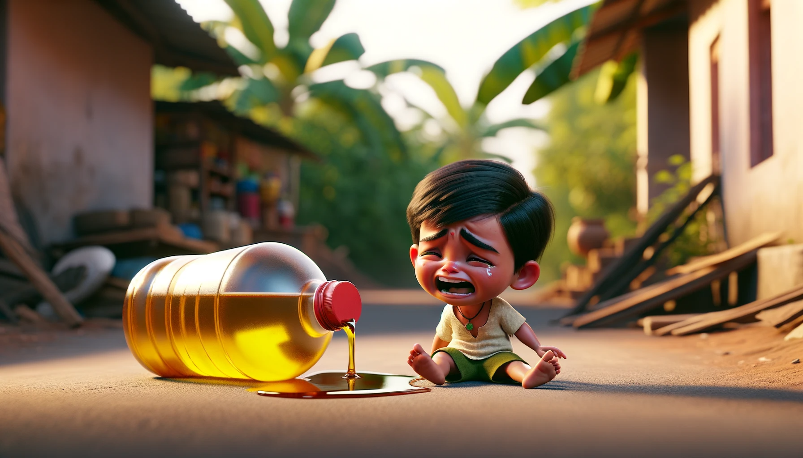
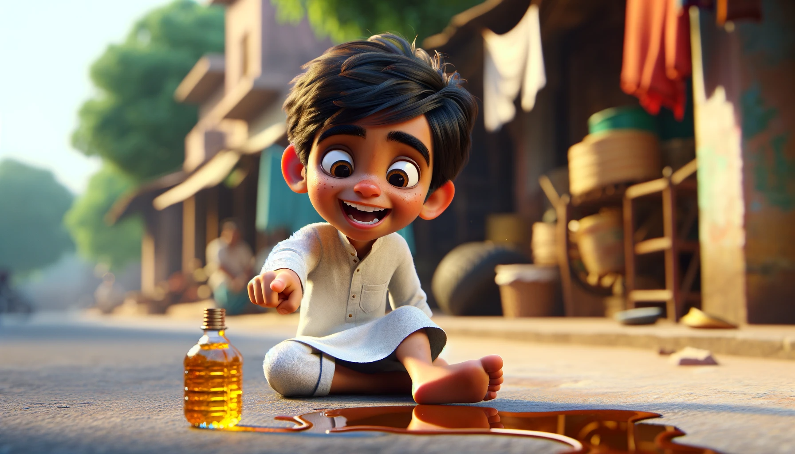
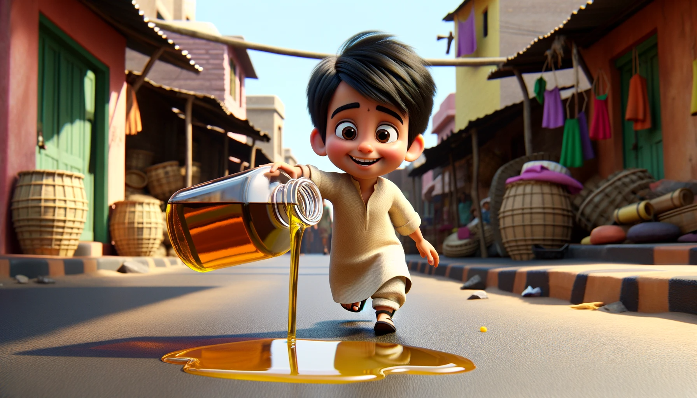
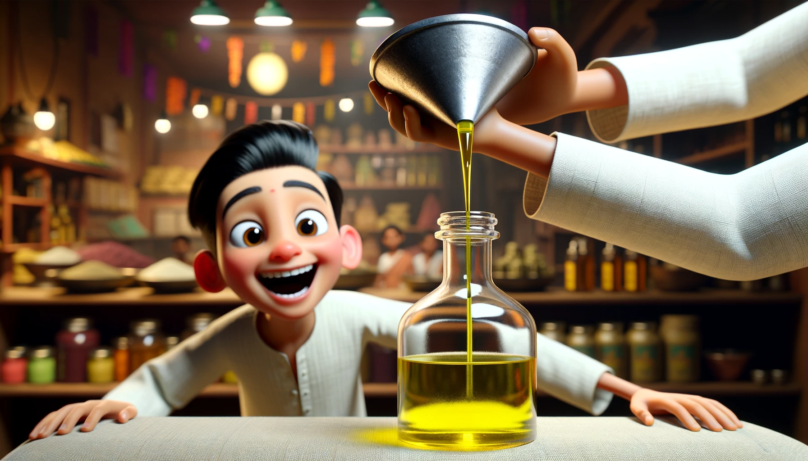
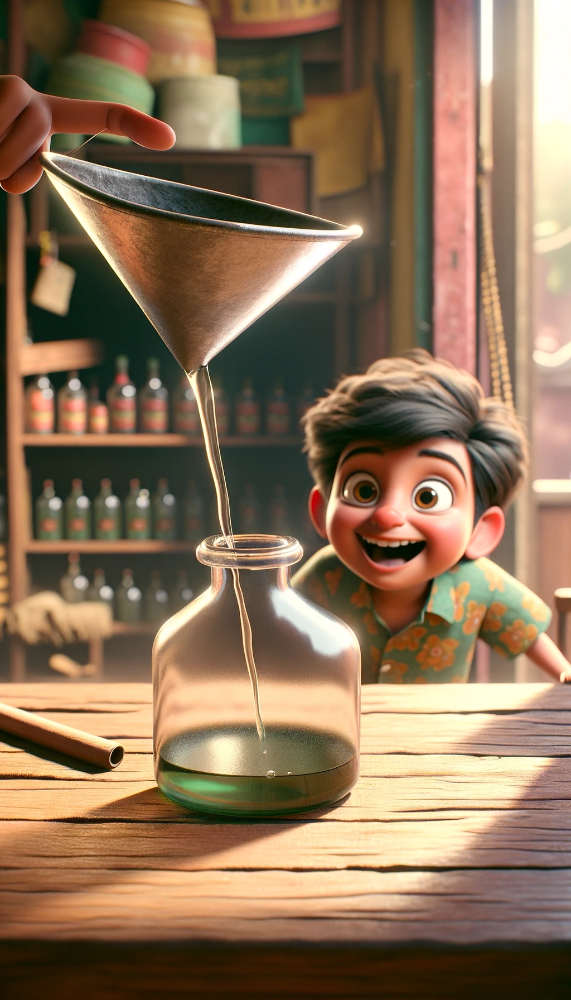
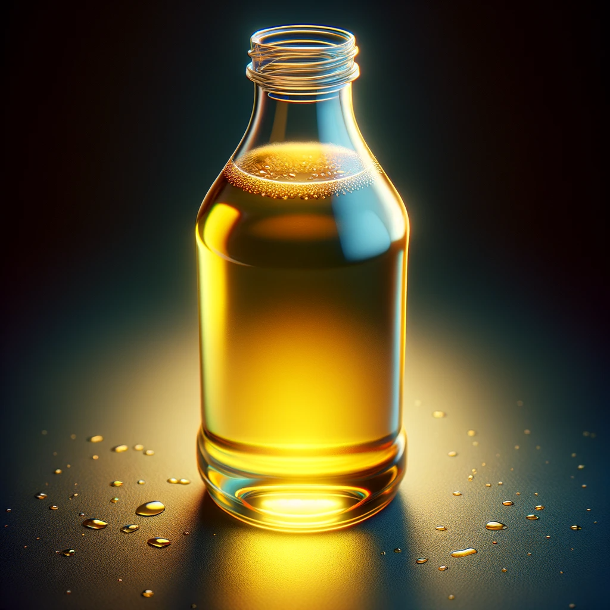
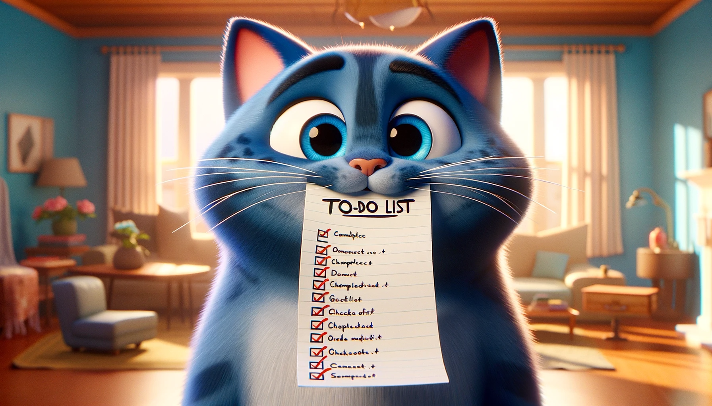

# 【生命⋅修行】如实观照

在十日内观课程上，葛印卡先生曾经讲过这样一个来自他家乡——印度的故事：

> 　　　　一个妈妈叫小儿子到附近的杂货店去买些油回来，她给他一个空瓶子及十块钱的卢比。小男孩去买了油，油瓶装满了，但在回家的路上他跌倒了，瓶子打翻了。漏出了半瓶油出来，小男孩捡起半空的油瓶跑回去哭着跟妈妈说：「妈妈，我打翻了半瓶油！我打翻了半瓶油！」很悲观、很悲观。
>
> 　　
>
> 　　　　母亲叫另外一个儿子带着十块钱卢比和一个空瓶子，也去买了油装满了瓶子，然后呢，他也跌倒了，漏掉了半瓶油。这个男孩捡起油瓶，高高兴兴地挂着笑容跑回去跟妈妈说：「妈啊，我保住了半瓶油！我保住了半瓶油！我摔了一跤，瓶子掉了下去，本来可能整瓶油都会漏掉的，你瞧！我保住了半瓶油。」在同样的情况下，两个男孩有不同的结论，一个看到瓶子是半满，另一个是半空。一个是为了空的一半而哭，十分的悲观；另一个为了满的一半而高兴，至少有一半是满的，他很高兴，很乐观。
>
> 　　
>
> 　　　　母亲又叫第三个儿子去买油，他也跌倒了，打翻了半瓶油。他捡起瓶子，和第二个男孩一样，回家时挂着笑容说：「我保住了一半！我保住了半瓶油！」不过，这男孩是学内观的，他不但乐观，还能看清楚事实：他说：「我失去了半瓶油，这是事实，我的油瓶有一半是空的。」他不但看清事实，还知道要精进，像在学内观一样。他下定决心说：「现在我得精进，我要出去努力工作，天黑前我要赚到五卢比，把油瓶重新装满。」
>
> 　　
>
> 　　

我为什么想起这个故事呢？依然是源于一次和大宝的聊天，那时候我问她：

> 我们要怎样才能快乐地渡过这一生？

她白我一眼：

> 为什么你总是问这么奇怪的问题？

我说：

> 那好吧，我们要怎样才能快乐地渡过这一天呢？

她说：

> 快乐？我现在就很快乐啊！有老公在我身边，有两个可爱的宝宝，饿了想吃什么就可以买，做好吃的很快乐，困了也有舒服的地方可以睡觉也很快乐，静坐很快乐，练太极也很快乐……

我说：

> 可是，不是会被没钱困扰吗？

她说：

> 那是啊，普通人当然会有烦恼和问题。没钱确实烦恼，但烦恼的问题并不影响那些快乐啊。那些快乐的事情，依然还是实实在在的快乐啊！虽然买不起80一斤的车厘子，但是8块钱一斤的冰糖橙还是可以买来解馋的呀？
>
> 反正，人嘛，肯定会有烦恼，但依旧有很多很多快乐啊！

显然，大宝就是那个能看到全部事实的「内观」的小孩，或者，至少是那个「乐观」的小孩。

而我呢，之所以总觉得「不乐」，还是因为自己只盯着那已经洒掉了的半瓶油——盯着那许多未完成的事项，未安排妥的任务，没做好的事情，没有学习的知识，没有去研究的机会，还有那些没睡够的觉，没打够的坐，没锻够的练……

所以不快乐，只因为自己总盯着自己没有的那些，却忽略了当下已经拥有的这一切是多么的宝贵，也忽略了为了走到当下这一步，自己已经付出的努力，那些读完过的书，那些做成过的事，那些走过的路，那些见过的人……

我翻出了苹果手机Notes里那几个标题为「千省吾身」的备忘记录，心想：

> 不如再重新开启这个「成就」记录吧，把自己的注意力与视角从洒掉了的半瓶油，转移到那被拯救下来的半瓶油上好了！

