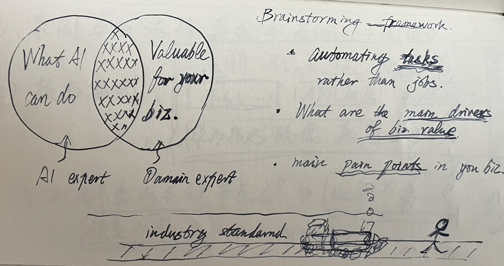
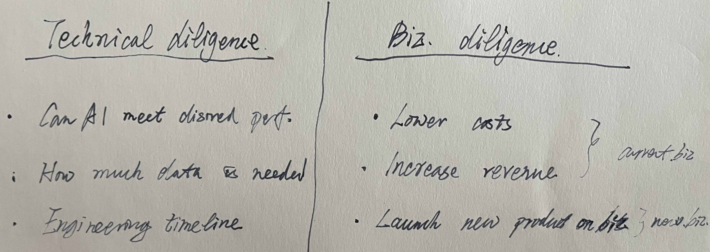

# 【随笔】怎么选择一个AI项目

前几天和两个好朋友、好兄弟聊天，聊到怎么部署Langchain系统，聊到需要在他当前面对的实际业务中把AI先用起来。我忽然觉得自己在这方面太落后了，一直没有「实际」地开始一个属于自己的「AI」项目。

正好又看到冯唐的一篇文章[《布局人生，最好把自己当公司》](https://mp.weixin.qq.com/s/RFBvCS_Xh989eQAONj0QuQ)，重温了把自己当公司这种规划人生如同做公司战略规划的理论。冯三点老师依旧讲了三点（先跑一下题，做一下记录）：

1. 正确认识自己（不能基于虚幻，要基于事实，行胜于言，业绩多于理论，实践重于理论）
2. 想清楚要做什么（目标，打法，原因，时机，投入以及预期的收入和风险）
3. 凭什么是你来做（要做的事情与能力资源要匹配）

关于第三点，冯老师说了两种情景（其实是同一现状的两个维度）：

> 我们面对的一般是两种情境，一种是如何利用现有资源做一件可成之事，完成短线目标。另外一种是设定目标后，如何利用目标驱动来寻找所需的人和资源，从而完成一个长线目标。
>
> 我们成事的最终目的是为了实现长线目标，但每一个阶段都必须实现一个短线目标，在每一个短线目标实现的过程中，人和物形成的资源自然会上升一个层次，最终日拱一卒，完成原来遥不可及的长线目标。

其实，每隔一段时间，我就会忍不住从「战略规划」的角度来审视自己、乃至家庭的重要选择。但是从最近几年的结果看，似乎不是太妙，尤其是在执行上。比如，当想到自己没有开始属于自己的「AI」项目时，我立刻想起了来**Andrew Ng**在AI for Everyone的课程中，讲过「How to choose an AI Project」。然而，当我再次拷问自己这个问题时，我却发现，自己不仅无法立即得出答案，甚至一点都不记得**Andrew Ng**在课程里讲过的选择框架究竟是什么。

于是乎，我打开CourseEra，才发现这个短短的总共应该不超过10个小时的课程，我竟然是从9月份开始的，然后至今没有学完。我自诩为擅长学习，但现实越来越打脸！也罢，先把**Andrew Ng**讲的怎么选择AI项目的关键点记录在这里，供自己取用吧：

1. 首先，要在What AI can do和Valuable for your biz. 中寻找交集，这需要AI专家和领域专家共同来进行头脑风暴。头脑风暴时注意三个要点：

   * 寻找可以自动化的任务而不是工作

   * 寻找商业价值中最主要的驱动力

   * 寻找业务中的主要痛点

2. 然后，在选择自建还是外购时依然可以遵循这个IT行业的简单原则：只要是有工业标准的，外购好过自建。Andrew还举了一个在不要在火车头前面奔跑的例子，说明这件事。

3. 接着，还要进行技术和商业的双重「尽职调察」
   * 技术方面
     1. AI能否满足期望的性能要求
     2. 需要多少数据
     3. 工程计划与时间表
   * 商业方案（前两者考虑当前业务，第三个则是考虑新产品/业务）
     1. 是降本
     2. 还是增效
     3. 要不要开发新产品或新业务

其实，说起来都是些Common Sense，但真实的世界里，也不过是要把这些Common Sense真正地落实到底罢了。

 and unchecked (pending) items, symbolizing t.png)