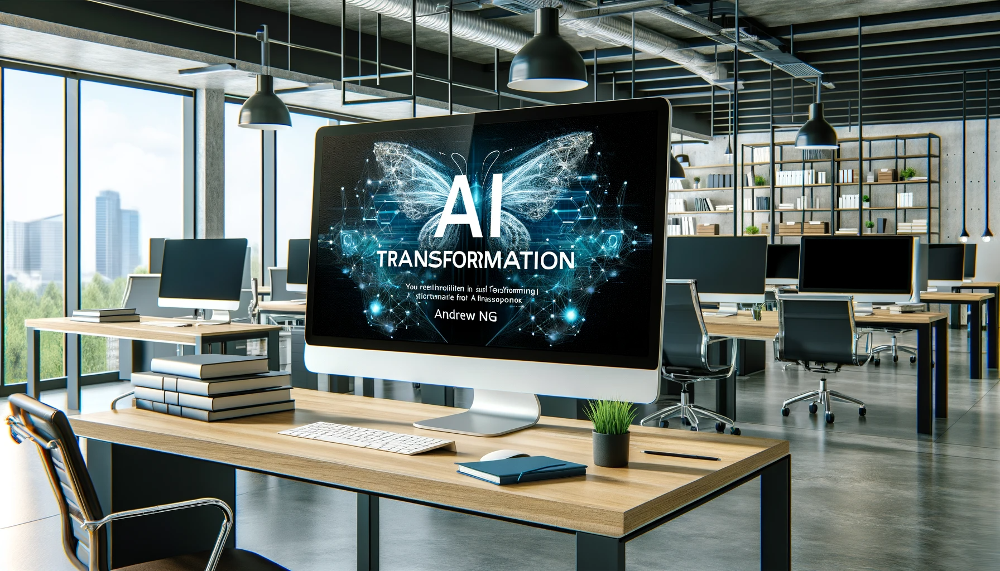
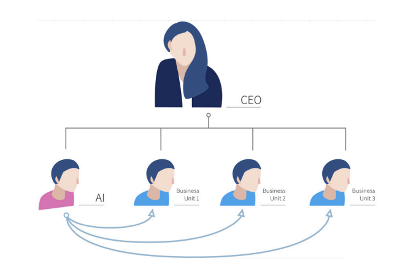
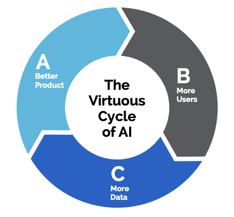

# 【教程】人工智能转型指南——吴恩达的课程笔记

Andrew在课程中用了两个10分钟介绍他的这篇《[AI Transformation Playbook](https://www.coursera.org/learn/ai-for-everyone/lecture/02931/ai-transformation-playbook-part-1)》，这篇指南的电子版，他也通过Landing AI发布在网上https://landing.ai/case-studies/ai-transformation-playbook/。

在这转型指南中，Andrew讲了下面5个核心步骤：

1. Execute pilot projects to gain momentum 执行试点项目以获得动力
2. Build an in-house AI team  组建内部AI 团队
3. Provide broad AI training 进行广泛的AI 培训
4. Develop an AI strategy 制定AI战略
5. Develop internal and external communications 建立内、外部的沟通

### **一、执行试点项目以获得动力**

试点项目的重点是项目要获得成功，这些项目需要有足够的意义，让公司以及公司内部的其他人对AI初步了解，并能说服公司内的更多人投资更多的AI项目。不能太小，小到别人觉得微不足道。重要的是用这些成功的试点项目把飞轮推动，转起来。

建议：

* 由新的AI团队或外部AI团队与内部业务团队合作，能过在6～12个月内展现成效的方式构建AI解决方案。
* 项目在技术上要可行。
* 要有明确、可衡量的目标，这个目标要能创作商业价值

如果依旧把一个人当作一个公司来看待，那么个人也同样需要找到合适规模的「试点项目」执行起来，想到这里，忍不住默默再次吐槽一下自己的「执行力」。当然，除非用GPT翻译、处理文档；以及拿DALL-E为文章配图如果也算的话，我自己这里的飞轮也算是转动起来了。

只不过，如果能开始一些更有价值的项目，就更好了。

### 二、**建立内部人工智能团队**

1. 从长远来看，建立内部人工智能团队更有效率，更有助于建立公司独有的竞争优势。
2. 建立独立的、向CEO汇报的人工智能团队，比各BU分别组建，更有助于构建起公司整体的人工智能能力。

站在「个人公司」的角度，这意味着，我需要有整块的时间、资源和精力投入在AI这些事情上。这是我迫切需要改进的地方。

### 三、进行广泛的培训

1. 对于CXO级别的高管，至少需要4个小时的培训（当然，用培训的小时来计算培训内容与范围其实是相当粗略和不准确的）。目标是使高管能够理解人工智能对企业的潜在作用，开始制定人工智能战略，做出适当的资源分配决策，并与支持有价值的人工智能项目的人工智能团队顺畅合作。培训内容包括：
   * 基本的人工智能业务理解，包括基本技术、数据以及人工智能可以干什么，不能干什么。
   * 理解人工智能对企业战略的影响。
   * 关于人工智能在相关行业或您特定行业的应用的案例研究。
2. 对于部门领导，至少需要12个小时的培训。目标是让部门领导者应能够为人工智能项目设定方向，分配资源，监测和跟踪进展，并在必要时进行修正，以确保成功交付项目。培训内容包括：
   * 基本的人工智能业务理解，包括基本技术、数据以及人工智能可以干什么，不能干什么。
   * 基本的人工智能技术理解，包括主要算法类别及其要求。
   * 对人工智能项目的工作流程和过程，人工智能团队中的角色和责任，以及人工智能团队的管理的基本理解。
3. 人工智能工程师，至少需要100小时的培训。目标是让新培训的人工智能工程师应能够收集数据、训练人工智能模型并交付具体的人工智能项目。
   * 对机器学习和深度学习的深入技术理解；对其他人工智能工具的基本理解。
   * 了解用于构建人工智能和数据系统的可用工具（开源和其他第三方工具）。
   * 能够实施人工智能团队的工作流和流程。
   * 此外需要持续教育，以跟上不断发展的人工智能技术。

Andrew说，培训材料网上已经非常丰富了，公司不需要自己开发。而站在「个人公司」的角度，这三个层面的培训显然都是需要的。其实，第三级、工程师层面的培训，完全可以随着自己选择的项目，按需、持续地进行下去。

### 四、制定人工智能战略

虽然，通常的理解是首先就需要制定战略。但Andrew的意见是，只有经历了前三步：有了成功的试点、有了团队、上上下下都接受了足够的培训，才有可能制定出真正适合企业的，能过落地的战略。

虽然，真正能落地的战略一定是独特的，但Andrew说，还是有一些基本的方法可供参考。那些基础的战略方法论，也同样可以和人工智能结合起来考虑。

比如，按照Michael Porter的模型，建立若个与广泛战略一致的，有难度的人工智能资产，以构筑竞争壁垒；

比如，在特定领域里利用AI建立优势，而不是与大公司在普遍领域中竞争；

比如，设计人工智能正反馈循环一致的战略（数据很重要，战略性的数据获取更重要）；

比如，在那些赢家通吃的领域，利用AI加速网络效应和平台优势的构建。

写到这里，我意识到，作为个人，我过去并没有战略性地考虑数据这个问题。看来，这是一直以来的思维盲点。虽然在为企业思考战略时，不太容易忽略这一点，但站在「个人公司」的角度，自己却几乎完全忘记了这回事儿。

其实即便是作为个人公司——战略性的数据获取，战略性地推动这个正循环同样是非常重要的事情。

### 五、**发展内部和外部沟通**

* 投资者关系
* 政府关系
* 客户/用户教育
* 人才/招聘
* 内部沟通

这方面，应该依然属于必须考虑的Common Sense。

### 最后、至关重要的经验

这条经验，Andrew在各种课程中常常强调，在这篇转型指南里，Andrew也特地放在最后强调了一次。

**在互联网时代，我们学到了以下教训：**

> Shopping Mall + Website ≠ internet company
>
> 购物广场 + 购物网站 ≠ 互联网公司

**那么同样的，在人工智能时代：**

> Any typical company + Deep Learning technology ≠ AI company
>
> 任何有代表性的公司 + 深度学习技术 ≠ 人工智能公司

----

Andrew说：

> 一个人工智能转型计划可能需要 2-3 年，但您应该在 6-12 个月内看到初步的具体结果。通过投资于人工智能转型，您将领先于竞争对手，并利用人工智能能力显着推进您的公司。

那么思考题来了：作为「个体公司」，要怎样转型，并在6-12个月内看到初步的具体结果呢？

