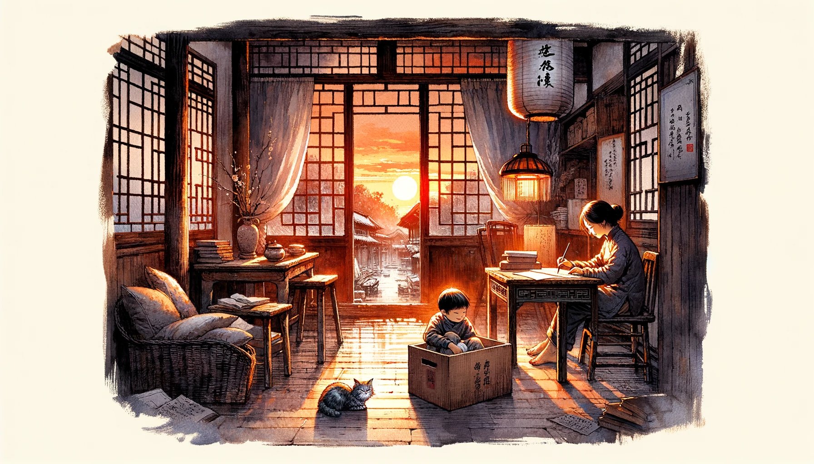
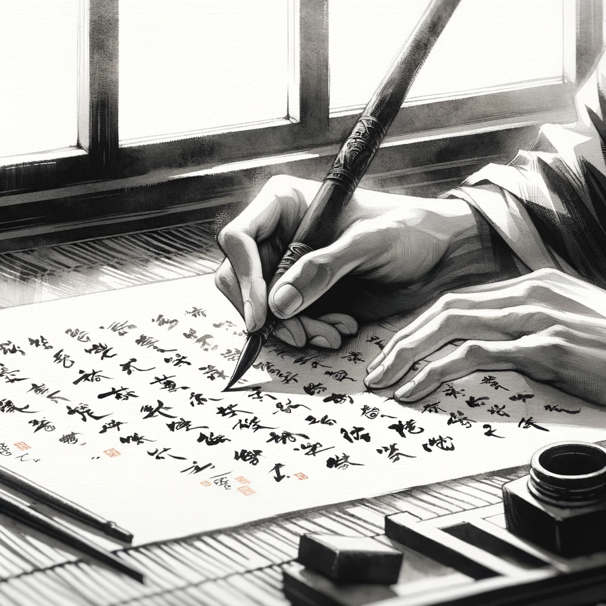

# 【随笔】从前车马慢

微信里出现越来越多的各类跨年演讲与年终总结，也算是新时代的一种年味与仪式吧。连着两天晚餐都在外面，和老同事、老同学聚会，聊些八卦、聊些过往，一地鸡毛的现在，以及不确定的将来。他们都说，如今这年岁，实在想躺平了，我却指着在我旁边拿着小汽车跑来跑去的大鱼自嘲：

> 看看这个小家伙，我还得努力支棱着！

小家伙们或许是昨天在外面玩累了，自从中午睡着，就一直呼呼呼地睡到现在太阳西斜。大宝让我找蔡姬否帮她把给好友DX的回信用古文翻译一遍，我想着她最近酷爱读梁启超先生的书与文章，便要求蔡姬否按着梁先生的文风来。写成后，诵读一遍，不免有些惊叹，这信写得真美、真好！大宝的这个朋友也是真有趣，在现如今这么一个浮躁，且不说读书写字，大部分人连刷手机都只愿看短视频的时代，她竟然兴致勃勃地用古文，先手写，再扫描，然后用电子邮件发过一封又一封的信来。

大宝认真地坐在桌前，用繁体字隽写着蔡姬否替她改写过的信件，Cup则瞅准机会跳进大鱼忘记收拾的行李箱里，踩出一片舒服的空间，然后安心地蜷起身子躺下，仔仔细细地梳理着自己的一身灰毛。

2023的最后一天，日子忽然慢了下来，静静地等待着新一年的到来。从前，日子的每一天，或本来都是这样慢悠悠的吧？

