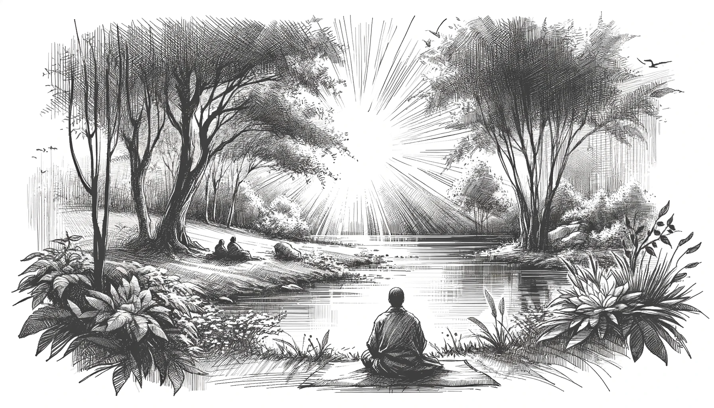
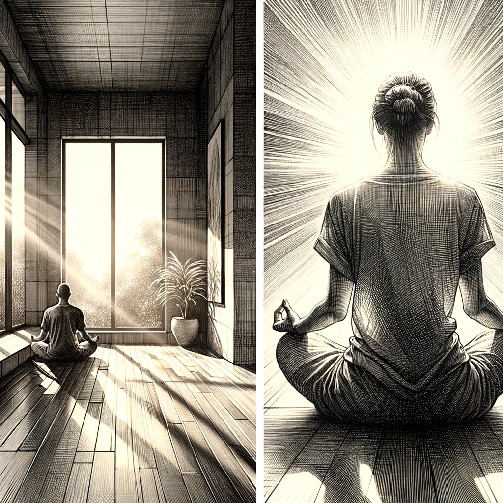
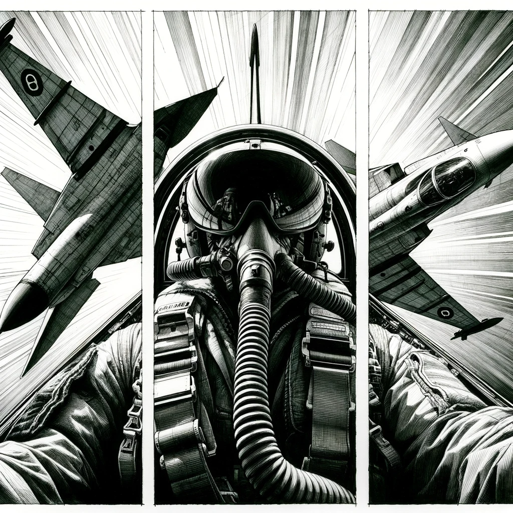
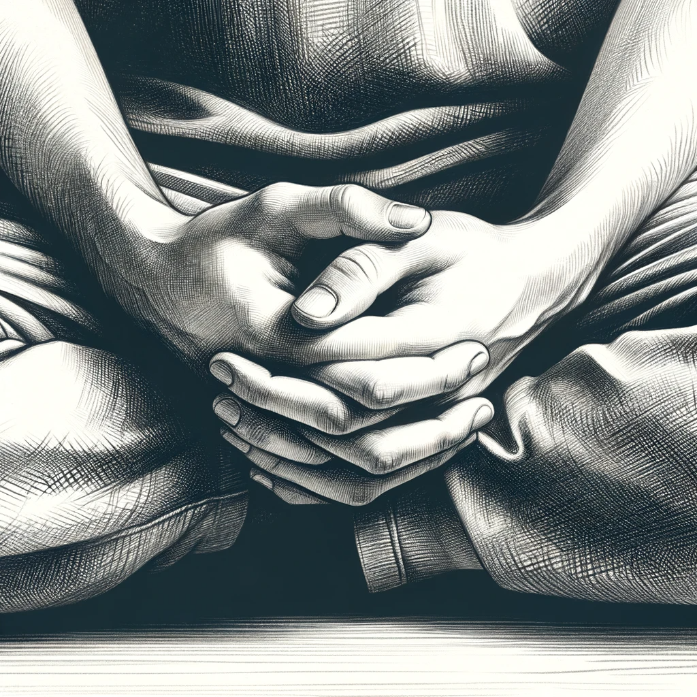

# 【生命⋅修行】再谈人生的意义

早几天就想写这个题目，没想到一眨眼间已经从2023年到了2024年。

那天是早起静坐了约莫半个小时之后，或许是刚刚经历了一系列从「走神」到「回神」的争斗吧，我忽然想到这样一个问题：

> 这样静坐的意义是什么呢？

显然不应该是追求某种「静定」的体验，这和「内观」的主旨可完全不一样。但是，如果不为了这一层，那么为什么要静坐呢？一个答案浮现出来：

> 静坐的意义，就是静静地坐着……

说实话，这个答案并不能完全让我信服。但是，我却由此推开去，想起那个自己一直常常会琢磨的问题：

> 人生的意义是什么？也就是「**活着**」罢了！
>
> 所谓意义，都是人为赋予的罢了。

等打开电脑，我在自己写过的文章目录中搜索了一下「意义」这个词，发现列出来滚动好几屏也翻不完的文章清单，可见自己一而再再而三地陷入在这个问题上绕圈，从开始写文章到现在5年多。而在我的记忆中，这个问题似乎从很久以前，就经常会来来回回地冒出来折磨自己。

不禁想起初中的班主任曾给过我们的告诫：

> 不要总是去思考人生意义这样的问题！

真是一语成谶啊！或许，正因为这个刚毕业的20多岁的大男孩的这句话，变成了始终萦绕我心头的「不要去想那头北极熊」问题了吧？

在这个意义问题上持续地纠结，让自己更容易陷入一种持续焦虑的循环。这有点类似于「死亡螺旋」吧？知乎上有一篇文章，说在航空中遇到死亡螺旋时，改出的办法其实也很简单，就是四步：

1. 收油门至慢车
2. 改平机翼（注意！！！ 按照姿态仪，通过副翼将机翼**改**水平，此处与失速**螺旋**的副翼回中有区别）
3. 缓慢将机头拉起至水平直飞的姿态
4. 恢复油门至正常空速

但实际上，最重要、最难的是，处在死亡螺旋中时，飞行员对于飞机姿态的「感知」通常已经失效了，甚至这错误的姿态感知和按照这错误判断所进行的操作，正是进入死亡螺旋的原因！

那么，如何退出心理上的焦虑循环呢？理论上的方法也很简单，就是两个字——「行动」！

所以，一切阻止自己行动的，都是错觉吧？

甚至，觉得自己没有在行动的那种感觉，其实也是错觉吧？

