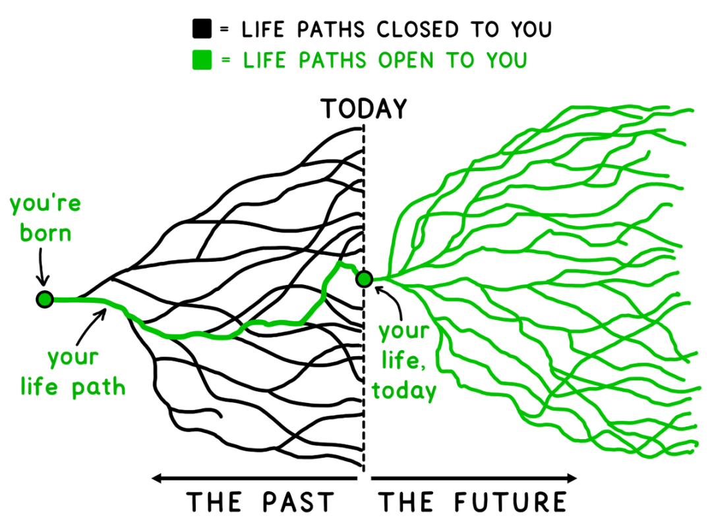

# 【生命⋅修行】青龙守库

昨天的一些虚无与挫败感，在睡了一觉之后烟消云散，哪怕这一晚，自己并没有睡够7、8个小时。我不禁再次想起葛印卡讲过的一个故事——那是两枚戒指的故事，哥哥拿走了那枚昂贵的钻戒，弟弟则拿走了那枚刻着字的银戒指。戒指上刻着：

> **这也将会改变。**

是的，这咒语一样的句子描述着这世界永恒的现实。一旦忘记了这现实，往往会被那波涛汹涌的虚拟无边「苦海」吞噬而沉沦。

在通勤的地铁上，用了近半个小时记录昨晚以及今天早上短短的一两个小时所做过的事情，以及一些值得感恩的小事。我给这两个备忘录所取的名字，一个是「千省吾身 」，一个是「Ten Thousands Appreciations」。虽然这两个记录活动已经暂停了半年多，但没想到之前竟然也已经积累了那么多——第一个备忘已经启用到3#（意味着已经进入第三千条反省记录），而第二个备忘中也已经记录了近700条感恩记录。这还只是记录过的生命片段，那些没做记录的生命片段其实也一样，如大江大河一般，从未停止过滚滚向前。

早上翻看了两篇文章，一是顺着和菜头的《青龙守库》翻到的一篇旧文，讲他为了选一幅合适的配图，背后所沉淀的那大几十张不那么好，甚至无奈的配图与他努力的过程。另一篇是老喻的《人生不是轨道，而是旷野》。一个讲过往与现在，一个讲现在与将来；一个诠释着，每一个看似辉煌的顶点，背后都有无数不尽人意低谷的现实；另一个则揭示着，**凡是过往，皆为序章**的含义。

过去的已经过去，现在的仍将过去。但此时此刻这个时空交汇的点，却蕴含着生命的全部奥义！

于是，我决定也用《青龙守库》来做今天文章的标题，过去所发生的一切，到此时此刻之前的所有一切，都是我已经积攒下的财富。且让这青龙守住我这宝库，然后我将轻装前行，去探索那前方无尽的旷野。

