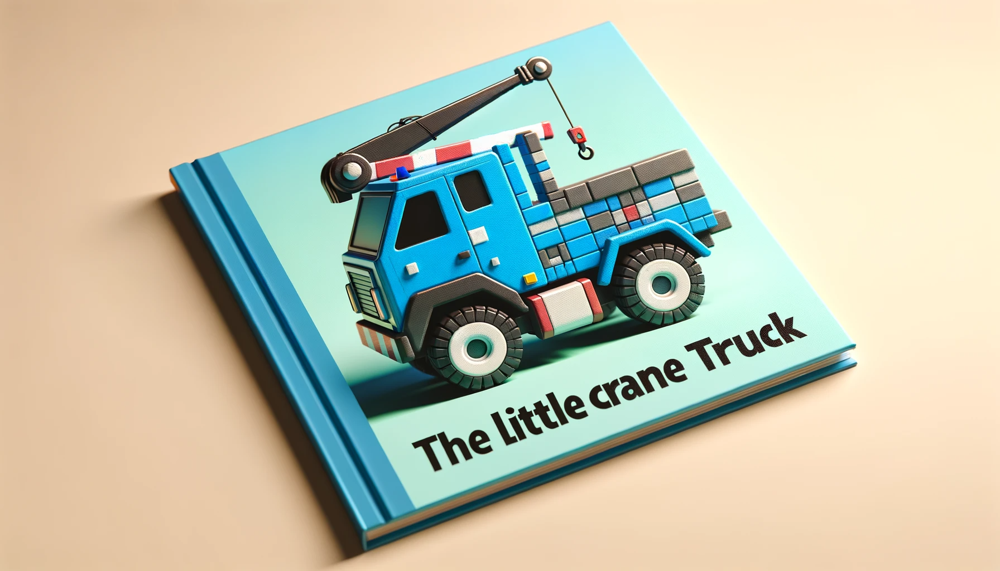
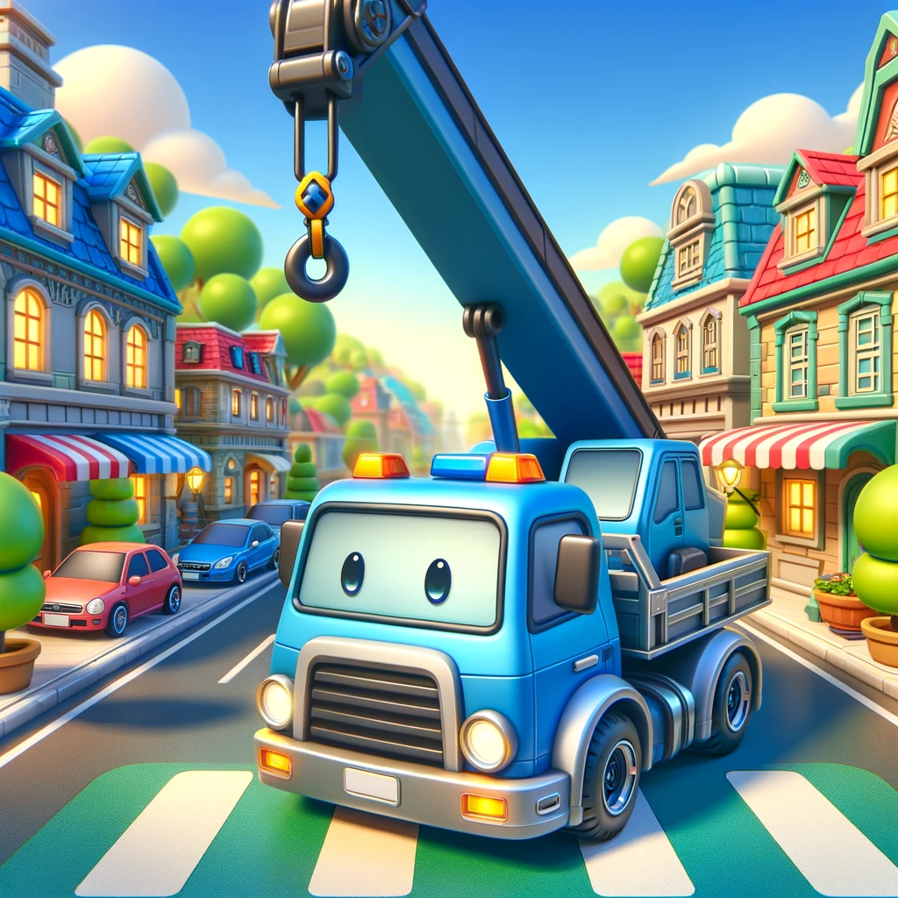
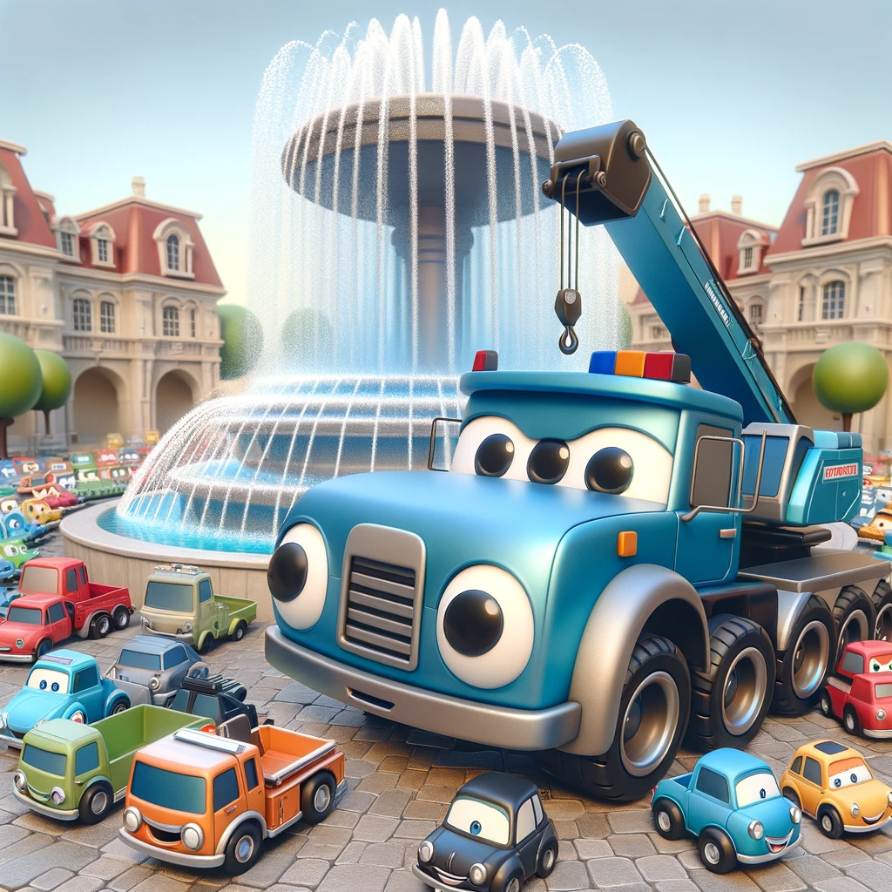
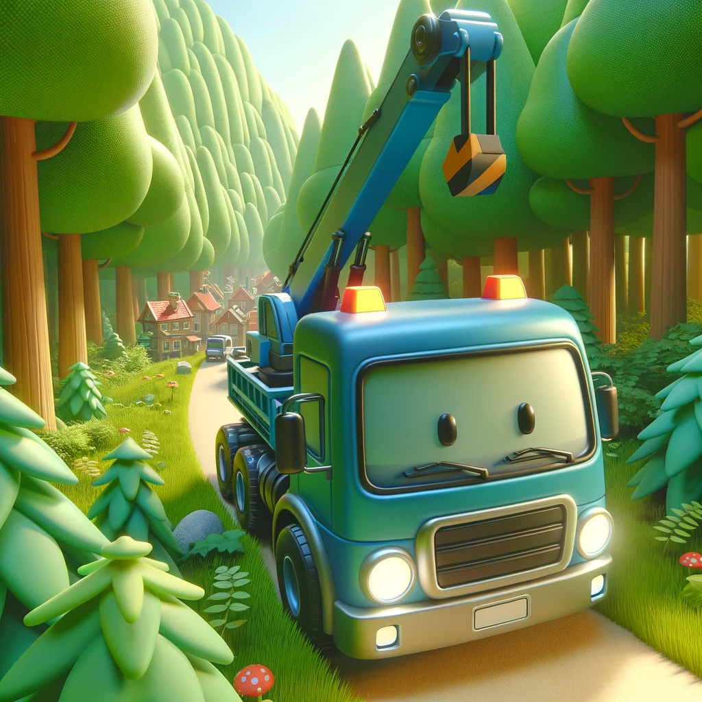
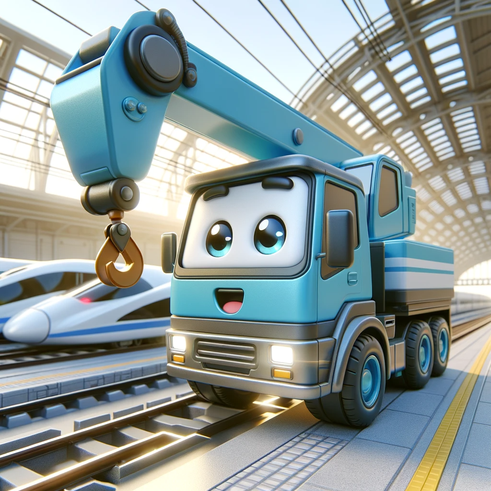
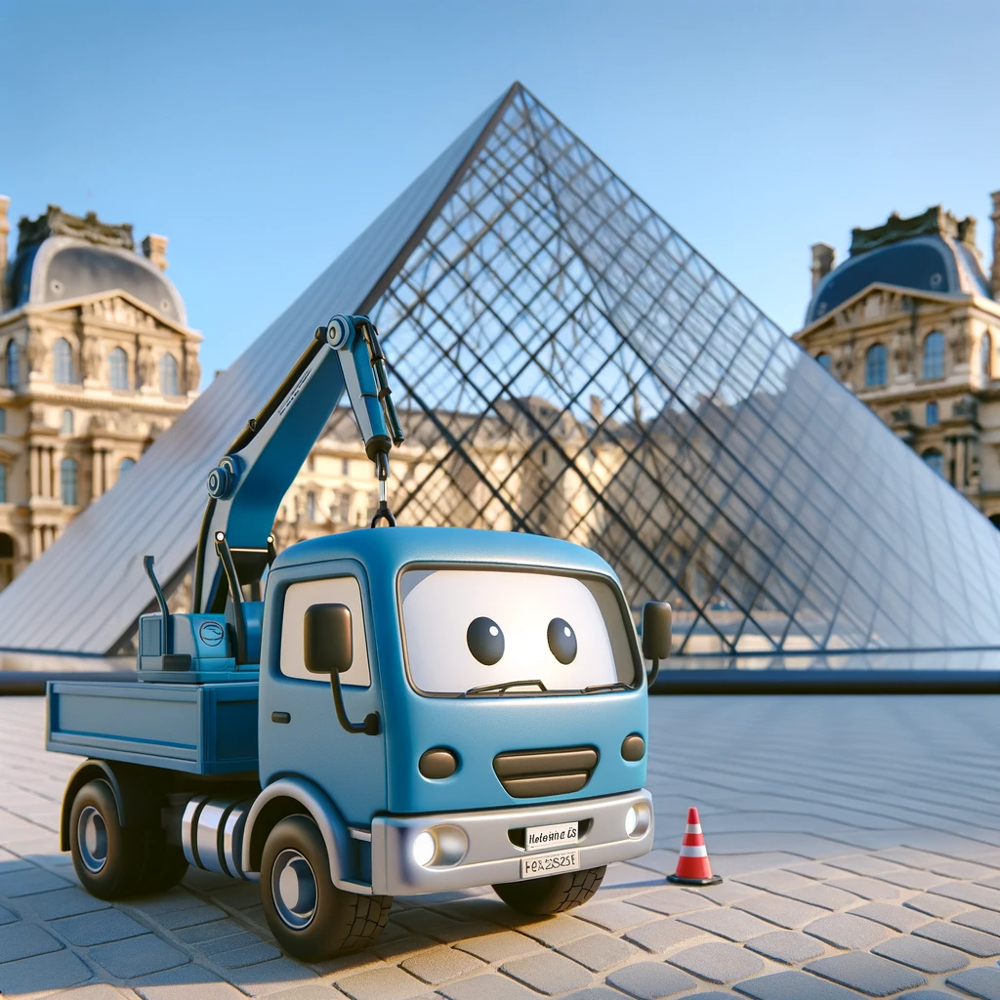
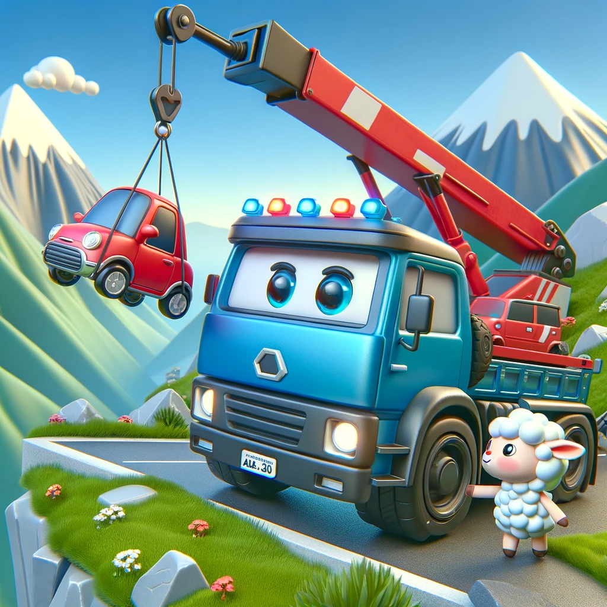
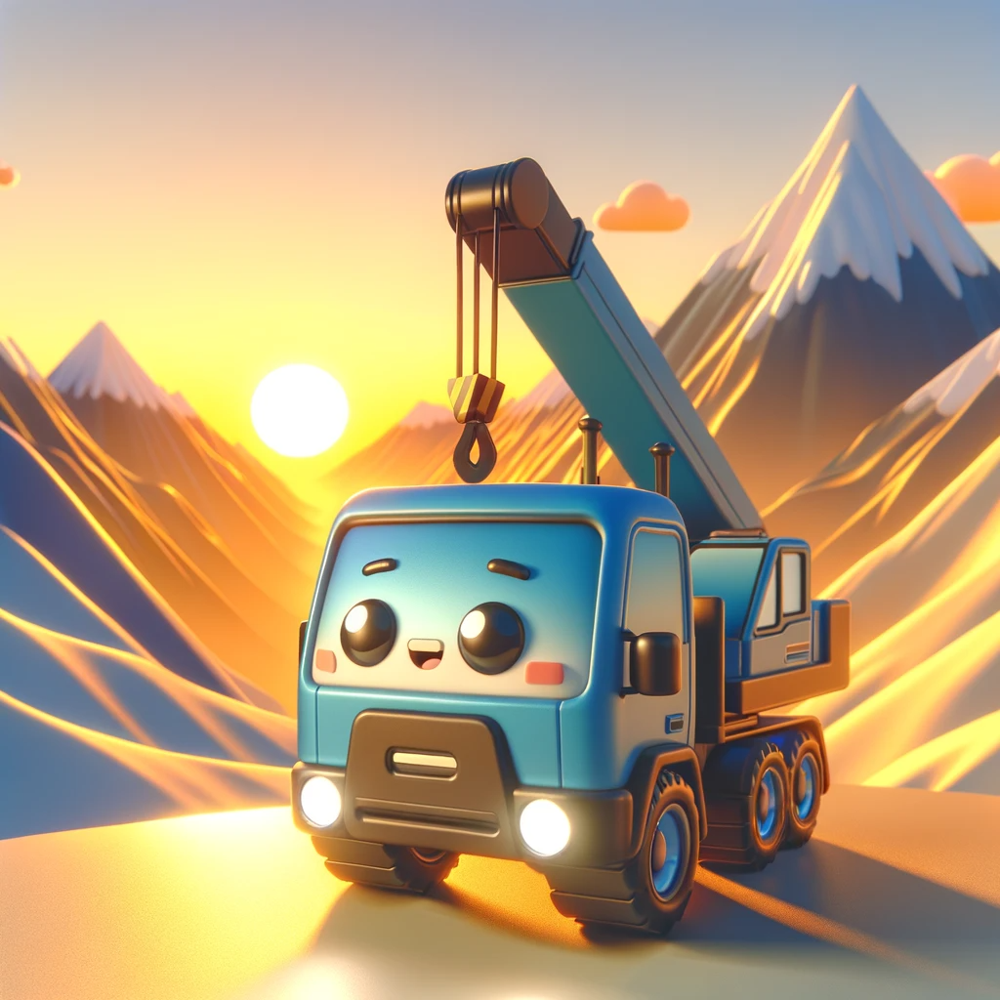
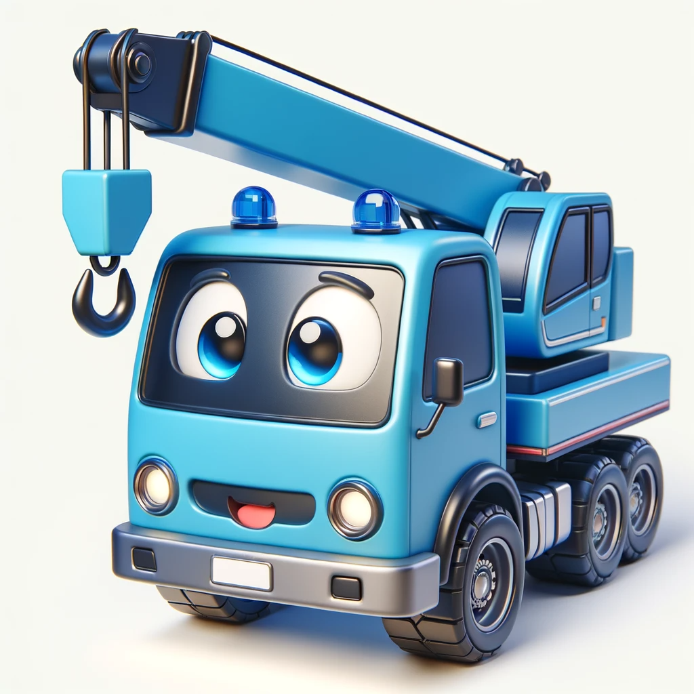

# 【随笔】蓝色小吊车的故事

这是用蔡姬否为大鱼创作的蓝色小吊车的故事书。

在一个迷人的汽车镇里，住着一辆非常特别的小蓝吊车。这辆名叫小吊的吊车，每天都在这个充满活力和色彩的小镇上快乐地生活着。他有一个很大的心愿，那就是帮助小镇变得更加美丽。

一天，小吊在路上快乐地飞奔，他要去市中心广场参与一个重要的工程。

他吊起了一块巨大的建筑用石块，

然后又吊起了一个更巨大的圆形石柱。

在他的帮助下，市中心广场很快建起了一个壮观的喷泉。他和其他小汽车一起，快乐地在旁边欣赏这个新建的喷泉，喷泉在阳光下闪闪发光，小镇的居民都聚集来欣赏。

冒险心很强的小吊，还去了郊外的森林探险，他喜欢在大自然中探索和游玩。

他还兴奋地去高铁站玩耍，看着快速行驶的高铁，他的眼睛里充满了好奇和兴奋。

小吊还去了著名的卢浮宫玻璃金字塔参观，他对那辉煌的建筑感到敬畏。

最勇敢的一天，他在山上救了一辆悬挂在悬崖边的红色小汽车。一只小羊在旁边观看，给他加油。

在夕阳的余晖下，他从山上下来，雪山在夕阳的照射下金光闪闪，他感到非常开心和满足。这一切努力和冒险，使得小镇的每一个角落都充满了故事和欢笑。

小吊的故事不仅仅是关于他的勇气和乐观，还关于友谊、勇气和小镇社区的力量。无论是在工作中，还是在休闲时光，他都以自己的方式，让小镇变得更加美丽。

这就是小吊，小镇上最勤劳、最快乐的小蓝吊车。

