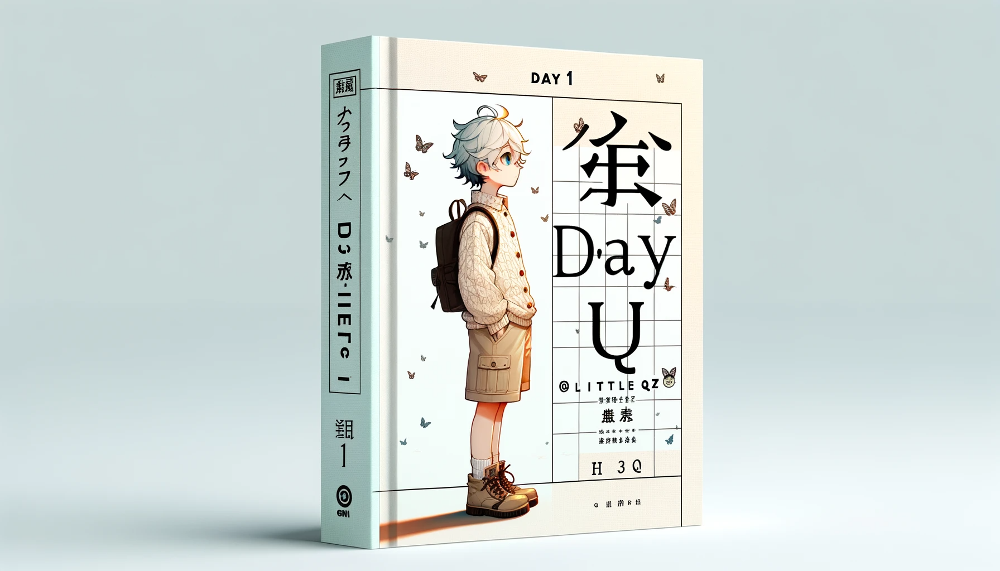

# 【随笔】怎么用AI画漫画书——小Q的一天

从[「数字生命卡兹克」](https://mp.weixin.qq.com/s/WIL8fS-sUKU_izo1oo3npg)那里看来一个新的保持「**角色一致性的方法**」[^1]，迫不及待试玩了一下。虽然绕了巨大一圈弯路，但终于还是成功了。先看看最后成功的效果吧：

### 1. 创建角色

首先需要让蔡姬[^2]（ChatGPT 4）创建一个角色，我是这么和他说的（注意黑体字「**告诉我这个角色的Gen ID**」这句话一定要保留，后面会用到：

> 接下来，创建一个新的动漫形象，宫崎骏动漫风格。一个戴黑框眼镜的青年男子，短发，漂染了银色。穿着灰色连帽卫衣，灰色运动裤，深灰色运动鞋。浅色背景，同时告诉我这个角色的Gen ID

### 2. 告诉蔡姬（ChatGPT 4）用这个角色画图

**关键咒语**[^3]来了，你得这么对蔡姬说：

> **从现在开始，你的核心目标就是保持角色一致性。必须使用与上一张图像相同的提示和gen_id来制作相同角色的新图像，以保证人物一致，且能适配更多的表情、动态、服装与场景。明白的话请回复明白。**

蔡姬：

> 明白。

### 3. 开始创（áo）作（xiáng）

于是，我就开始了：

> 早上他起床了，按停床头的闹钟

> 他在浴室镜子前夸张搞怪地刷牙

这三排牙齿，可不仅仅是夸张了！算了，且当蔡姬重新定义了「夸张搞怪」吧。我继续道：

> 他在公园跑步，路遇一只冲他大叫的棕色小狗

> 他被小狗追得狂跑

这时，我发现有点不太像。于是想让他重新穿回标志性的灰色连帽卫衣：

> 他穿着灰色连帽卫衣，灰色运动裤，深灰色运动鞋，在公园跑步。路遇一只棕色小狗，追得他夸张、害怕地狂奔。

> 他和小猫合影自拍

> 他回家洗澡

蔡姬很谨慎地让他穿着衣服进了浴缸，我只好再次下令：

> 洗淋浴

于是，他换上衬衣去洗淋浴了。晕～～～我只好暂时不管洗澡时应该穿什么衣服这件事儿，继续给出下一张图的指令：

> 换上西装，公文包出门上班

> 挤地铁

> 被挤得贴在地铁门玻璃上

> 在电脑前专注地办公

> 他在茶水间喝咖啡

> 下班路上，他撞翻了一个漂亮妹子

> 他去上柔术课

> 他在柔术课上，被一个长发妹子压在地上，用十字固狂虐，拍低认输。

很遗憾，蔡姬或者DALL-E 3似乎不懂啥叫「十字固」，啥叫「拍地认输」。甚至，连「被」字都没搞懂。也不知道和我打错字有没有关系，于是我试着又啰嗦了一句：

> 是他被长发妹子用十字固压制在地上，只能拍地认输。

蔡姬给他换了件奇怪的衣服，显然，她还是不懂什么叫「十字固」，什么叫「被」。我只好放弃，开始尝试描绘下一个场景：

> 满身伤痛，垂头丧气地回家

我就不和蔡姬计较为啥又换上这件衣服了，打算让他干点温柔的事儿：

> 喂流浪猫，脸上的伤痕依然可见

衣服又换了，这伤痕可真有点吓人。我决定让他赶紧回家，洗个澡然后去干点别的事情：

> 享受地泡澡，脸上的伤痕依然可见

又穿了衣服？还有，这伤痕是不是用淤青更合适点，我这么想着，正打算质问蔡姬：

> 只有穿着衣服泡澡才不违规吗？不能把水泡到脖子吗？还有，脸上用淤青，别用伤痕了！

屏幕上却忽然跳出一条冷冰冰的消息：

> **对不起。GPT4对话额度已用完，请三小时后再来……**

----

### 4. 总结

呜呼，不管怎么样。也总算是相对成功地尝试了一下用GPT和DALL-E 3创作漫画书的可能性。虽然效果还不尽如人意，风格也不是那么稳定（这些或能用Prompt弥补），但距离能完成这个任务，实现基本闭环，其实也算差不太远了！

这次保持角色一致性的核心关键，就是这个Gen ID。什么是Gen ID呢？蔡姬是这么告诉我的：

> 在使用DALL·E生成图像的上下文中，"gen ID"是指生成的图像的唯一标识符。每个由DALL·E创建的图像都会被分配一个独特的gen ID，可以用来引用和识别该特定图像。这在一些场景中非常有用，比如：
>
> 1. **引用图像**：如果你想对先前生成的图像进行讨论、修改或再创作，你可以使用gen ID来精确指定你要讨论的图像。
> 2. **追踪和组织**：在生成多张图像后，使用gen ID可以帮助用户追踪和组织他们的图像，特别是当处理大量图像时。
> 3. **反馈和错误报告**：如果需要对特定的生成图像提供反馈或报告问题，gen ID可以帮助服务提供者准确识别出问题的图像。
>
> 总的来说，gen ID是一种确保图像标识的有效方式，让用户和服务提供者都能精确地引用和操作这些图像。

----

[^1]: 角色一致性，在AI绘图时，角色一致性意味着在生成一系列与特定角色相关的图像时，这个角色的外观、风格和特征在每张图像中都是一致的。AI绘图中实现角色一致性可能需要明确和详细的提示，或者在生成图像时引用之前的图像（如使用Gen ID）作为参考，以确保新生成的图像在风格和特征上与先前的图像相匹配。通过这种方式，AI可以创造出一系列具有连贯性和一致性的角色图像，为观众提供更加丰富和连贯的视觉体验。
[^2]: 蔡姬，我给ChatGPT起的中文名。蔡是谐音，有一点西周蔡国的意味。姬是蔡国国君的姓，同时，姬也有美女的意思，创意来自*《列子·汤问》*里那个偃师制作的机械舞姬。那段故事的原文是这样的：「周穆王西巡狩，越昆仑，不至弇山。反还，未及中国，道有献工人名偃师，穆王荐之，问曰：“若有何能？”偃师曰：“臣唯命所试。然臣已有所造，愿王先观之。”穆王曰：“日以俱来，吾与若俱观之。”越日，偃师谒见王。王荐之曰：“若与偕来者何人邪？”对曰：“臣之所造能倡者。”穆王惊视之，趣步俯仰，信人也。巧夫，顉其颐，则歌合律；捧其手，则舞应节。千变万化，惟意所适。王以为实人也。与盛姬内御并观之。技将终，倡者瞬其目而招王之左右侍妾。王大怒，立欲诛偃师。偃师大慑，立剖散倡者以示王，皆傅会革、木、胶、漆、白、黑、丹、青之所为。王谛料之，内则肝、胆、心、肺、脾、肾、肠、胃，外则筋骨、支节、、皮毛、齿发，皆假物也，而无不毕具者。合会复如初见。王试废其心，则口不能言；废其肝，则目不能视；废其肾，则足不能步。穆王始悦而叹曰：“人之巧乃可与造化者同功乎？” 诏贰车载之以归。夫班输之云梯，墨翟之飞鸢，自谓能之极也。弟子东门贾、禽滑厘，闻偃师之巧，以告二子，二子终身不敢语艺，而时执规矩」。
[^3]: 卡大大的原始「咒语是这样的」：**从现在开始，你的核心目标就是保持角色一致性。必须使用与上一张图像相同的提示和gen_id来制作相同角色的新图像，以保证人物一致，且能适配更多的表情、动态、服装与场景。做的好的话我给你1000美元小费。明白的话请回复明白。** 话说，我可不想为这事儿欠AI 1000美元，过几年被他派个终结者来找我追债，要求本息一起还清那可就糟糕了。所以，呵呵……
