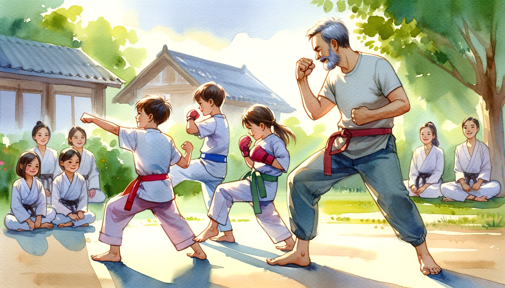

# 【随笔】拉不开的筋骨

大宝还是每周会尽可能地带着孩子们去练武术。没想到，阿宝现在不仅仅是五步拳练得有模有样，各种正踢、侧踢、里合外摆都已经打得漂漂亮亮了！甚至连大鱼，也能拉开架势，马步、弓步地跟上练一小会儿。

 practicing martial arts with her two children_ a 6-year-old daught.png)

眼看着照这样练下去，再不用多久，小家伙们就要一个又一个地比我厉害了。其实，就算是现在，练到那些「蹦蹦跳跳」的基本功时，我都忍不住要偷懒，躲在后面偷工减料、看着大宝带着阿宝生龙活虎地使劲儿跳。

唉，看来我这个「超业余武术爱好者」，就要被新一代「武术爱好者」超越了啊！

不禁想起冯唐常常在文章里念叨的一句话：

> 四十是以前有永远使不完的力气；四十以后只有永远拉不开的筋骨！

还真是这样，每次跟着练功，最让自己感慨的就是一前一后的拉筋环节。一面把自己拉得「嗷嗷」乱叫，一面又觉得身体拉开之后实在是太舒服了；每一个动作都很不得弄得自己浑身关节吱嘎乱响，然后遗憾地发现：当年自己劈叉最巅峰时刻，离地面只差一个拳头，现如今就算完全活动开，离地面还有二尺二。

按大宝的经验，哪怕只是每周这样练一次，持续一段时间，柔韧性和体力也会慢慢恢复到不错的水平。那么，哪怕是沦为全家垫底，也还是坚持练下去吧。说不定，到了70岁的某一天，我反而能劈出一个合格的一字马呢？

 attempting a split (one-character horse stance), humorously em.png)

