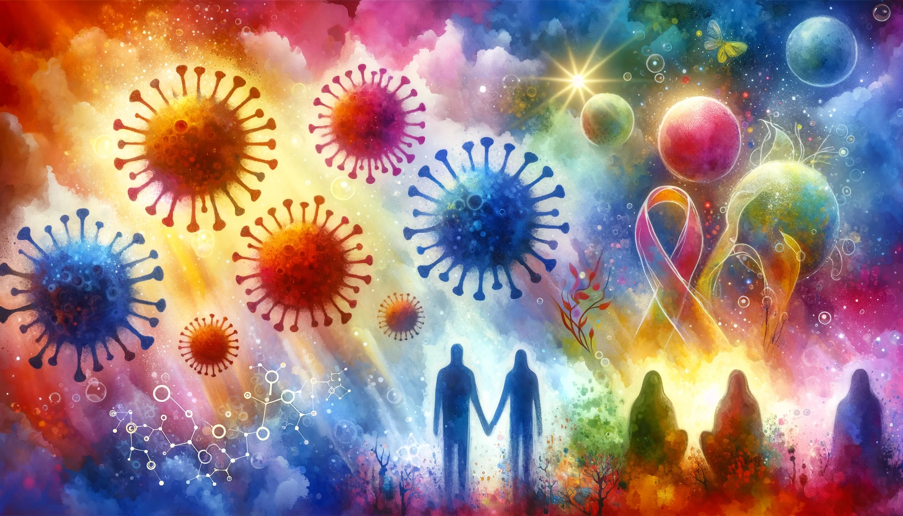
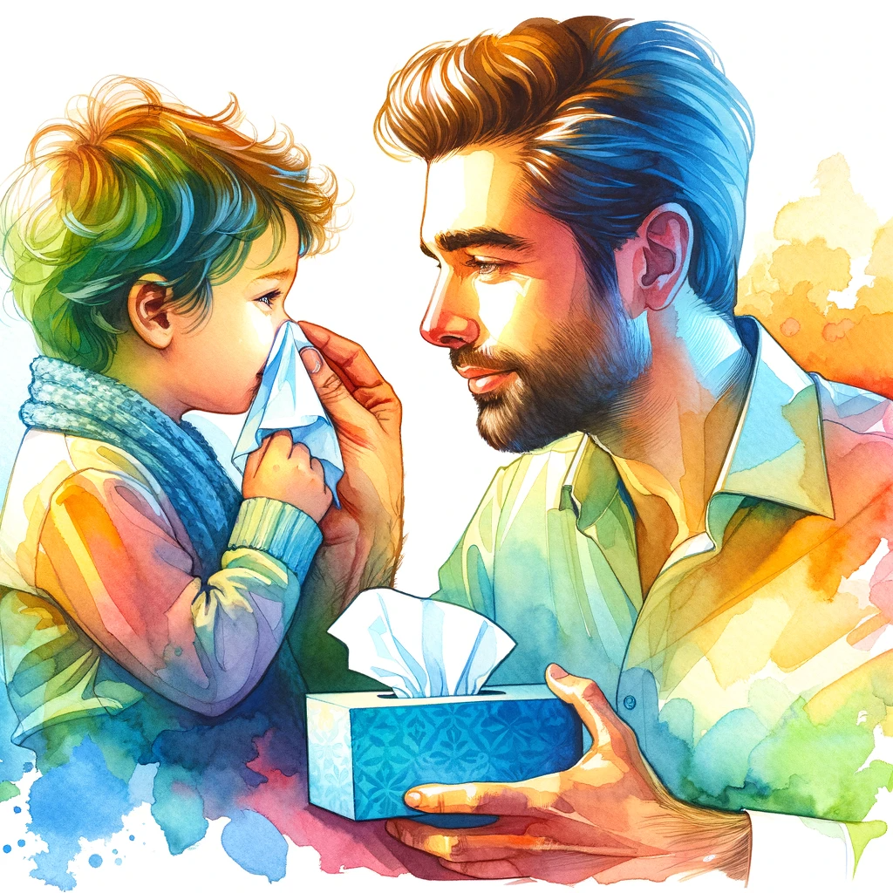

# 【随笔】与病毒共存的日子

距离上一次全家生病还不过一个多月的样子，我、妈妈、大鱼又被不知名的病毒击倒了。折腾了好几天，大鱼总算是有恢复的迹象，可是妈妈依旧咳嗽得很严重，我也只是略有好转。

不知是像我这样的人类变弱了，还是病毒的传染性变强了。这次能有感觉的开端，也不过是在元旦前和两位正在咳嗽中的同事和前同事一起吃了两顿饭而已。只不过，那几天没睡好，于是心里也有些「打鼓」，不知是不是心理作用，终究没扛住。

妈妈和大鱼则是家人中典型的「老」与「幼」，前几天的天气变化中只一个不注意，他们就着凉，流清鼻涕，然后开始咳嗽了。

想必这些病毒一直徘徊在我们身边伺机作案，由于我近距离接触生病的人导致家中的病毒浓度上升，再加上天气变化与作息不规律造成的免疫力下降，我们就这样被击倒了！

这次的症状说起来和大宝上次很像，首先是咳嗽，胸中总觉得有痰粘住不那么畅快；其次是睡不着觉，要不然就整晚睡不着，要不然睡着了也容易醒，睡不安稳；还有一点，就是有时会眩晕（这个大宝倒是没经历，但我两次都有这个症状）。睡不着这一点，很是讨厌，看来这次的病毒依然很擅长攻击人的免疫系统——睡觉往往是人体免疫系统发挥作用的重要时机，它竟然懂得从源头上进行打击，真是无语！

听说Q师兄和他家娃娃也发烧了的时候，我和大宝都禁不住摇头感慨，以前一两年不感冒一次的人，现在个把月就要来一次，真不知道这世界是怎么了。当然了，说起来最近这些「很多人生病」的感知，也不过是后疫情时代，人类重新整体暴露在「正常病毒」环境中的一个正常现象而已吧。

不过，不管怎么变化，人类作为整体，还是终将适应这世界的吧？只不过，作为个体，在接下来的岁月里，我们会如何与之共存，继续生活呢？

