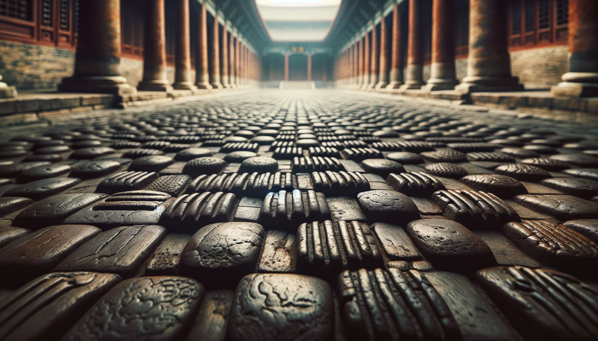
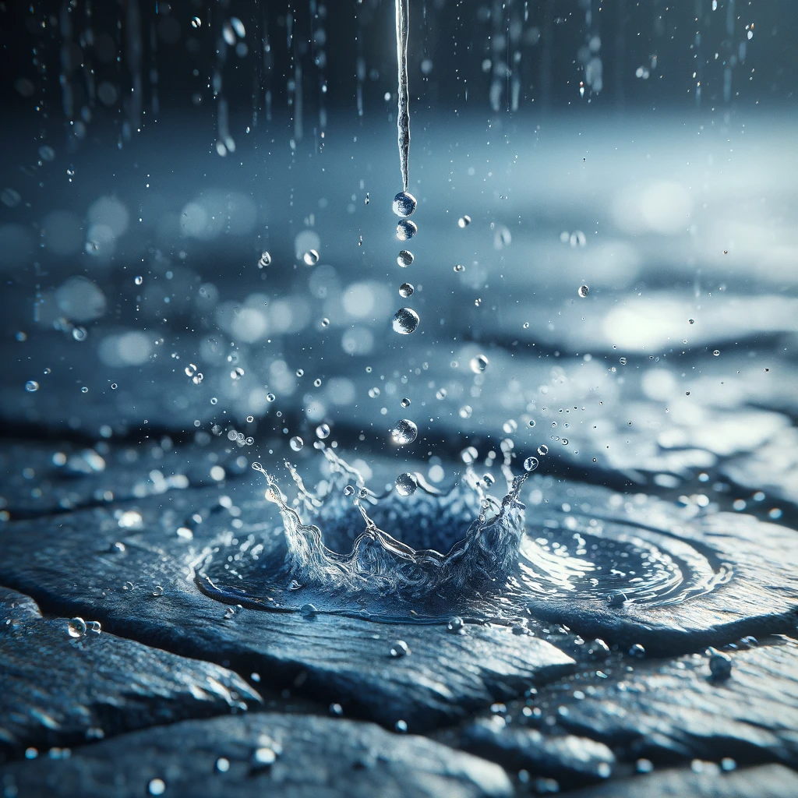

# 【生命⋅修行】基本功要天天练

在JT讲的「庄子」中，基本功就两条：

1. 遇到有辩论冲动，忍住不辩。而是仔细看看自己，究竟是错失了什么事实。
2. 遇到有情绪，赶紧看看自己究竟是搞错了什么事实，引发了这情绪。

而早上一件小事儿，就接连触发了练习这两条基本功的机会。缘起于大宝让我帮她为阿宝整理寒假日程表，准备打印出来。关于是否要把画画、还有学可汗学院这两件她一定会做的事情放进去，我和大宝有了不同意见。我想说服，当然未遂。于是，我们让阿宝自己来看看。阿宝看了一眼，却说：

> 练字呢？我想要练笔画的！

于是，我对大宝说：

> 看吧，阿宝是想把她想要的做的事情都加进去。

大宝瞬间变了脸：

> 这种事情争个对错有意思吗？

我张嘴还想争辩，她又一句：

> 你还要争辩！

这个词，让我瞬间意识到自己的「辩论冲动」，默默地停止了辩论。灰溜溜地表示刚刚自己是想「争个对错」，并且这是不该的。但被堵住的「辩论冲动」，似乎触发了什么，让自己情绪瞬间低落了下去。我去厨房里收拾东西，听见妈妈在外面和大宝说：

> 他从小就是计划做得好，但是不会行动……
>
> 嗯，说他，他还不高兴。

大宝笑着应和妈妈：

> 戳到痛处了。

确实是戳到痛处了。在这一刻引发的那种浓烈的低落情绪，久久不能消散！

----

辩论冲动背后，那搞错的事实，其实很快就水落石出（想明白后，这冲动就消失了）：

1. 大宝想要的是一个简单、清晰，他要用来帮助阿宝能记住那些「可能记不住」的学习相关事务的日程表。
2. 同时，一大堆待办事项会给她带来的压力，让她难受，让她无法借助这个达成帮助阿宝执行的目的。
3. 阿宝和妈妈的想法基本是一致的。她喜欢最后那个加上了「练笔画」，同时没有「画画」、「可汗学院」的日程表。她也认可，日程表上没有这两项，没有关系，她自己一定会做的。
4. 阿宝和妈妈都不需要用这「日程表」来告诉自己，自己计划了多少事情——只有我（可能）需要

然而，低落情绪的背后，却不知是什么事实被误判。

* 我善于做计划，不善于行动——这我也认，但这么想，我并没有好起来。这背后依然有错判或遗漏的事实；
* 我习惯于做详细的计划，或许这本身就不利于行动和执行——这背后似乎真的有所关联，但这么想，我依旧很难过；
* 我给自己定的计划，内容太多，太没有弹性，这也不利于执行——似乎又是真的，但这么想，我还是很不舒服；
* 给自己一个规律的日程表，有助于我这种人的执行效率提升——似乎也是对的，但我还是不开心。

关于计划与行动这件事，翻过来、倒过去的观点自己都想过了。却始终差点意思，看来想要搞明白自己究竟「弄错了什么事实」，只能靠将来了。

也许，真正弄错了的事情，仅仅是这个吧：

「我错了，所以我不好！」

