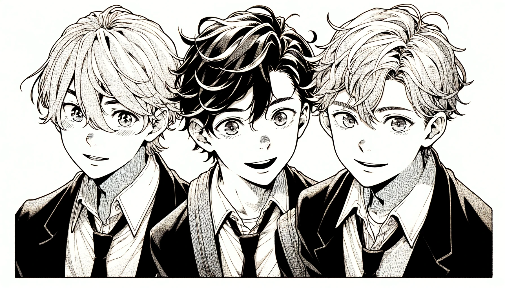
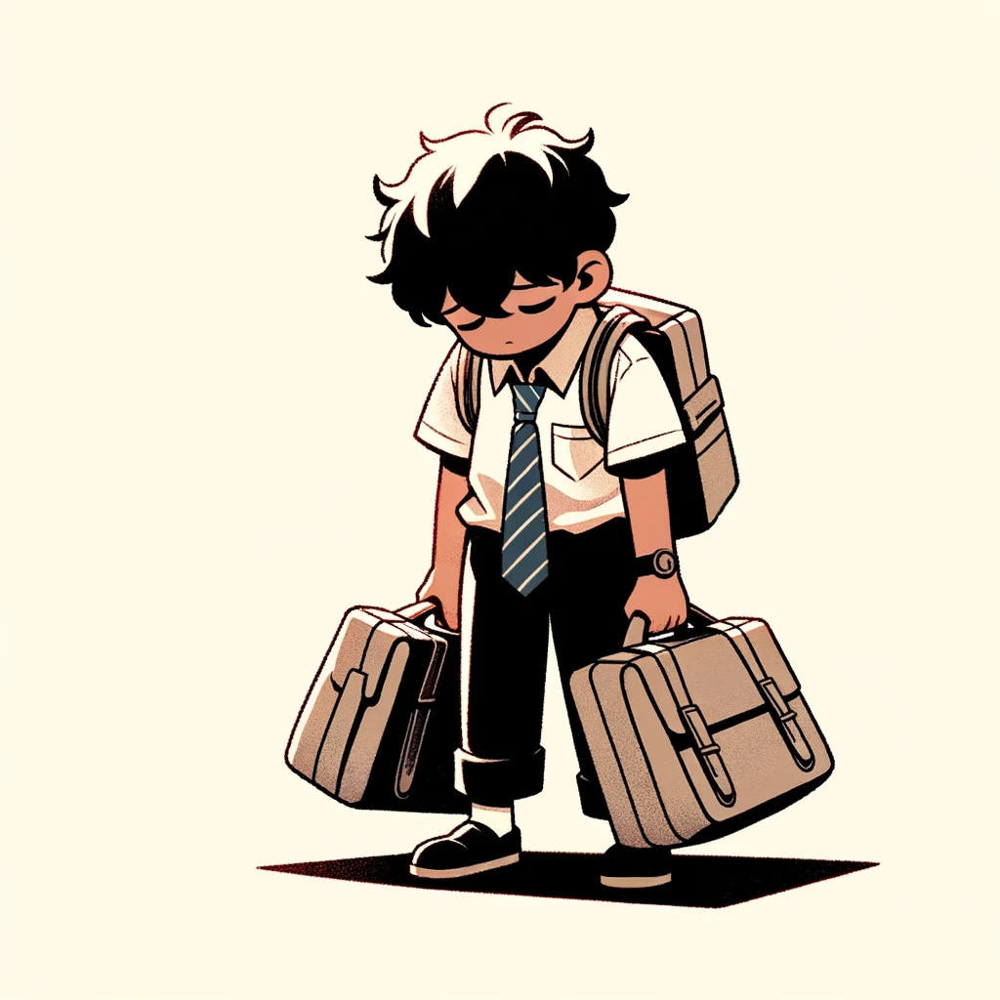
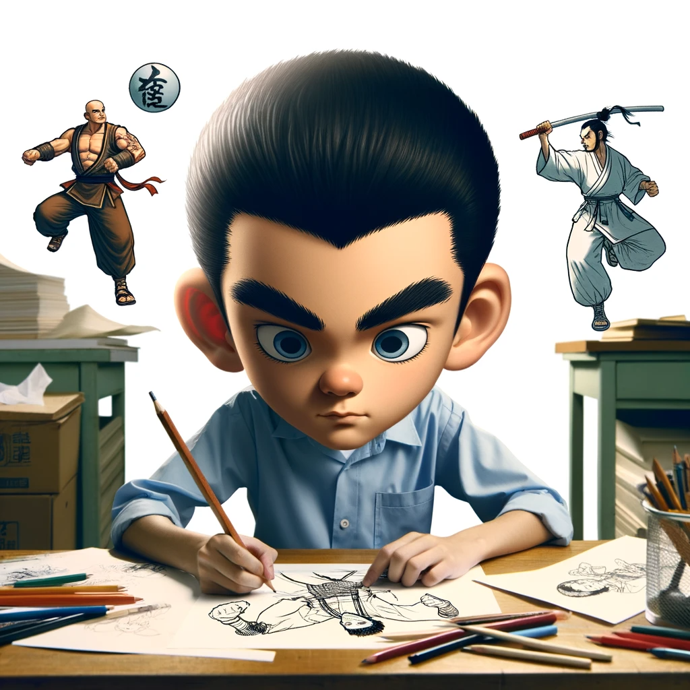
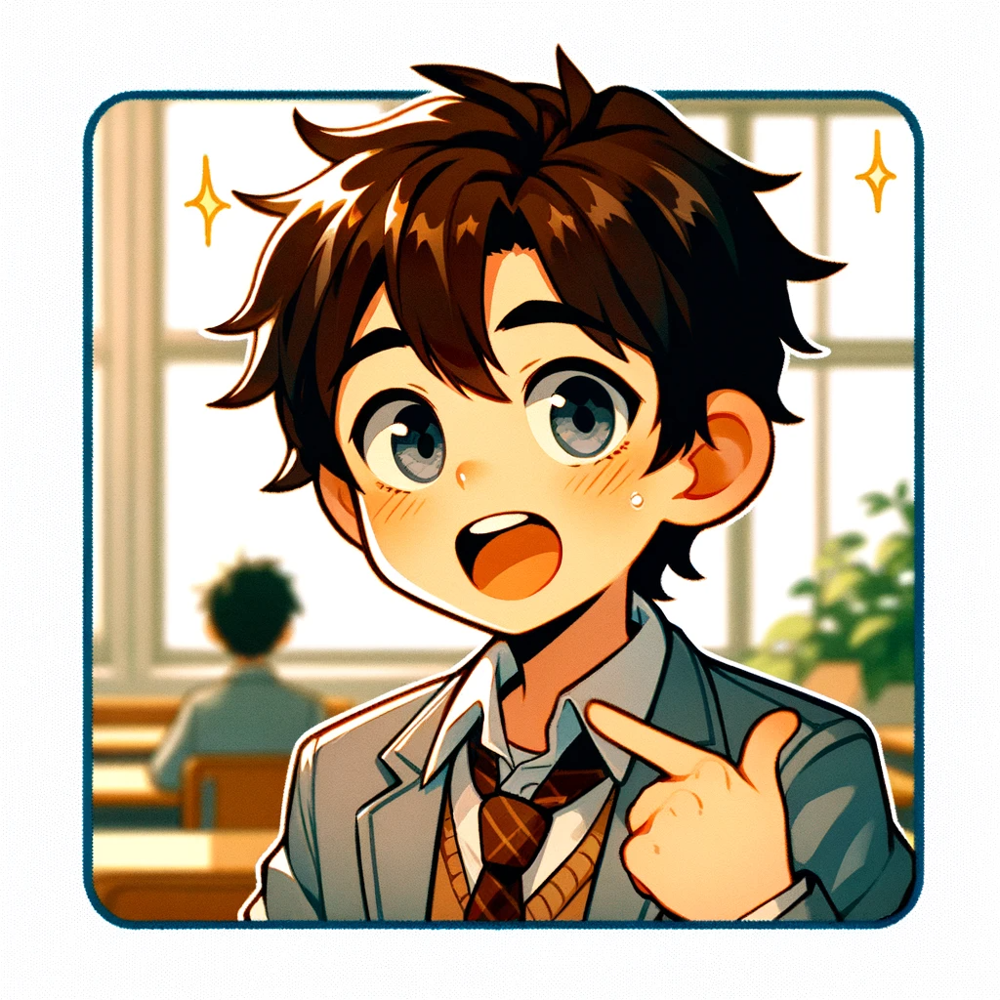

# 【生命•故事】（109）初中的几名同桌

初中时，我的成绩已经算是相对不错了。那时换过不少同桌，大部分都是所谓「差生」，也算是让我对他们的世界有所了解。

### 小C的心机

小C住在离学校四站路远的武汉重型机械厂，他是一个贪玩又淘气的家伙。有一天放学，他邀请我去他家里玩。于是，我和他一起坐了公共汽车去到他家。在他家玩了一会儿，又出门在他们厂区里和他的朋友们一起玩。我记得，那天玩得很开心。

等到天色渐晚，要回家了。他告诉我说，忘记带家里钥匙了。于是，我没法拿书包，只好空着手回家。第二天，他拖着两个沉重的书包来到学校。告诉我说，昨天是骗我的。因为，他想留下我的书包，抄我的作业。但是，两个书包实在是太沉了。他后悔得不行……

我哈哈大笑，虽然我不喜欢把作业给其它人抄，但我也不在乎他们抄我的作业。何况我家庭作业早已做完，回家也用不上书包，有人帮我拿书包，反而轻松自在。

他为了一件我不在乎的事情骗我，然后折腾得自己够呛，想想还是蛮有趣的。

### 使劲想「学坏」的小H

小H有点少白头，他喜欢武侠。那时我在一个白纸钉成的小本子上画变形金刚。他就也找来一个本子，为他写的武侠小说配图。为了让招式更加准确逼真，他让我帮他找来了拳谱，把各种招式的名字一一抄录——什么白鹤亮翅，猛虎下山，蛟龙入海等等……回头好用在自己的小说中。

有一次，他因故请了半天假还是一天假的第二天，他神秘兮兮地对我说：

> 你知道我昨天为啥没来吗？

我问：

> 不是请病假了吗？

他摇摇头，悄悄地告诉我，说他去偷自行车去了。然后被警察抓住，扣留了半天。他甚至为此颇为得意，一副那些班上那些「混社会」的都不如他的感觉。「进过局子」，竟然成了一种可以炫耀的荣耀。

不知他还对谁炫耀过。我默默保守着这个秘密，直到今天。

### 想入团的小Y

小Y是个有趣的人。他家住在附近的《湖北日报社》，喜欢和我分享各种奇闻轶事，那种「混社会」的小年轻中流传的各种传闻。比如，某某学校，学生打架结了仇，在澡堂门口被人一刀捅死；比如某某认识黑社会的大哥，等等……

他还会和我炫耀，跟着班上的某大哥，去旁边另一所学校，抢那些同学皮带和皮带扣的「英雄事迹」。

然而，即便如此，他还告诉我，他想「入团」。身为团支部书记，我只好告诉他，想入团，得按照「共青团员」的标准来要求自己。达不到标准，我也没办法。我不记得他后来入团没有，反正他很努力地「改好」过一阵子。我还设法让老师当众表扬过他。

我还记得他第一次用海飞丝「香波」洗过头以后，得意地让我猜他是用什么洗过头的可爱样子。然后我也记得，当时他那头发上的苹果香气，确实好闻。不过一个男孩子向另一个男孩子炫耀自己头发的顺滑和香气，让我想起了就觉得有那么点好笑。

他喜欢班上同样住在他们报社的一个女孩 J，总在我耳边絮絮叨叨这个女孩子有多好多好。曾经好几次带着我去那个女孩子屋外转悠，有时远远看到那个女孩，他就会很开心。我有时想，他想要入团，或许也是因为这个女孩是共青团员，他希望能多些和她在一起的机会？

