# 【随笔】给猪坚强画画

前几天看[鬼脚七公众号发了一篇宗翎的文章《猪坚强》](https://mp.weixin.qq.com/s/qdqwyFMpE9vI_GekodS89Q)，特别喜欢。其中有一幅宗翎师傅的画，也是别有韵味：

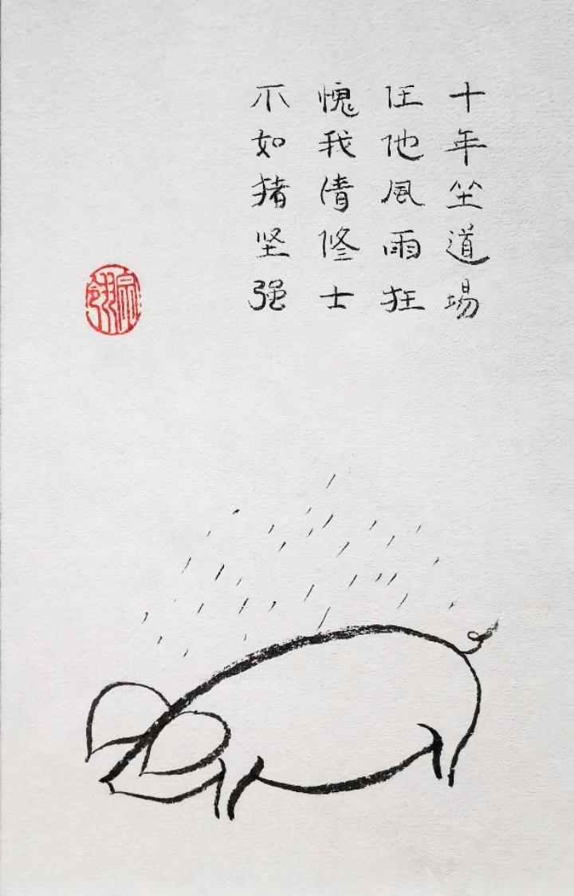

于是乎，我忍不住想要试试让蔡姬按照这个风格，给我创作一系列漫画出来好好讲讲「猪坚强」的故事。

我把这幅图喂给蔡姬，然后问：

>要用什么样的提示词，你才能画出同样风格的画来？

她一边说，一边就画出一幅这样的画来：

> 要创造一幅具有类似风格的画作，可以使用以下的提示词：一只简约风格的猪在微雨中休息，其上方为用传统毛笔书写的中文诗句和红色的印章。整体风格体现东方的审美和艺术的简练，线条流畅，富有禅意。让我们来生成这样一幅画。

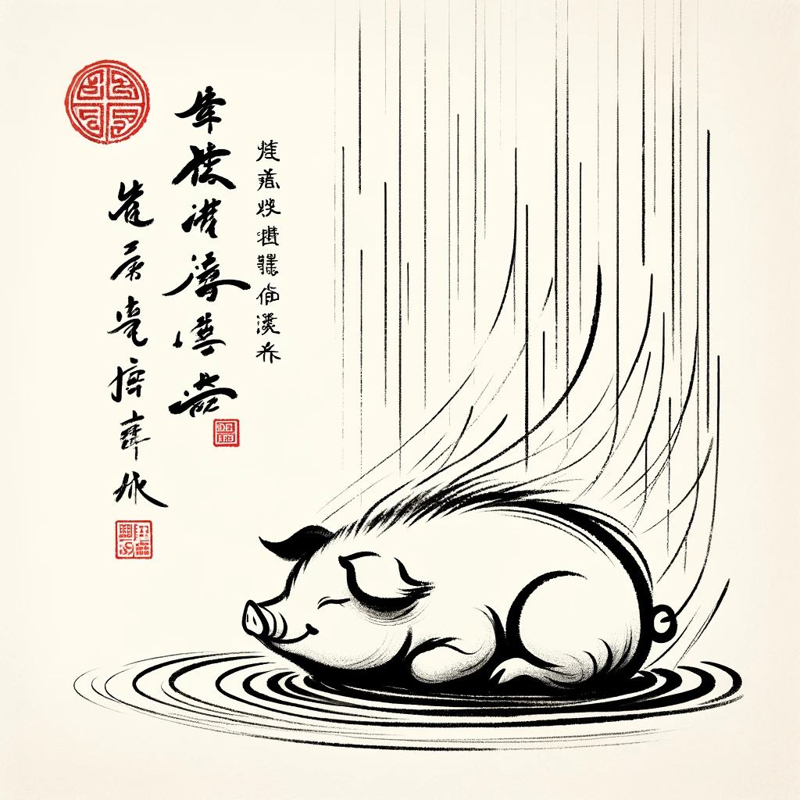

这完全是另一种风格嘛！最重要的是，DALL•E 所谓的中文和印章实在是太形似神不似了！我只好把图截了下面只有猪的部分，再次提问：

> 要用什么样的提示词，你才能画出同样风格的画来？仔细描述风格，笔触，画画的工具和风格

这次，没有了不擅长的中文字干扰，她是这么说的：

> 为了创作出这种风格的画作，提示词应该包括：一幅表现简约风格的猪在细雨中的水墨画。这幅画的风格应当体现出东方艺术的简练与雅致，采用极简的线条和形式，用墨色的深浅和笔触的宽窄来表现出雨的细腻与猪的温馨、安详。画作应使用传统的中国水墨画工具，比如毛笔、墨和宣纸，通过流畅而有力的笔触，捕捉到动物轮廓的精髓。整体作品应传达出宁静和禅意的氛围。这样的描述将有助于生成一幅符合您要求的图画。

画出来长这样：

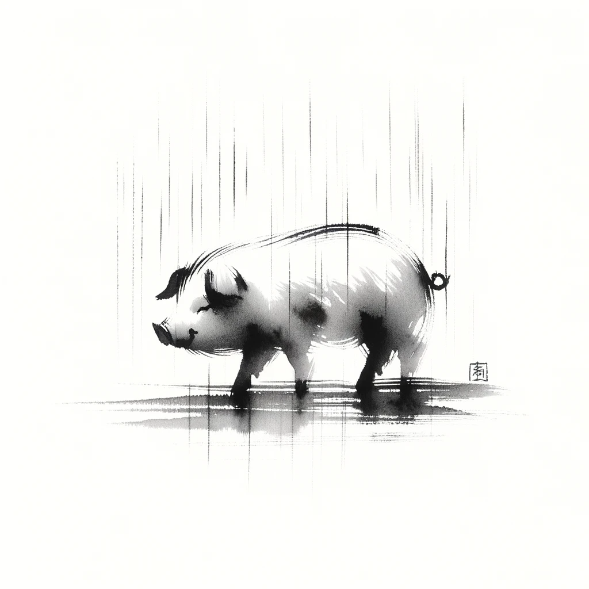

其实也还不错，但是离我想要的简笔风格还有些距离。于是，我又试了一次：

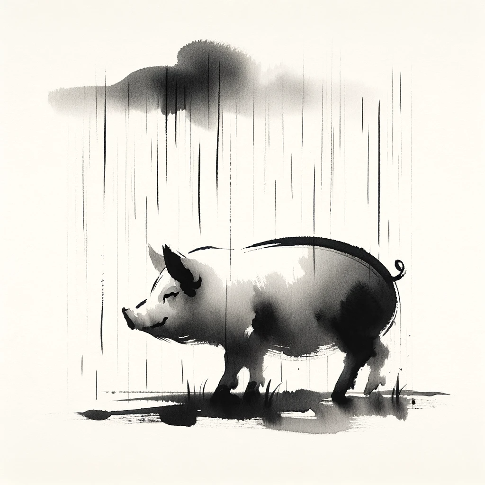

得到一张风格没区别，画得略略不同的水墨画。不管了，我开始尝试创作后面的情节：

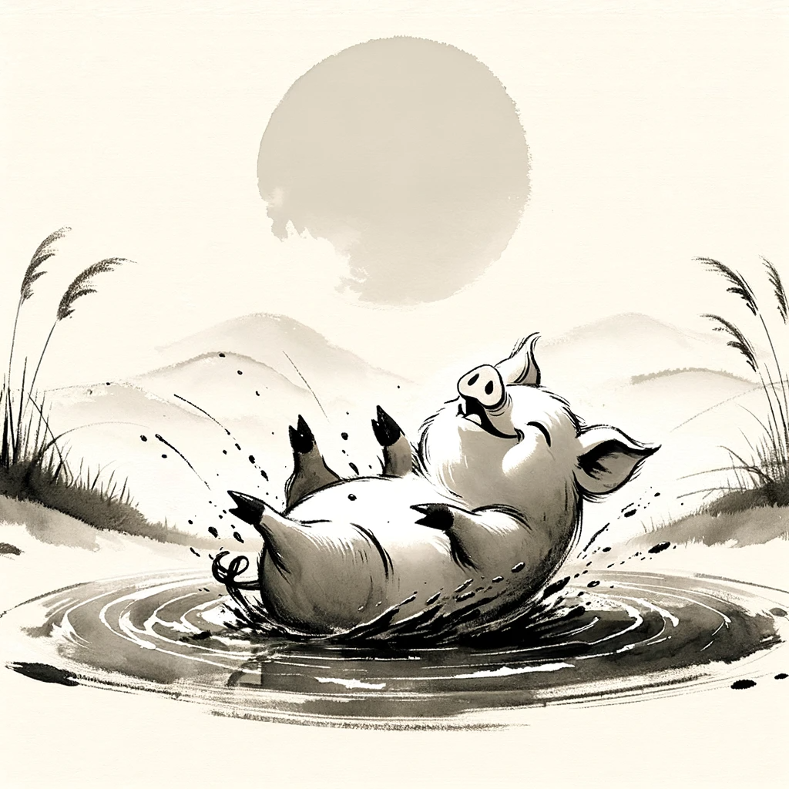

> 出太阳了，它在山坡草地上的泥塘里快乐地打滚

我是这么说的，可是这画风好像有点儿变了！重来吧。这时，我想起大宝问我，能不能不用这种小方块画图，于是我决定换个竖屏试试：

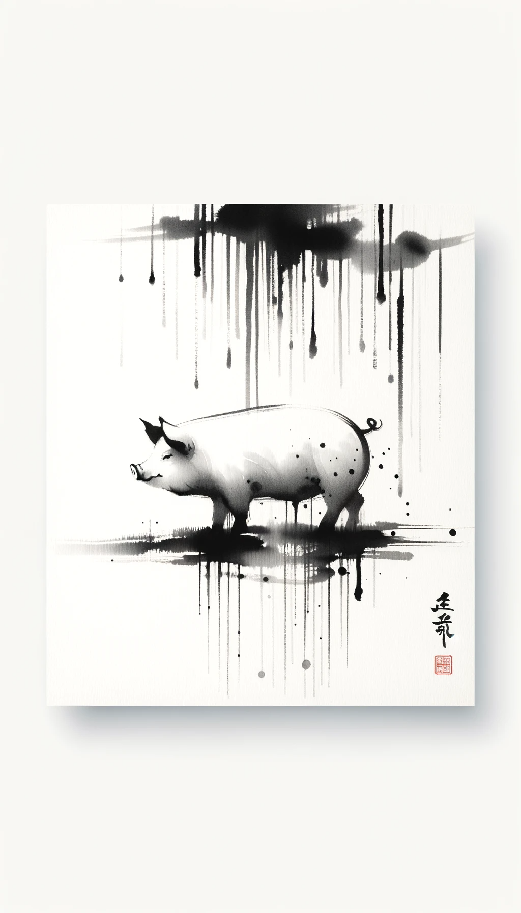

> 重新来。用适合手机显示的竖屏格式，创建一个角色，这是一幅表现简约风格的猪在细雨中的水墨画。这幅画的风格应当体现出东方艺术的简练与雅致，采用极简的线条和形式，用墨色的深浅和笔触的宽窄来表现出雨的细腻与猪的安详自在神态。画作使用传统的中国水墨画工具，毛笔、墨和宣纸，通过流畅而有力的笔触，捕捉到动物轮廓的精髓。不管是猪还是雨，都只用简单的线条表现。整体作品应传达出宁静和禅意的氛围。同时，给我这个角色的gen_id

虽然构图在我意料之外，但毕竟还是竖屏。于是，我试着继续：

> 从现在开始，你的核心目标就是保持角色一致性。必须使用与上一张图像相同的提示和gen_id来制作相同角色的新图像，以保证角色一致，且能适配更多的表情、动态、服装与场景。画风也要保持一致，使用传统的中国水墨画工具，毛笔、墨和宣纸。不管是角色，还是场景，都只用简单的线条表现。整体作品应传达出宁静和禅意的氛围。明白的话请回复明白。

蔡姬：

> 明白。

我：

> 天晴了。

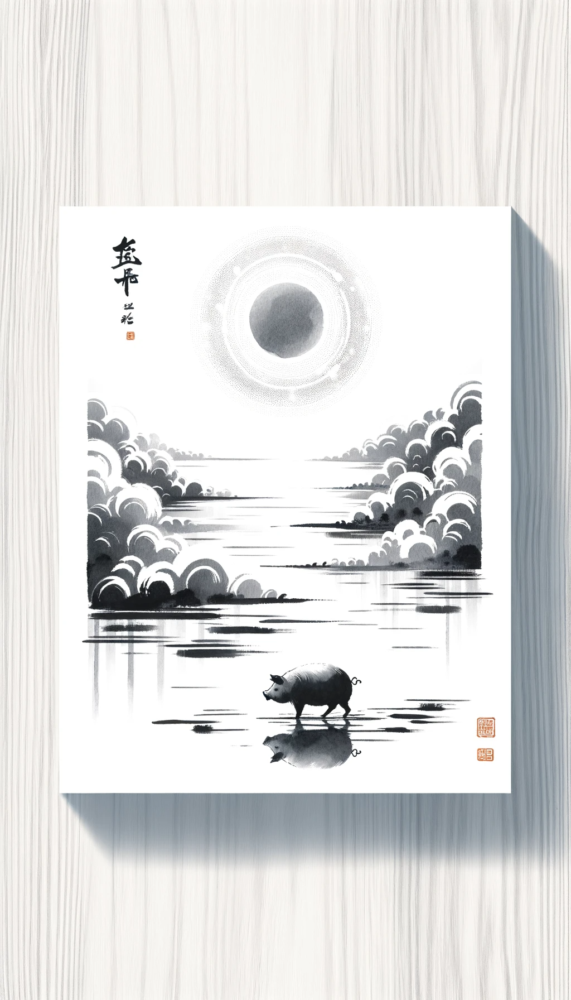

> 它去城里溜达

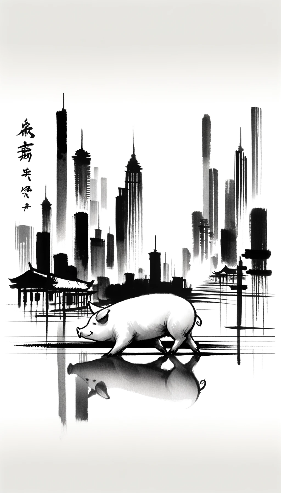

> 地震了

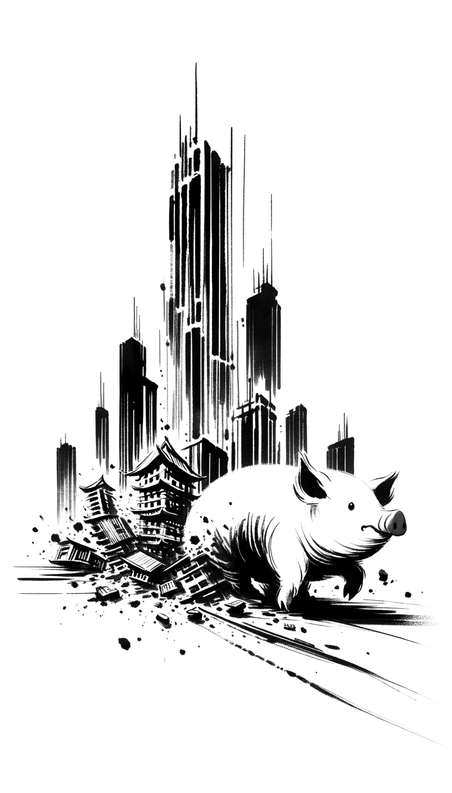

> 它没有跑掉，被埋在了废墟下，但是坚强地活着

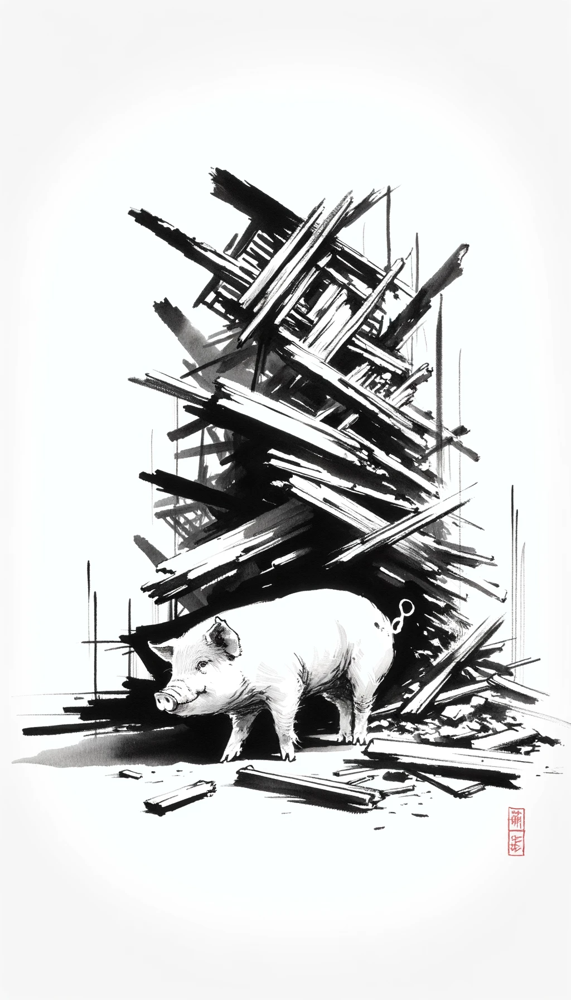

> 被埋住，出不来那种样子

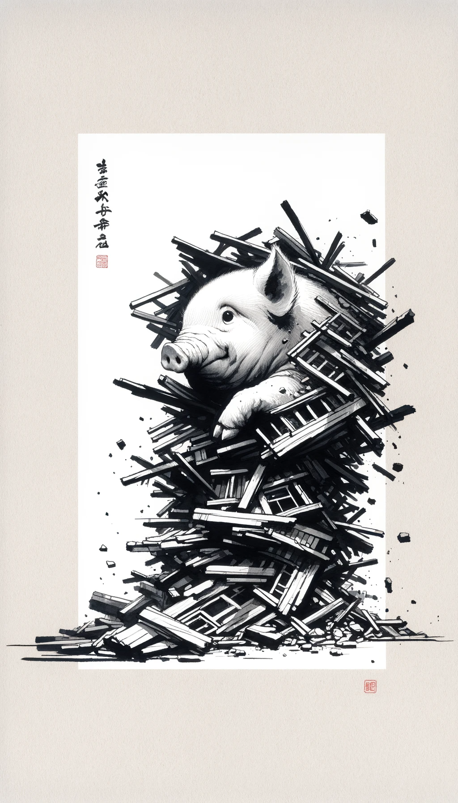

> 过了10天，它依然出不来，它饿瘦了，但是还活着

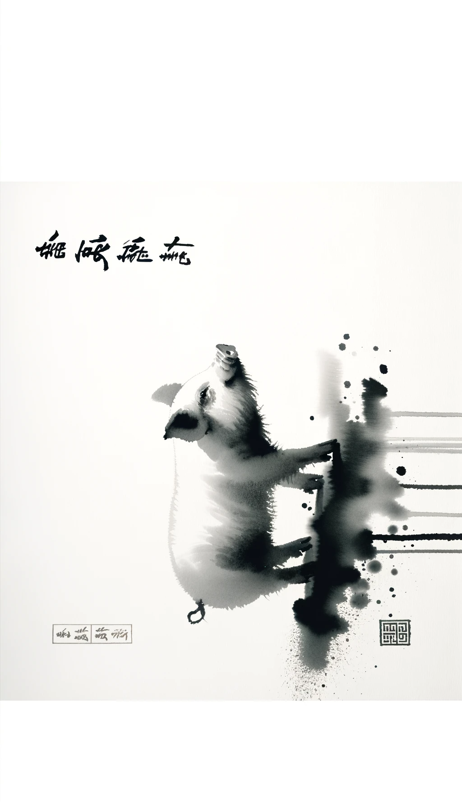

这时，蔡姬的表现突然开始变得奇怪起来。我试着一边纠正她，一边继续：

> 不对啊？这哪里是被困在废墟下，饿瘦了的猪？又过了10天，它还在那里，更瘦了。

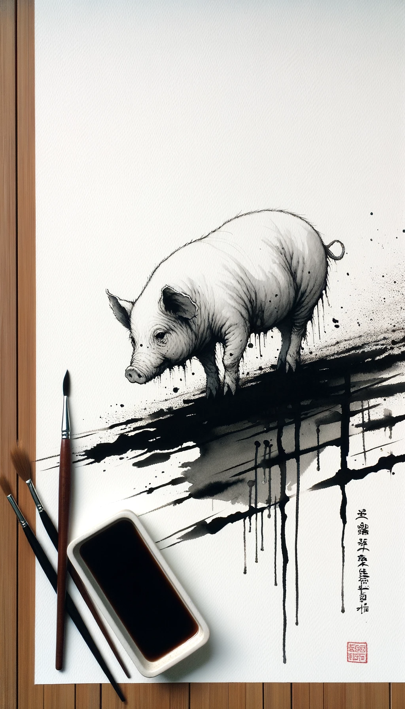

显然，她已经越来越脱轨，但现在的画好歹还是正常画风。我于是继续试图纠正（是完全没想到，后来竟然会……）

> 这明明是更胖了。重新画：它被困在废墟下36天，瘦了200斤，皮包骨头。

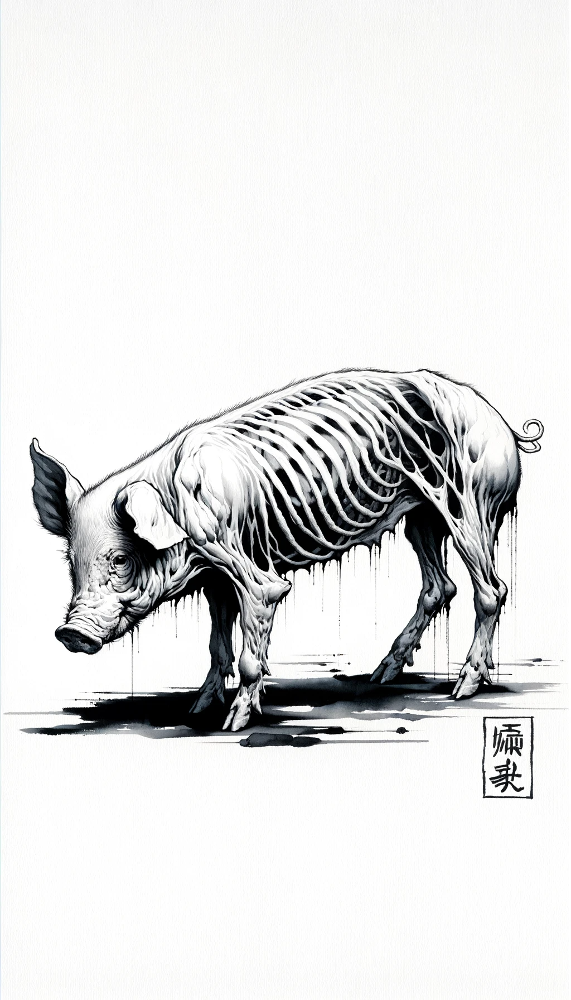

怎么变成鬼畜风了？！对了，不是地震废墟里嘛？我问：

> 地震的废墟呢？

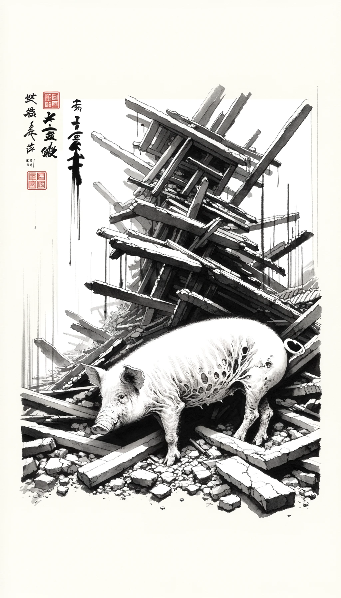

到这时，我忽然发现了一个问题。原来，每一次蔡姬都是用「上一幅的Gen ID」创作下一幅画，这或许就是偏离越来越远的原因？

要不，再重新试一次吧？