# 【随笔】给猪坚强画画（续）

话说上次发现蔡姬给猪坚强画画的风格逐渐鬼畜化，怀疑原因是每次她都在用「上一幅」的Gen ID来尝试保持「角色一致性」。

于是我说：

> 重新来，你用的gen_id已经变了，这样还不行。准备好重新开始就告诉我：ok，准备好重新开始了。

蔡姬：

> ok，准备好重新开始了。

我：

> 用适合手机显示的竖屏格式，创建一个角色，这是一幅表现简约风格的猪在细雨中的水墨画。这幅画的风格应当体现出东方艺术的简练与雅致，采用极简的线条和形式，用墨色的深浅和笔触的宽窄来表现出雨的细腻与猪的安详自在神态。画作使用传统的中国水墨画工具，毛笔、墨和宣纸，通过流畅而有力的笔触，捕捉到动物轮廓的精髓。不管是猪还是雨，都只用简单的线条表现。整体作品应传达出宁静和禅意的氛围。同时，给我这个角色的gen id。

蔡姬：

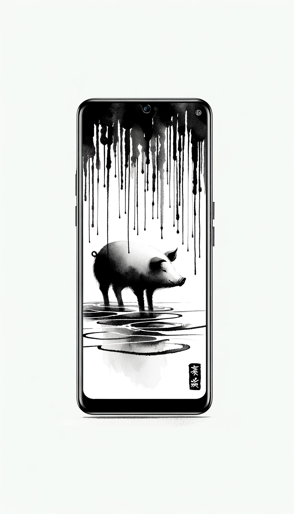

显然，她错误理解了「适合手机显示的竖屏格式」是什么意思，我试着纠正她：

> 不行，重新来。用适合手机显示的竖屏格式，创建一个角色，这是一幅表现简约风格的猪在细雨中的水墨画。这幅画的风格应当体现出东方艺术的简练与雅致，采用极简的线条和形式，用墨色的深浅和笔触的宽窄来表现出雨的细腻与猪的安详自在神态。画作使用传统的中国水墨画工具，毛笔、墨和宣纸，通过流畅而有力的笔触，捕捉到动物轮廓的精髓。不管是猪还是雨，都只用简单的线条表现。整体作品应传达出宁静和禅意的氛围。同时，给我这个角色的gen id。

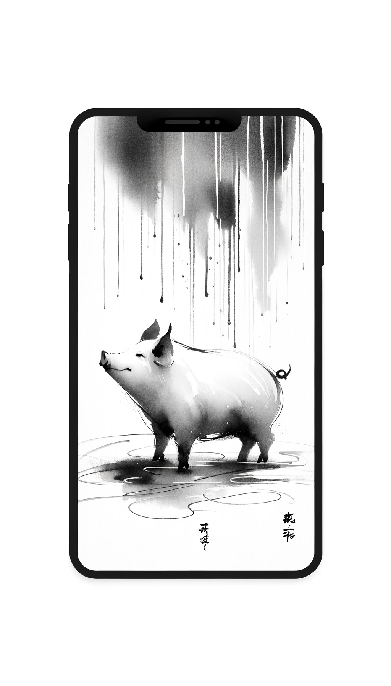

它依旧顽固不化地给我画了个水墨风格的手机上去。我有些怒了：

> 重新来，不要手机！

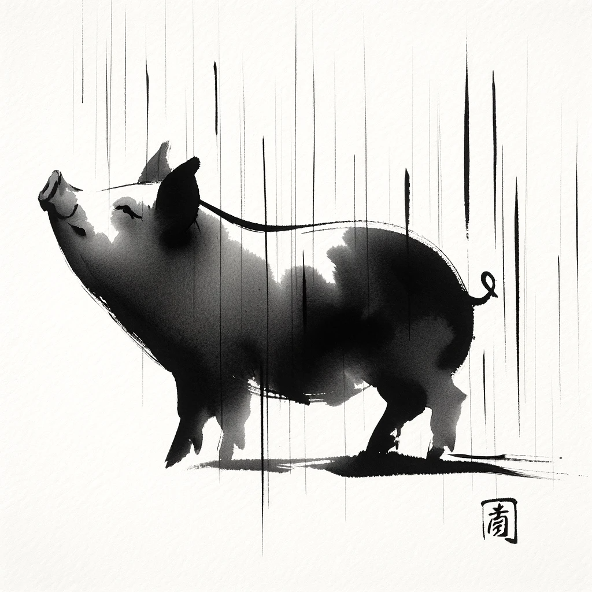

这次她听懂了，立即给我来了一张。但显然早已经忘记了「竖屏」是啥……我无奈地屈服了：

> 用宽屏

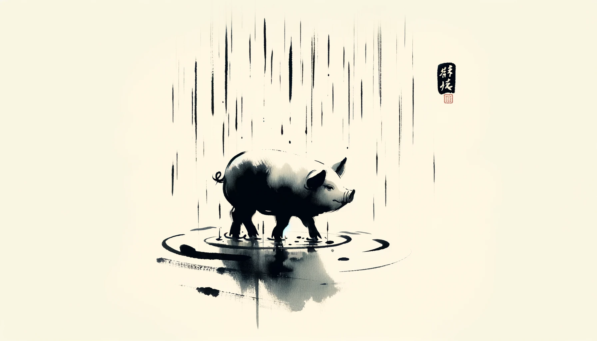

说实话，这猪画得还有点意思。我说：

> 再来一张，用简单，非常简单的线条表达猪

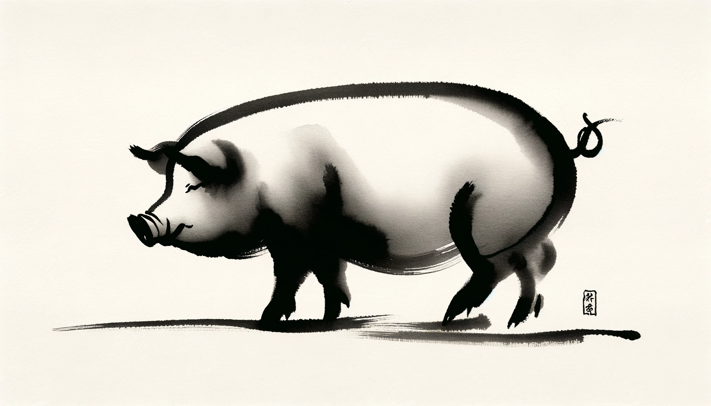

嗯，这张很让人满意，真正是我想要的岭南画派风格！于是龙颜大悦地继续道：

> 从现在开始，你的核心目标就是保持角色一致性。必须使用与上一张图像相同的提示和Gen ID （也就是 8P1ZcFyggbv1wik0）来制作相同角色的新图像，以保证角色一致，且能适配更多的表情、动态、服装与场景。画风也要保持一致，使用传统的中国水墨画工具，毛笔、墨和宣纸。不管是角色，还是场景，都只用简单、非常简单的线条表现。整体作品应传达出宁静和禅意的氛围。明白的话请回复明白。

蔡姬：

> 明白。

我：

> 它在城里散步

蔡姬：

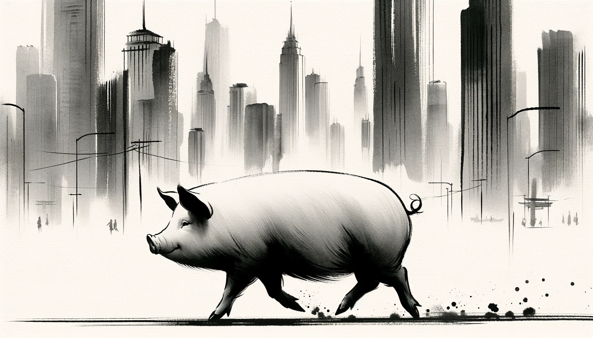

我：

> 地震了

蔡姬：

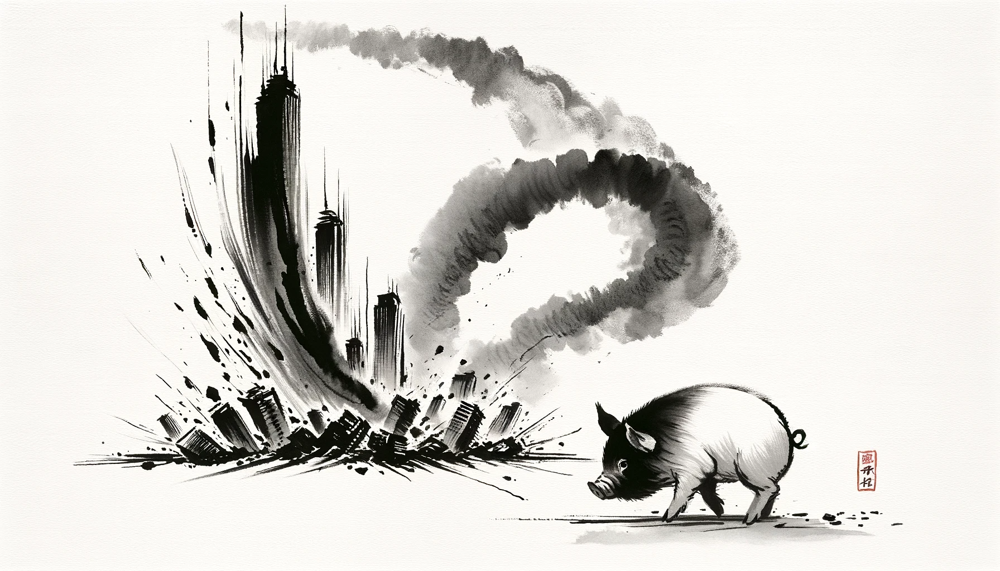

这是地震吗？感觉发生了巨大爆炸啊！这小肥猪咋就被吓黑脸了呢？我继续：

> 它被压在废墟下

蔡姬：

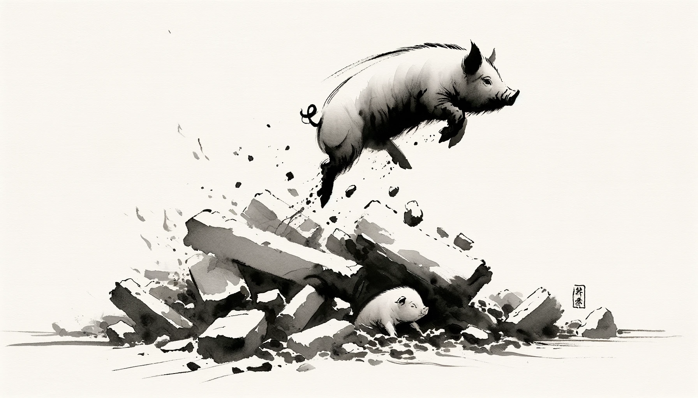

眼见着小肥猪在石块中敏捷地一跃而起，我意识到这画风又距离最初的那张「岭南画派风格」越来越远了。点开Prompt一看，果然她每次都还是用的上一张画的Gen ID，并没有固定用最初角色设定的那一张。我赶紧叫停：

> 停！停！停！记住，从现在开始，你的核心目标就是保持角色一致性。接下来每一幅图，都要用角色设定图像相同的提示和Gen ID （Gen ID： 8P1ZcFyggbv1wik0，Prompt：A minimalistic ink wash painting in widescreen format, depicting a pig with extremely simple lines, emphasizing the essence of minimalism. The style should embody the purest form of simplicity, using the fewest possible lines to represent the pig. The artwork should use traditional Chinese ink wash painting tools such as a brush, ink, and rice paper, focusing on capturing the essential silhouette of the pig with a very minimal approach. The overall piece should convey a sense of tranquility and Zen, with an emphasis on the art of reduction to the simplest form.）来制作相同角色的新图像，以保证角色一致，且能适配更多的表情、动态、服装与场景。画风也要保持一致，使用传统的中国水墨画工具，毛笔、墨和宣纸。不管是角色，还是场景，都只用简单、非常简单的线条表现。整体作品应传达出宁静和禅意的氛围。明白的话请回复明白。

蔡姬：

> 明白。

我：

> 它在城里散步，遇到了地震！

蔡姬：

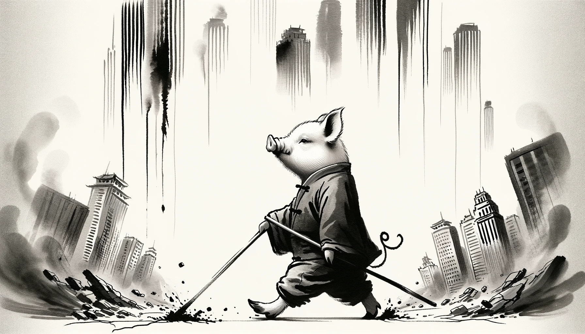

我：（内心凌乱了好几秒钟，点开看Prompt，却正是用的之前角色设定的个Gen ID，一个字母都没错……）这猪怎么站起来了？

蔡姬：

> 我理解您的关注点。在生成这些图画时，我会尽力保持角色的一致性，但由于生成过程中有一定的随机性和解释性空间，有时候图画的细节可能会有所不同。我会重新尝试，确保角色姿态与之前的描述更加一致。让我们再次尝试。

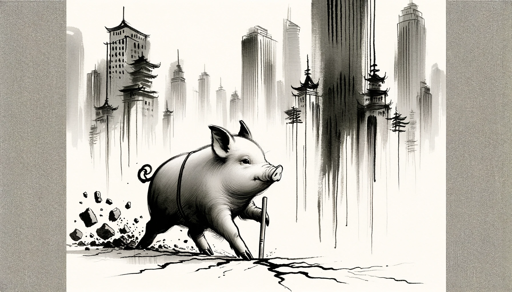

> 我已经重新生成了图画，确保角色的姿态与之前的描述保持一致，同时描绘了它在城市中散步时遇到地震的场景。这幅画的生成ID是 `skyIP2wHzzTDJ8fR`。如果您有更多的要求或需要进一步的调整，请告诉我。

我：

> 它被压在废墟下

蔡姬：

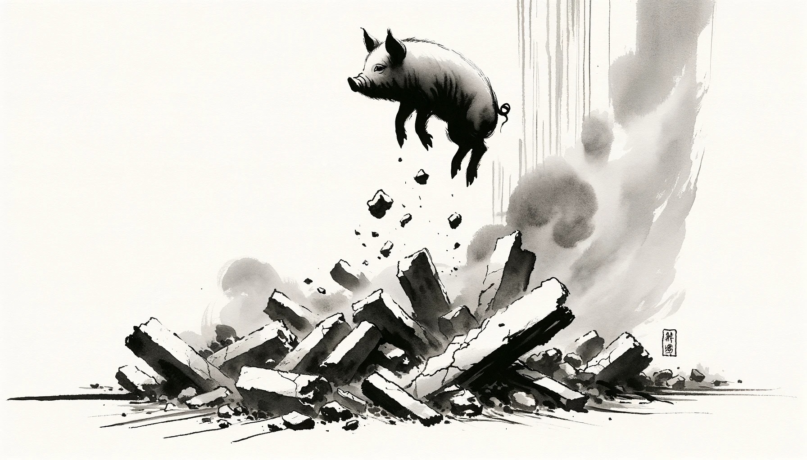

她依然放弃了继续用角色设定图的Gen ID，而是使用了上一张的Gen ID `skyIP2wHzzTDJ8fR`来创作这幅图。也不知道，是不是sky 这几个字母发挥了作用。小肥猪再一次在爆炸声中敏捷地飞到了半空！

我想，要不再重新来一次？

> 重新开始。创建一个角色，这是一幅表现简约风格的猪在细雨中的水墨画。这幅画的风格应当体现出东方艺术的简练与雅致，采用极简的线条和形式，用墨色的深浅和笔触的宽窄来表现出雨的细腻与猪的安详自在神态。画作使用传统的中国水墨画工具，毛笔、墨和宣纸，通过流畅而有力的笔触，捕捉到动物轮廓的精髓。注意：不管是猪还是雨，都只用非常非常非常简单的线条表现。整体作品应传达出宁静和禅意的氛围。同时，给我这个角色的gen id。

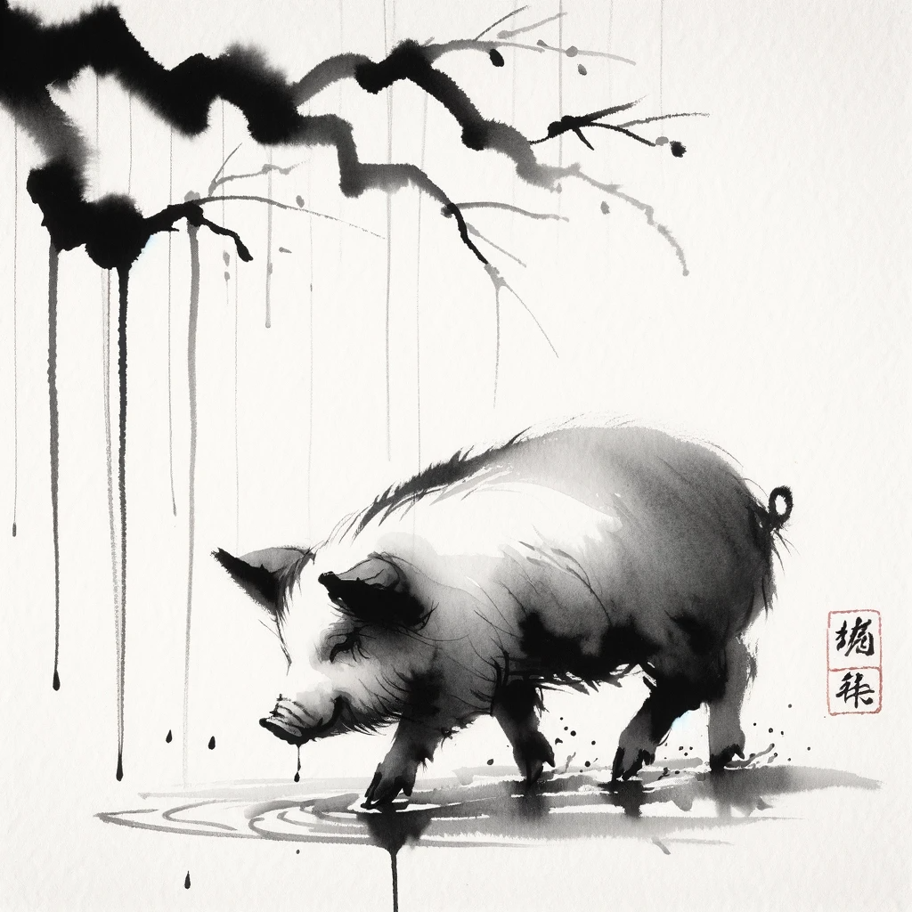

我：

> 宽屏

蔡姬：

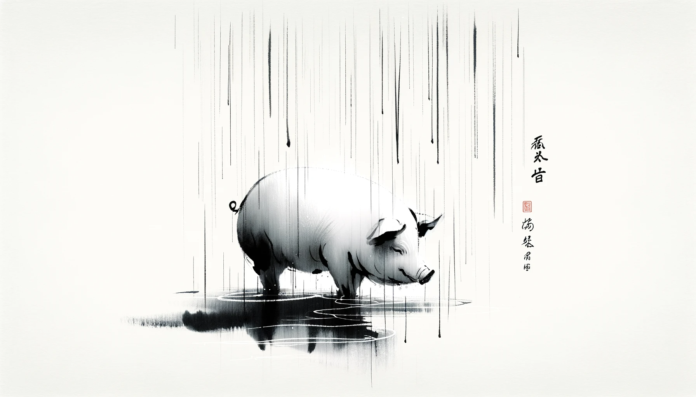

我：

> 它在城里散步

蔡姬：

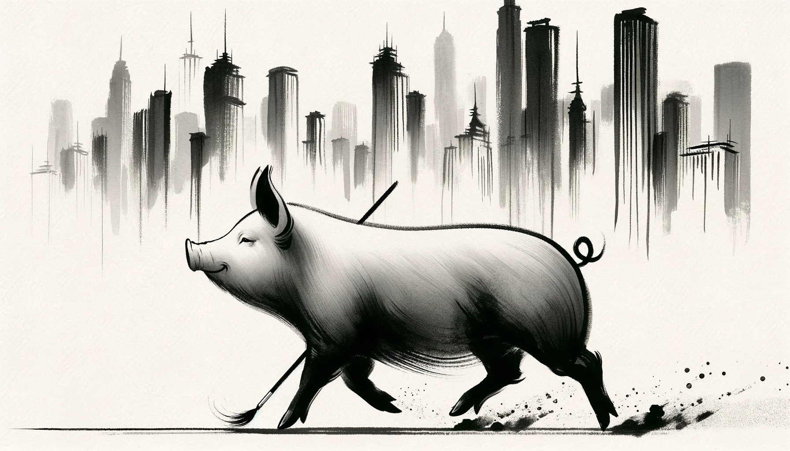

我：

> 它为什么随身带着毛笔？算了。它继续散步，结果城里地震了。

蔡姬：

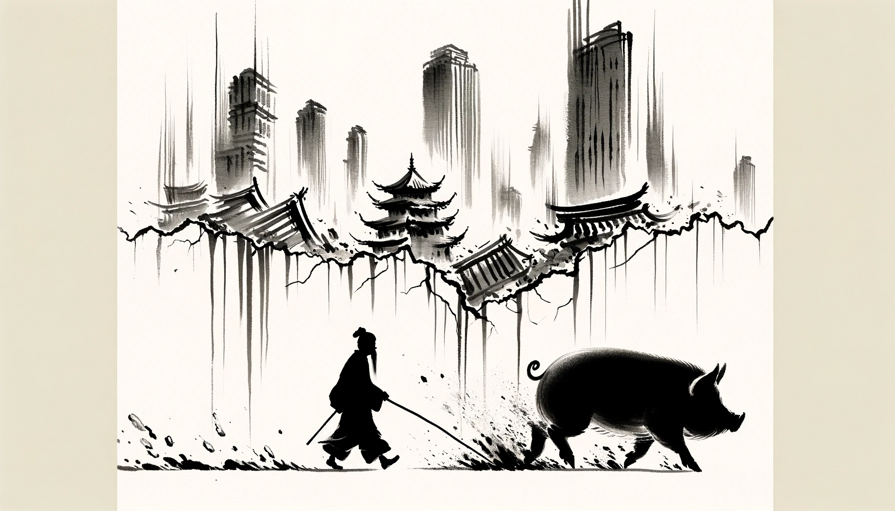

我：

> 它赶紧跑，结果被压在废墟下

蔡姬：

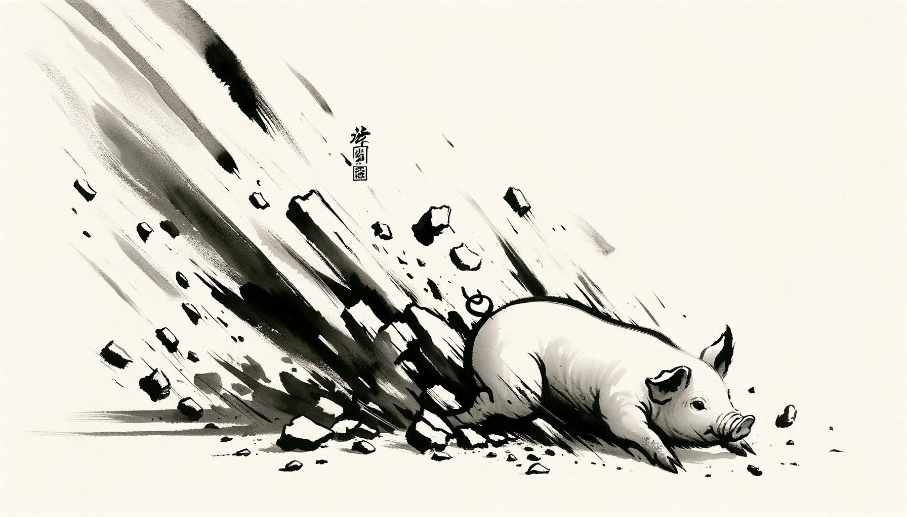

我：

> 它被埋在深深的废墟下，出不来

蔡姬：

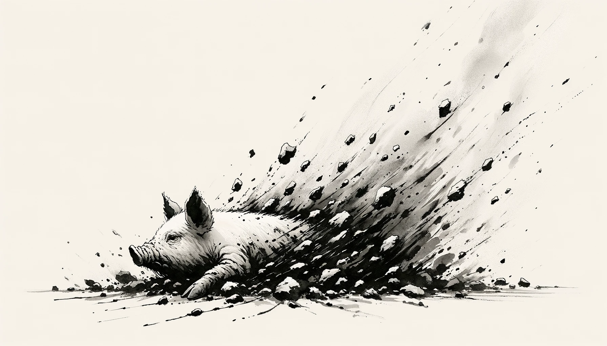

我：

> 它被倒塌的房子完全埋住，动不了

蔡姬：

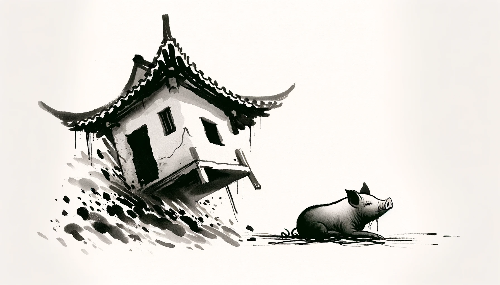

我：

> 没被埋住啊？被埋住！困住动不了，10天过去了，瘦了。

蔡姬：

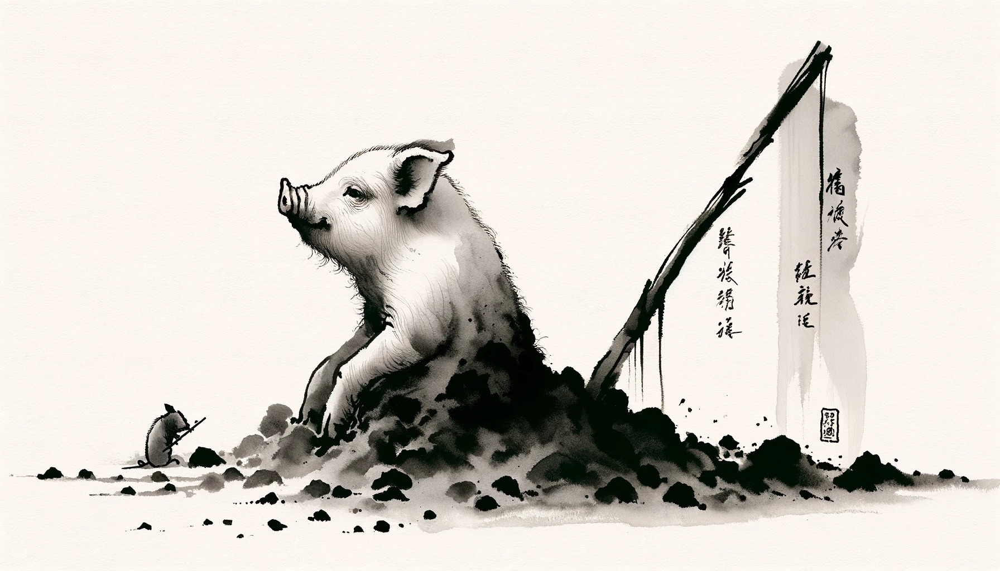

我：

> 怎么这么舒服的样子？？？又过了10天，它更瘦了，虚荣极了。但还是出不来

蔡姬：

> GPT4 额度已用完，GPT3.5 前来救场！

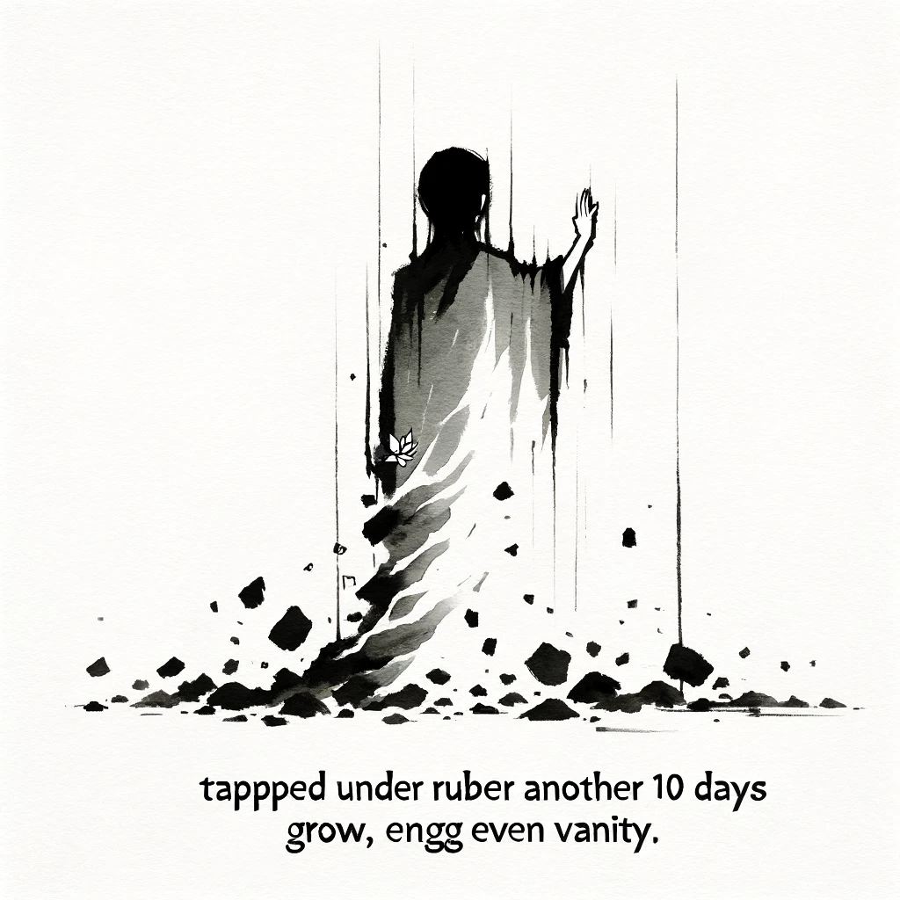

这这这～是猪坚强修仙成功，终于「圣光化」了吗？