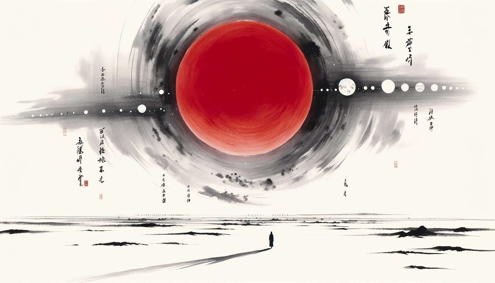
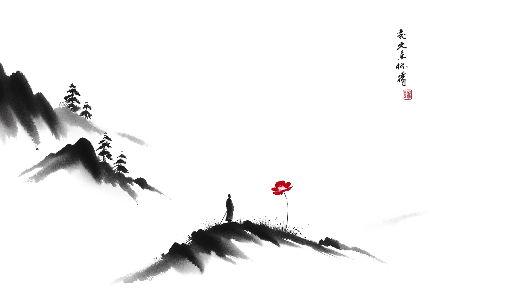

# 【生命⋅修行】一些平衡情绪的小技巧

在萨古鲁的一个公众号上看到这样一篇旧文[《平衡情绪的简单生活技巧》](https://mp.weixin.qq.com/s/LoHI4y--CejM6OFROFKpOg)，说实话，文章虽然是疫情期间写的，但其中所列举的好几个技巧还都蛮管用的。尤其是微笑这招，昨天早上若是记得使用，也不至于苦脸一早上。哪怕是后来看到文章再用，也依然立竿见影地把自己从坏情绪里拉了出来。

好东西要分享，希望对你也有用。希望自己需要时也别忘记了这些招数：

### 1.  Put Things into Perspective 正确看待事物

正如这几天一直萦绕脑海的「猪坚强」，正确面对自己，以及正在面对的「事与物」相当重要。大部分时候，我们都是高看了自己，太把自己当作「人物」了。

殊不知，在这广袤宇宙，漫漫历史长河之中，我们这个人，我们面对的那些事，只是一粒一粒微尘而已。就连我们赖以生存的地球，也不过是一粒微尘中的微尘——一颗暗淡的小蓝点。

然而，有时候，我们也会把自己看得太轻了。所以，细品卡尔•萨根说过的这句话：

> 再来看一眼这个小点。就在这里。这就是家。这就是我们。在这个小点上，每一个你爱的人，每一个你认识的人，每一个你听说过的人，每一个人，无论他是谁，都曾经生活过。我们所有的快乐和挣扎，数以千万自傲的宗教信仰、思想体系观念意识，以及经济学原理教义，每一个猎人或征服者，每一位勇士或是懦夫，每一个文明的缔造者或摧毁者，每一位君王或农夫，每一对陷入爱河的年轻伴侣，每一位为人父母者，所有充满希望的小孩，发明家或探险者，每一位灵魂导师，每一个腐败的政客，每一个所谓的「超级巨星」，每一个所谓的「最伟大领袖」，每一位我们人类史上的圣人或是罪人……我们的一切一切，全部都存在于这样一粒悬浮在一束阳光中的尘埃上。

我们既是这尘埃之上的尘埃；我们同时也是活生生，有着具体的挣扎、快乐、希望与爱的生命之具象。

所以，想一想这广袤无边的宇宙，再想一想那孩子灿烂的笑脸、淡淡的花香、清风朗月、雨露阳光，多大事儿也不是个事儿了。

### 2. Getting High on Your Low 低谷反弹！

任何情绪都有其力量。我们要学会正确地理解情绪，正确地把它转化为创造性的力量。难过、低落时，可以变得焦躁易怒，也可以变得爱与慈悲。

低落的情绪也只是情绪。情绪是信号，情绪也是促发行动的力量。遇到这种情况，正是修炼基本功的时候：

1. 正确认识情绪信号：
   * 究竟是那项与客观事实不符的错误认知引发了这情绪？
   * 这情绪会给我带了什么「好处」，或我以为的「好处」？
2. 转化情绪的力量到正确的方向上：
   * 或休息疗伤
   * 或敞开觉知
   * 或改变行动

### 3. Choose a Joyful Rat Race 快乐地竞赛

生命是一场老鼠赛跑（或者其它各种竞赛），虽然无法逃避，但却可以选择。尤其是，我们可以选择「快乐地」参与这场竞赛，还是「不快乐」地参与这场竞赛。

如果你相信，只有停止或退出「竞赛」才意味着快乐，那就糟糕了。

鬼脚七在[《一切都是游戏》](https://mp.weixin.qq.com/s/2dJWU71lagcMc6XOeTzt-w)的文章中说：

> 还记得小时候玩游戏吗？捉迷藏、过家家、踢房子、抓石子、玩枪战，每个参与的人都很投入，也很专注。无论输赢，都很欢乐！

能以孩子时这样「快乐游戏」的态度，参与生活这场「竞赛」，才能真正地享受生活吧。

### 4. Remember Your Morning Smile 记得在早上微笑

昨天看到这句话时，我就意识到，自己忘记了在「早上微笑」。

每天早上醒来，这是一件多么值得庆贺的事情。—— 这一夜过去，许多人无法醒来，许多人醒来无法见到自己心爱的人，心爱的宠物，心爱的东西。而我们醒来了，见到自己心爱之人也醒来，或还在甜美的梦乡之中，我们活着，他们也活着，我们的宠物还活着，这个早上，我们会重新遇到许许多多的生命的醒来，他们都活着。

对自己微笑，对他们微笑吧！

那天早上，我只是觉知着自己紧簇的眉头，紧咬的牙关，却忘记了去松开脸上的肌肉，给自己一个微笑，给世界一个微笑。何其愚蠢，下次别忘了！

### 5. Set Reminders to Check Your Aliveness

每小时，提醒一次自己还活着，提醒自己生命的价值。要是不行，可以半小时提醒一次，甚至每5分钟一次。

“我活着，你活着，还需要什么呢？”

### 6. Be Physically Active

坚持运动，保持身体的活动。这是刻在人类DNA里的密码。我们的身体是一部适应几十万年前丛林与草原狩猎生活的机器。

如果不动，会出问题的。

我记得好像是《原则》的作者说过这么一句话：

「**让世界等我半小时，完成我的运动**」

是的，就是这么重要，整个世界都值得为此等待！

----

当然，还有一些其他你或许也熟知的技巧，比如：

* Eat the Right Food 正确的饮食
* Don't Compare Yourself with Anyone 不要将自己与任何人相比较
* Take Small Steps Towards Self-Transformation 通过小小的步伐走向自我转化

也都蛮有道理的。