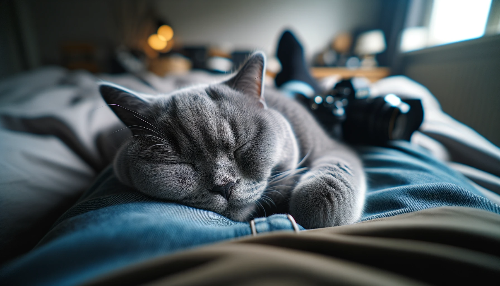
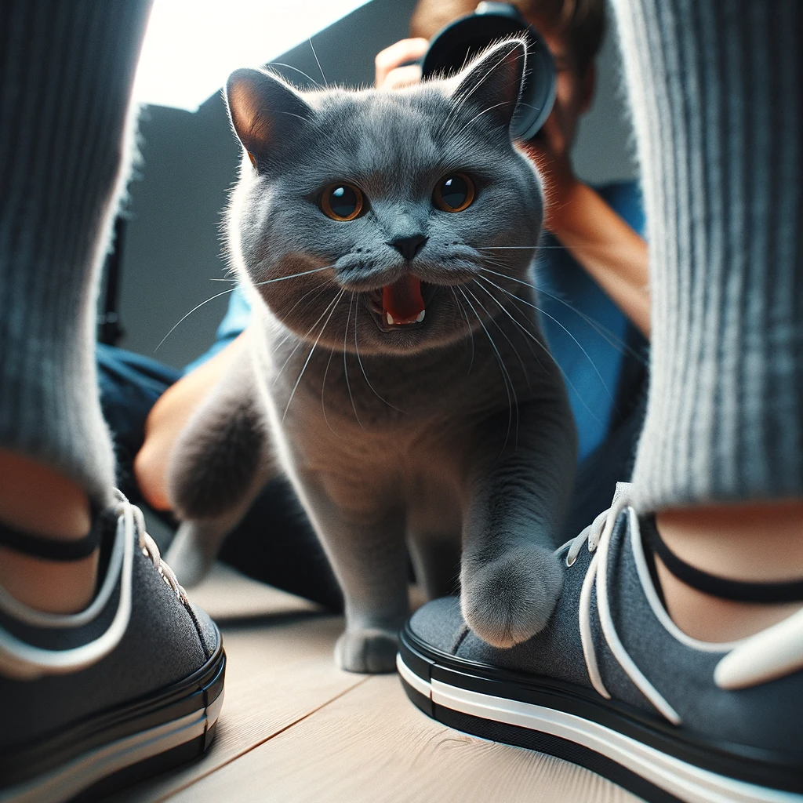
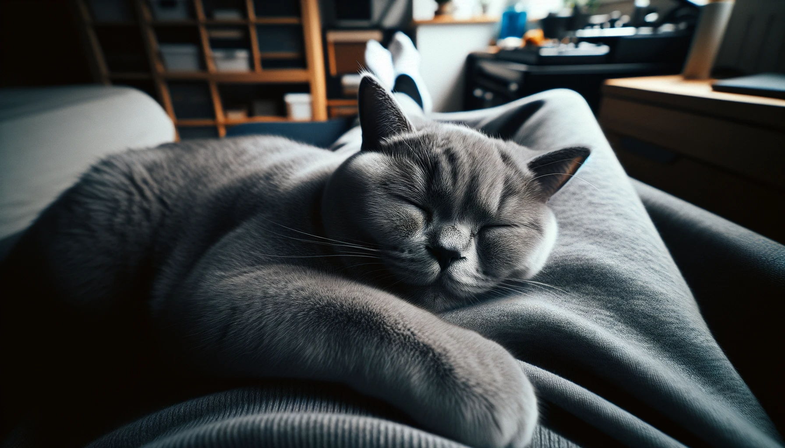

# 【随笔】学人说话的猫

以前一直觉得，所谓发情的猫咪晚上「嗷嗷」的叫声和小孩哭一样，只不过是人类的错觉。猫叫就是猫叫，说它像小孩哭，只不过是我们人类一厢情愿的想象罢了。

然而，最近几次Cup猫的表现，让我忍不住有点相信，它是真地在努力学习人类说话呢。

那天晚上，应该是自己睡得不太踏实，忽然听见大鱼在叫「妈妈」。于是从梦中惊醒过来，却发现，只不过是Cup猫又孤独地在客厅里「嗷嗷」叫了。但是，仔细挺过去，可不是像往常那样「呜嗷呜」像小孩哭的那种声音，而是——「妈妈吗～妈妈妈妈吗～～～」

那声音和腔调，和大鱼平日里叫妈妈的动静简直一摸一样。我躺在床上，听着Cup猫在客厅里努力地练习「妈妈妈」的发音，差点忍不住笑出声了。

无独有偶，在那之后的第二天晚上，Cup猫又开启了新的发音尝试。我听见它清清楚楚地在客厅里叫着：「我要尿尿，我要尿尿」。笑得我差点从床上蹦起来，要不是天太冷、被窝太暖，我都想要去看看Cup猫究竟在客厅里干什么了。

这还不算。等我再睡过去，到了早上起床准备打坐。Cup猫听到卧室里的动静，蹭蹭蹭跑到卧室门口。「嗷嗷」地大声叫了几嗓子，然后唰唰唰地开始挠门。我一如既往懒得理它。它似乎也意识到，卧室门是不会在这时候打开了。于是停止了挠门，靠在门边，轻轻地、低声地说：「尿了」。那腔调，和大鱼不小心尿湿了裤子时说的话：「我尿了」，又是一摸一样！

据研究，家猫的叫声本来就是猫咪专门为了和人类沟通而特有的。猫和猫之间的沟通，大多不需要用叫。于是，我真心地觉得，Cup猫它是真地努力在学习大鱼叫妈妈和说话。或许是因为它也观察到了：大鱼目前是我们家最获关注的一个宝宝。它也许觉得，学会像大鱼那样叫「妈妈」，说「我尿了」，我们就会立刻来到它身边，陪她玩耍呢？

不过，大鱼最近学会的新把戏，可是这句话：

> 「爸爸（妈妈/姐姐/爷爷/奶奶）陪我玩！」

Cup猫能学会吗？

----

今天早上起床，独自一人在客厅暖炉前坐了一会儿。Cup猫小心翼翼地走过来，看我没有走开的打算，就安心地趴在我怀里，咕噜噜咕噜噜地眯着眼睛，任我轻轻地抚摸它那柔软的脑门和下巴。我没有如往常一样去拿梳毛器来给它梳理浮毛，只是用手轻轻地抚摸着，感受着那极其柔软的触感。——奇怪了，莫非是冬天来了，它长出细毛了，怎么摸起来像小奶猫一样柔软呢？

它只轻声地张开嘴嗷了一下，似乎在埋怨，自己为什么这么久都没有得到和小宝宝一样的爱抚和关注。然后一声不吭蜷在我身上，使劲地弯过脖子，靠紧我。认真地享受和一人一猫相处的宁静时光。

