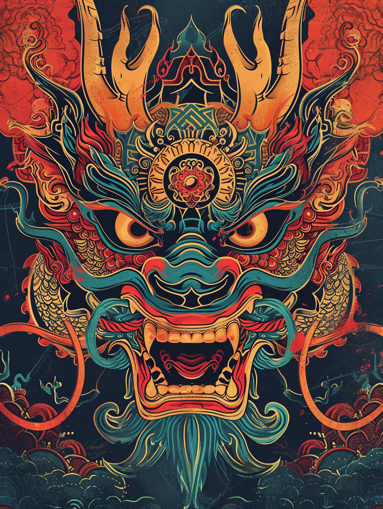
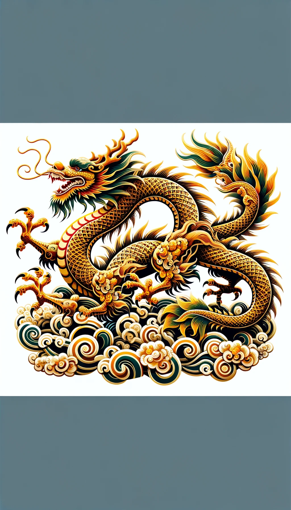
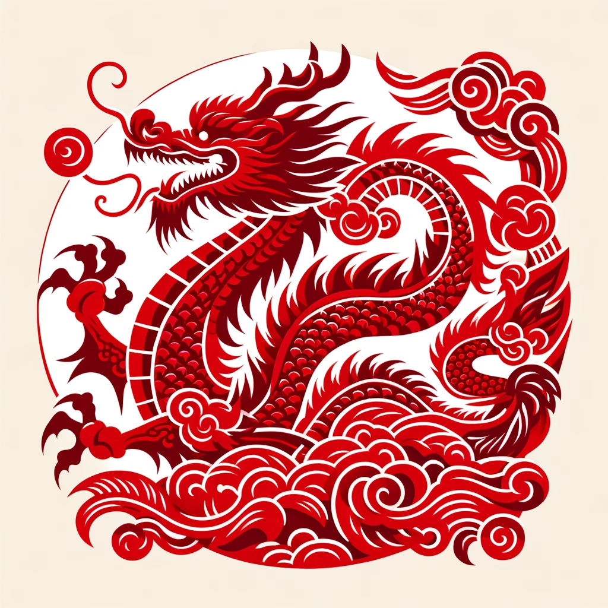
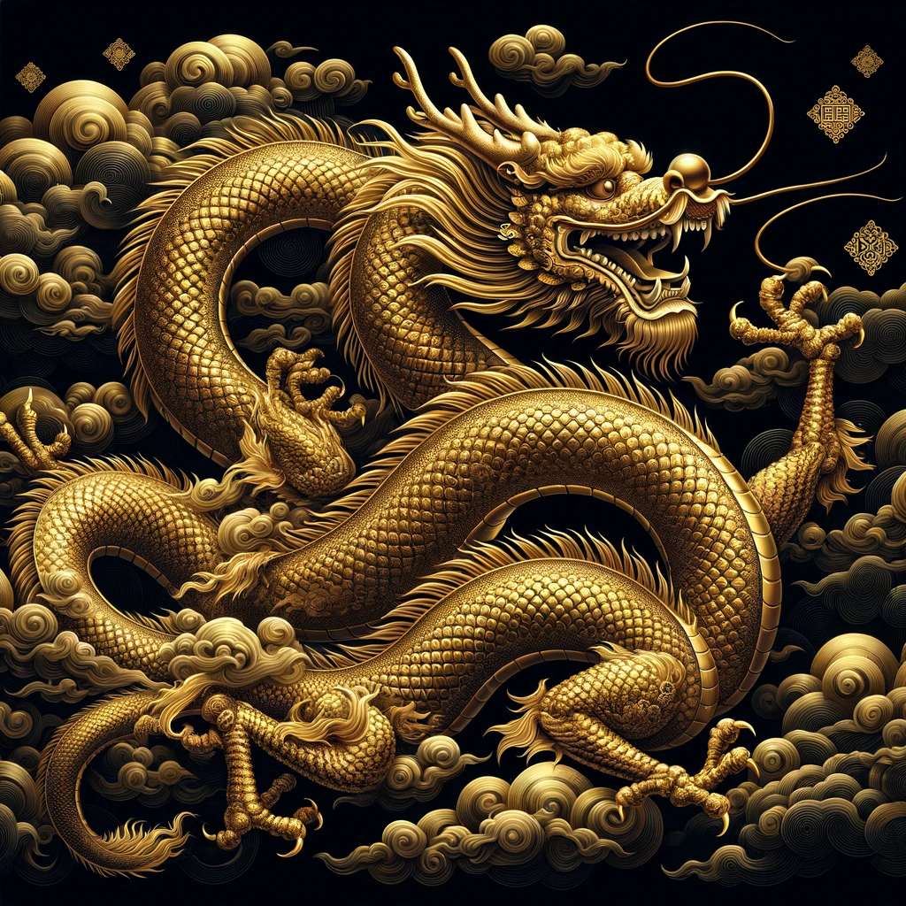
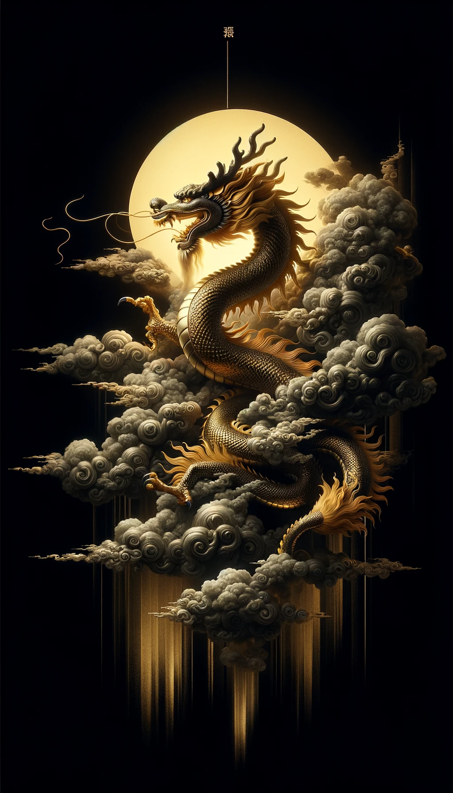
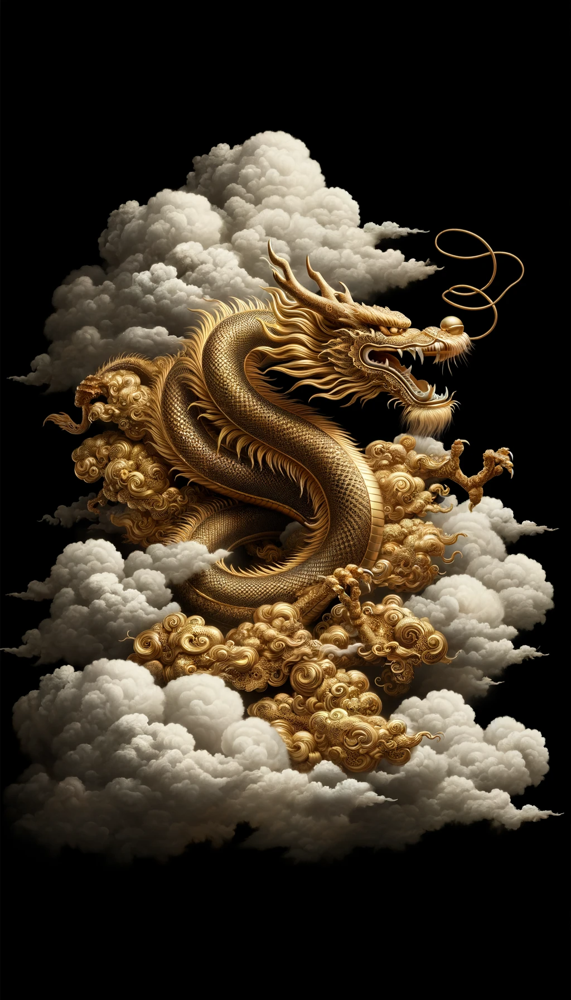
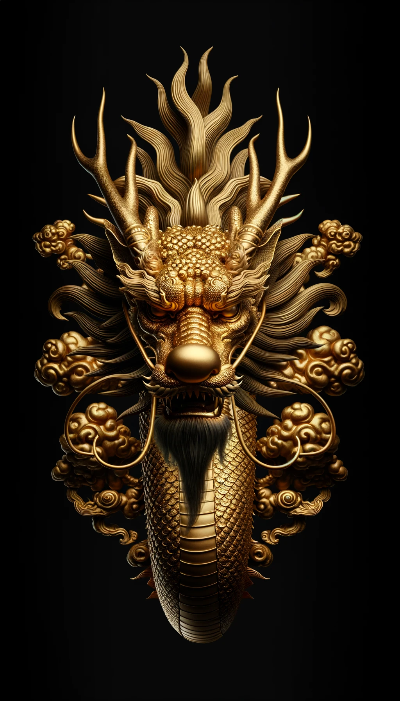
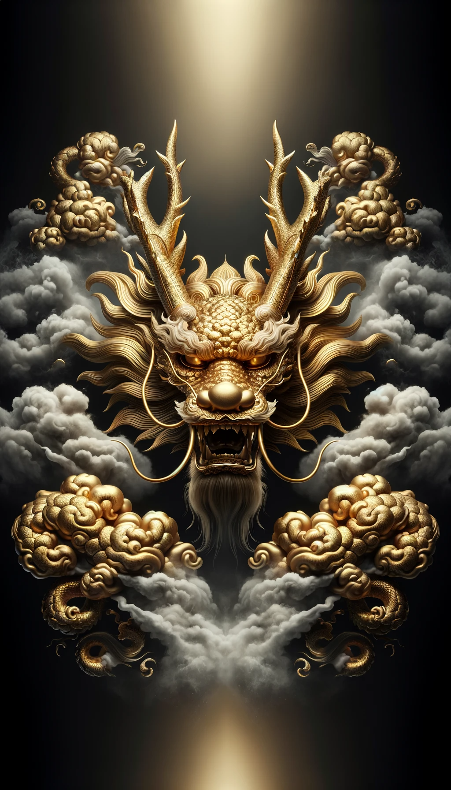

# 【随笔】红包封面不容易

前段时间，收到微信公众号平台发放的三张红包兑换卡，说是可以兑换定制的红包封面。前几年过年定制红包封面时似乎没那么多讲究，直接就能定制红包了。可是今年似乎大不一样。

从和菜头那里抢来几个红包封面后，终于弄明白了自己定制红包的流程：

1. 有了平台发放的兑换卡，那还只是第一步。接下来，
2. 要去微信红包封面开放平台注册账号。
3. 在微信红包封面开放平台按要求上传定制的红包封面，版权证明。
4. 等待审核——很遗憾，我上次用Midjourney 制作的青龙就没能过审（不知道原因是什么，算了，毕竟我借鉴了和菜头叔叔的提示词，而且菜头叔的青龙红包我已经抢到了一个）。

我想试着再用GPT画几张五爪金龙来做红包，可是，想画个好看的，还真不容易呢。不知不觉，一个小时就过去了，愣是一张好看的也没有画出来。

伤心！
