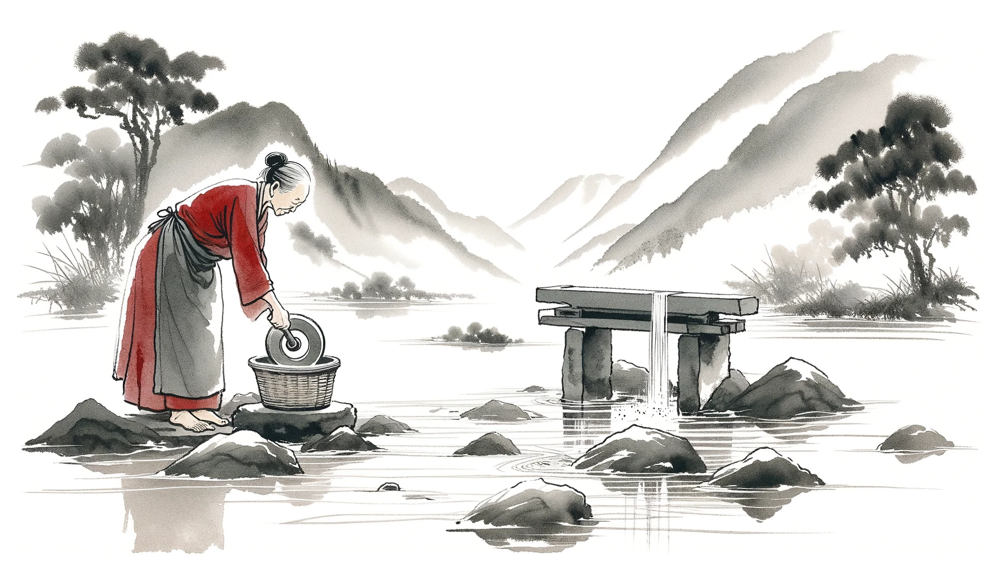
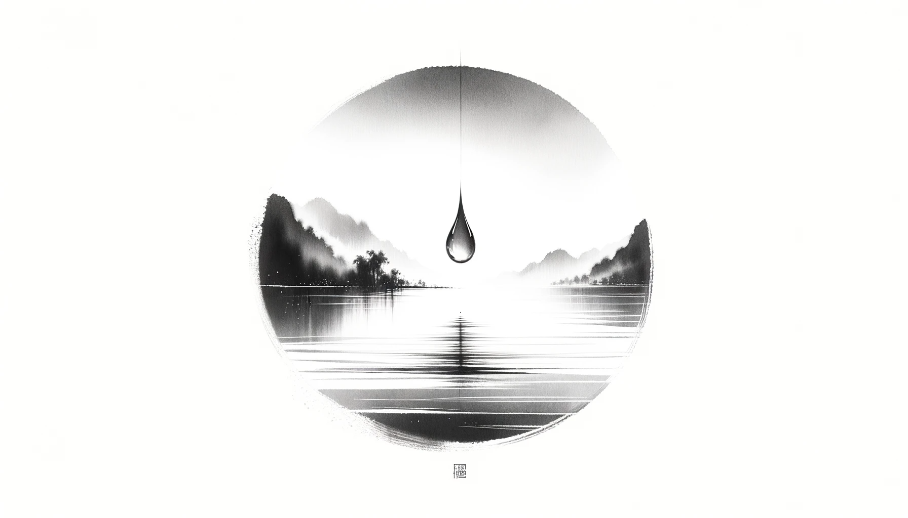

# 【生命⋅修行】坚持的意义与目的

说实话，前天原想着花半小时完成每日的写在练习就结束的。但，还是想简单了：

1. 首先，之前申请的红包封面没有审核通过。
2. 想要「随便」再找GPT画几张图，挑一张出来做封面。但想「随便」一点，实际上一张不满意，又一张不满意，眨眼之间一个多小时就过去了。

回头再看这一个半小时，顿时觉得有些意兴阑珊。最初颇有一些为「坚持」而「坚持」的念想，然后因为不知道写什么，竟然把时间全用在了「画图」上。

而此时此刻用AI画图，虽然有一些经验，但也有破有一些「玄学」的状态，时间是非常难以把控的。是的，一个任务所需要花费的时间，往往是一个大问题。至少对我而言是这样——那潜藏在内心，时不时冒头的「完美主义」倾向，会不经意的把一个原计划半小时完成的任务，扩充到远远超过一个半小时。

那么，最终虽然达成了「为了坚持而坚持」的念想，但这额外消耗的精力，却成了紧接着的第二天，自己放弃的理由，或者说是借口。

可是，我为何要在写作这件事情上坚持呢？并不仅仅是为了证明自己「能够坚持」而已。归根结底，我还是喜欢思考（哪怕是胡思乱想），而写作，毕竟是一个能让自己纷飞的思想，有那么一个着力的地方的好方法。

所以，写作的坚持，还是聚焦，并落到这个基本功训练上吧：

> 每天，500字力求传递清楚一个「感知」！

另外，大部分时候，还是得以半小时为限。加上这个时间限制，想必也会有更好的练习效果吧。记得前两天看谁介绍马斯克的作息方式时，说他每天在无数多任务切换时，同样会为每一个短期任务也设定「截止时间」，以便充分地「Dead Line」心理上的督促作用。

写到这里，我忽然想起另一件没那么坚持下去的事情——《囚徒健身》来了。书中有这么一句话：

> 从你决定按照本书的体系开始健身的那一刻起——也就是今天，你的终极目标必须是完美地做到六个最终式。记住，不仅仅是做到一两个动作的最终式，而要一个不落！

这个愿望，还有很多其他的愿望，我能够实现吗？

关于写作，我的终极目标或者说愿望，又是什么呢？用文字打败时间？不，那只是冯唐的愿望而已。

