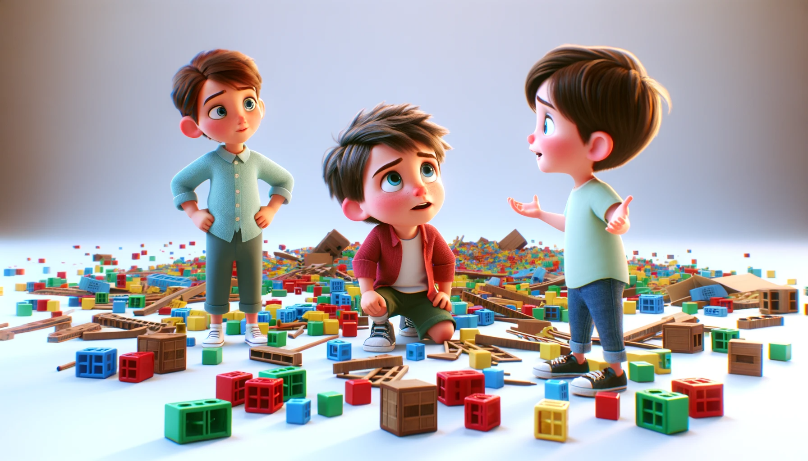

# 【随笔】不听话的大鱼和能让他听话的阿宝

小孩子真是每个都不一样，大鱼才不到3岁，就已经越来越表现出和他姐姐完全不一样的个性。最典型的，就是他不听话！

不像姐姐，虽然阿宝也有表现得很倔的时候，但基本上不会拧着我们的意思来。至少，让她来吃饭。她会过来吃饭；让她穿鞋子穿袜子，她会乖乖穿上袜子；虽然有时我着急，说得语气重了些，她就会哭，但她还是会听父母的。

可是大鱼，完全不同。

昨天大家还在吃饭呢，他不肯吃了，跑去一边玩。他性质勃勃地推着行李箱，在客厅里跑来跑去。可是，吃饭前，他玩过，洒落一地的拼图正躺在行李箱的必经之路上。

> 大鱼，把先拼图收起来！

我说。可是，大鱼完全没听见一样。推着行李箱呼地冲过来，从拼图上「吱吱呀呀」地碾了过去。大宝也开始叫他：

> 快把拼图收起来，不然会被碾坏了！

他依旧不理。大宝对我揶揄着：

> 你看，他完全不听！

我无奈地笑笑，说：

> 可能，只有姐姐能让他听话吧。

阿宝听见了我的话，开始出手：

> 大鱼，你先把拼图一片一片装起来，一会儿姐姐吃完饭了，也来和你一起装，然后我们一起玩，好不好？

大鱼居然真的停了下来，原地转了一圈，对姐姐说：

> 没有东西装！

阿宝继续循循善诱地告诉他：

> 就是地上那个塑料袋，对，就是那个。

于是大鱼找到了塑料袋，果然就开始捡地上的拼图。我们松了一口气，放下心来，继续吃饭。

然后，就听见「哗啦啦」一声，我们吃了一惊，扭头一看，他已经把一盒小积木全部倒在了客厅地板上，里面许多小圆球咕噜噜滚了一地……我们目瞪口呆：

> 你这样乱扔，要怎么收拾啊？

他也转过头来看我们一眼，然后好像什么都没发生一样，转过头去继续开始玩他的小积木和小球球了。