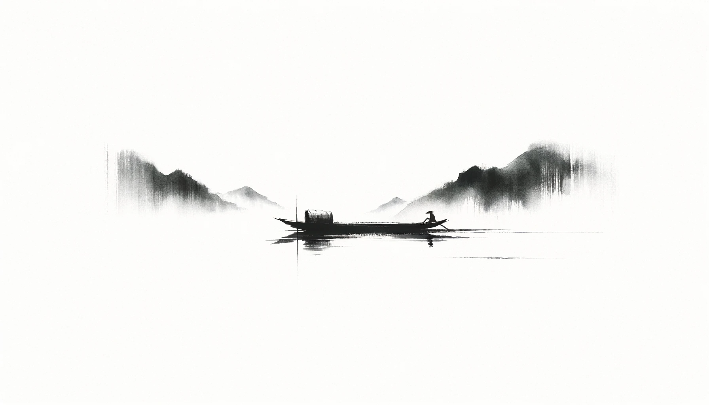
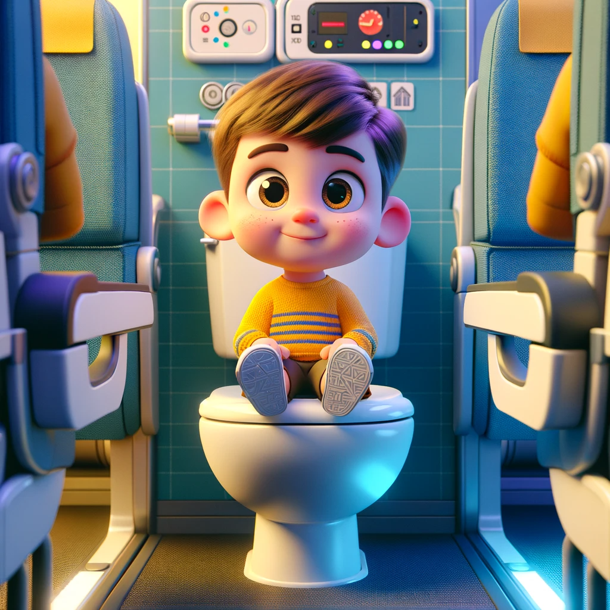

# 【生命⋅修行】撞上来的是只空船

> 方舟而濟於河，有虛船來觸舟，雖有惼心之人不怒； 有一人在其上，則呼張歙之， 一呼而不聞，再呼而不聞，於是三呼邪， 則必以惡聲隨之。 向也不怒，而今也怒。向也虛，而今也實。 人能虛己以游世其孰能害之？」
>
> ——《莊子》 外篇•山木

在飞机上，两个小家伙都忽然闹着要上厕所，于是乎我带着他们到了卫生间。大鱼想要拉屎，于是我等阿宝上完厕所就让她先回去座位找妈妈，然后带着大鱼进了卫生间，锁上了门。

大鱼认真又小心地坐在马桶上拉着屎，可能因为人太小，马桶太大，他总是觉得不稳当，便紧紧地抓着我。这时，有人在外面粗鲁地咣咣敲着卫生间的门，甚至不能算是敲，几乎就是在撞。我心想：

> 这是谁这么粗鲁呢？

大鱼问我：

> 那是什么声音？

我说：

> 外面有人在敲门。

大鱼说：

> 是姐姐？

我说：

> 不是，不知道是谁。没关系，不用管他。

可是，外面这人似乎憋坏了，没消停一会儿，又开始咣咣咣地砸门。我心里怒火忍不住地往上窜，心想这人咋这样呢？又不是只有这一个卫生间，就算急，至于这样吗？我甚至已经在脑海里开始设想这样的画面：

「开门后，我让大鱼先出去。外面的人急着想进来，我冷冷地卡住门，给他一个愤怒的眼神让他自己体会，然后转过身，冲马桶。再才侧身走出厕所，从他身边经过时，再次给他一个愤怒的眼神。」

过了一会儿，我已经对外面的砸门、敲门声有些麻木了。大鱼也终于拉完了屎，我给他擦干净屁股，整理好裤子，自己也洗了个手，拿纸巾把手上的水仔仔细细擦干净。这才缓缓地打开门：

门口站着的是阿宝。我大吃一惊：

> 你怎么还在这里？

阿宝说：

> 我找不到回去的路了。

> 所以，刚刚是你在敲门？

> 嗯！

我忽然发现，此时此刻，自己哪有什么半点怒气，只是心疼自己的阿宝贝而已。

呜呼！**人能虛己以游世，其孰能害之？**

