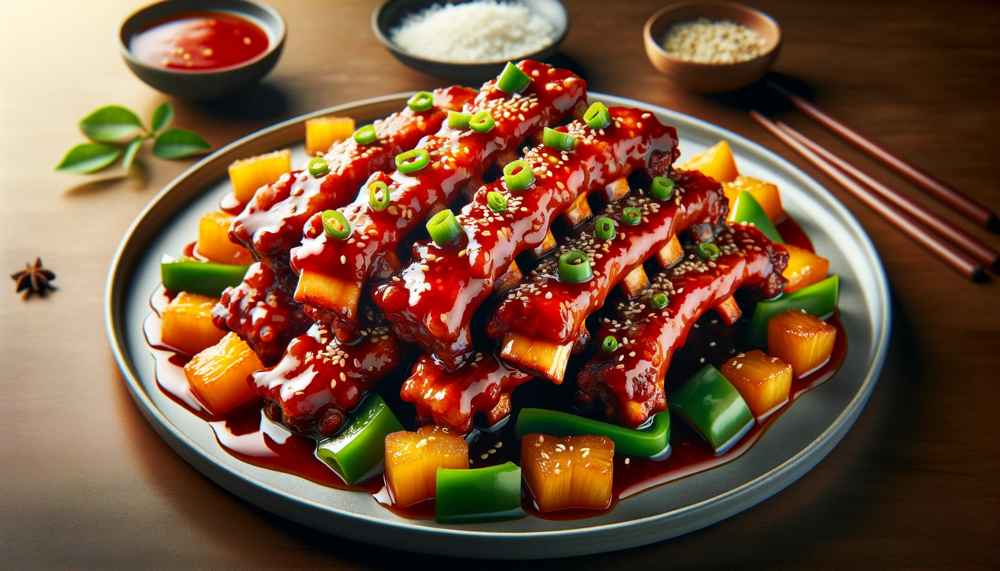
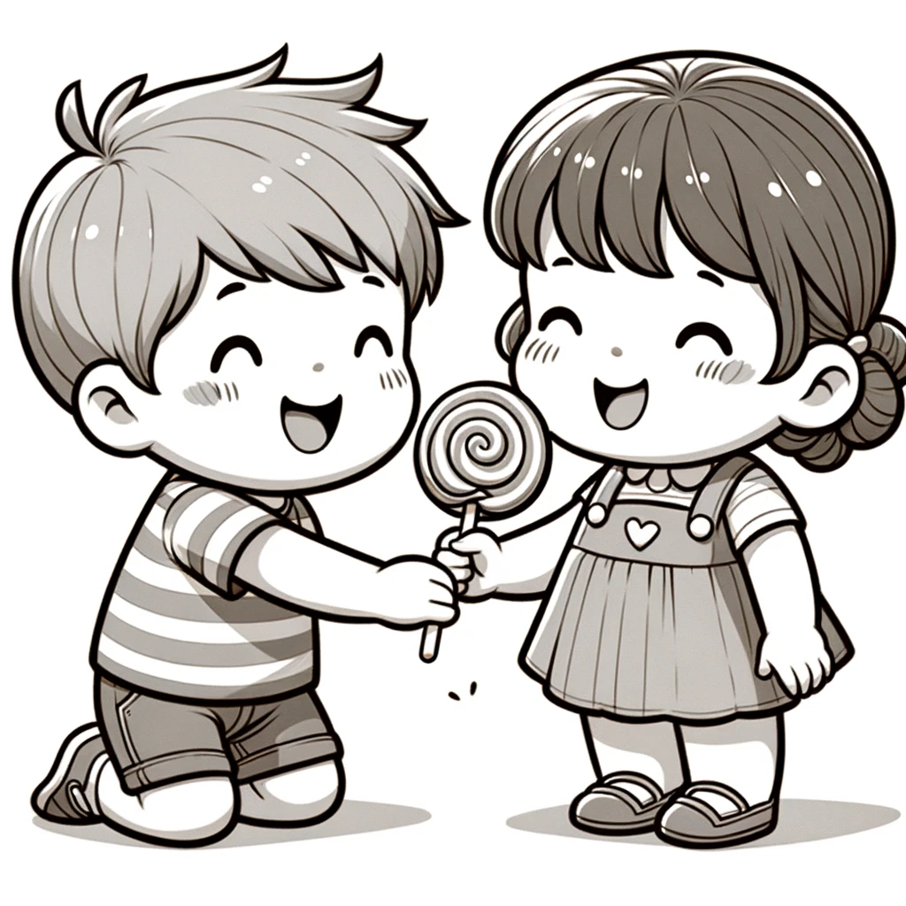

# 【随笔】你就不可以爱我了——阿宝趣事儿

那天中午，烧了香喷喷的糖醋排骨。剩下最后一大块，大鱼抱着啃得香喷喷，满脸沉醉。阿宝还想吃，可是已经没有了。她只好盯着弟弟那块，问：

> 可以给姐姐吃一口吗？只要一小口！

大鱼几乎毫不犹豫，说：

> 不行！

我们想着劝说一下大鱼，说到：

> 要不分给姐姐吃一小口呗？平时姐姐有好吃的，都会分给你吃的……

大鱼不为所动，继续摇头。

这时，姐姐开口了：

> 你要是不给姐姐吃，你就不可以爱我咯？

我和大宝一时没明白这逻辑，之间大鱼停下了吃排骨，显然开始思索起来。我笑着和大宝打趣，说：

> 完了，大鱼这下要面临两难选择了。是要大排骨呢？还是要爱姐姐？吃了大排骨，就不可以爱姐姐了。想要爱姐姐，就要舍弃大排骨。

没过多久，大鱼做出了决定，把排骨递给姐姐：

> 可以给你吃一口。

姐姐开心的咬了一口，笑得像朵花儿一样。弟弟在大排骨和姐姐之间，几乎不太犹豫地就选择了姐姐，她一定很得意吧。大鱼也笑了，一面继续啃着大排骨，一面笑吟吟地看着姐姐。这两个小家伙，真是可爱。相亲相爱的时候简直姐姐弟弟爱得不要不要的，等打起架来，现在也是好不想让。

眼见着只有姐姐一半多一点高的弟弟，跟在姐姐后面跑来跑去，就忍不住想，再过几年，他们是什么模样，再过十几年，他们又是什么模样……

每次这么想想，心也柔软了，眼神也温柔了。

