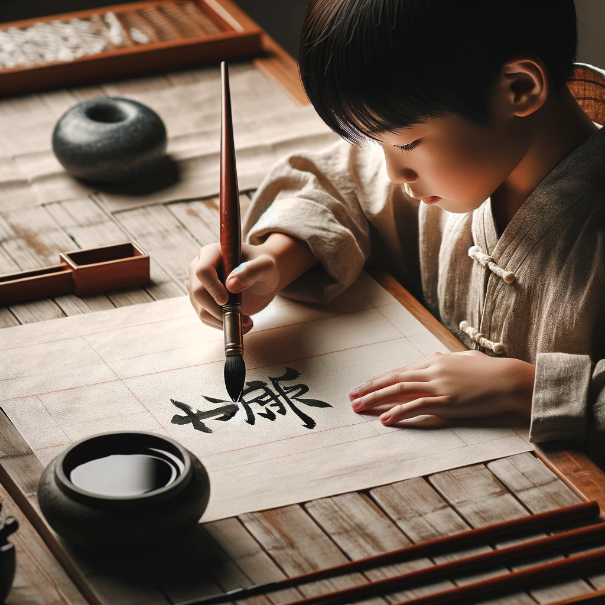

# 【生命⋅修行】困知勉行的道理

最近常常又有一种「困」住的感觉，无论是工作、学习、还是生活，都是这样。每天想要坚持的500字写作练习，也常常变得困难无比。于是乎，冯唐公众号的一篇《[7步轻松破解中年危机](https://mp.weixin.qq.com/s/5MhBEfDVt7j3nByNlT9d7w)》跃入我的眼帘。

他说中年危机的四种来源，确实隐约与我内心的焦灼呼应：

1. 后生可畏
2. 自己增长乏力（体力、精力、学习力、收入都在走下坡路）
3. 压力大、工作累
4. 花钱处越来越多

然而，在他提出的「轻松7步中」，有那么一条更是加重了自己的焦虑，那就是：

> 年纪大了还是有年纪大的优势，要认清。比如说：情绪管理；有人脉，被人信任……

对比之下，我一点不觉得「情绪管理」、「人脉」这些是自己的优势。我想，这主要是冯唐他老人家的优势吧。我自己的「年长优势」在哪里，却一点认不清。又一想，认不清，也怕是「借口」和「错觉」吧。

年岁越大，越认可曾国藩的一些道理。想来也是清晰地认识到，自己并非李白那样的天纵奇才，还不下笨功夫对准几个关键点努力，才是真没得救了。曾国藩在给孩子的一封信中讲到练字：

> 余于凡事用困知勉行功夫，尔不可求名太骤，求效太捷也。以后每日习柳字百个，单日以生纸临之，双日用油纸摹之。临帖宜徐，摹帖宜疾，专学其开张处。数月之后，手愈拙，字愈丑，意兴愈低，所谓困也。困时莫间断，熬过此关，便可少进，再进再困，再熬再奋，自有亨通精进之日。不特习字，**凡事皆有极困极难之时，打得通的，便是好汉**。
>
> ——《曾国藩家书•同治五年正月十八日谕纪鸿书》

说凡事，都用「困知勉行」的功夫。想想自己教大宝练字这件最成功的事情，也就是因为她自己的「坚持」，以及在我的鼓励下，激发了她的「坚持力」。不急不躁，一个笔画一个笔画，一个字又一个字，她一路坚持下来这么几年，甚至因此领悟了辅导阿宝功课的方法。归根结底，也正好是合了曾国藩所总结的这条「困知勉行」之道。总之，在「意兴愈低、所谓困」时，一定要想尽办法，莫间断，熬过此关。

**凡事皆有极困难之时，打得通的，便是好汉**。

> 或生而知之，或学而知之，或困而知之，及其知之一也。或安而行之，或利而行之，或勉强而行之，及其成功一也。
>
> ——《中庸》

所以，本命年降至，已然悟透自己不是天才，不过是愚人一枚，除了困而知之，勉强而行之别无二法。冯唐所说的7步，对我而言，还是精简成4步吧：

1. 锻炼好身体
2. 持续学习
3. 做减法（花钱、花时间、花精力这三方面都要做减法）
4. 困知勉行——在已经精简过、最重要的「锻炼、学习、工作、生活」事务中，坚持不懈，直到打通那一个又一个「极困难之时」

生命无常，总是要最重要的事情牢牢放在心上，还是要时时刻刻、勉力向着人生智慧的高峰持续前进才是！