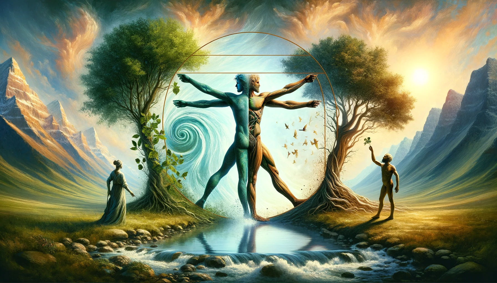
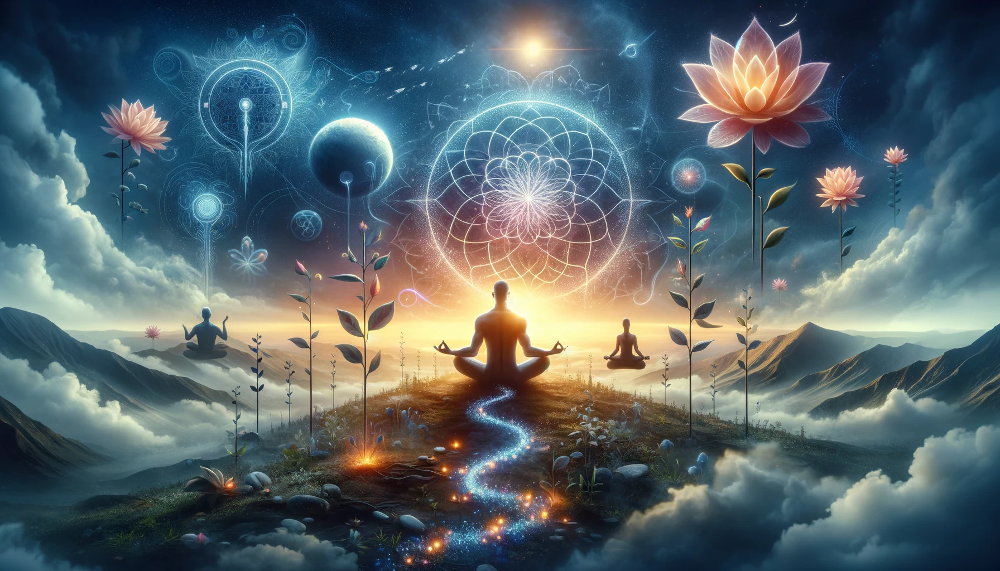

# 【生命⋅修行】有意识地挣扎

晚上，大宝和我聊起我最近的状态。她说虽然看着我总是在各种内耗，各种挣扎，但是能看到我在经历着这些挣扎的过程中，状态一点一点地发生着变化。显然，每一次挣扎最后收获的都是成长。

于是，我再一次想起林世儒老师教过的「是与否的挣扎」练习来。那是一个非常简单的身体练习，只不过是把双手水平举起15分钟而已，过程却极其煎熬。核心也就是用这有意识地与身体痛苦对抗的过程，来淬炼心力，完成一种类似于「结晶」的转变。那么，我在生活、工作的过程中所经历着的那许多一次又一次的内耗，不也是一种「是与否的挣扎」么？

只不过，有时候不知道自己在挣扎，有时候知道自己在挣扎。或许和任何锻炼一样，有意识地「锻炼」才会有更好的效果吧。然而即便是没意识，只要是经过了，也照样就练过了，多少都会有效果。

当然，如果能「觉知」，再加上「自主」，修行就事半功倍了。难怪海灵格老师总不建议那些「让身体受苦」，类似于「苦行」的锻炼方法，生活中要经历的苦太多了，顺手拿来一件事儿，其实都是修练自己的好手段。

此时此刻，我深深地体会到卓别林诗中，这句话的意味与力量：

> As I began to love myself I stopped craving for a different life, and I could see that everything that surrounded me was inviting me to grow. Today I call it **MATURITY**.
>
> 当我开始爱自己，我停下来不再去渴求与现在不一样的生活，我开始能够看到：围绕在我身边的一切，都是在邀请我成长。今天我管这叫做**成熟**。

是的——

**周遭一切的一切，都是成长的邀约！**

